# 计算：第二部分 计算的数学基础 第 4 章 数学的基础 康托尔的超穷数

## 1. 背景介绍

### 1.1 问题的由来

在研究数学基础时，我们经常会遇到一个古老而又令人费解的问题：是否存在一个"最大的无限集"？从本质上讲，这个问题探讨的是无限的概念及其边界。早在19世纪末期，著名数学家乔治·康托尔(Georg Cantor)就开始着手研究这一领域,并最终创立了被称为"康托尔集合论"的理论体系。

康托尔的工作源于一个简单的疑问:自然数集合N是无限的,但实数集合R看起来"更大"。他努力回答这样一个问题:两个无限集是否可以建立一一对应的关系?如果可以,那么它们在某种意义上是"等价的";如果不可以,就意味着其中一个集合"更大"。

### 1.2 研究现状

通过一系列巧妙的对角线论证,康托尔发现自然数集N与实数集R之间不存在一一对应关系,从而证明了实数集"更大"。这种思路后来被推广到更高层次,产生了"基数"(cardinality)的概念,用于衡量无限集的"大小"。

令人惊讶的是,康托尔还发现,即使在无限集之间,也存在着严格的大小等级关系。他定义并研究了"可数无限集"(countable infinite set)和"不可数无限集"(uncountable infinite set)两个重要类别。可数无限集可以与自然数集建立一一对应关系,而不可数无限集则不行。实数集R就是一个典型的不可数无限集。

在这一理论的指导下,康托尔进一步引入了"超越数"(transfinite number)的概念,旨在对无限集进行"排序"。他发现,即使在不可数无限集之间,也存在着不同的"大小"级别,被称为"超越基数"(transfinite cardinality)。这样,无限就不再是一个单一的概念,而是呈现出一种分层的、系统的结构。

### 1.3 研究意义

康托尔集合论的意义是深远的。它不仅为无限这一historically难以捉摸的概念提供了严格的数学描述,而且还拓展了人类对"无限"的认知边界。康托尔的工作为后来的数学分析、拓扑学、逻辑学等诸多领域奠定了基础。

从应用的角度来看,集合论在计算机科学中也扮演着重要角色。有限状态自动机、形式语言等概念都与集合论有着千丝万缕的联系。此外,现代密码学的很多分支也植根于康托尔关于"大小"和"无限"的洞见。

### 1.4 本文结构

本文将从以下几个方面深入探讨康托尔的超穷数理论:

- 核心概念与联系
- 核心算法原理与具体操作步骤
- 数学模型和公式的详细推导与案例分析  
- 实际应用场景
- 代码实现与解释
- 发展趋势与挑战

我们将从康托尔对角线论证的启发出发,逐步建立对无限集"大小"的理解,最终抵达超穷数的概念,并探讨其在数学和计算机科学中的应用。让我们开始这段发人深思的数学之旅。

## 2. 核心概念与联系

在深入探讨康托尔超穷数理论之前,我们需要先了解一些核心概念及其相互关系。

### 2.1 集合与基数

集合(set)是现代数学的基石。一个集合由若干独特的元素(element)组成,用大括号{}表示。例如,A={1,2,3}是一个包含三个元素的集合。

基数(cardinality)描述了一个集合中元素的"多少"。有限集的基数很容易理解,就是元素的个数。但对于无限集,情况就变得复杂了。

### 2.2 可数无限集与不可数无限集

康托尔将无限集划分为两大类:可数无限集(countable infinite set)和不可数无限集(uncountable infinite set)。

一个集合如果与自然数集N存在一一对应关系,那么它就是可数无限集。直观地说,我们可以为这个集合中的每个元素编上一个自然数,就像给它们编号一样。例如,整数集Z就是一个可数无限集。

相反,如果一个无限集与自然数集N之间不存在一一对应关系,那么它就是不可数无限集。实数集R就是一个典型的不可数无限集。

### 2.3 对角线论证

康托尔通过著名的"对角线论证"(diagonal argument),证明了实数集R比自然数集N"更大"。他发现,无论如何列举实数,总会有一些实数被遗漏。这种方法后来被推广,用于证明不同无限集之间的"大小"关系。

### 2.4 基数的层级结构

通过对角线论证,康托尔发现无限集之间存在严格的包含关系。可数无限集的基数被称为$\aleph_0$(阿列夫-0),是最"小"的无限基数。而实数集R的基数$\mathfrak{c}$(连续性常数)则是下一级别的不可数无限基数。

进一步地,康托尔引入了"超越数"(transfinite number)的概念,将无限集按照基数的大小排列成一个分层的、有序的结构。这就是著名的"康托尔阶梯"(Cantor's ladder)。

```mermaid
graph TB
  subgraph Legend
  l1>Legend]
  l2(("&#129041; 有限集"))
  l3(("&#8734; 可数无限集"))
  l4(("&#8741; 不可数无限集"))
  end
  subgraph CantoranHierarchy
  n0(("&#8709; 0 (空集)"))
  n1(("&#8709; 1"))
  n2(("&#8709; 2"))
  n3(("&#8709; 3"))
  n4>......]
  n5(("&#8709;<sub>0</sub> (&#8721; 自然数集 &#8469;)"))
  n6(("&#8709;<sub>1</sub> (&#8721; 实数集 &#8477;)"))
  n7>......]
  n8(("&#8709;<sub>&omega;</sub>"))
  n9>......]
  n0--"Successor"-->n1
  n1--"Successor"-->n2
  n2--"Successor"-->n3
  n3--"Successor"-->n4
  n4--"Limit"-->n5
  n5--"Power Set"-->n6
  n6--"Power Set"-->n7
  n7--"Power Set"-->n8
  n8--"Power Set"-->n9
  end
  classDef finite fill:#e8f4e8,stroke:#2e8245
  classDef countable fill:#fff0f6,stroke:#c92a2a
  classDef uncountable fill:#e8eaff,stroke:#1f3864
  class n0,n1,n2,n3 finite
  class n5 countable
  class n6,n8 uncountable
```

这种层级结构为我们研究无限集的"大小"提供了强有力的理论工具。接下来,我们将深入探讨康托尔是如何构建这一理论体系的。

## 3. 核心算法原理与具体操作步骤

### 3.1 算法原理概述

康托尔的核心算法原理可以概括为:通过建立一一对应关系(或者证明不存在一一对应关系),来比较两个集合的基数大小。

具体来说,如果两个集合A和B之间存在一一对应关系,那么它们的基数就是相等的,记作$|A|=|B|$。反之,如果不存在一一对应关系,就意味着其中一个集合的基数"更大"。

对于有限集,这种比较很容易进行。但对于无限集,情况就变得棘手了。康托尔发明了一种巧妙的"对角线论证"(diagonal argument)技术,用来处理这种情况。

### 3.2 算法步骤详解

我们以证明实数集R比自然数集N"更大"为例,来具体解释康托尔的对角线论证算法。

**步骤1:假设存在一一对应关系**

假设存在一个双射(bijection)函数$f: \mathbb{N} \rightarrow \mathbb{R}$,它将自然数集N与实数集R建立了一一对应关系。这意味着,我们可以按照某种方式,为实数集中的每个元素编上一个自然数。

**步骤2:构造对角线数**

我们按照一定顺序,将所有实数列举出来,形成一个无限矩阵:

$$
\begin{array}{cccccc}
0&.&a_{11}&a_{12}&a_{13}&\ldots\\
&.&a_{21}&a_{22}&a_{23}&\ldots\\
&.&a_{31}&a_{32}&a_{33}&\ldots\\
&.&\vdots&\vdots&\vdots&\ddots\\
\end{array}
$$

其中每个$a_{ij}$都是0或1。

接下来,我们构造一个新的实数$d$,它与矩阵中的每个实数都不同。具体做法是:在小数点右边,取第一行第二个数字的补码(0变1,1变0),作为$d$的第一位小数;取第二行第三个数字的补码作为$d$的第二位小数;以此类推。

$$d=0.a_{12}^{'}a_{23}^{'}a_{34}^{'}\ldots$$

其中$a_{ij}^{'}$表示$a_{ij}$的补码。

**步骤3:论证矛盾**

现在,不难看出$d$与矩阵中的任何一个实数都不同,因为它至少有一位小数不同。但根据我们之前的假设,所有实数都应该在矩阵中被列举出来,并与某个自然数一一对应。这就产生了矛盾!

因此,我们的初始假设是错误的,也就是说自然数集N与实数集R之间不存在一一对应关系。实数集R的基数"更大"。

**步骤4:推广到其他集合**

康托尔的对角线论证技术并非只适用于自然数集和实数集。事实上,它可以推广到任意两个无限集之间,用来比较它们的基数大小。

这种方法的精髓在于,通过构造一个"新"的元素,我们总能在任何一一对应关系的映射中找到"漏洞",从而推翻"两个集合基数相等"的假设。

### 3.3 算法优缺点

康托尔对角线论证算法的优点是:

- 思路简单明了,证明过程严谨有力
- 可以应用于比较任意两个无限集的基数大小
- 为研究无限集的"大小"提供了有效工具

但它也存在一些缺点:

- 算法本身是一种"反证法",无法直接构造出一一对应关系
- 对于某些特殊的无限集(如同胞集),对角线论证可能失效
- 算法无法回答"是否存在两个集合有相同的基数"这一根本性问题

### 3.4 算法应用领域

尽管存在一些缺陷,但康托尔对角线论证算法在数学和计算机科学中有着广泛的应用。

- **集合论**:它是集合论中一种重要的证明技术,用于研究集合之间的包含关系。
- **数学逻辑**:对角线论证被用于证明逻辑系统的相对于元理论的不完备性,例如哥德尔不完备性定理。
- **计算复杂性理论**:在研究不可判定问题时,常常需要利用对角线论证来构造一个新的"异常"实例。
- **密码学**:对角线论证思想被应用于设计密码系统,例如产生伪随机数序列。

总的来说,康托尔对角线论证算法为我们提供了一种独特的思维方式,帮助我们认识无限集的本质特征,并在此基础上发展出更深层次的理论。

## 4. 数学模型和公式 & 详细讲解 & 举例说明

### 4.1 数学模型构建

为了形式化描述无限集的"大小",康托尔提出了基数(cardinality)的概念。每个集合都对应一个确定的基数,用来衡量集合元素的"多少"。

对于有限集,基数很容易理解,就是元素的个数。但对于无限集,情况就变得复杂了。康托尔将无限集划分为两大类:可数无限集和不可数无限集。

**可数无限集**的基数被记作$\aleph_0$(阿列夫-0),它与自然数集N的