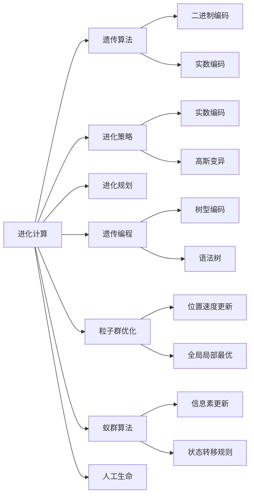

# 计算：第四部分 计算的极限 第 11 章 复杂性计算 进化计算

关键词：复杂性计算、进化计算、遗传算法、进化策略、粒子群优化、蚁群算法、人工生命、自适应系统

## 1. 背景介绍
### 1.1 问题的由来
在现实世界中,我们经常会遇到一些复杂的优化问题,如旅行商问题(TSP)、车间调度问题、网络路由优化等。这些问题通常具有搜索空间大、约束条件多、目标函数复杂等特点,传统的精确算法难以在可接受的时间内找到最优解。受大自然进化过程的启发,人们开始研究进化计算方法来解决这类复杂优化问题。

### 1.2 研究现状
进化计算作为一种启发式优化方法,已经成为解决复杂优化问题的重要手段。目前主要的进化计算方法包括遗传算法(GA)、进化策略(ES)、粒子群优化(PSO)、蚁群算法(ACO)等。这些算法在解决TSP、车间调度、网络路由等问题上取得了良好的效果。同时,进化计算与其他领域如神经网络、模糊系统等结合,形成了一些新的混合智能优化方法。

### 1.3 研究意义
进化计算作为一种通用的优化框架,不仅能解决传统精确算法难以处理的复杂问题,而且可以为其他智能优化算法提供参考和借鉴。深入研究进化计算的基本原理和关键技术,对于拓展其应用领域,提高算法性能,乃至发展新一代人工智能都具有重要意义。

### 1.4 本文结构
本文将首先介绍进化计算的核心概念和主要分支,然后重点讲解遗传算法的基本原理、数学模型和关键操作,并给出具体的编程实例。接着介绍进化计算的其他几个重要分支,如进化策略、粒子群优化、蚁群算法等。最后总结进化计算的研究现状、应用前景和未来挑战。

## 2. 核心概念与联系
进化计算(Evolutionary Computation,EC)是一类模拟自然进化过程的启发式优化算法。其核心思想是:将问题的可能解编码成"个体",通过"选择"、"交叉"、"变异"等遗传操作,不断迭代进化,最终收敛到问题的最优解或满意解。

进化计算主要包括以下几个分支:
- 遗传算法(Genetic Algorithm,GA):模拟生物进化过程,通过选择、交叉、变异等操作进化种群。
- 进化策略(Evolution Strategy,ES):重点模拟生物进化过程中的变异操作。
- 进化规划(Evolutionary Programming,EP):强调种群中个体的行为进化。
- 遗传编程(Genetic Programming,GP):利用进化过程自动生成计算机程序。
- 粒子群优化(Particle Swarm Optimization,PSO):模拟鸟群觅食行为,通过粒子的合作与竞争寻优。
- 蚁群算法(Ant Colony Optimization,ACO):模拟蚂蚁觅食的群体行为。
- 人工生命(Artificial Life,ALife):研究生命系统的共性,创造人工生命系统。

这些分支算法在模拟进化过程、编码策略、进化操作等方面各有特色,但都遵循"适者生存"的进化法则,体现了"群体智能"的思想。下图展示了几种主要进化计算方法的关联与区别:



## 3. 核心算法原理 & 具体操作步骤
### 3.1 算法原理概述
以遗传算法为例,其核心原理可概括为:
1. 将问题的可能解编码为染色体(个体)
2. 初始化一个随机种群
3. 根据个体的适应度选择优良个体 
4. 通过交叉变异产生新一代个体
5. 不断迭代步骤3和4,直到满足终止条件

遗传算法通过模拟"适者生存"的自然选择过程和"优良基因组合"的遗传机制,利用种群的"群体智能"高效搜索问题的最优解。

### 3.2 算法步骤详解
遗传算法的具体步骤如下:
1. 编码:将问题的可能解x映射为遗传算法的个体(染色体)。常见的编码方式有二进制编码、实数编码、格雷码等。
2. 初始化种群:随机生成N个个体作为初始种群P(0)。
3. 适应度评价:计算每个个体x的适应度f(x),作为其生存质量的度量。
4. 选择操作:按照一定的选择策略,从当前种群中选择一些个体形成下一代。常见的选择算子有轮盘赌选择、锦标赛选择等。
5. 交叉操作:按照一定的交叉概率Pc,将两个父代个体的部分基因交换,产生新的子代个体。常见的交叉算子有单点交叉、多点交叉、均匀交叉等。
6. 变异操作:按照一定的变异概率Pm,对个体的某些基因进行随机改变。常见的变异算子有二进制变异、高斯变异等。
7. 终止条件判断:如果满足预设的终止条件(如达到最大迭代次数、找到可接受解等),则输出最优解;否则回到步骤3,继续迭代。

### 3.3 算法优缺点
遗传算法的主要优点有:
- 通用性强,适用于多种优化问题
- 易于并行化,可充分利用计算资源  
- 鲁棒性好,不易陷入局部最优
- 可以处理复杂的非线性、多模态问题

遗传算法的主要缺点有:  
- 编码和解码过程可能引入额外复杂度
- 难以精确控制收敛速度和解的质量
- 对问题的先验知识利用不足
- 某些问题的适应度评估代价较高

### 3.4 算法应用领域
遗传算法在许多领域得到了成功应用,例如:
- 组合优化:TSP、背包问题、车间调度等
- 机器学习:特征选择、参数优化、规则提取等
- 自动控制:PID控制器参数整定、机器人路径规划等
- 图像处理:图像分割、特征提取、配准等
- 生物信息学:DNA测序、蛋白质结构预测等

## 4. 数学模型和公式 & 详细讲解 & 举例说明
### 4.1 数学模型构建
以遗传算法求解函数优化问题为例,假设要最大化目标函数:

$$ \max f(x), x\in S $$

其中$x$为$n$维决策变量,$S$为可行解空间。将$x$编码为二进制串$s$(个体),遗传算法的种群可表示为:

$$ P(t)=\{s_1^t,s_2^t,\cdots,s_N^t\} $$  

其中$t$为进化代数,$N$为种群大小。个体$s_i^t$的适应度为:

$$ \text{Fitness}(s_i^t)=f(x_i^t) $$

$x_i^t$为$s_i^t$解码后对应的决策变量取值。

### 4.2 公式推导过程
遗传算法的数学描述可基于马尔可夫链理论。假设$P(t)$到$P(t+1)$的转移服从一阶马尔可夫链,则有:

$$ P(t+1)=P(t)\cdot T $$

其中转移矩阵$T$的元素$T_{ij}$表示个体$s_i^t$变成$s_j^{t+1}$的转移概率:

$$ T_{ij}=\text{Pr}(s_i^t \to s_j^{t+1})=\text{Pr}(\text{selection})\cdot \text{Pr}(\text{crossover})\cdot \text{Pr}(\text{mutation}) $$

假设采用比例选择,单点交叉和基本位变异,则有:

$$ \text{Pr}(\text{selection})=\frac{f(x_i^t)}{\sum_{k=1}^N f(x_k^t)} $$

$$ \text{Pr}(\text{crossover})=\begin{cases} 
\frac{P_c}{n-1}, & s_j^{t+1}与s_i^t只差一个基因\\
1-P_c, & s_j^{t+1}=s_i^t \\
0, & 其他情况
\end{cases} $$

$$ \text{Pr}(\text{mutation})=P_m^{H(i,j)}(1-P_m)^{n-H(i,j)} $$

其中$P_c$为交叉概率,$P_m$为变异概率,$H(i,j)$为$s_i^t$和$s_j^{t+1}$的汉明距离。

### 4.3 案例分析与讲解
考虑以下函数优化问题:

$$ \max f(x)=x\sin(10\pi x)+2,x\in[-1,2] $$

将$x$离散为10位二进制编码,采用种群大小$N=50$,交叉概率$P_c=0.8$,变异概率$P_m=0.01$,进化500代。其Matlab程序如下:

```matlab
%% 遗传算法优化函数
clear;clc
%% 问题定义
f=@(x) x.*sin(10*pi*x)+2;  % 目标函数
L=10;  % 编码长度
xl=-1; xu=2;  % 变量范围
%% 遗传算法参数
N=50;  % 种群大小
Pc=0.8; % 交叉概率
Pm=0.01; % 变异概率 
G=500;  % 最大代数
%% 初始化种群
x=randi([0,1],N,L);
%% 迭代优化
for k=1:G
    % 解码
    x_real=xl+(xu-xl).*bin2dec(num2str(x))/(2^L-1);
    % 适应度评价  
    f_val=f(x_real);
    % 选择
    index=Sus(f_val);
    x=x(index,:);
    % 交叉
    for i=1:2:N-1
        if rand<Pc
            pos=randi(L-1);
            temp=x(i,pos+1:end);
            x(i,pos+1:end)=x(i+1,pos+1:end);
            x(i+1,pos+1:end)=temp;
        end
    end
    % 变异  
    for i=1:N
        if rand<Pm
            pos=randi(L);
            x(i,pos)=~x(i,pos);
        end
    end
end 
% 结果显示
[f_max,index]=max(f_val);
x_best=xl+(xu-xl)*bin2dec(num2str(x(index,:)))/(2^L-1);
fprintf('最优解为:%.4f,最优值为:%.4f\n',x_best,f_max);
```

运行结果为:最优解为1.8503,最优值为3.8503。可见遗传算法能够有效求解该函数优化问题。

### 4.4 常见问题解答
Q:遗传算法的时间复杂度如何?
A:假设种群大小为$N$,编码长度为$L$,进化代数为$G$,则遗传算法的时间复杂度为$O(NLG)$。其中适应度评价往往是最耗时的步骤。

Q:遗传算法容易陷入局部最优吗?
A:与传统优化方法相比,遗传算法通过维护一个种群并利用概率转移规则搜索,不易陷入局部最优。但若问题过于复杂或参数设置不当(如变异概率过小),仍可能过早收敛于次优解。

Q:遗传算法对初始种群有什么要求?
A:初始种群应具有一定的多样性,尽可能覆盖解空间的不同区域。通常采用随机初始化方法,或借助问题领域知识生成较优的初始解。

## 5. 项目实践：代码实例和详细解释说