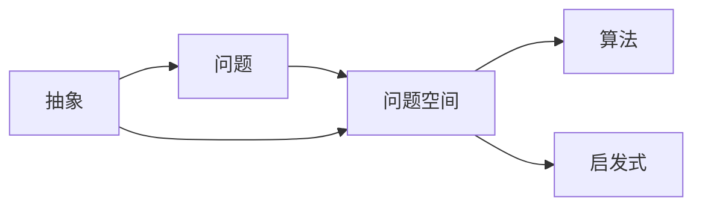

# 计算：附录 B 提问与求解的艺术

作者：禅与计算机程序设计艺术 / Zen and the Art of Computer Programming

## 1. 背景介绍
### 1.1 问题的由来
在计算机科学与编程领域,提出问题和寻求解决方案是每个从业者必备的基本功。无论是调试程序、优化算法,还是设计系统架构,都离不开问题求解的过程。然而,很多人往往忽视了提问和解决问题本身所蕴含的艺术和智慧。

### 1.2 研究现状
目前,关于提问和解决问题的研究主要集中在以下几个方面:

1. 批判性思维(Critical Thinking):强调以理性、客观的态度审视问题,并运用逻辑推理寻求解决之道。代表人物有理查德·保罗(Richard Paul)等。

2. 创造性问题解决(Creative Problem Solving):注重发散性思维,通过头脑风暴等方式激发灵感,产生创新的解决方案。代表人物有亚历克斯·奥斯本(Alex Osborn)等。  

3. 系统思考(Systems Thinking):强调从整体和长远的角度思考问题,洞察事物之间的内在联系。代表人物有杰伊·福瑞斯特(Jay Forrester)等。

4. 设计思维(Design Thinking):倡导以人为本,在理解用户需求的基础上,快速构建原型,不断迭代完善解决方案。代表人物有蒂姆·布朗(Tim Brown)等。

### 1.3 研究意义
深入研究提问和解决问题的艺术,对于提升程序员的编程素养和计算思维能力具有重要意义:

1. 培养批判性思维和逻辑推理能力,提高 debug 和性能优化水平。

2. 锻炼创新思维,开拓问题解决的新思路、新方法。

3. 加强系统思考意识,从全局视角思考软件架构设计。

4. 学习设计思维理念,以用户为中心开发高质量的软件产品。

### 1.4 本文结构
本文将从以下几个方面阐述提问与求解的艺术:

1. 核心概念与联系
2. 问题求解的一般方法论
3. 数学建模在问题求解中的应用
4. 编程实践:代码 debug 和性能优化
5. 软件工程中的问题分析与需求管理
6. 问题求解相关工具和资源推荐
7. 总结与展望

## 2. 核心概念与联系
在讨论提问和求解的艺术之前,我们有必要厘清几个核心概念:

- 问题(Problem):一个有待解决的困难或不确定的情况,通常由目标状态(期望达到的结果)和初始状态(当前的条件和资源)之间的差距所定义。

- 问题空间(Problem Space):包含问题及其所有可能解的集合。通过对问题空间的探索,我们寻找最优解。

- 算法(Algorithm):为解决特定问题而规定的一系列明确指令,常常用于将问题求解过程形式化、自动化。

- 启发式(Heuristic):一种经验法则或直观判断,虽然不能保证找到最优解,但能快速获得可接受的次优解。在问题空间过于庞大时,启发式是一种权衡策略。

- 抽象(Abstraction):通过去除不必要的细节,聚焦问题的本质特征。抽象是化繁为简、透过现象看本质的有力工具。

这些概念环环相扣,构成了问题求解的理论基础。我们需要运用抽象思维构建问题模型,利用算法或启发式在问题空间中高效搜索,最终找到最优或次优解。理解概念之间的联系,是掌握提问和求解艺术的第一步。

## 3. 核心算法原理 & 具体操作步骤
### 3.1 算法原理概述
解决问题的一般算法可以概括为以下步骤:

1. 明确问题:清晰界定问题的目标状态和约束条件。
2. 分解问题:将复杂问题分解为若干子问题。
3. 寻找解决方案:对每个子问题进行求解。可以利用已知算法,或采用启发式搜索。
4. 组合解决方案:将子问题的解组合起来,形成原问题的解。
5. 评估与优化:验证解的正确性,并在可能的情况下进一步优化。

### 3.2 算法步骤详解
以下是每个步骤的详细阐述:

1. 明确问题
   - 确定目标:期望达到的结果状态。
   - 识别约束:问题求解过程中必须遵循的限制条件,如时间、空间复杂度等。
   - 明晰输入:求解所需的已知信息和可用资源。
   - 定义输出:问题解决后需要返回的结果。

2. 分解问题
   - 划分子问题:将原问题划分为多个独立或弱相关的子问题。
   - 定义子问题之间的接口:确定子问题之间的输入输出关系。
   - 排定子问题的求解顺序:构建子问题的依赖关系图,确定求解顺序。

3. 寻找解决方案
   - 针对每个子问题,采取以下策略之一:
     - 利用已知算法:对于常见问题,直接使用现成的算法。
     - 采用启发式搜索:利用问题的特点,设计高效的搜索策略缩小解空间。
     - 运用数学建模:将问题转化为数学模型,利用数学工具求解。
   - 递归求解:如果子问题可以进一步分解,则递归执行"分解问题"和"寻找解决方案"步骤。

4. 组合解决方案
   - 按照子问题的求解顺序,逐步组合子问题的解,形成原问题的解。
   - 解决子问题之间的接口问题,确保解的连贯性和一致性。

5. 评估与优化
   - 验证解的正确性:设计测试用例,检验解能否满足所有约束并达成目标。
   - 分析解的质量:评估解在时间、空间复杂度等方面的表现。
   - 优化解决方案:在保证正确性的前提下,采取措施提升解的质量,如减少冗余计算、改进数据结构等。

### 3.3 算法优缺点
该算法的优点在于:
- 采用分治策略,将复杂问题化简为规模更小的子问题,降低了问题求解的难度。
- 松耦合的子问题划分,使得解决方案更加模块化,易于并行化实现。
- 递归处理使得算法结构简洁,易于理解和实现。

同时,该算法也存在一些局限性:
- 要求问题可分解为独立的子问题,对问题的适用范围有所限制。
- 递归求解可能引入额外的栈空间开销。
- 算法的整体复杂度取决于子问题划分的质量,不当的划分可能导致低效。

### 3.4 算法应用领域
该算法适用于以下问题领域:
- 组合优化问题:如旅行商问题(TSP)、背包问题等。
- 图论问题:如最短路径、最小生成树等。
- 搜索问题:如棋类游戏的博弈树搜索等。
- 数值计算问题:如矩阵乘法、快速傅里叶变换等。

## 4. 数学模型和公式 & 详细讲解 & 举例说明
### 4.1 数学模型构建
在寻求解决方案的过程中,数学建模是一种强有力的工具。通过将问题抽象为数学模型,我们可以利用数学语言的简洁性和数学分析工具的强大功能,高效地探索问题的本质规律。

以下是一个常见的数学建模流程:
1. 确定决策变量:即问题的未知量,如优化问题中的决策参数。
2. 定义目标函数:用数学语言描述问题的优化目标,如最大化利润、最小化成本等。
3. 刻画约束条件:用不等式或等式描述问题的约束,如资源限制、法规要求等。
4. 求解模型:利用数学规划、动态规划、图论算法等方法求解模型。
5. 验证与改进:将求得的数学解映射回原问题,验证其合理性,必要时改进模型。

### 4.2 公式推导过程
以下是一个经典的背包问题模型,我们将详细推导其数学形式。

背包问题描述:给定 $n$ 个物品,每个物品有重量 $w_i$ 和价值 $v_i$,背包的容量为 $W$。如何选择物品放入背包,使得背包内物品的总价值最大化?

1. 决策变量:
令 $x_i \in \{0, 1\}$ 表示第 $i$ 个物品是否被选中放入背包。$x_i = 1$ 表示选中,  $x_i = 0$ 表示未选中。

2. 目标函数:
最大化背包内物品的总价值,即
$$\max \sum_{i=1}^n v_i x_i$$

3. 约束条件:
   - 背包容量限制:所选物品的总重量不能超过背包容量 $W$。
     $$\sum_{i=1}^n w_i x_i \leq W$$
   - 决策变量取值限制:每个物品要么选中要么不选,因此
     $$x_i \in \{0, 1\}, i = 1,2,\cdots,n$$

综上,背包问题的整数规划模型为:
$$
\begin{align*}
\max & \sum_{i=1}^n v_i x_i \\
\text{s.t.} & \sum_{i=1}^n w_i x_i \leq W \\
& x_i \in \{0, 1\}, i = 1,2,\cdots,n
\end{align*}
$$

### 4.3 案例分析与讲解
我们以一个简单的背包问题实例来说明模型的应用。

假设有 3 个物品,它们的重量和价值分别为:
- 物品 1: $w_1 = 2$, $v_1 = 3$
- 物品 2: $w_2 = 3$, $v_2 = 4$  
- 物品 3: $w_3 = 4$, $v_3 = 5$

背包的容量为 $W = 6$。

根据上述整数规划模型,我们可以列出如下求解过程:
$$
\begin{align*}
\max & 3x_1 + 4x_2 + 5x_3 \\
\text{s.t.} & 2x_1 + 3x_2 + 4x_3 \leq 6 \\
& x_1, x_2, x_3 \in \{0, 1\}
\end{align*}
$$

通过穷举所有可能的 $x_1, x_2, x_3$ 取值组合,我们可以得到最优解:
$$x_1 = 1, x_2 = 1, x_3 = 0$$

此时,背包内物品的总重量为 $2 + 3 = 5 \leq 6$,总价值达到最大值 $3 + 4 = 7$。

当然,对于大规模的背包问题,穷举法的计算复杂度过高。我们需要采用更高效的算法,如动态规划、贪心算法等。这些算法的设计与实现,将在后续章节中详细讨论。

### 4.4 常见问题解答
Q: 数学建模是否适用于所有类型的问题?
A: 并非所有问题都适合用数学建模的方法求解。数学建模通常要求问题具有明确的量化指标和清晰的逻辑结构。对于定性描述的、逻辑模糊的问题,数学建模可能无法奏效。

Q: 如何评估数学模型的质量?
A: 一个好的数学模型应当具备以下特点:
   - 准确性:能够准确刻画问题的本质特征。
   - 简洁性:用尽可能少的变量和参数描述问题。
   - 可解性:模型应当可以用现有的数学工具求解。
   - 可解释性:模型的解能够映射回原问题,并给出合理的解释。
   - 稳健性:模型对参数变化不敏感,解的质量稳定。

Q: 如何处理模型求解过程中