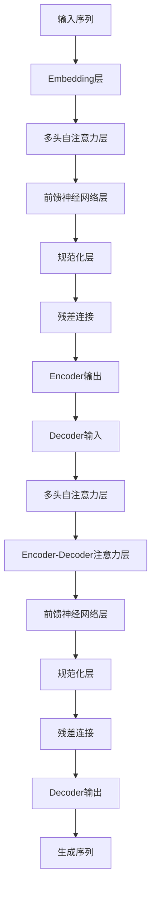

# 语言与思维的区别：大模型的认知误解

## 1. 背景介绍

### 1.1 问题的由来

随着人工智能技术的不断发展,大型语言模型(Large Language Models, LLMs)已经成为当前人工智能领域最引人注目的研究热点之一。这些模型通过在海量文本数据上进行预训练,展现出了惊人的语言生成和理解能力,在自然语言处理、问答系统、内容创作等领域取得了突破性的进展。然而,对于这些模型的真正"认知"能力,业界存在着广泛的争议和质疑。

### 1.2 研究现状  

目前,大多数研究者倾向于认为,尽管大型语言模型在语言任务上表现出色,但它们仍然缺乏真正的理解和推理能力。这些模型只是在统计上学习了语言的模式和规则,而无法像人类那样形成深层次的概念理解和推理链条。因此,它们更像是"语言黑匣子",能够生成看似合理的语言输出,但背后缺乏真正的认知过程。

另一方面,也有研究者认为,大型语言模型确实展现出了某种程度的"认知"能力,尽管这种认知能力与人类的认知存在着本质区别。他们认为,这些模型通过学习海量数据,形成了一种"统计认知",能够在一定程度上模拟人类的语言理解和推理过程。

### 1.3 研究意义

探讨大型语言模型的真正认知能力,不仅对于评估当前人工智能技术的局限性具有重要意义,更能够为未来发展提供重要的理论指导。如果我们能够揭示语言模型的内在机制,或许就能设计出更加"智能"的模型,真正实现人工通用智能(Artificial General Intelligence, AGI)的目标。

### 1.4 本文结构

本文将从多个角度深入探讨语言与思维的区别,以及大型语言模型在认知方面的误解。我们将首先介绍核心概念和理论基础,然后分析语言模型的核心算法原理和数学模型,并通过实际案例和代码实现进行说明。最后,我们将探讨语言模型在实际应用中的局限性,以及未来的发展趋势和挑战。

## 2. 核心概念与联系

在探讨语言与思维的区别之前,我们需要先了解一些核心概念和理论基础。

### 2.1 语言的本质

语言是人类表达思想、交流信息的工具,它是一种符号系统,由词汇、语法和语义规则构成。语言不仅仅是一种表达形式,更是人类认知和思维活动的载体。

### 2.2 思维的定义

思维是人脑进行信息加工、推理和解决问题的高级认知过程。它包括形成概念、进行推理、做出判断和决策等多种认知活动。思维是人类智能的核心,它使我们能够理解世界、创造知识和解决复杂问题。

### 2.3 符号主义与连接主义

在认知科学和人工智能领域,存在着两种主要的理论范式:符号主义(Symbolism)和连接主义(Connectionism)。

符号主义认为,人类思维是通过操作符号和规则来实现的,就像计算机执行程序一样。这种观点认为,思维是一种形式化的、逻辑推理的过程,可以用算法和数学模型来描述。

连接主义则认为,人脑是一种大规模的并行分布式系统,思维是通过神经元之间的连接和激活模式实现的。这种观点强调思维的emergent性质,认为它是从底层神经元的交互作用中自发涌现出来的。

### 2.4 语言与思维的关系

语言和思维之间存在着密切的联系,但它们并不是完全等同的。语言是思维的外在表现形式,但思维也可以通过其他方式(如图像、数学符号等)来表达。另一方面,语言也可能影响和塑造我们的思维方式(语言相对论假说)。

因此,语言与思维之间存在着复杂的相互作用关系,它们虽然密不可分,但又有着本质的区别。这种区别正是我们探讨大型语言模型认知能力的关键所在。

## 3. 核心算法原理与具体操作步骤

### 3.1 算法原理概述

大型语言模型的核心算法原理是基于自注意力(Self-Attention)机制和Transformer架构。这种架构能够有效地捕捉输入序列中的长程依赖关系,从而生成更加连贯、合理的语言输出。

具体来说,Transformer模型由编码器(Encoder)和解码器(Decoder)两个主要部分组成。编码器将输入序列(如问题或上文)映射为一系列向量表示,解码器则基于这些向量表示生成目标序列(如回答或下文)。

在这个过程中,自注意力机制起到了关键作用。它允许模型在计算每个位置的向量表示时,关注整个输入序列的所有位置,从而捕捉长程依赖关系。这种机制打破了传统序列模型(如RNN)对序列长度的限制,使得Transformer能够处理更长的序列。

### 3.2 算法步骤详解

1. **嵌入层(Embedding Layer)**: 将输入序列(如文本)转换为向量表示,作为模型的初始输入。

2. **多头自注意力层(Multi-Head Self-Attention Layer)**: 计算每个位置的向量表示,同时关注整个输入序列的所有位置,捕捉长程依赖关系。

3. **前馈神经网络层(Feed-Forward Neural Network)**: 对自注意力层的输出进行进一步处理和转换,提取更高层次的特征表示。

4. **规范化层(Normalization Layer)**: 对前馈神经网络的输出进行归一化处理,提高模型的稳定性和收敛速度。

5. **残差连接(Residual Connection)**: 将规范化层的输出与自注意力层的输入相加,形成残差连接,有助于梯度传播和模型收敛。

6. **Encoder输出**: 经过多个编码器层的处理后,得到输入序列的最终编码表示。

7. **Decoder输入**: 将Encoder的输出作为Decoder的初始输入,开始生成目标序列。

8. **Decoder自注意力层**: 与Encoder类似,Decoder也包含多头自注意力层,用于捕捉目标序列内部的依赖关系。

9. **Encoder-Decoder注意力层**: 将Decoder的自注意力输出与Encoder的输出进行注意力计算,捕捉输入序列和目标序列之间的依赖关系。

10. **前馈神经网络层、规范化层和残差连接**: 与Encoder类似,对注意力输出进行进一步处理和转换。

11. **Decoder输出**: 经过多个解码器层的处理后,得到目标序列的最终输出表示。

12. **生成序列**: 根据Decoder的输出,通过掩码(Masking)和概率预测,逐步生成目标序列(如文本)。

### 3.3 算法优缺点

**优点**:

- 自注意力机制能够有效捕捉长程依赖关系,克服了传统序列模型(如RNN)的局限性。
- 并行计算能力强,可以充分利用GPU等硬件加速,提高训练和推理效率。
- 模型架构简单,易于优化和扩展,如增加层数、调整注意力头数等。

**缺点**:

- 计算复杂度较高,尤其是对于长序列,注意力计算的开销会急剧增加。
- 缺乏显式的归纳偏置(Inductive Bias),需要从大量数据中学习模式和规则。
- 生成的输出可能存在不连贯、矛盾或无意义的问题,缺乏真正的理解和推理能力。

### 3.4 算法应用领域

Transformer和自注意力机制已经在多个自然语言处理任务中取得了卓越的表现,包括:

- **机器翻译**: 将一种语言的文本翻译成另一种语言。
- **文本生成**: 根据给定的提示或上文,生成连贯、流畅的文本内容。
- **问答系统**: 根据问题和背景知识,生成相关的答案。
- **文本摘要**: 自动生成文本的摘要或概括。
- **情感分析**: 分析文本的情感倾向(正面、负面等)。
- **实体识别**: 从文本中识别出人名、地名、组织机构等实体。

除了自然语言处理领域,Transformer和自注意力机制也被应用于计算机视觉、语音识别等其他领域,展现出了广阔的应用前景。

## 4. 数学模型和公式详细讲解与举例说明

### 4.1 数学模型构建

为了更好地理解Transformer模型的工作原理,我们需要构建相应的数学模型。在这里,我们将重点介绍自注意力机制的数学表示。

自注意力机制的核心思想是计算一个查询向量(Query)与所有键向量(Keys)之间的相似性分数,并根据这些分数对值向量(Values)进行加权求和,得到查询向量的注意力表示。

具体来说,给定一个序列 $X = (x_1, x_2, \ldots, x_n)$,我们首先将每个元素 $x_i$ 映射为三个向量:查询向量 $q_i$、键向量 $k_i$ 和值向量 $v_i$,它们的维度均为 $d_k$、$d_k$ 和 $d_v$。这个映射可以通过线性变换实现:

$$
q_i = W^Q x_i, \quad k_i = W^K x_i, \quad v_i = W^V x_i
$$

其中 $W^Q \in \mathbb{R}^{d_k \times d_m}$、$W^K \in \mathbb{R}^{d_k \times d_m}$ 和 $W^V \in \mathbb{R}^{d_v \times d_m}$ 分别是查询、键和值的线性变换矩阵。

接下来,我们计算查询向量 $q_i$ 与所有键向量 $k_j$ 的点积,得到一个相似性分数向量:

$$
e_{ij} = \frac{q_i \cdot k_j}{\sqrt{d_k}}
$$

其中 $\sqrt{d_k}$ 是一个缩放因子,用于防止点积值过大导致梯度消失或爆炸。

然后,我们对相似性分数向量 $e_i = (e_{i1}, e_{i2}, \ldots, e_{in})$ 进行软最大化(Softmax)操作,得到注意力权重向量 $\alpha_i$:

$$
\alpha_i = \text{softmax}(e_i) = \left(\frac{e^{e_{i1}}}{\sum_j e^{e_{ij}}}, \frac{e^{e_{i2}}}{\sum_j e^{e_{ij}}}, \ldots, \frac{e^{e_{in}}}{\sum_j e^{e_{ij}}}\right)
$$

最后,我们将注意力权重向量 $\alpha_i$ 与值向量 $v_j$ 进行加权求和,得到查询向量 $q_i$ 的注意力表示 $z_i$:

$$
z_i = \sum_{j=1}^n \alpha_{ij} v_j
$$

通过上述计算过程,我们实现了自注意力机制,即根据查询向量与所有键向量的相似性,对值向量进行加权求和,捕捉序列内部的依赖关系。

### 4.2 公式推导过程

在实际应用中,我们通常会使用多头自注意力(Multi-Head Attention)机制,它能够从不同的子空间捕捉序列的不同特征。

具体来说,给定一个查询向量 $q$、键向量 $K = (k_1, k_2, \ldots, k_n)$ 和值向量 $V = (v_1, v_2, \ldots, v_n)$,我们首