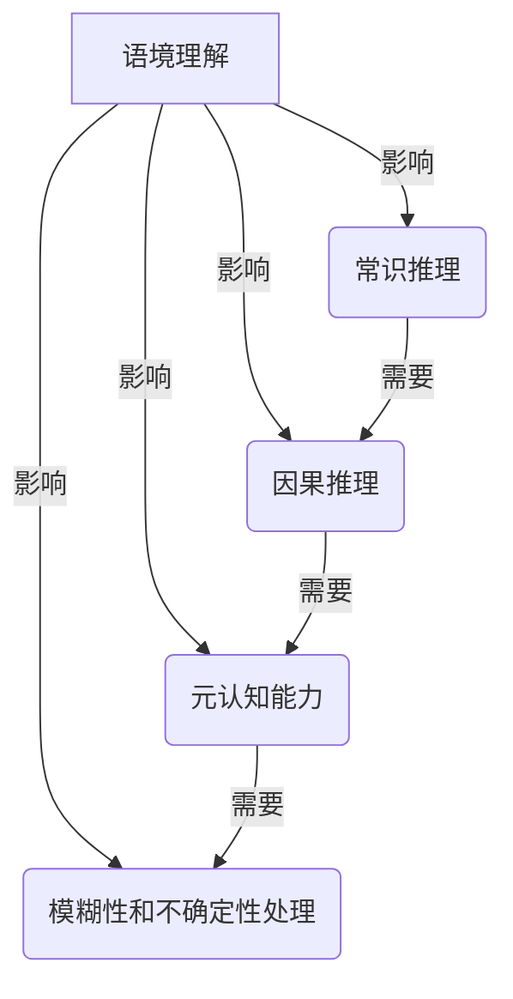

# 语言与推理：大模型的认知障碍

## 1. 背景介绍

### 1.1 问题的由来

随着人工智能技术的不断发展,大型语言模型(Large Language Models, LLMs)已经成为当前自然语言处理领域的主导力量。这些模型通过在海量文本数据上进行预训练,展现出了惊人的语言生成和理解能力。然而,尽管取得了令人瞩目的成就,但大型语言模型在推理和认知方面仍然存在着一些固有的障碍和局限性。

人类语言是一种复杂的符号系统,不仅需要掌握词汇和语法规则,更需要对语境、隐喻、逻辑推理等高级认知能力有深刻的理解。然而,当前的大型语言模型主要是通过统计学习的方式来捕捉语言的模式和规律,缺乏对语义和认知层面的深入理解。这导致了模型在处理需要复杂推理和认知能力的任务时,表现往往不尽如人意。

### 1.2 研究现状

针对大型语言模型在推理和认知方面的局限性,研究人员已经开展了大量的工作。一些研究集中在改进模型的架构和训练方式,例如引入外部知识库、设计更有效的注意力机制等。另一些研究则侧重于设计新的评估任务和基准测试,以更好地衡量模型的推理和认知能力。

然而,尽管取得了一些进展,但大型语言模型在推理和认知方面的根本性障碍仍然存在。这些障碍不仅来自于模型本身的局限性,也与人类语言本身的复杂性和模糊性密切相关。

### 1.3 研究意义

深入探讨大型语言模型在推理和认知方面的障碍,对于我们更好地理解人工智能系统的能力边界、设计更加人性化的人机交互界面,以及最终实现真正的人工通用智能(Artificial General Intelligence, AGI)都具有重要的理论和实践意义。

只有透彻地认识到大型语言模型在推理和认知方面的局限性,我们才能更加清晰地认识到人工智能技术的现实水平,从而制定更加合理的发展路线图和应用场景。同时,探索大型语言模型在推理和认知方面的障碍,也有助于我们更好地理解人类语言和认知的本质,为建立更加人性化的人工智能系统奠定基础。

### 1.4 本文结构

本文将从以下几个方面深入探讨大型语言模型在推理和认知方面的障碍:

1. 语境理解的障碍
2. 常识推理的障碍
3. 因果推理的障碍
4. 元认知能力的障碍
5. 模糊性和不确定性处理的障碍

对于每一个障碍,我们将首先阐述其背景和重要性,然后分析其根源和表现,最后探讨可能的解决方案和未来的研究方向。在此过程中,我们将引入相关的核心概念、算法原理、数学模型和公式,并辅以实际案例和代码示例,以帮助读者更好地理解这一领域的最新进展和挑战。

## 2. 核心概念与联系

在探讨大型语言模型在推理和认知方面的障碍之前,我们需要先介绍一些核心概念,以建立必要的理论基础。这些概念不仅与语言模型的架构和训练方式密切相关,也与人类语言和认知的本质存在内在联系。

### 2.1 语境理解

语境理解是指能够根据语境信息正确解释和理解语言表达的能力。它包括以下几个方面:

1. **共指消解(Coreference Resolution)**: 将文本中的代词、名词短语等与其所指对象正确关联。
2. **语义角色标注(Semantic Role Labeling)**: 识别句子中的谓词-论元结构,确定每个论元在谓词事件中扮演的语义角色。
3. **语境推理(Contextual Reasoning)**: 根据上下文信息推断出隐含的语义内容和逻辑关系。

语境理解对于自然语言理解至关重要,是进行更高层次的推理和认知的基础。然而,由于语境信息的复杂性和多样性,语境理解一直是大型语言模型面临的一大挑战。

### 2.2 常识推理

常识推理是指利用日常生活中的常识知识进行推理的能力。它包括以下几个方面:

1. **物理常识推理**: 对物理世界的基本规律和属性进行推理,如重力、运动、因果关系等。
2. **社会常识推理**: 对人类社会行为和规范进行推理,如社交礼仪、角色关系、道德准则等。
3. **时间常识推理**: 对时间概念和事件顺序进行推理,如先后关系、持续时间、周期性等。

常识推理是人类认知的重要组成部分,但对于大型语言模型来说,它却是一个巨大的挑战。由于常识知识的广泛性和隐性,很难通过简单的统计学习来获取和应用这些知识。

### 2.3 因果推理

因果推理是指根据已知信息推断出事件或现象之间的因果关系的能力。它包括以下几个方面:

1. **归因推理(Abductive Reasoning)**: 从观察到的证据推断出最有可能的原因。
2. **反事实推理(Counterfactual Reasoning)**: 推断在不同情况下会发生什么。
3. **动机推理(Intention Reasoning)**: 推断行为背后的动机和目的。

因果推理是人类进行决策和规划的关键能力,但对于大型语言模型来说,它也存在着巨大的挑战。这主要是因为因果关系往往隐含在语言表达中,需要综合多种信息源和推理技巧才能准确把握。

### 2.4 元认知能力

元认知能力是指对自身认知过程进行监控、评估和调节的能力。它包括以下几个方面:

1. **不确定性评估**: 评估自身推理结果的可信度和不确定性程度。
2. **知识缺陷意识**: 意识到自身知识的缺陷和局限性。
3. **学习意愿**: 主动寻求新知识和反馈,以改进自身的认知能力。

元认知能力是人类智能的重要体现,但对于当前的大型语言模型来说,它几乎是一个全新的领域。缺乏元认知能力意味着模型难以客观评估自身的表现,也无法主动学习和改进。

### 2.5 模糊性和不确定性处理

模糊性和不确定性是自然语言的一个重要特征,它们来源于以下几个方面:

1. **语义模糊性**: 词语和句子的含义往往是模糊的,需要根据语境进行解释。
2. **主观性**: 语言表达往往带有主观色彩,反映了说话者的观点和情感。
3. **不完整信息**: 语言表达中经常存在隐含的、未说明的信息。

处理模糊性和不确定性是人类语言理解和推理的核心能力,但对于大型语言模型来说,这也是一个巨大的挑战。模型往往倾向于给出确定性的输出,难以很好地捕捉和表达语言中的模糊性和不确定性。

这些核心概念相互关联、相互影响,共同构成了大型语言模型在推理和认知方面的障碍。只有深入理解它们的内涵和联系,我们才能更好地分析和解决这些障碍。

## 3. 核心算法原理 & 具体操作步骤

### 3.1 算法原理概述

大型语言模型通常采用基于transformer的序列到序列(Seq2Seq)架构,其核心算法原理包括:

1. **自注意力机制(Self-Attention)**: 捕捉输入序列中不同位置之间的长程依赖关系。
2. **编码器-解码器结构(Encoder-Decoder)**: 将输入序列编码为语义向量表示,再由解码器生成目标序列。
3. **掩码语言模型(Masked Language Model)**: 在预训练阶段,通过预测被掩码的词来学习语言的上下文语义。
4. **次新词预测(Next Sentence Prediction)**: 在预训练阶段,通过预测下一个句子是否与当前句子相关来学习句子之间的关系。

虽然这些算法原理使得大型语言模型能够在语言生成和理解任务上取得了卓越的表现,但它们也存在一些固有的局限性,导致了模型在推理和认知方面的障碍。

### 3.2 算法步骤详解

以下是基于transformer的大型语言模型的典型训练和推理过程:

1. **预训练阶段**:
   a. 从大规模语料库中采样输入序列。
   b. 对输入序列进行掩码处理,随机将部分词替换为特殊的[MASK]标记。
   c. 将处理后的输入序列输入编码器,获得其语义向量表示。
   d. 将语义向量输入解码器,预测被掩码的词。
   e. 根据预测结果和真实标签计算损失函数,并通过反向传播更新模型参数。

2. **微调阶段**:
   a. 在特定任务的数据集上继续训练预训练好的模型。
   b. 根据任务的性质,可能需要对输入进行特定的处理(如添加特殊标记)。
   c. 将处理后的输入序列输入编码器,获得其语义向量表示。
   d. 将语义向量输入解码器,生成目标序列。
   e. 根据生成的序列和真实标签计算损失函数,并通过反向传播更新模型参数。

3. **推理阶段**:
   a. 将输入序列输入编码器,获得其语义向量表示。
   b. 将语义向量输入解码器,生成目标序列。
   c. 根据任务需求,可能需要对生成的序列进行后处理(如去除特殊标记)。

虽然这种基于transformer的序列到序列架构在语言生成和理解任务上表现出色,但它也存在一些固有的局限性,导致了模型在推理和认知方面的障碍。例如,自注意力机制虽然能够捕捉长程依赖关系,但无法很好地处理复杂的逻辑推理;掩码语言模型虽然能够学习上下文语义,但无法很好地理解隐含的常识知识。

### 3.3 算法优缺点

**优点**:

1. **并行计算**: 自注意力机制和transformer架构能够高效利用GPU进行并行计算,大大提高了训练和推理的效率。
2. **长程依赖捕捉**: 自注意力机制能够有效捕捉输入序列中不同位置之间的长程依赖关系,这对于理解复杂的语言结构至关重要。
3. **transfer学习**: 通过预训练和微调的方式,大型语言模型能够在不同任务和领域之间进行知识转移,提高了模型的泛化能力。

**缺点**:

1. **缺乏结构化知识**: 大型语言模型主要是通过统计学习的方式来捕捉语言的模式和规律,缺乏对结构化知识(如常识知识、逻辑规则等)的明确表示和利用。
2. **推理能力有限**: 虽然自注意力机制能够捕捉长程依赖关系,但它无法进行复杂的逻辑推理和因果推理,这限制了模型在推理和认知方面的表现。
3. **缺乏可解释性**: 大型语言模型的内部机制是一个高度复杂的黑箱,难以解释其推理过程和输出结果,这影响了模型的可信度和可控性。

### 3.4 算法应用领域

尽管存在一些局限性,基于transformer的大型语言模型仍然在自然语言处理的多个领域取得了卓越的应用,包括但不限于:

1. **机器翻译**: 将一种自然语言转换为另一种自然语言。
2. **文本摘要**: 自