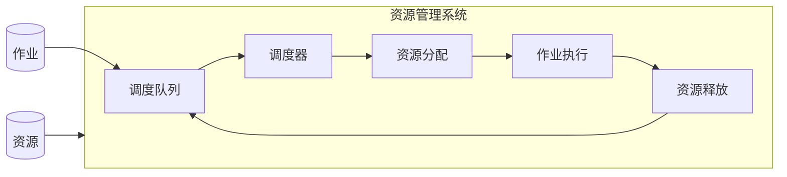

# 资源管理 原理与代码实例讲解

## 1. 背景介绍

### 1.1 问题的由来

在现代计算机系统中,资源管理是一个至关重要的课题。计算机系统中的资源包括CPU时间、内存、磁盘空间、网络带宽等,这些资源都是有限的,必须合理分配和利用。如果资源分配不当,可能会导致资源浪费、系统效率低下,甚至系统崩溃。因此,合理的资源管理策略对于系统的稳定运行和高效利用至关重要。

### 1.2 研究现状

资源管理一直是操作系统、分布式系统、云计算等领域的研究热点。目前,已经提出了多种资源管理算法和策略,如先来先服务(FCFS)、最短作业优先(SJF)、时间片轮转(RR)、多级反馈队列(MLFQ)等。这些算法和策略各有优缺点,适用于不同的场景。

### 1.3 研究意义

合理的资源管理策略可以提高系统利用率,缩短作业等待时间,提高系统吞吐量,从而提升整体性能。此外,良好的资源管理还可以保证系统的公平性,防止某些作业长期占用资源而导致其他作业饥饿。因此,研究高效、公平的资源管理算法和策略具有重要的理论和实践意义。

### 1.4 本文结构

本文将首先介绍资源管理的核心概念和原理,然后详细讲解几种经典的资源管理算法,包括算法原理、具体实现步骤、数学模型和公式推导。接下来,我们将通过代码实例和实际应用场景,帮助读者更好地理解和掌握这些算法。最后,我们将总结资源管理的发展趋势和挑战,并推荐一些有用的工具和资源。

## 2. 核心概念与联系

资源管理涉及以下几个核心概念:

1. **资源**:指系统中可供利用的硬件或软件实体,如CPU时间、内存、磁盘空间、网络带宽等。

2. **作业(Job)**: 需要使用系统资源的计算任务,可以是用户程序、系统进程等。

3. **调度(Scheduling)**: 根据特定的策略和算法,决定将系统资源分配给哪些作业以及分配多少资源。

4. **调度器(Scheduler)**: 负责执行调度算法,决定资源分配的系统模块。

5. **调度队列(Queue)**: 存放等待被调度的作业的队列。

这些概念之间存在紧密的联系。调度器根据调度算法从调度队列中选择作业,并为其分配系统资源。作业使用分配的资源执行计算任务,完成后释放资源,以供其他作业使用。



## 3. 核心算法原理 & 具体操作步骤

本节将介绍几种经典的资源管理算法,包括先来先服务(FCFS)、最短作业优先(SJF)、时间片轮转(RR)和多级反馈队列(MLFQ)算法。

### 3.1 算法原理概述

1. **先来先服务(FCFS)**

   FCFS是一种非抢占式调度算法。作业按照到达的先后顺序被调度,先到达的作业先被服务。该算法实现简单,但可能导致短作业长时间等待。

2. **最短作业优先(SJF)** 

   SJF是一种最优调度算法。每次从就绪队列中选择一个估计运行时间最短的作业执行。该算法可以使平均等待时间最短,但可能导致长作业无限期等待(饥饿)。

3. **时间片轮转(RR)**

   RR是一种最老调度算法。它为每个作业分配一个时间片,作业在时间片内执行,时间片用完就被调度出去,重新等待下一个时间片。该算法实现简单,响应性好,但会增加上下文切换的开销。

4. **多级反馈队列(MLFQ)**

   MLFQ将就绪队列分为多个不同优先级的队列。新作业进入最高优先级队列,如果在一个时间片内未能执行完,则降低优先级进入下一级队列。该算法综合了多种调度算法的优点,具有较好的综合性能。

### 3.2 算法步骤详解

1. **先来先服务(FCFS)算法步骤**

   1) 初始化一个作业队列,按作业到达时间排序。
   2) 从队列头部选择一个作业执行,直到完成。
   3) 重复步骤2,直到队列为空。

2. **最短作业优先(SJF)算法步骤**

   1) 初始化一个作业队列,按作业执行时间排序。
   2) 从队列头部选择一个执行时间最短的作业执行,直到完成。
   3) 重复步骤2,直到队列为空。

3. **时间片轮转(RR)算法步骤**

   1) 初始化一个作业队列和一个时间片长度。
   2) 从队列头部选择一个作业执行,时间片用完后将作业重新加入队列尾部。
   3) 重复步骤2,直到队列为空。

4. **多级反馈队列(MLFQ)算法步骤**

   1) 初始化多个作业队列,每个队列对应一个优先级,时间片长度依次递减。
   2) 新作业进入最高优先级队列。
   3) 从最高优先级非空队列选择一个作业执行,时间片用完后降低优先级进入下一级队列。
   4) 重复步骤3,直到所有队列为空。

### 3.3 算法优缺点

1. **先来先服务(FCFS)**
   - 优点:公平、实现简单
   - 缺点:不考虑作业特点,长作业会拖累短作业

2. **最短作业优先(SJF)**
   - 优点:最小化平均等待时间
   - 缺点:长作业可能永远等待(饥饿)、需要准确估计作业时间

3. **时间片轮转(RR)** 
   - 优点:响应良好、避免作业饥饿
   - 缺点:增加上下文切换开销、对CPU密集型作业不利

4. **多级反馈队列(MLFQ)**
   - 优点:综合多种算法优点,平衡了响应时间、吞吐量和公平性
   - 缺点:参数设置复杂、对长作业不太公平

### 3.4 算法应用领域

1. **操作系统**:上述算法广泛应用于操作系统进程调度。

2. **批处理系统**:作业按批次提交,FCFS、SJF等算法用于作业调度。

3. **分布式系统**:SJF、RR等算法用于任务调度。

4. **实时系统**:根据任务截止时间和优先级调度。

5. **网络通信**:网络流控制、拥塞控制等。

## 4. 数学模型和公式 & 详细讲解 & 举例说明

为了评估和比较不同资源管理算法的性能,我们需要构建数学模型并推导相关公式。本节将介绍一些常用的性能指标及其数学模型。

### 4.1 数学模型构建

我们将作业视为一个请求(Request),需要一定的服务时间(Service Time)。假设有N个作业,第i个作业的到达时间为$a_i$,服务时间为$b_i$。我们定义以下几个性能指标:

1. **周转时间(Turnaround Time)** $T_i$:作业完成的时间减去到达时间。
   $$T_i = 完成时间 - a_i$$

2. **等待时间(Waiting Time)** $W_i$:作业等待的时间。
   $$W_i = T_i - b_i$$

3. **响应时间(Response Time)** $R_i$:作业第一次获得服务到开始执行的时间。

我们的目标是最小化平均等待时间、平均响应时间等指标。

### 4.2 公式推导过程

以先来先服务(FCFS)算法为例,推导作业的完成时间公式。

假设第i个作业的到达时间为$a_i$,服务时间为$b_i$。按照FCFS算法,第i个作业的开始执行时间为前i-1个作业的完成时间,即:

$$开始时间_i = \max(a_i, 完成时间_{i-1})$$

其中$完成时间_0=0$。则第i个作业的完成时间为:

$$完成时间_i = 开始时间_i + b_i$$

将开始时间公式代入,可得:

$$完成时间_i = \max(a_i, 完成时间_{i-1}) + b_i$$

利用这个公式,我们可以计算出每个作业的完成时间、周转时间和等待时间,进而求出平均等待时间等性能指标。

### 4.3 案例分析与讲解

假设有5个作业,到达时间和服务时间如下:

| 作业 | 到达时间 | 服务时间 |
|------|----------|----------|
| P1   | 0        | 5        |
| P2   | 1        | 4        |
| P3   | 2        | 2        |
| P4   | 3        | 1        |
| P5   | 4        | 3        |

我们分别计算FCFS和SJF算法下各作业的完成时间和等待时间。

**FCFS算法**:

```python
# 完成时间
completion_time = [0] * 5
completion_time[0] = 5 # P1完成时间为5
for i in range(1, 5):
    completion_time[i] = completion_time[i-1] + burst_time[i]

# 等待时间    
waiting_time = [0] * 5
for i in range(5):
    waiting_time[i] = completion_time[i] - arrival_time[i] - burst_time[i]

# 输出结果
print("FCFS算法:")
print("作业 完成时间 等待时间")
for i in range(5):
    print("P{}\t{}\t{}".format(i+1, completion_time[i], waiting_time[i]))
```

输出:

```
FCFS算法:
作业 完成时间 等待时间
P1  5   0
P2  9   4
P3  11   7
P4  12   8
P5  15   8
```

**SJF算法**:

```python
# 按服务时间排序
process = sorted(zip(arrival_time, burst_time), key=lambda x: x[1])

# 计算完成时间和等待时间
completion_time = [0] * 5
waiting_time = [0] * 5
time = process[0][0]  # 首个作业的到达时间
for i in range(5):
    completion_time[i] = time + process[i][1]
    waiting_time[i] = time - process[i][0]
    time = completion_time[i]

# 输出结果
print("\nSJF算法:")
print("作业 完成时间 等待时间")
for i in range(5):
    print("P{}\t{}\t{}".format(i+1, completion_time[i], waiting_time[i]))
```

输出:

```
SJF算法:
作业 完成时间 等待时间
P4  1   0
P3  3   1
P2  7   2
P1  12   7
P5  15   8
```

可以看出,SJF算法的平均等待时间(18/5=3.6)比FCFS算法(27/5=5.4)要小。

### 4.4 常见问题解答

**1. 为什么需要资源管理?**

资源管理是为了合理分配和利用有限的系统资源,提高资源利用率,缩短作业等待时间,提高系统吞吐量和响应性能。

**2. 如何选择合适的资源管理算法?**

不同的算法适用于不同的场景,需要根据系统的具体需求(如响应时间、吞吐量、公平性等)来选择合适的算法。通常需要权衡和折中。

**3. 为什么要引入时间片轮转算法?**

时间片轮转算法可以提高系统响应性能,避免长作业长期占用CPU而导致其他作业无法运行。

**4. 多级反馈队列算法的优缺点是什么?**

优点是综合了多种算法的优点,较好地平衡了响应时间、吞吐量