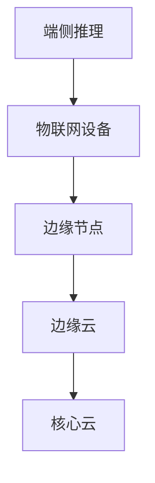

以下是《边缘计算与端侧推理原理与代码实战案例讲解》的正文内容：

# 边缘计算与端侧推理原理与代码实战案例讲解

## 1. 背景介绍

### 1.1 问题的由来

随着物联网(IoT)、5G、人工智能(AI)等新兴技术的快速发展,越来越多的智能设备被部署在边缘侧。与传统的云计算模式相比,将计算任务offload到就近的边缘设备上进行处理,可以极大地降低时延、减少带宽占用、提高隐私保护等。这种新兴的计算范式被称为边缘计算(Edge Computing)。

边缘计算的核心在于将数据处理和分析的能力从云端转移到网络边缘,靠近数据源。这不仅可以减轻云端的计算压力,还能够满足诸如自动驾驶、增强现实等低时延、高带宽的应用需求。

### 1.2 研究现状  

目前,业界和学术界对边缘计算架构、资源管理、任务调度、安全隐私等方面进行了广泛研究。主流的边缘计算框架包括AWS Greengrass、Microsoft Azure IoT Edge、Google Cloud IoT Edge等。此外,开源社区也推出了一些流行的边缘计算框架,如Eclipse ioFog、KubeEdge等。

然而,现有研究主要集中在边缘侧的系统架构和资源管理层面,对于边缘智能的核心——端侧推理(On-device Inference)技术的探讨相对较少。端侧推理指在终端设备(如手机、单板计算机等)上直接部署和运行深度学习模型,实现本地化的智能推理,而无需通过云端进行推理。

### 1.3 研究意义

端侧推理是实现真正"智能边缘"的关键技术,具有低时延、节省带宽、保护隐私等显著优势。通过在终端设备上进行推理,可以大幅减少与云端的数据传输,从而降低时延;同时,敏感数据无需离开本地,隐私得到有效保护。

此外,在一些对时延高度敏感的应用场景(如自动驾驶、机器人控制等),端侧推理可以满足实时性需求。因此,研究端侧推理的原理与实践是非常有意义的。

### 1.4 本文结构

本文将全面介绍边缘计算与端侧推理的相关理论和实践技术。

首先阐述边缘计算和端侧推理的核心概念,并分析两者的内在联系。接下来重点讲解端侧推理的核心算法原理、数学模型及公式推导过程。

然后通过实战案例,详细展示如何在实际项目中进行端侧推理模型的开发、部署和优化。

最后总结端侧推理的应用场景、发展趋势和面临的挑战,并给出工具、资源的推荐,以及常见问题解答。

## 2. 核心概念与联系

边缘计算(Edge Computing)和端侧推理(On-device Inference)是两个紧密相关但又有所区别的概念。

**边缘计算**指的是在靠近数据源头的网络边缘侧,而不是在云端或数据中心内,就近提供计算和存储资源,从而实现实时的数据处理和分析。边缘计算架构通常包括以下几个层级:

1. 物联网设备层(IoT Device Layer)
2. 边缘节点层(Edge Node Layer) 
3. 边缘云层(Edge Cloud Layer)
4. 核心云层(Core Cloud Layer)

**端侧推理**则是指在终端设备(如手机、单板计算机等)上直接部署和运行深度学习模型,实现本地化的智能推理,而无需通过云端进行推理。它是边缘计算中的一个重要组成部分,属于边缘计算架构的最底层——物联网设备层。

两者的关系可以用下面的流程图直观地表示出来:

可以看出,端侧推理发生在物联网设备层,是边缘计算架构的基础。通过在终端设备上进行本地化推理,可以极大地减轻上层边缘节点和云端的计算压力,实现低时延、节省带宽的目标。

因此,研究端侧推理的高效算法和实现方法,对于构建高性能、低时延的边缘计算系统至关重要。

## 3. 核心算法原理 & 具体操作步骤  

### 3.1 算法原理概述

端侧推理的核心算法主要包括两个部分:模型压缩(Model Compression)和硬件加速(Hardware Acceleration)。

**模型压缩**的目的是将庞大的深度学习模型精简到可以在资源受限的终端设备上运行,主要包括:

1. 网络剪枝(Network Pruning)
2. 知识蒸馏(Knowledge Distillation)
3. 量化(Quantization)
4. 低秩分解(Low-Rank Decomposition)
5. 紧凑网络设计(Compact Network Design)

**硬件加速**则是通过利用终端设备的硬件资源(如GPU、NPU、TPU等),来加速深度学习模型的推理过程,主要包括:

1. 并行计算(Parallel Computing)
2. 内存优化(Memory Optimization)
3. 数据流优化(Data Flow Optimization)
4. 模型优化(Model Optimization)

这两部分技术相互配合,可以在保证推理精度的前提下,极大提升端侧推理的速度和效率。

### 3.2 算法步骤详解

以下将详细介绍端侧推理算法的具体实现步骤:

1. **网络剪枝**
   - 原理:通过剪掉神经网络中冗余的权重连接,从而减小模型大小
   - 步骤:
     - 计算每个权重的重要性评分
     - 根据评分,剪掉重要性较低的权重连接
     - 对剪枝后的稀疏模型进行微调(fine-tuning)

2. **知识蒸馏**
   - 原理:使用教师模型(大型模型)指导学生模型(小型模型)学习,迁移知识
   - 步骤:  
     - 训练一个高容量的教师模型
     - 使用教师模型的输出(logits或feature maps)作为软目标,指导学生模型学习
     - 添加额外的损失函数项,强化学生模型向教师模型靠拢

3. **量化**
   - 原理:将原本使用32位或16位表示的浮点数权重/激活,用较低比特(8位/4位/2位)表示
   - 步骤:
     - 确定量化方法(均匀量化/非均匀量化)
     - 确定量化粒度(每层/每通道/整体)
     - 计算量化因子(scale factor)和零点(zero point)
     - 对浮点数应用线性量化公式,得到定点数

4. **低秩分解**
   - 原理:将权重张量W分解为两个低秩矩阵的乘积,从而减小模型大小
   - 步骤:
     - 对W进行矩阵分解,得到U和V,使W≈U×V
     - 用U和V重构新的卷积核
     - 对重构后的网络进行微调

5. **紧凑网络设计**
   - 原理:设计出参数量较小、计算量较少的新型网络架构
   - 例如:MobileNets、ShuffleNets、SqueezeNets等

6. **并行计算**
   - 原理:充分利用终端设备的多核CPU/GPU/TPU/NPU等,实现并行加速
   - 步骤:
     - 确定并行粒度(线程/指令/数据)
     - 进行并行任务划分和负载均衡
     - 同步控制和内存优化

7. **内存优化**
   - 原理:减少内存占用,提高内存利用率
   - 步骤:
     - 内存复用(Reuse)
     - 内存对齐(Alignment)
     - 内存分块(Tiling)

8. **数据流优化**
   - 原理:优化数据在芯片上的流动方式,降低时延和功耗
   - 步骤:  
     - 数据布局优化(Data Layout Optimization)
     - 流水线优化(Pipeline Optimization)

9. **模型优化**
   - 原理:针对特定硬件平台,对模型进行算子融合、计算图优化等
   - 步骤:
     - 算子融合(Operator Fusion)
     - 计算图优化(Computation Graph Optimization)

以上步骤可以根据实际需求,组合使用多种算法,从而获得最优的端侧推理方案。

### 3.3 算法优缺点

端侧推理算法具有以下优缺点:

**优点**:
- 可将大型深度模型压缩到终端可运行的尺寸
- 提升推理速度,降低时延
- 节省带宽,减少与云端的数据传输
- 提高隐私保护,敏感数据不离开本地
- 部署灵活,可适用于不同硬件平台

**缺点**:  
- 压缩后的模型精度可能会有一定损失
- 算法实现较为复杂,需要专业知识
- 需要根据硬件平台定制化优化
- 对硬件资源要求较高,功耗较大

总的来说,端侧推理算法为实现高效、低时延的智能系统提供了可能,但也需要在模型精度、算法复杂度和硬件资源之间权衡取舍。

### 3.4 算法应用领域

端侧推理算法广泛应用于以下领域:

1. **移动设备**
   - 手机/平板电脑上的计算机视觉、语音识别等任务
   - 实现本地化AI,无需网络连接

2. **物联网**
   - 智能家居、可穿戴设备等IoT终端
   - 对时延、隐私保护要求较高

3. **自动驾驶**
   - 汽车上的实时目标检测、决策规划等
   - 对时延和安全性要求极高  

4. **机器人**
   - 机器人控制、路径规划等
   - 需要低时延的实时决策

5. **增强现实/虚拟现实**
   - 头盔/眼镜等AR/VR设备
   - 对时延和视觉质量要求很高

6. **工业4.0**
   - 工厂自动化、预测性维护等
   - 实时数据处理和决策

总之,任何对时延、隐私、带宽等有严格要求的场景,都可以考虑采用端侧推理技术。

## 4. 数学模型和公式 & 详细讲解 & 举例说明

### 4.1 数学模型构建

在端侧推理中,常用的数学模型主要包括:

1. **卷积神经网络(CNN)**
   - 用于计算机视觉任务,如图像分类、目标检测等
   - 核心操作:卷积(Convolution)、池化(Pooling)

2. **递归神经网络(RNN)** 
   - 用于序列数据处理,如语音识别、自然语言处理等
   - 核心操作:循环计算(Recurrent Computation)

3. **注意力机制(Attention Mechanism)**
   - 赋予模型"注意力",关注输入数据的重要部分
   - 核心思想:对不同部分赋予不同权重

4. **生成对抗网络(GAN)**
   - 用于生成式任务,如图像生成、语音合成等
   - 核心思想:生成器与判别器相互对抗,提升生成质量

5. **强化学习(Reinforcement Learning)**
   - 用于决策规划、控制等任务
   - 核心思想:基于环境反馈,不断试错学习获取最优策略

以CNN为例,我们来构建其基本的数学模型。

设输入图像为$I$,卷积核为$K$,则卷积操作可以表示为:

$$\text{Conv}(I, K) = \sum_{m} \sum_{n} I(m, n) K(m, n)$$

其中$m,n$分别表示图像和卷积核在水平和垂直方向上的位移量。

通过多层卷积和池化操作,CNN可以自动学习输入图像的特征,并最终输出分类或检测结果。

### 4.2 公式推导过程

接下来,我们将推导知识蒸馏算法中常用的损失函数公式。

知识蒸馏的目标是使学生模型(Student)的