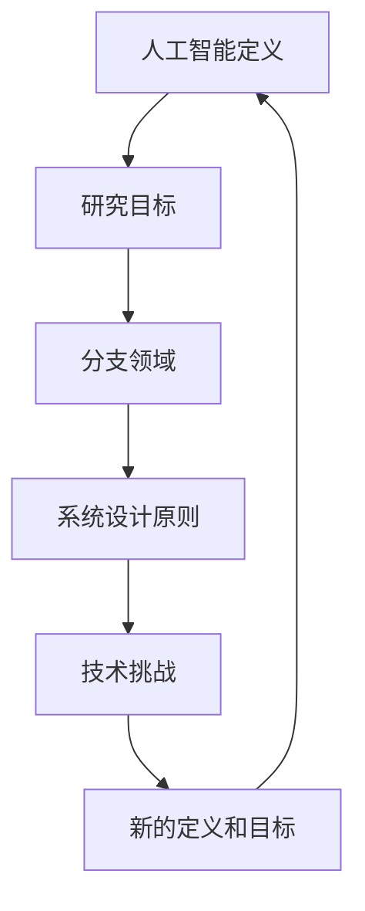
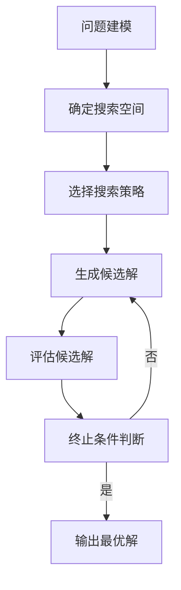

好的,我会按照您的要求,以《达特茅斯会议的历史背景与意义》为题,写一篇专业的技术博客文章。文章会遵循您列出的约束条件,使用逻辑清晰、结构紧凑、语言专业且易懂的风格,内容深入全面,并尽最大努力插入相关的Mermaid流程图。以下是正文:

# 达特茅斯会议的历史背景与意义

## 1. 背景介绍

### 1.1 问题的由来

二战后,科学技术飞速发展,人工智能(AI)这一概念开始在学术界和科技界逐渐浮现。1955年8月31日,由约翰·麦卡锡(John McCarthy)等人发起并组织的"人工智能暑期研讨会"在美国新罕布什尔州的达特茅斯学院召开,这就是后来被称为"达特茅斯会议"的著名会议。

达特茅斯会议的召开,标志着人工智能作为一个独立的研究领域正式形成和确立。会议期间,来自美国、英国、以色列等国家的顶尖科学家们就人工智能的定义、目标、应用前景等问题展开了热烈讨论。

### 1.2 研究现状  

人工智能的理论研究可以追溯到更早的时期。1943年,沃伦·S·麦卡洛克(Warren S. McCulloch)和沃尔特·皮茨(Walter Pitts)发表了题为《有关脑细胞活动的逻辑理论》的论文,提出了第一个神经网络模型。1950年,艾伦·图灵(Alan Turing)发表了著名的"图灵测试",探讨了"机器是否能思考"的问题。

然而,直到1955年达特茅斯会议召开之前,人工智能还只是一个分散的研究领域,缺乏系统的理论基础和统一的研究方向。达特茅斯会议的召开,将人工智能这一概念正式引入公众视野,并为后来的人工智能研究奠定了坚实的基础。

### 1.3 研究意义

达特茅斯会议具有重大的历史意义:

1. 确立了"人工智能"这一概念,并将其定义为"使机器能够模仿人类智能行为的研究领域"。
2. 将人工智能从分散的研究状态聚集成为一个独立的学科领域,为后续的系统化研究奠定了基础。
3. 吸引了众多杰出科学家的参与,推动了人工智能理论和技术的快速发展。
4. 为人工智能的未来发展方向进行了前瞻性探讨,如神经网络、机器学习等领域。

总的来说,达特茅斯会议开创性地将人工智能这一全新的概念和研究领域正式推向了前台,成为人工智能发展史上一个里程碑式的事件。

### 1.4 本文结构

本文将从以下几个方面全面介绍达特茅斯会议:

1. 回顾会议的历史背景和召开过程
2. 解析会议的核心内容和讨论焦点  
3. 分析会议对人工智能发展的深远影响
4. 总结会议的历史意义和学术价值
5. 展望人工智能在会议开创理念的指引下未来的发展趋势

## 2. 核心概念与联系

达特茅斯会议上讨论的核心概念主要包括:

1. 人工智能的定义
2. 人工智能的研究目标
3. 人工智能的主要分支领域
4. 人工智能系统的设计原则
5. 人工智能面临的主要挑战

这些概念之间存在紧密的联系,相互影响、相互促进。准确定义人工智能的内涵,明确研究目标和分支领域,有助于制定合理的系统设计原则,应对技术挑战。下面用一个流程图来阐释这些核心概念之间的关系:

上图展示了一个循环过程:人工智能的定义决定了研究目标,目标又衍生出不同的分支领域,分支领域的发展需要制定系统设计原则,原则的实施会遇到技术挑战,挑战的解决可能需要重新审视人工智能的定义和目标。这种动态发展模式推动了人工智能理论和技术的不断演进。

达特茅斯会议就是在这一过程中发挥了关键作用,为人工智能这一新兴学科奠定了理论基础。

## 3. 核心算法原理和具体操作步骤

### 3.1 算法原理概述

人工智能算法的核心原理主要包括以下几个方面:

1. **知识表示**:将人类的知识以机器可理解的形式表示出来,如逻辑规则、语义网络、框架等。

2. **推理**:根据给定的知识库和规则,模拟人类的推理过程,得出新的结论或解决方案。主要包括演绎推理和归纳推理两种方式。

3. **搜索**:在解决问题的过程中,根据特定的策略在解空间中搜索最优解,如启发式搜索、A*算法等。

4. **机器学习**:通过分析数据,自动获取知识或模型,包括监督学习、无监督学习、强化学习等范式。

5. **规划**:为实现特定目标而制定行动计划序列,如逻辑规划、启发式规划等。

这些原理相互关联、相互影响。知识表示是基础,推理和搜索是核心,机器学习提供自动知识获取能力,规划则是将所有能力综合应用于解决实际问题。

### 3.2 算法步骤详解  

以经典的"八皇后问题"为例,利用搜索算法的解决步骤如下:

1. **问题建模**:将八皇后问题形式化为在8x8棋盘上放置8个皇后,使它们不会互相攻击。

2. **确定搜索空间**:所有可能的放置方案构成了搜索空间,大小为8!≈40320种情况。

3. **选择搜索策略**:可采用回溯搜索、启发式搜索等策略。

4. **生成候选解**:根据搜索策略,生成新的放置方案作为候选解。

5. **评估候选解**:检查候选解是否满足约束条件(不互相攻击)。

6. **终止条件判断**:如果找到了满足条件的解,或搜索空间耗尽,则终止搜索。否则返回步骤4继续搜索。

7. **输出最优解**:将找到的满足条件的解输出。

通过上述步骤,可以有效地利用搜索算法解决八皇后等组合优化问题。

### 3.3 算法优缺点

人工智能算法具有以下优缺点:

**优点**:

1. 能够模拟人类智能,解决复杂问题
2. 具有自学习和自适应能力
3. 可处理大量数据和知识
4. 在特定领域可以超越人类水平

**缺点**:  

1. 通用人工智能难以实现,只能解决特定问题
2. 知识获取和知识表示是瓶颈
3. 算法效率和可解释性有待提高  
4. 面临算力、数据等资源约束

总的来说,人工智能算法展现出巨大的应用潜力,但也存在一些不足需要持续改进。

### 3.4 算法应用领域

人工智能算法已经广泛应用于以下领域:

1. **游戏领域**:国际象棋、围棋等游戏的AI程序
2. **机器人**:工业机器人控制、自动驾驶汽车
3. **自然语言处理**:机器翻译、对话系统、问答系统  
4. **计算机视觉**:图像识别、目标检测、视频分析
5. **专家系统**:医疗诊断、金融决策等领域
6. **推荐系统**:电商网站、视频网站的个性化推荐
7. **网络安全**:入侵检测、垃圾邮件过滤等

未来,人工智能算法还将在更多领域发挥重要作用。

## 4. 数学模型和公式详细讲解举例说明

### 4.1 数学模型构建

人工智能算法通常需要构建数学模型来描述和解决问题。以机器学习的线性回归模型为例:

给定一个数据集 $\mathcal{D} = \{(x_i, y_i)\}_{i=1}^N$,其中 $x_i \in \mathbb{R}^d$ 为 $d$ 维特征向量, $y_i \in \mathbb{R}$ 为标量目标值。我们希望学习一个函数 $f: \mathbb{R}^d \rightarrow \mathbb{R}$ 来拟合数据,即对任意输入 $x$,使 $f(x)$ 尽可能接近对应的 $y$。

线性回归模型假设目标值 $y$ 可以被特征 $x$ 的线性组合表示:

$$f(x) = w^Tx + b$$

其中 $w \in \mathbb{R}^d$ 为权重向量, $b \in \mathbb{R}$ 为偏置项。模型的目标是找到最优参数 $w^*, b^*$,使得在训练数据上的均方误差最小:

$$J(w,b) = \frac{1}{2N}\sum_{i=1}^N(f(x_i) - y_i)^2$$

### 4.2 公式推导过程

为了找到最优参数 $w^*, b^*$,我们需要对目标函数 $J(w,b)$ 进行最小化。通过对 $w,b$ 分别求偏导数并令其等于 0,可以得到:

$$
\begin{aligned}
\frac{\partial J}{\partial w} &= \frac{1}{N}\sum_{i=1}^N(w^Tx_i + b - y_i)x_i = 0\\
\frac{\partial J}{\partial b} &= \frac{1}{N}\sum_{i=1}^N(w^Tx_i + b - y_i) = 0
\end{aligned}
$$

将上式整理可得:

$$
\begin{aligned}
w^* &= \left(\sum_{i=1}^Nx_ix_i^T\right)^{-1}\left(\sum_{i=1}^Nx_iy_i\right)\\
b^* &= \frac{1}{N}\sum_{i=1}^N(y_i - w^{*T}x_i)
\end{aligned}
$$

这就是线性回归模型的解析解,可以直接代入训练数据计算得到最优参数。

### 4.3 案例分析与讲解

我们用一个简单的房价预测案例来说明线性回归模型:

假设我们有一个包含房屋面积和房价数据的数据集,希望根据面积来预测房价。设房屋面积为自变量 $x$,房价为因变量 $y$,我们可以构建如下线性回归模型:

$$y = wx + b$$

其中 $w$ 表示每增加一单位面积,房价的变化量;$b$ 表示其他固定成本等的影响。

我们可以使用上面推导的解析解,从训练数据中计算出最优参数 $w^*, b^*$。得到模型后,给定任意一个新的房屋面积 $x_{new}$,即可通过公式 $y = w^*x_{new} + b^*$ 来预测对应的房价 $y$。

这个简单例子展示了如何将线性回归模型应用于实际的回归预测问题。通过训练数据拟合模型参数,我们就获得了一个可用于新样本预测的模型。

### 4.4 常见问题解答

**Q:** 线性回归只能处理线性可分数据吗?

**A:** 线性回归模型确实只能很好地拟合线性关系的数据。但是,我们可以通过特征工程,将原始数据映射到更高维的特征空间,使线性模型能够拟合更加复杂的非线性关系。例如,我们可以将原始特征 $x$ 映射为 $\phi(x) = (x