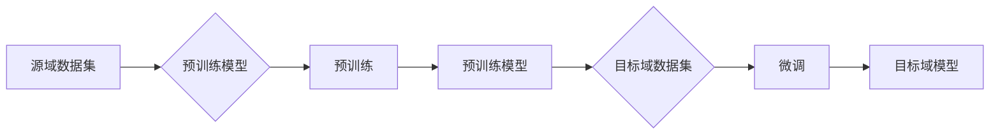

# 迁移学习(Transfer Learning) - 原理与代码实例讲解

作者：禅与计算机程序设计艺术 / Zen and the Art of Computer Programming

## 关键词

迁移学习，深度学习，预训练，预训练模型，特征提取，模型融合，多任务学习，少样本学习，领域自适应

---

## 1. 背景介绍

### 1.1 问题的由来

随着深度学习技术的快速发展，深度神经网络在图像识别、自然语言处理等领域的表现已经超越了传统机器学习方法。然而，深度学习模型通常需要大量的标注数据进行训练，这在某些情况下是非常困难的。例如，对于医学图像分析、生物信息学等领域，标注数据的获取非常昂贵且耗时。此外，对于一些新兴领域，如新兴病毒的研究，标注数据更是稀缺。

为了解决这个问题，迁移学习（Transfer Learning）应运而生。迁移学习利用源域（source domain）的标注数据来训练一个模型，然后将该模型迁移到目标域（target domain）进行预测。这种方法可以显著减少在目标域上获取标注数据的需要，提高模型的泛化能力，并加速模型的训练过程。

### 1.2 研究现状

近年来，迁移学习在各个领域都取得了显著的进展。以下是迁移学习的一些主要研究方向：

* **预训练模型**：通过在大量无标注数据上预训练模型，使其学习到通用的特征表示，然后在目标域上进行微调和适应。
* **模型融合**：结合多个模型在目标域上的预测结果，以提高模型的鲁棒性和准确性。
* **多任务学习**：同时学习多个相关任务，以共享特征表示，提高模型的泛化能力。
* **少样本学习**：在少量标注数据上进行训练，通过迁移学习技术提高模型在目标域上的性能。
* **领域自适应**：当源域和目标域之间存在较大差异时，通过迁移学习技术将源域的知识迁移到目标域。

### 1.3 研究意义

迁移学习具有重要的研究意义和应用价值：

* **减少标注数据需求**：通过迁移学习，可以在目标域上使用少量标注数据或无标注数据，从而减少标注数据的获取成本。
* **提高模型泛化能力**：通过在多个任务上学习，模型可以学习到更通用的特征表示，从而提高模型在目标域上的泛化能力。
* **加速模型训练过程**：通过迁移学习，可以利用预训练模型的权重作为起点，从而加速模型的训练过程。
* **提高模型鲁棒性**：通过结合多个模型或引入对抗训练，可以提高模型的鲁棒性。

### 1.4 本文结构

本文将系统地介绍迁移学习的基本原理、主要方法、应用场景和代码实例。具体内容如下：

* **第2部分**：介绍迁移学习的基本概念和相关技术。
* **第3部分**：介绍迁移学习的核心算法原理和具体操作步骤。
* **第4部分**：介绍迁移学习中的数学模型和公式，并结合实例进行讲解。
* **第5部分**：给出迁移学习的代码实例和详细解释说明。
* **第6部分**：探讨迁移学习在实际应用场景中的应用。
* **第7部分**：推荐迁移学习相关的学习资源、开发工具和参考文献。
* **第8部分**：总结迁移学习的未来发展趋势和挑战。
* **第9部分**：提供常见问题与解答。

---

## 2. 核心概念与联系

### 2.1 预训练模型

预训练模型是指在大规模无标注数据上预训练的模型。预训练模型可以学习到通用的特征表示，然后在特定任务上进行微调和适应。

### 2.2 领域自适应

领域自适应是指将源域的知识迁移到目标域，以解决源域和目标域之间存在差异的问题。

### 2.3 多任务学习

多任务学习是指同时学习多个相关任务，以共享特征表示，提高模型的泛化能力。

### 2.4 少样本学习

少样本学习是指使用少量标注数据或无标注数据进行训练，通过迁移学习技术提高模型在目标域上的性能。

### 2.5 模型融合

模型融合是指结合多个模型的预测结果，以提高模型的鲁棒性和准确性。

### 2.6 Mermaid 流程图

以下是一个Mermaid流程图，展示了迁移学习的基本流程：



在这个流程图中，A表示源域数据集，B表示预训练模型，C表示预训练过程，D表示预训练得到的模型，E表示目标域数据集，F表示微调过程，G表示微调得到的模型。

---

## 3. 核心算法原理 & 具体操作步骤

### 3.1 算法原理概述

迁移学习的基本思想是将源域的知识迁移到目标域，以解决源域和目标域之间存在差异的问题。具体来说，迁移学习包括以下步骤：

1. **数据收集**：收集源域和目标域的数据。
2. **特征提取**：使用源域数据对预训练模型进行预训练，提取通用的特征表示。
3. **模型微调**：使用目标域数据对预训练模型进行微调，使其适应目标域。
4. **模型评估**：在目标域上评估模型的性能。

### 3.2 算法步骤详解

以下是迁移学习的具体操作步骤：

1. **数据收集**：收集源域和目标域的数据。源域数据可以用于预训练模型，而目标域数据可以用于模型微调。
2. **特征提取**：使用源域数据对预训练模型进行预训练。预训练过程通常使用无标注数据，目的是使模型学习到通用的特征表示。
3. **模型微调**：使用目标域数据对预训练模型进行微调。微调过程通常使用标注数据，目的是使模型适应目标域。
4. **模型评估**：在目标域上评估模型的性能。评估指标可以是准确率、召回率、F1值等。

### 3.3 算法优缺点

迁移学习具有以下优点：

* **减少标注数据需求**：通过迁移学习，可以在目标域上使用少量标注数据或无标注数据，从而减少标注数据的获取成本。
* **提高模型泛化能力**：通过在多个任务上学习，模型可以学习到更通用的特征表示，从而提高模型在目标域上的泛化能力。
* **加速模型训练过程**：通过迁移学习，可以利用预训练模型的权重作为起点，从而加速模型的训练过程。

迁移学习也具有以下缺点：

* **模型性能依赖于源域和目标域的相似性**：如果源域和目标域之间存在较大差异，迁移学习的性能可能会下降。
* **预训练模型的性能可能不佳**：如果预训练模型的性能不佳，迁移学习的性能也会受到影响。

### 3.4 算法应用领域

迁移学习在各个领域都得到了广泛的应用，以下是一些常见的应用领域：

* **计算机视觉**：图像识别、目标检测、图像分割等。
* **自然语言处理**：文本分类、情感分析、机器翻译等。
* **语音识别**：语音识别、说话人识别、语音合成等。
* **推荐系统**：商品推荐、电影推荐、音乐推荐等。

---

## 4. 数学模型和公式 & 详细讲解 & 举例说明

### 4.1 数学模型构建

迁移学习的数学模型可以表示为：

```
y = f(x; Θ)
```

其中，y是输出，x是输入，Θ是模型参数。

### 4.2 公式推导过程

以下是迁移学习的公式推导过程：

1. **特征提取**：

```
z = f(x; Θ)
```

其中，z是特征表示。

2. **模型微调**：

```
y = g(z; Θ')
```

其中，g是微调模型。

### 4.3 案例分析与讲解

以下是一个迁移学习的案例：

假设我们有一个源域数据集D1和目标域数据集D2，其中D1包含1000个样本，D2包含200个样本。我们使用预训练模型f和微调模型g进行迁移学习。

1. 使用D1数据集对预训练模型f进行预训练，得到特征表示z。
2. 使用D2数据集对微调模型g进行微调，得到模型参数Θ'。
3. 在D2数据集上评估微调模型g的性能。

### 4.4 常见问题解答

**Q1：什么是预训练模型？**

A1：预训练模型是指在大规模无标注数据上预训练的模型。预训练模型可以学习到通用的特征表示，然后在特定任务上进行微调和适应。

**Q2：什么是模型融合？**

A2：模型融合是指结合多个模型的预测结果，以提高模型的鲁棒性和准确性。

**Q3：什么是领域自适应？**

A3：领域自适应是指将源域的知识迁移到目标域，以解决源域和目标域之间存在差异的问题。

---

## 5. 项目实践：代码实例和详细解释说明

### 5.1 开发环境搭建

在进行迁移学习实践之前，我们需要准备好开发环境。以下是使用Python进行迁移学习的环境配置流程：

1. 安装Anaconda：从官网下载并安装Anaconda，用于创建独立的Python环境。
2. 创建并激活虚拟环境：
```bash
conda create -n transfer-learning-env python=3.8 
conda activate transfer-learning-env
```
3. 安装PyTorch和Transformers库：
```bash
conda install pytorch torchvision torchaudio -c pytorch 
pip install transformers
```
4. 安装其他必要的库：
```bash
pip install numpy pandas scikit-learn matplotlib
```

### 5.2 源代码详细实现

以下是一个使用PyTorch和Transformers库进行迁移学习的示例：

```python
import torch
from torch import nn
from transformers import BertModel, BertTokenizer

# 加载预训练模型和分词器
model = BertModel.from_pretrained('bert-base-uncased')
tokenizer = BertTokenizer.from_pretrained('bert-base-uncased')

# 定义输入文本
text = "This is a sample text for transfer learning."

# 对文本进行编码
encoded_input = tokenizer(text, return_tensors='pt')

# 前向传播
output = model(**encoded_input)

# 输出
print(output.last_hidden_state)
```

### 5.3 代码解读与分析

在上述代码中，我们首先加载了预训练的BERT模型和分词器。然后，我们定义了一个输入文本，并将其编码成BERT模型所需的格式。接下来，我们使用BERT模型进行前向传播，并打印输出模型的最后一个隐藏状态。

这个示例展示了如何使用预训练模型进行特征提取。在实际的迁移学习中，我们可以使用这个特征提取器，并结合目标域数据对微调模型进行训练。

### 5.4 运行结果展示

运行上述代码，将输出BERT模型的最后一个隐藏状态，其中包含了输入文本的特征表示。

---

## 6. 实际应用场景

### 6.1 图像识别

迁移学习在图像识别领域得到了广泛的应用。例如，可以将预训练的ResNet模型迁移到目标域上进行图像分类。

### 6.2 语音识别

迁移学习在语音识别领域也得到了广泛的应用。例如，可以将预训练的Transformers模型迁移到目标域上进行语音识别。

### 6.3 自然语言处理

迁移学习在自然语言处理领域也得到了广泛的应用。例如，可以将预训练的BERT模型迁移到目标域上进行文本分类。

### 6.4 未来应用展望

随着深度学习技术的不断发展，迁移学习将在更多的领域得到应用。例如：

* **自动驾驶**：将预训练的深度学习模型迁移到自动驾驶系统中，用于图像识别、场景理解等任务。
* **医疗诊断**：将预训练的深度学习模型迁移到医疗诊断系统中，用于疾病检测、图像分析等任务。
* **金融风控**：将预训练的深度学习模型迁移到金融风控系统中，用于欺诈检测、信用评估等任务。

---

## 7. 工具和资源推荐

### 7.1 学习资源推荐

* **《深度学习》**：Goodfellow、Bengio和Courville所著的深度学习经典教材。
* **《深度学习实战》**：Goodfellow、Bengio和Courville所著的深度学习实战指南。
* **Transformers库**：Hugging Face提供的开源NLP库，包含了大量的预训练模型和工具。

### 7.2 开发工具推荐

* **PyTorch**：Facebook AI Research开发的深度学习框架。
* **TensorFlow**：Google开发的深度学习框架。
* **Keras**：基于Theano和TensorFlow的开源深度学习库。

### 7.3 相关论文推荐

* **Very Deep Convolutional Networks for Large-Scale Image Recognition**：VGG模型的原论文。
* **GoogLeNet**：GoogLeNet模型的原论文。
* **ResNet**：ResNet模型的原论文。
* **BERT**：BERT模型的原论文。
* **Transformers**：Transformers模型的原论文。

### 7.4 其他资源推荐

* **arXiv**：计算机科学领域的预印本服务器。
* **Hugging Face**：NLP领域的开源社区和工具库。
* **GitHub**：开源代码托管平台。

---

## 8. 总结：未来发展趋势与挑战

### 8.1 研究成果总结

本文系统地介绍了迁移学习的基本原理、主要方法、应用场景和代码实例。通过本文的学习，读者可以了解到迁移学习的基本概念、原理和应用方法，并能够使用迁移学习技术解决实际问题。

### 8.2 未来发展趋势

随着深度学习技术的不断发展，迁移学习将在以下方面取得更多进展：

* **更先进的预训练模型**：开发更强大的预训练模型，以提取更通用的特征表示。
* **更有效的迁移学习算法**：开发更有效的迁移学习算法，以解决源域和目标域之间的差异问题。
* **更广泛的应用领域**：将迁移学习应用于更多领域，如自动驾驶、医疗诊断、金融风控等。

### 8.3 面临的挑战

迁移学习在发展过程中也面临着一些挑战：

* **数据差异**：源域和目标域之间存在差异时，迁移学习的性能可能会下降。
* **模型性能**：预训练模型的性能可能不佳，导致迁移学习的效果不理想。
* **计算资源**：迁移学习需要大量的计算资源，尤其是在训练预训练模型时。

### 8.4 研究展望

为了应对迁移学习面临的挑战，未来的研究可以从以下几个方面进行：

* **数据增强**：开发更有效的数据增强方法，以减少源域和目标域之间的差异。
* **模型优化**：改进预训练模型的性能，以提高迁移学习的效果。
* **资源优化**：开发更高效的迁移学习算法，以减少计算资源的需求。

相信通过不断的努力，迁移学习技术将会在未来的发展中取得更大的突破，为人工智能技术的应用带来更多的可能性。

---

## 9. 附录：常见问题与解答

**Q1：什么是迁移学习？**

A1：迁移学习是指将源域的知识迁移到目标域，以解决源域和目标域之间存在差异的问题。

**Q2：什么是预训练模型？**

A2：预训练模型是指在大规模无标注数据上预训练的模型。预训练模型可以学习到通用的特征表示，然后在特定任务上进行微调和适应。

**Q3：什么是模型融合？**

A3：模型融合是指结合多个模型的预测结果，以提高模型的鲁棒性和准确性。

**Q4：什么是领域自适应？**

A4：领域自适应是指将源域的知识迁移到目标域，以解决源域和目标域之间存在差异的问题。

**Q5：迁移学习有哪些应用场景？**

A5：迁移学习在各个领域都得到了广泛的应用，如图像识别、语音识别、自然语言处理等。

**Q6：迁移学习有哪些挑战？**

A6：迁移学习在发展过程中面临着一些挑战，如数据差异、模型性能和计算资源等。

**Q7：如何解决迁移学习中的数据差异问题？**

A7：可以通过数据增强、领域自适应等方法来解决迁移学习中的数据差异问题。

**Q8：如何提高迁移学习的效果？**

A8：可以通过改进预训练模型的性能、优化迁移学习算法等方法来提高迁移学习的效果。

**Q9：如何减少迁移学习的计算资源需求？**

A9：可以通过模型压缩、量化等技术来减少迁移学习的计算资源需求。

---

作者：禅与计算机程序设计艺术 / Zen and the Art of Computer Programming