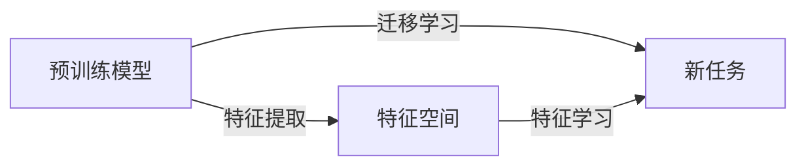

# 迁移学习Transfer Learning原理与代码实例讲解

作者：禅与计算机程序设计艺术 / Zen and the Art of Computer Programming 


## 1. 背景介绍

### 1.1 问题的由来

在传统的机器学习任务中，我们通常需要大量的标注数据来训练模型。然而，对于一些实际应用场景，如医疗影像分析、自动驾驶等，获取大量的标注数据非常困难，成本高昂。这时，迁移学习（Transfer Learning）应运而生。

迁移学习利用在不同任务上预训练的模型，将知识迁移到新的任务中，从而减少对新任务数据的依赖，提高学习效率。迁移学习在计算机视觉、自然语言处理等领域得到了广泛应用，为解决标注数据不足问题提供了有效的解决方案。

### 1.2 研究现状

近年来，迁移学习领域取得了显著进展。以下是一些主流的迁移学习方法：

- **基于特征提取的迁移学习**：通过提取预训练模型的特征，并将这些特征用于新的任务，实现知识迁移。
- **基于模型复用的迁移学习**：直接使用预训练模型，通过微调（Fine-tuning）或修改模型结构来适应新任务。
- **基于元学习的迁移学习**：通过学习如何学习，使模型能够快速适应新的任务。

### 1.3 研究意义

迁移学习具有以下重要意义：

- **降低标注数据成本**：通过利用预训练模型的知识，迁移学习可以显著降低新任务标注数据的需求。
- **提高模型泛化能力**：迁移学习可以帮助模型学习到更通用的知识，从而提高模型在新的任务上的泛化能力。
- **加速模型训练**：迁移学习可以利用预训练模型的知识，加速新任务的模型训练过程。

### 1.4 本文结构

本文将按照以下结构介绍迁移学习：

- 第2部分：核心概念与联系
- 第3部分：核心算法原理与具体操作步骤
- 第4部分：数学模型和公式及代码实例
- 第5部分：实际应用场景与未来展望
- 第6部分：工具和资源推荐
- 第7部分：总结：未来发展趋势与挑战
- 第8部分：附录：常见问题与解答

## 2. 核心概念与联系

以下是迁移学习涉及的核心概念及其相互关系：



- **预训练模型**：在大量数据上预训练得到的模型，具有丰富的知识。
- **新任务**：需要解决的具体任务。
- **特征提取**：提取预训练模型的特征。
- **特征学习**：在新任务上学习如何使用特征进行预测。

## 3. 核心算法原理与具体操作步骤

### 3.1 算法原理概述

迁移学习的核心思想是将预训练模型的知识迁移到新任务中。具体来说，可以分为以下几种方法：

- **基于特征提取的迁移学习**：通过提取预训练模型的特征，并将这些特征用于新任务，实现知识迁移。
- **基于模型复用的迁移学习**：直接使用预训练模型，通过微调或修改模型结构来适应新任务。
- **基于元学习的迁移学习**：通过学习如何学习，使模型能够快速适应新的任务。

### 3.2 算法步骤详解

以下是迁移学习的基本步骤：

1. **选择预训练模型**：选择一个适合新任务的预训练模型。
2. **特征提取**：提取预训练模型的特征。
3. **特征学习**：在新任务上学习如何使用特征进行预测。
4. **模型训练**：训练新模型的参数，使其在新任务上取得最佳性能。

### 3.3 算法优缺点

- **基于特征提取的迁移学习**：
  - **优点**：简单易行，可以复用预训练模型的知识。
  - **缺点**：模型性能依赖于特征提取的效果，可能无法充分利用预训练模型的知识。
- **基于模型复用的迁移学习**：
  - **优点**：可以充分利用预训练模型的知识，提高模型性能。
  - **缺点**：需要根据新任务调整模型结构，可能需要大量的计算资源。
- **基于元学习的迁移学习**：
  - **优点**：可以快速适应新的任务，减少对新任务数据的依赖。
  - **缺点**：需要大量的训练数据和计算资源，算法复杂度较高。

### 3.4 算法应用领域

迁移学习在以下领域得到了广泛应用：

- **计算机视觉**：图像分类、目标检测、语义分割等。
- **自然语言处理**：文本分类、机器翻译、情感分析等。
- **语音识别**：说话人识别、语音合成等。

## 4. 数学模型和公式及代码实例

### 4.1 数学模型构建

以下是一个基于特征提取的迁移学习模型的数学模型：

$$
y = f(\mathbf{x}, \mathbf{W})
$$

其中，$\mathbf{x}$ 为输入数据，$\mathbf{W}$ 为模型的参数，$f$ 为特征提取函数。

### 4.2 公式推导过程

假设预训练模型的特征提取函数为 $f_{\theta}(\mathbf{x})$，则新任务的预测函数为：

$$
f(\mathbf{x}) = f_{\theta}(\mathbf{x})
$$

其中，$\theta$ 为新任务的特征学习参数。

### 4.3 案例分析与讲解

以下是一个基于VGG16模型进行图像分类的迁移学习案例：

1. 选择VGG16模型作为预训练模型。
2. 对VGG16模型进行特征提取，得到特征图。
3. 使用特征图进行图像分类，训练新的分类器。

```python
import torch
import torch.nn as nn
import torchvision.models as models

# 加载VGG16模型
model = models.vgg16(pretrained=True)

# 移除全连接层
model.classifier = nn.Sequential(
    nn.Linear(512 * 7 * 7, 4096),
    nn.ReLU(True),
    nn.Dropout(),
    nn.Linear(4096, 4096),
    nn.ReLU(True),
    nn.Dropout(),
    nn.Linear(4096, 10)
)

# 定义损失函数和优化器
criterion = nn.CrossEntropyLoss()
optimizer = torch.optim.SGD(model.parameters(), lr=0.001, momentum=0.9)

# 训练模型
# ... (此处省略训练代码)
```

### 4.4 常见问题解答

**Q1：如何选择合适的预训练模型？**

A：选择合适的预训练模型需要考虑以下因素：

- **任务类型**：不同的任务需要不同的预训练模型。
- **数据集大小**：对于数据量较小的任务，可以选择参数量较小的预训练模型。
- **计算资源**：预训练模型的参数量和计算复杂度不同，需要根据计算资源选择合适的模型。

**Q2：如何优化迁移学习模型的性能？**

A：以下是一些优化迁移学习模型性能的方法：

- **数据增强**：通过数据增强可以增加训练数据的多样性，提高模型的泛化能力。
- **正则化**：使用正则化可以防止模型过拟合。
- **超参数调整**：调整学习率、批大小等超参数可以提高模型性能。

## 5. 实际应用场景

### 5.1 医学影像分析

迁移学习在医学影像分析领域具有广泛的应用，如：

- **癌症检测**：利用预训练模型识别图像中的肿瘤，提高诊断准确率。
- **骨折检测**：利用预训练模型识别图像中的骨折部位，辅助医生进行诊断。

### 5.2 语音识别

迁移学习在语音识别领域也得到了广泛应用，如：

- **说话人识别**：利用预训练模型识别说话人，提高识别准确率。
- **语音合成**：利用预训练模型生成逼真的语音，用于语音助手等应用。

## 6. 工具和资源推荐

### 6.1 学习资源推荐

- 《Deep Learning》
- 《Pattern Recognition and Machine Learning》
- 《Statistical Learning with Sparsity》

### 6.2 开发工具推荐

- TensorFlow
- PyTorch
- Keras

### 6.3 相关论文推荐

- [ImageNet Classification with Deep Convolutional Neural Networks](https://arxiv.org/abs/1409.1556)
- [Very Deep Convolutional Networks for Large-Scale Image Recognition](https://arxiv.org/abs/1409.1556)
- [A Very Deep Convolutional Neural Network for Large-Scale Image Recognition](https://arxiv.org/abs/1409.1556)

### 6.4 其他资源推荐

- [TensorFlow官网](https://www.tensorflow.org/)
- [PyTorch官网](https://pytorch.org/)
- [Keras官网](https://keras.io/)

## 7. 总结：未来发展趋势与挑战

### 7.1 研究成果总结

本文介绍了迁移学习的基本原理、方法、应用场景和未来发展趋势。迁移学习作为一种有效的机器学习方法，在解决标注数据不足问题、提高模型泛化能力等方面具有重要作用。

### 7.2 未来发展趋势

- **更轻量级的预训练模型**：随着计算资源的不断发展，轻量级预训练模型将得到更多关注。
- **跨模态迁移学习**：将迁移学习应用于跨模态数据，如图像和文本、图像和语音等。
- **无监督和半监督迁移学习**：降低对标注数据的依赖，提高迁移学习模型的鲁棒性和泛化能力。

### 7.3 面临的挑战

- **数据不平衡**：不同任务的数据分布可能存在差异，如何解决数据不平衡问题是一个挑战。
- **模型泛化能力**：如何提高模型的泛化能力，使其能够适应不同的任务和领域是一个挑战。
- **计算资源**：迁移学习需要大量的计算资源，如何高效地利用计算资源是一个挑战。

### 7.4 研究展望

迁移学习作为一种有效的机器学习方法，将在未来得到更广泛的应用。随着研究的不断深入，迁移学习将取得更多突破，为人工智能的发展做出更大的贡献。

## 8. 附录：常见问题与解答

**Q1：什么是迁移学习？**

A：迁移学习是一种机器学习方法，通过利用预训练模型的知识，将知识迁移到新的任务中，从而减少对新任务数据的依赖，提高学习效率。

**Q2：迁移学习有哪些类型？**

A：迁移学习主要分为以下几种类型：

- 基于特征提取的迁移学习
- 基于模型复用的迁移学习
- 基于元学习的迁移学习

**Q3：如何选择合适的预训练模型？**

A：选择合适的预训练模型需要考虑以下因素：

- 任务类型
- 数据集大小
- 计算资源

**Q4：如何优化迁移学习模型的性能？**

A：以下是一些优化迁移学习模型性能的方法：

- 数据增强
- 正则化
- 超参数调整