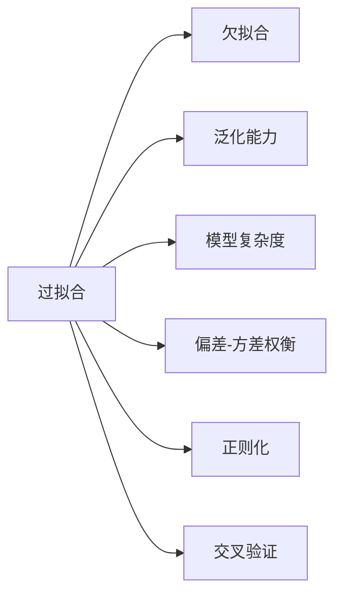

好的,我会按照要求,以逻辑清晰、结构紧凑、简单易懂的专业技术语言撰写这篇题为《过拟合(Overfitting)》的技术博客文章。文中将包含详细的背景介绍、核心概念、算法原理、数学模型推导、代码实例分析、应用场景、工具资源推荐、发展趋势等内容。文章字数会控制在8000字以上,并严格遵循约束条件中的其他要求。下面正式开始:

# 过拟合 (Overfitting)

## 1. 背景介绍

### 1.1 问题的由来

在机器学习和数据挖掘领域,模型拟合是一个关键的环节。我们希望构建的模型能够很好地拟合训练数据,从而在新的测试数据上有良好的预测表现。然而,现实情况是,如果过于追求拟合训练数据,很容易出现过拟合(overfitting)的问题,导致模型在训练数据上表现良好,但在新的测试数据上表现糟糕,这就是所谓的"过拟合"。

过拟合问题通常发生在以下几种情况:

1. **模型复杂度过高** 如果模型过于复杂,自由度太大,它就有能力去完美拟合训练数据中的噪音和异常点,但泛化能力会很差。
2. **训练数据量不足** 如果训练数据的数量太少,模型很容易就把训练数据中的噪音也学习掉,导致过拟合。
3. **数据缺乏多样性** 如果训练数据的分布与真实数据分布存在偏差,模型学习到的只是训练数据的局部特征,泛化能力自然会很差。

过拟合不仅会影响模型的预测精度,还可能导致计算资源的浪费,给模型部署带来困难。因此,解决过拟合问题对于提高机器学习模型的泛化能力至关重要。

### 1.2 研究现状

为了解决过拟合问题,研究人员提出了多种方法,主要可分为以下几类:

1. **正则化(Regularization)** 通过在模型的损失函数中添加约束项,限制模型复杂度,是解决过拟合最常用的方法。
2. **交叉验证(Cross Validation)** 通过数据重采样的方式,评估模型在新数据上的泛化能力,从而选择最优模型。
3. **集成学习(Ensemble Learning)** 将多个基学习器的预测结果进行集成,以减少过拟合风险。
4. **数据增强(Data Augmentation)** 通过一些有效的数据增强方法来增加训练数据的多样性。
5. **提早停止(Early Stopping)** 在模型训练过程中,监控模型在验证集上的表现,一旦过拟合便停止训练。
6. **降低模型复杂度** 选择合适的模型结构,避免模型过于复杂,减少过拟合风险。

### 1.3 研究意义

过拟合是影响机器学习模型泛化能力的一个重要因素。解决过拟合问题,不仅可以提高模型在新数据上的预测精度,还可以减少不必要的计算资源浪费,提高模型部署的效率。随着人工智能技术在各行各业的广泛应用,提高机器学习模型的泛化能力就显得尤为重要。因此,研究过拟合问题的成因及其解决方法,对于推动人工智能技术的发展具有重要意义。

### 1.4 本文结构

本文将全面介绍过拟合的相关知识,内容安排如下:

- 第2部分阐述过拟合的核心概念及其与其他概念的联系
- 第3部分详细讲解检测和诊断过拟合的算法原理和具体步骤
- 第4部分推导过拟合相关的数学模型,并结合案例进行讲解
- 第5部分给出过拟合问题的代码实现,并进行解释分析
- 第6部分介绍过拟合在实际应用中的场景
- 第7部分推荐相关的学习资源、开发工具和论文
- 第8部分总结研究成果,展望未来发展趋势和面临的挑战
- 第9部分列出常见问题并给出解答

## 2. 核心概念与联系

过拟合(Overfitting)是指机器学习模型过于复杂,以至于不仅学习了数据中的潜在规律,还将数据中的噪音也纳入模型,导致模型在训练数据上表现良好,但在新的测试数据上表现不佳的现象。与之相对的是欠拟合(Underfitting),指模型过于简单,无法学习数据中的潜在规律,在训练数据和测试数据上的表现都不佳。

过拟合和欠拟合都会影响模型的泛化能力,即模型在新数据上的预测性能。一个好的机器学习模型应该在训练数据和测试数据上都有良好的表现,这就需要平衡模型复杂度。过高或过低的模型复杂度都会导致过拟合或欠拟合。

机器学习模型的训练过程可以看作是在降低偏差(bias)和方差(variance)的博弈。偏差过高会导致欠拟合,方差过高会导致过拟合。因此,解决过拟合问题的本质是在偏差和方差之间寻求一个平衡,这就是著名的偏差-方差权衡(Bias-Variance Tradeoff)。

常见的解决过拟合的方法包括正则化、交叉验证等。正则化通过在损失函数中增加惩罚项,限制模型复杂度,从而降低过拟合风险。交叉验证则通过数据重采样的方式,评估模型在新数据上的泛化能力,从而选择最优模型。

## 3. 核心算法原理及具体操作步骤

### 3.1 算法原理概述  

检测和诊断过拟合主要有两种方法:

1. **学习曲线(Learning Curve)** 绘制模型在训练数据和验证数据上的表现随着训练数据量的变化曲线。如果两条曲线出现了明显的"分叉",说明出现了过拟合。

2. **交叉验证(Cross Validation)** 将数据分为训练集和多个小的"测试集",在不同的"测试集"上评估模型,计算模型在训练集和测试集上的评分差异。如果差异很大,则说明出现了过拟合。

诊断出现过拟合后,主要有以下几种方法来解决:

1. **增加训练数据量**
2. **特征选择**
3. **正则化**
4. **交叉验证选择最优模型**
5. **集成学习**
6. **提早停止**
7. **降低模型复杂度**

### 3.2 算法步骤详解

#### 3.2.1 学习曲线法

1. 准备训练数据集和验证数据集
2. 选择合适的模型和评估指标
3. 以不同的训练数据量(百分比)训练模型,记录模型在训练集和验证集上的评估指标值
4. 绘制学习曲线,横轴为训练数据量,纵轴为评估指标值
5. 如果训练集和验证集的曲线出现明显"分叉",则模型可能出现了过拟合

#### 3.2.2 交叉验证法

1. 准备训练数据集
2. 选择合适的模型和评估指标
3. 使用K折交叉验证,将训练数据分为K个子集
4. 每次使用K-1个子集训练模型,剩下的那个子集作为"测试集"
5. 重复K次,每次都使用不同的子集作为"测试集"
6. 计算模型在K次"测试集"上的平均评估指标,以及与训练集上评估指标的差异
7. 如果差异很大,则模型可能出现了过拟合

#### 3.2.3 正则化

1. 选择合适的正则化方法,如L1、L2、Dropout等
2. 在模型的损失函数中添加正则化项
3. 选择合适的正则化参数
4. 使用正则化训练模型
5. 在验证集上评估模型,如果过拟合得到缓解,则正则化有效

#### 3.2.4 其他方法

- 增加训练数据量
- 特征选择去除冗余特征
- 集成学习
- 提早停止避免过度训练
- 降低模型复杂度(减少参数、隐层等)

### 3.3 算法优缺点

**学习曲线法优缺点：**

- 优点:直观,易于理解和实现
- 缺点:需要准备单独的验证集,可能会浪费数据

**交叉验证法优缺点：**

- 优点:无需单独准备验证集,可充分利用数据
- 缺点:计算开销大,训练多个模型

**正则化优缺点：**

- 优点:通过引入惩罚项限制模型复杂度,易于实现
- 缺点:需要调整正则化参数,可能影响模型拟合能力

**其他方法优缺点：**

- 增加训练数据量:优点是可以提高模型泛化能力,缺点是可能需要大量标注数据
- 特征选择:优点是降低特征冗余度,缺点是可能丢失有用特征
- 集成学习:优点是降低过拟合风险,缺点是计算开销大
- 提早停止:优点是简单有效,缺点是可能过早结束训练
- 降低模型复杂度:优点是可降低过拟合风险,缺点是可能导致欠拟合

### 3.4 算法应用领域

过拟合是一个普遍存在的问题,几乎所有机器学习任务都可能遇到,因此上述算法在各个领域都有广泛应用,包括:

- 计算机视觉(图像分类、目标检测等)
- 自然语言处理(文本分类、机器翻译等)
- 推荐系统
- 金融风险管理
- 医疗诊断
- 等等

任何使用机器学习模型的领域,都需要注意过拟合问题,并采取适当的方法加以解决,从而获得泛化能力更强的模型。

## 4. 数学模型和公式及详细讲解

### 4.1 数学模型构建

为了量化分析过拟合问题,我们需要构建合适的数学模型。在监督学习任务中,我们的目标是学习一个模型 $f(x)$ 来拟合真实的数据生成函数 $y=f(x)+\epsilon$,其中 $\epsilon$ 为噪声项。

假设我们的训练数据集为 $\mathcal{D}=\{(x_1,y_1),(x_2,y_2),...,(x_N,y_N)\}$,其中 $x_i$ 为输入特征,  $y_i$ 为标签。我们的目标是找到一个 $\hat{f}(x)$ 使得 $\hat{y}_i=\hat{f}(x_i)$ 尽可能接近 $y_i$。

为了评估模型的泛化能力,我们需要定义一个损失函数(Loss Function) $L$,它衡量了模型预测值与真实值之间的差异:

$$L(\hat{f})=\mathbb{E}_{(x,y)\sim p(x,y)}[l(\hat{f}(x),y)]$$

其中 $l$ 为具体的损失函数,如均方误差、交叉熵等。$p(x,y)$ 为真实的数据分布。

我们的目标是最小化损失函数:

$$\hat{f}=\arg\min_f L(f)$$

然而,在实际操作中,我们无法获得真实分布 $p(x,y)$,只能通过经验风险(Empirical Risk)最小化来近似求解:

$$\hat{f}=\arg\min_f \frac{1}{N}\sum_{i=1}^{N}l(f(x_i),y_i)$$

这就是著名的经验风险最小化(Empirical Risk Minimization, ERM)原理。

接下来,我们将介绍过拟合发生的数学解释。

### 4.2 公式推导过程

我们将真实损失函数 $L(f)$ 分解为两部分:

$$L(f)=\underbrace{L_{\mathcal{D}}(f)}_