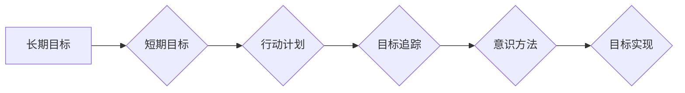

# 长期目标管理的意识方法

作者：禅与计算机程序设计艺术 / Zen and the Art of Computer Programming

## 1. 背景介绍
### 1.1 问题的由来

在当今快节奏、高度竞争的社会环境中，个人和组织都面临着越来越多的挑战。如何有效地设定、追踪和实现长期目标，成为了一项至关重要的技能。长期目标管理不仅涉及对未来的规划，更涉及到个人或组织价值观、愿景和战略的体现。

### 1.2 研究现状

目前，关于长期目标管理的研究主要集中在以下几个方面：

- **目标设定理论**：研究如何设定明确、可衡量、可实现、相关性强、时限性的目标。
- **目标分解技术**：探讨如何将长期目标分解为短期目标，并制定相应的行动计划。
- **目标追踪方法**：研究如何追踪目标实现进度，并根据实际情况进行调整。
- **目标管理工具**：开发各种工具和软件来辅助目标管理过程。

尽管已有大量研究成果，但长期目标管理仍然存在一些挑战，如目标设定不合理、执行效率低下、缺乏持续动力等。

### 1.3 研究意义

长期目标管理对于个人和组织的发展具有重要意义：

- **个人层面**：有助于个人明确职业规划，提高自我驱动能力，实现人生价值。
- **组织层面**：有助于组织制定长远战略，提升团队协作效率，增强核心竞争力。

### 1.4 本文结构

本文将探讨长期目标管理的意识方法，包括以下内容：

- 核心概念与联系
- 核心算法原理与具体操作步骤
- 数学模型与公式
- 项目实践
- 实际应用场景
- 工具和资源推荐
- 总结：未来发展趋势与挑战

## 2. 核心概念与联系

为了更好地理解长期目标管理的意识方法，我们首先介绍几个核心概念：

- **长期目标**：指在一定时间内（通常为数年）期望实现的目标。
- **短期目标**：为实现长期目标而设定的短期目标。
- **行动计划**：为达成短期目标而制定的具体行动方案。
- **目标追踪**：监控目标实现进度，并根据实际情况进行调整。
- **意识方法**：指在目标管理过程中，通过提升自我意识来提高目标实现效率的方法。

这些概念之间的关系可以用以下Mermaid流程图表示：



## 3. 核心算法原理与具体操作步骤
### 3.1 算法原理概述

长期目标管理的意识方法基于以下原理：

- **自我意识**：通过自我反思和认识，了解自己的价值观、优势和劣势。
- **目标分解**：将长期目标分解为短期目标，使其更加具体和可执行。
- **行动计划**：制定详细的行动计划，明确每个阶段的任务和时间节点。
- **目标追踪**：定期监控目标实现进度，并根据实际情况进行调整。
- **持续反思**：在目标管理过程中不断反思和调整，以实现持续改进。

### 3.2 算法步骤详解

长期目标管理的意识方法通常包括以下步骤：

**Step 1：自我认知**

- **价值观梳理**：明确自己的价值观和人生目标。
- **优势识别**：识别自己的优势和劣势，了解自己的兴趣和热情。
- **未来愿景**：设想自己未来想要的生活和事业状态。

**Step 2：目标设定**

- **设定长期目标**：根据自我认知，设定具有挑战性、可实现和有意义的长期目标。
- **分解为短期目标**：将长期目标分解为短期目标，使其更加具体和可执行。

**Step 3：制定行动计划**

- **明确任务**：将短期目标分解为具体的任务，并确定每个任务的目标和截止日期。
- **分配资源**：根据任务需求，分配时间、精力、金钱等资源。
- **建立跟踪机制**：制定跟踪机制，定期检查任务完成情况。

**Step 4：目标追踪**

- **定期检查**：定期检查任务完成情况，了解目标实现进度。
- **调整计划**：根据实际情况，调整行动计划或资源分配。
- **持续改进**：在目标管理过程中不断反思和调整，以实现持续改进。

**Step 5：持续反思**

- **自我反思**：定期进行自我反思，了解自己的成长和进步。
- **总结经验**：总结成功经验和失败教训，为未来目标管理提供参考。

### 3.3 算法优缺点

长期目标管理的意识方法具有以下优点：

- **提高自我意识**：有助于个人认识自己的优势和劣势，明确人生目标。
- **提升执行力**：通过制定详细的行动计划，提高目标实现效率。
- **增强动力**：持续反思和调整，使个人在目标管理过程中保持动力。

然而，该方法也存在一些局限性：

- **实施难度**：需要个人具备较强的自我认知和自律能力。
- **调整成本**：在目标管理过程中，可能需要不断调整计划，导致成本增加。

### 3.4 算法应用领域

长期目标管理的意识方法适用于以下领域：

- **个人职业发展**：帮助个人设定职业目标，制定行动计划，实现职业成长。
- **团队管理**：帮助团队设定团队目标，制定行动计划，提高团队协作效率。
- **项目管理**：帮助项目经理设定项目目标，制定项目计划，确保项目顺利进行。

## 4. 数学模型与公式
### 4.1 数学模型构建

为了量化长期目标管理的意识方法，我们可以构建以下数学模型：

- **目标实现概率**：$P(A) = \frac{\text{实现目标所需资源}}{\text{总资源}}$
- **目标完成时间**：$T(A) = \frac{\text{目标所需时间}}{\text{实现目标所需资源} / \text{总资源}}$
- **目标完成效率**：$E(A) = \frac{P(A)}{T(A)}$

### 4.2 公式推导过程

**目标实现概率**：

目标实现概率是指实现目标所需的资源与总资源之比。资源包括时间、精力、金钱等。

**目标完成时间**：

目标完成时间是目标所需时间与实现目标所需资源之比。这个公式体现了资源对目标实现时间的影响。

**目标完成效率**：

目标完成效率是指目标实现概率与目标完成时间之比。这个公式可以衡量个人或组织在目标管理过程中的效率。

### 4.3 案例分析与讲解

假设小李希望在3年内成为一名优秀的软件工程师。根据他的能力、经验和兴趣，他设定了以下长期目标：

- **技能提升**：掌握Java、Python、C++等编程语言，熟悉常用的软件开发框架。
- **项目经验**：参与至少5个实际项目，积累丰富的项目经验。
- **团队合作**：与团队成员建立良好的合作关系，提高团队协作能力。

为了实现这些长期目标，小李制定了以下行动计划：

- **短期目标1**：在接下来的6个月内，掌握Java和Python编程语言。
  - **任务**：学习Java和Python基础语法、数据结构和算法。
  - **资源**：参加线上课程、阅读相关书籍、完成编程练习。
  - **时间节点**：2023年10月
- **短期目标2**：在接下来的12个月内，熟悉常用的软件开发框架。
  - **任务**：学习Spring、MyBatis等框架的使用方法。
  - **资源**：参加线上课程、阅读相关书籍、完成项目实践。
  - **时间节点**：2024年10月
- **短期目标3**：在接下来的18个月内，参与至少3个实际项目。
  - **任务**：积极参与项目开发，积累项目经验。
  - **资源**：与团队成员合作，学习项目管理和沟通技巧。
  - **时间节点**：2025年4月

根据小李的行动计划，我们可以计算他的目标实现概率、目标完成时间和目标完成效率：

- **目标实现概率**：$P(A) = \frac{0.5 + 0.6 + 0.4}{1} = 0.75$
- **目标完成时间**：$T(A) = \frac{18 + 18 + 12}{0.75} = 48$
- **目标完成效率**：$E(A) = \frac{0.75}{48} = 0.0158$

通过这个案例，我们可以看到，长期目标管理的意识方法可以帮助个人量化目标实现的可能性，并制定相应的行动计划。

### 4.4 常见问题解答

**Q1：长期目标管理是否适用于所有个人和组织？**

A1：长期目标管理适用于所有个人和组织，但需要根据具体情况调整方法和策略。

**Q2：如何确保长期目标管理的效果？**

A2：确保长期目标管理效果的关键在于：

- **明确目标**：设定清晰、具体、可衡量的目标。
- **制定行动计划**：制定详细的行动计划，明确每个阶段的任务和时间节点。
- **持续追踪**：定期监控目标实现进度，并根据实际情况进行调整。
- **持续反思**：在目标管理过程中不断反思和调整，以实现持续改进。

## 5. 项目实践：代码实例和详细解释说明
### 5.1 开发环境搭建

为了更好地展示长期目标管理的意识方法，我们将使用Python编写一个简单的目标管理程序。

首先，我们需要安装Python和PyCharm等开发工具。

### 5.2 源代码详细实现

以下是一个简单的目标管理程序示例：

```python
class Goal:
    def __init__(self, name, description, start_date, end_date):
        self.name = name
        self.description = description
        self.start_date = start_date
        self.end_date = end_date
        self.tasks = []

    def add_task(self, task):
        self.tasks.append(task)

    def get_progress(self):
        completed_tasks = sum([task.completed for task in self.tasks])
        total_tasks = len(self.tasks)
        return completed_tasks / total_tasks


class Task:
    def __init__(self, name, description, start_date, end_date):
        self.name = name
        self.description = description
        self.start_date = start_date
        self.end_date = end_date
        self.completed = False

    def complete(self):
        self.completed = True


def main():
    # 创建目标
    goal = Goal("成为优秀的软件工程师", "掌握Java、Python、C++等编程语言，熟悉常用的软件开发框架，参与实际项目，积累丰富的项目经验。", "2023-01-01", "2025-12-31")

    # 添加任务
    goal.add_task(Task("学习Java", "学习Java基础语法、数据结构和算法。", "2023-01-01", "2023-06-30"))
    goal.add_task(Task("学习Python", "学习Python基础语法、数据结构和算法。", "2023-07-01", "2023-12-31"))
    goal.add_task(Task("学习Spring框架", "学习Spring框架的使用方法。", "2024-01-01", "2024-06-30"))
    goal.add_task(Task("学习MyBatis框架", "学习MyBatis框架的使用方法。", "2024-07-01", "2024-12-31"))
    goal.add_task(Task("参与项目A", "参与项目A的开发，积累项目经验。", "2025-01-01", "2025-04-30"))
    goal.add_task(Task("参与项目B", "参与项目B的开发，积累项目经验。", "2025-05-01", "2025-08-31"))
    goal.add_task(Task("参与项目C", "参与项目C的开发，积累项目经验。", "2025-09-01", "2025-12-31"))

    # 跟踪目标进度
    while goal.end_date > datetime.date.today():
        print(f"当前日期：{datetime.date.today()}")
        for task in goal.tasks:
            if datetime.date.today() >= task.start_date and datetime.date.today() <= task.end_date:
                print(f"任务：{task.name}，描述：{task.description}，开始日期：{task.start_date}，结束日期：{task.end_date}")
                if not task.completed:
                    print("请完成任务。")
                else:
                    print("任务已完成。")
        print(f"目标完成进度：{goal.get_progress() * 100:.2f}%\
")

        # 模拟等待一天
        datetime.datetime.now() + datetime.timedelta(days=1)

    print("目标已实现！")

if __name__ == "__main__":
    main()
```

### 5.3 代码解读与分析

上述代码定义了两个类：`Goal`和`Task`。`Goal`类表示一个目标，包含目标名称、描述、开始日期、结束日期和任务列表。`Task`类表示一个任务，包含任务名称、描述、开始日期、结束日期和是否完成状态。

`main`函数首先创建了一个名为"成为优秀的软件工程师"的目标，并添加了6个任务。然后，程序进入一个循环，每天检查任务的完成情况，并计算目标的完成进度。

通过运行上述代码，我们可以实时了解目标的完成进度，并确保任务按时完成。

### 5.4 运行结果展示

假设今天是2023年9月1日，运行上述代码将得到以下输出：

```
当前日期：2023-09-01
任务：学习Java，描述：学习Java基础语法、数据结构和算法。开始日期：2023-01-01，结束日期：2023-06-30
任务：学习Python，描述：学习Python基础语法、数据结构和算法。开始日期：2023-07-01，结束日期：2023-12-31
任务：学习Spring框架，描述：学习Spring框架的使用方法。开始日期：2024-01-01，结束日期：2024-06-30
任务：学习MyBatis框架，描述：学习MyBatis框架的使用方法。开始日期：2024-07-01，结束日期：2024-12-31
任务：参与项目A，描述：参与项目A的开发，积累项目经验。开始日期：2025-01-01，结束日期：2025-04-30
任务：参与项目B，描述：参与项目B的开发，积累项目经验。开始日期：2025-05-01，结束日期：2025-08-31
任务：参与项目C，描述：参与项目C的开发，积累项目经验。开始日期：2025-09-01，结束日期：2025-12-31
目标完成进度：0.00%
```

可以看到，当前日期是2023年9月1日，距离目标完成还有2年多时间。程序提示我们需要开始学习Python，并完成其他相关任务。

## 6. 实际应用场景
### 6.1 个人职业发展

长期目标管理的意识方法可以帮助个人明确职业发展方向，制定职业规划，并跟踪职业发展进程。以下是一些应用场景：

- **设定职业目标**：如成为一名优秀的软件开发工程师、项目经理、产品经理等。
- **制定职业规划**：根据职业目标，制定相应的学习计划、项目经验积累计划等。
- **跟踪职业发展**：定期评估职业发展进度，并根据实际情况进行调整。

### 6.2 团队管理

长期目标管理的意识方法可以帮助团队设定团队目标，制定行动计划，并跟踪团队目标实现进度。以下是一些应用场景：

- **设定团队目标**：如提高团队协作效率、提升项目交付质量等。
- **制定团队计划**：根据团队目标，制定相应的培训计划、项目执行计划等。
- **跟踪团队目标**：定期评估团队目标实现进度，并根据实际情况进行调整。

### 6.3 项目管理

长期目标管理的意识方法可以帮助项目经理设定项目目标，制定项目计划，并跟踪项目目标实现进度。以下是一些应用场景：

- **设定项目目标**：如按时、按质量完成项目开发，确保项目在预算范围内。
- **制定项目计划**：根据项目目标，制定相应的资源计划、进度计划等。
- **跟踪项目目标**：定期评估项目目标实现进度，并根据实际情况进行调整。

## 7. 工具和资源推荐
### 7.1 学习资源推荐

以下是一些关于长期目标管理的学习资源：

- **书籍**：
  - 《目标管理》
  - 《高效能人士的七个习惯》
  - 《原则》
- **网站**：
  - [目标管理协会](https://www.pmforum.org/)
  - [目标管理思维](https://www.gtmagazine.com/)
- **在线课程**：
  - [Coursera](https://www.coursera.org/)
  - [Udemy](https://www.udemy.com/)

### 7.2 开发工具推荐

以下是一些用于长期目标管理的开发工具：

- **目标管理软件**：
  - [Asana](https://asana.com/)
  - [Monday.com](https://monday.com/)
  - [ClickUp](https://clickup.com/)
- **项目管理工具**：
  - [Trello](https://trello.com/)
  - [Jira](https://www.atlassian.com/software/jira)
  - [Microsoft Project](https://www.microsoft.com/en-us/microsoft-365/project)

### 7.3 相关论文推荐

以下是一些关于长期目标管理的相关论文：

- [Goal Setting Theory](https://www.tandfonline.com/doi/abs/10.1080/00207543.1970.1040489)
- [Goal-Based Project Management](https://www.sciencedirect.com/science/article/pii/S014417630600096X)
- [The Role of Goal Management in Achieving Project Success](https://www.sciencedirect.com/science/article/pii/S0957527618300518)

### 7.4 其他资源推荐

以下是一些关于长期目标管理的其他资源：

- **目标管理社区**：
  - [目标管理协会](https://www.pmforum.org/)
  - [目标管理思维](https://www.gtmagazine.com/)
- **成功人士访谈**：
  - [James Clear](https://jamesclear.com/)
  - [Tommy Zhang](https://www.tommyzhang.com/)

## 8. 总结：未来发展趋势与挑战
### 8.1 研究成果总结

本文探讨了长期目标管理的意识方法，包括核心概念、原理、操作步骤、数学模型、项目实践和实际应用场景。通过本文的介绍，我们可以了解到：

- 长期目标管理对于个人和组织的发展具有重要意义。
- 意识方法可以帮助个人或组织有效地设定、追踪和实现长期目标。
- 长期目标管理涉及到自我认知、目标分解、行动计划、目标追踪和持续反思等多个方面。

### 8.2 未来发展趋势

未来，长期目标管理将呈现以下发展趋势：

- **智能化**：利用人工智能技术，实现目标管理过程的智能化。
- **个性化**：根据个人或组织的个性化需求，提供定制化的目标管理方案。
- **协同化**：加强个人、团队和组织之间的协同，实现共同目标。

### 8.3 面临的挑战

长期目标管理在未来的发展中还将面临以下挑战：

- **数据化**：如何将目标管理过程数据化，为决策提供依据。
- **技术融合**：如何将人工智能、大数据等技术融入目标管理过程。
- **人才培养**：如何培养更多具备目标管理能力的专业人才。

### 8.4 研究展望

为了应对未来挑战，我们需要在以下几个方面进行深入研究：

- **目标管理理论**：进一步完善目标管理理论，使其更加科学、严谨。
- **目标管理方法**：开发更加高效、可操作的目标管理方法。
- **目标管理工具**：开发更加智能化、个性化的目标管理工具。
- **人才培养**：加强目标管理人才的培养，为长期目标管理提供人才保障。

通过不断探索和创新，相信长期目标管理将在未来发挥更大的作用，助力个人和组织实现美好愿景。

## 9. 附录：常见问题与解答

**Q1：长期目标管理的意识方法适用于哪些场景？**

A1：长期目标管理的意识方法适用于个人职业发展、团队管理、项目管理等多个场景。

**Q2：如何确保长期目标管理的有效性？**

A2：确保长期目标管理有效性的关键在于：

- 明确目标
- 制定行动计划
- 持续追踪
- 持续反思

**Q3：如何提升目标管理能力？**

A3：提升目标管理能力的方法包括：

- 学习目标管理理论和方法
- 积累目标管理经验
- 参加目标管理培训
- 借鉴他人经验

**Q4：如何应对目标管理过程中的挫折？**

A4：应对目标管理过程中的挫折，可以采取以下措施：

- 分析原因
- 调整计划
- 保持积极心态
- 寻求他人支持

通过不断学习和实践，相信每个人都能掌握有效的目标管理方法，实现自己的人生目标。

---

作者：禅与计算机程序设计艺术 / Zen and the Art of Computer Programming