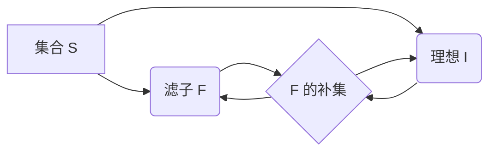

# 集合论导引：滤子与理想

关键词：集合论、滤子、理想、超滤子、主理想、素理想

## 1. 背景介绍
### 1.1 问题的由来
集合论是现代数学的基础，其核心概念和方法已广泛应用于数学各分支及计算机科学等领域。在集合论的发展历程中，滤子与理想是两个重要的概念工具，它们在点集拓扑、布尔代数、格论等方面有着广泛而深刻的应用。

### 1.2 研究现状
目前，关于滤子与理想的研究主要集中在以下几个方面：
1. 在点集拓扑学中，利用滤子与理想刻画拓扑空间的各种性质，如紧致性、Hausdorff性等；
2. 在布尔代数中，用滤子与理想研究布尔代数的表示定理、Stone对偶定理等；
3. 在格论中，用滤子与理想刻画格的各种性质，如分配格、模块格等；
4. 利用滤子与理想构造新的数学结构，如商拓扑、商代数等。

### 1.3 研究意义
深入研究滤子与理想的理论，对于拓展集合论的应用范围，深化对数学结构的认识，具有重要的理论意义和应用价值。同时，滤子与理想在计算机科学领域也有广泛应用，如在程序语义学、领域理论等方面，利用滤子与理想构造新的计算模型。

### 1.4 本文结构
本文将从以下几个方面介绍滤子与理想的相关理论：
1. 滤子与理想的基本概念与性质；
2. 超滤子、主理想、素理想等特殊滤子与理想；
3. 利用滤子与理想研究拓扑空间、布尔代数、格等数学结构；
4. 滤子与理想在计算机科学中的应用。

## 2. 核心概念与联系
在集合论中，滤子和理想是两个重要的对偶概念：
- 滤子：设 $S$ 为集合，$\mathcal{F}\subseteq \mathcal{P}(S)$ 满足：
  1. $S\in\mathcal{F}$；
  2. 若 $A,B\in\mathcal{F}$，则 $A\cap B\in\mathcal{F}$；
  3. 若 $A\in\mathcal{F},A\subseteq B\subseteq S$，则 $B\in\mathcal{F}$。
  则称 $\mathcal{F}$ 为 $S$ 上的一个滤子。
- 理想：设 $S$ 为集合，$\mathcal{I}\subseteq \mathcal{P}(S)$ 满足：
  1. $\emptyset\in\mathcal{I}$；
  2. 若 $A,B\in\mathcal{I}$，则 $A\cup B\in\mathcal{I}$；
  3. 若 $A\in\mathcal{I},B\subseteq A$，则 $B\in\mathcal{I}$。
  则称 $\mathcal{I}$ 为 $S$ 上的一个理想。

滤子与理想之间有着密切的联系，对于 $S$ 的子集族 $\mathcal{A}\subseteq\mathcal{P}(S)$：
- 若 $\mathcal{A}$ 为 $S$ 上的滤子，则 $\{S\setminus A:A\in\mathcal{A}\}$ 为 $S$ 上的理想；
- 若 $\mathcal{A}$ 为 $S$ 上的理想，则 $\{S\setminus A:A\in\mathcal{A}\}$ 为 $S$ 上的滤子。



## 3. 核心算法原理 & 具体操作步骤
### 3.1 算法原理概述
利用滤子与理想研究数学结构的一般步骤如下：
1. 在给定的数学结构(如拓扑空间、格等)中，定义合适的滤子与理想；
2. 利用滤子与理想刻画该数学结构的特殊性质；
3. 利用滤子与理想构造新的数学结构(如商拓扑、商格等)；
4. 研究新构造的数学结构与原结构之间的关系。

### 3.2 算法步骤详解
以利用滤子研究拓扑空间的紧致性为例，具体步骤如下：
1. 在拓扑空间 $(X,\mathcal{T})$ 中，定义 $X$ 上的滤子：$\mathcal{F}\subseteq \mathcal{P}(X)$ 满足：
   - $X\in\mathcal{F}$；
   - 若 $A,B\in\mathcal{F}$，则 $A\cap B\in\mathcal{F}$；
   - 若 $A\in\mathcal{F},A\subseteq B\subseteq X$，则 $B\in\mathcal{F}$。
2. 定义 $\mathcal{F}$ 在 $\mathcal{T}$ 中的极限点：$x\in X$ 称为 $\mathcal{F}$ 在 $\mathcal{T}$ 中的极限点，若 $\forall U\in\mathcal{N}(x)$，都有 $U\in\mathcal{F}$。其中 $\mathcal{N}(x)$ 表示 $x$ 在 $\mathcal{T}$ 中的全体开邻域。
3. 证明：$(X,\mathcal{T})$ 是紧致空间 $\Leftrightarrow$ $X$ 上的每个滤子在 $\mathcal{T}$ 中都有极限点。

### 3.3 算法优缺点
利用滤子与理想研究数学结构的优点：
1. 可以用统一的方法处理不同的数学结构；
2. 通过构造新的数学结构，可以揭示原结构的本质特征；
3. 有助于发现新的数学结构和性质。

缺点：
1. 对初学者来说，滤子与理想的概念比较抽象，理解起来有一定难度；
2. 在具体问题中，如何选取合适的滤子与理想并非易事，需要一定的数学功底和经验。

### 3.4 算法应用领域
滤子与理想在以下领域有重要应用：
1. 点集拓扑学：研究拓扑空间的紧致性、Hausdorff性等性质；
2. 布尔代数：研究布尔代数的表示定理、Stone对偶定理等；
3. 格论：刻画格的各种性质，构造商格等；
4. 计算机科学：在程序语义学、领域理论等方面构造新的计算模型。

## 4. 数学模型和公式 & 详细讲解 & 举例说明
### 4.1 数学模型构建
在集合论中，滤子和理想可以用以下数学模型刻画：
- 滤子：设 $S$ 为集合，$\mathcal{F}\subseteq \mathcal{P}(S)$，则 $\mathcal{F}$ 为 $S$ 上的滤子 $\Leftrightarrow$ $\mathcal{F}$ 满足：
  1. $S\in\mathcal{F}$；
  2. 若 $A,B\in\mathcal{F}$，则 $A\cap B\in\mathcal{F}$；
  3. 若 $A\in\mathcal{F},A\subseteq B\subseteq S$，则 $B\in\mathcal{F}$。
- 理想：设 $S$ 为集合，$\mathcal{I}\subseteq \mathcal{P}(S)$，则 $\mathcal{I}$ 为 $S$ 上的理想 $\Leftrightarrow$ $\mathcal{I}$ 满足：
  1. $\emptyset\in\mathcal{I}$；
  2. 若 $A,B\in\mathcal{I}$，则 $A\cup B\in\mathcal{I}$；
  3. 若 $A\in\mathcal{I},B\subseteq A$，则 $B\in\mathcal{I}$。

### 4.2 公式推导过程
对于 $S$ 的子集族 $\mathcal{A}\subseteq\mathcal{P}(S)$，有：
- 若 $\mathcal{A}$ 为 $S$ 上的滤子，则 $\mathcal{A}^{c}=\{S\setminus A:A\in\mathcal{A}\}$ 为 $S$ 上的理想。
  证明：
  1. 因为 $S\in\mathcal{A}$，所以 $\emptyset=S\setminus S\in\mathcal{A}^{c}$；
  2. 若 $A,B\in\mathcal{A}^{c}$，则 $S\setminus A,S\setminus B\in\mathcal{A}$，由滤子的定义，$(S\setminus A)\cap(S\setminus B)\in\mathcal{A}$，即 $S\setminus(A\cup B)\in\mathcal{A}$，所以 $A\cup B\in\mathcal{A}^{c}$；
  3. 若 $A\in\mathcal{A}^{c},B\subseteq A$，则 $S\setminus A\in\mathcal{A}$，而 $S\setminus A\subseteq S\setminus B$，由滤子的定义，$S\setminus B\in\mathcal{A}$，即 $B\in\mathcal{A}^{c}$。
  
- 若 $\mathcal{A}$ 为 $S$ 上的理想，则 $\mathcal{A}^{c}=\{S\setminus A:A\in\mathcal{A}\}$ 为 $S$ 上的滤子。
  证明过程类似，此处略。

### 4.3 案例分析与讲解
下面以一个具体的例子来说明滤子与理想的应用。

设 $(X,\mathcal{T})$ 为拓扑空间，$\mathcal{N}(x)$ 表示点 $x$ 在 $\mathcal{T}$ 中的全体开邻域，则 $\mathcal{N}(x)$ 为 $X$ 上的一个滤子。

证明：
1. 因为 $x\in X$，且 $X\in\mathcal{T}$，所以 $X\in\mathcal{N}(x)$；
2. 若 $A,B\in\mathcal{N}(x)$，则 $x\in A\cap B\in\mathcal{T}$，所以 $A\cap B\in\mathcal{N}(x)$；
3. 若 $A\in\mathcal{N}(x),A\subseteq B\subseteq X$，则 $x\in A\subseteq B$，而 $A\in\mathcal{T}$，所以 $B\in\mathcal{T}$，即 $B\in\mathcal{N}(x)$。

由此可知，在拓扑空间中，每一点的全体开邻域构成了一个滤子。利用这一点，可以刻画拓扑空间的许多重要性质，如紧致性、Hausdorff性等。

### 4.4 常见问题解答
Q: 滤子与理想有什么区别和联系？
A: 滤子和理想是集合论中的两个对偶概念，它们的定义非常相似，只是将交换律、幂等律等性质中的交、并运算互换即可。每个滤子的补集都是一个理想，反之亦然。在具体应用中，要根据问题的实际需要，灵活选择使用滤子还是理想。

Q: 如何利用滤子和理想研究数学结构？
A: 一般步骤是：首先在给定的数学结构中定义合适的滤子与理想，然后用它们刻画该结构的特殊性质，再利用滤子与理想构造新的数学结构，最后研究新构造的数学结构与原结构之间的关系。比如在拓扑空间中，可以用滤子刻画紧致性，用滤子收敛来定义连续映射，用滤子构造纤维丛等。

## 5. 项目实践：代码实例和详细解释说明
### 5.1 开发环境搭建
本文主要是数学理论探讨，没有涉及具体的编程实现。如果要用代码来实现滤子与理想的相关算法，可以选择Python、Java等通用编程语言，或者Mathematica、Maple等数学软件。

### 5.2 源代码详细实现
下面以Python为例，给出滤子的简单实现：

```python
def is_filter(S, F):
    """判断F是否为集合S上的滤子"""
    if S not in F:
        return False
    for A in