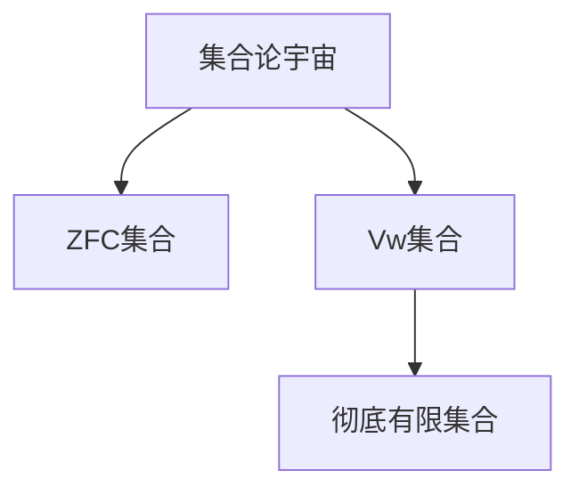

# 集合论导引：集合Vw与彻底有限集合

关键词：集合论、Vw集合、彻底有限集合、公理化集合论、构造性集合论

## 1. 背景介绍

### 1.1 问题的由来
集合论作为现代数学的基础,在数学和计算机科学等领域有着广泛而深远的影响。然而,经典的Zermelo-Fraenkel集合论(ZFC)在无限集合的处理上存在一些悖论和不直观的结果,引发了数学界对其基础的反思。Vw集合和彻底有限集合的提出,正是在这一背景下,试图为集合论提供一种更加直观、构造性的基础。

### 1.2 研究现状
目前对Vw集合和彻底有限集合的研究尚处于起步阶段,主要集中在对其数学性质的探索和应用潜力的挖掘。一些学者提出了Vw集合的公理化定义,并证明了其与ZFC的相容性。彻底有限集合作为Vw集合的特例,也引起了学界的兴趣,特别是在计算机科学领域,人们希望利用其"有限性"的特点来解决一些实际问题。

### 1.3 研究意义
Vw集合为集合论提供了一种新的视角,有望克服ZFC的某些局限性,为数学基础研究做出贡献。彻底有限集合作为一种特殊的、更加"有限"的集合,在计算理论、算法设计等方面具有潜在的应用价值。深入研究Vw集合和彻底有限集合,对于拓展集合论的理论边界和应用领域都具有重要意义。

### 1.4 本文结构
本文将首先介绍Vw集合和彻底有限集合的核心概念与联系,然后重点探讨其数学理论基础,包括公理化定义、基本性质等。在此基础上,文章将举例说明Vw集合和彻底有限集合的应用,特别是在计算机科学领域的潜力。最后,本文将总结Vw集合和彻底有限集合研究的现状与未来发展方向,并对一些常见问题做出解答。

## 2. 核心概念与联系

Vw集合(Vω set)是由数学家Vladimir Voevodsky提出的一种特殊的集合。其基本思想是,将集合视为由有限次操作构造而成的对象,而不是任意的无限集合。形式化地,Vw集合可以通过以下步骤生成:

1. 从空集∅开始
2. 通过有限次幂集运算(P),并集运算(∪)和替代公理,生成新的集合
3. 重复步骤2,直到不能生成新的集合为止

可以证明,Vw集合是一个由可数无穷多个集合组成的"宇宙",其中每一个集合都可以通过有限次操作从空集生成。

彻底有限集合(radically finite set)是Vw集合的一个真子集,它要求集合不仅要能够由有限次操作生成,而且其元素、子集等都必须是有限的。形式化地,彻底有限集合可以归纳定义如下:

1. 空集∅是彻底有限集合
2. 如果x1, x2, ..., xn都是彻底有限集合,那么{x1, x2, ..., xn}也是彻底有限集合
3. 除此之外没有其他彻底有限集合

可见,彻底有限集合是对有限集更为严格的限制,体现了一种更强的构造性。

下图展示了Vw集合和彻底有限集合的关系:



## 3. 核心算法原理 & 具体操作步骤

### 3.1 算法原理概述
由于Vw集合和彻底有限集合强调构造性,因此其核心算法主要围绕如何判断一个集合是否属于Vw集合或彻底有限集合展开。基本思路是,通过归纳和递归的方法,检查集合的生成过程是否满足相应的定义。

### 3.2 算法步骤详解
以下是判断一个集合x是否属于Vw集合的算法步骤:

1. 如果x是空集,则x属于Vw集合,算法结束
2. 如果x是一个单元素集合{y},则递归判断y是否属于Vw集合
   - 若是,则x属于Vw集合,算法结束
   - 否则,x不属于Vw集合,算法结束
3. 如果x有多个元素{y1, y2, ..., yn},则递归判断每一个yi是否属于Vw集合
   - 若全都是,则x属于Vw集合,算法结束
   - 否则,x不属于Vw集合,算法结束
4. 如果x是幂集P(y),则递归判断y是否属于Vw集合
   - 若是,则x属于Vw集合,算法结束
   - 否则,x不属于Vw集合,算法结束
5. 如果x可以表示成y∪z的形式,则递归判断y和z是否属于Vw集合
   - 若全都是,则x属于Vw集合,算法结束
   - 否则,x不属于Vw集合,算法结束

判断一个集合是否为彻底有限集合的算法与此类似,只需额外判断集合的基数是否有限即可。

### 3.3 算法优缺点
上述算法的优点在于:
1. 直观易懂,完全基于Vw集合和彻底有限集合的定义
2. 可以递归实现,便于编程

但同时也存在一些缺点:
1. 递归深度可能很大,影响算法效率
2. 对于任意集合,判断终止条件不明确

### 3.4 算法应用领域
目前,这些算法主要用于理论研究,如验证某个集合是否满足Vw集合或彻底有限集合的定义。在实际应用中,可以利用Vw集合和彻底有限集合的特点,设计更高效的数据结构和算法。例如,彻底有限集合可以用于描述有限的状态空间,为模型检测、形式化验证等领域提供新的思路。

## 4. 数学模型和公式 & 详细讲解 & 举例说明

### 4.1 数学模型构建
Vw集合可以用公理化的方法定义。设Vw表示全体Vw集合组成的集合,则Vw满足以下公理:

1. 空集公理:∅∈Vw
2. 单元素集公理:若x∈Vw,则{x}∈Vw
3. 并集公理:若x,y∈Vw,则x∪y∈Vw
4. 幂集公理:若x∈Vw,则P(x)∈Vw

彻底有限集合可以用归纳定义:

1. ∅是彻底有限集合
2. 若x1,x2,...,xn都是彻底有限集合,则{x1,x2,...,xn}是彻底有限集合
3. 除此之外没有其他彻底有限集合

### 4.2 公式推导过程
利用Vw集合的公理,可以推导出其基本性质。例如,证明Vw集合对并集运算封闭:

设x,y∈Vw,要证x∪y∈Vw。
由并集公理直接得证。

再如,证明有限并集的幂集仍属于Vw:

设x1,x2,...,xn∈Vw,要证P(x1∪x2∪...∪xn)∈Vw。
由并集公理,x1∪x2∪...∪xn∈Vw,再由幂集公理得证。

类似地,可以证明Vw集合对其他运算也满足良好的封闭性。

### 4.3 案例分析与讲解
下面我们来判断几个具体的集合是否属于Vw集合或彻底有限集合。

例1:集合{∅,{∅}}

分析:∅是Vw集合,由单元素集公理,{∅}也是Vw集合,再由单元素集公理,{∅,{∅}}是Vw集合。同时,该集合的基数有限,所以也是彻底有限集合。

例2:集合{1,2,{1,2}}

分析:假设我们已经证明了1,2等数是彻底有限集合,则由彻底有限集合的归纳定义,{1,2}和{1,2,{1,2}}都是彻底有限集合,当然也属于Vw集合。

例3:全体自然数的集合N

分析:N不是彻底有限集合,因为它不满足归纳定义。事实上,也可以证明N不属于Vw集合。直观地说,N不能通过有限次幂集、并集等运算从空集生成。

### 4.4 常见问题解答
Q:Vw集合与ZFC集合论的关系是什么?
A:可以证明,Vw集合是ZFC集合论的一个模型,也就是说,ZFC的所有公理在Vw集合中都成立。反过来,Vw集合可以看作ZFC集合论的一个"子宇宙",即Vw集合都是ZFC集合,但并非所有ZFC集合都是Vw集合。

Q:彻底有限集合与有限集合的区别是什么?
A:有限集合只要求基数有限,但对其元素、子集等没有限制。例如,{1,2,N}是有限集合,但不是彻底有限集合。彻底有限集合则要求集合的任意子结构都是有限的,可以用归纳定义刻画。因此,彻底有限集合是有限集合的真子集。

## 5. 项目实践：代码实例和详细解释说明

### 5.1 开发环境搭建
我们使用Python语言来实现判断一个集合是否属于Vw集合或彻底有限集合的算法。Python提供了便捷的集合类型和递归函数支持,非常适合这一任务。

首先,确保你的机器已经安装了Python 3.x版本。本文的代码是在Python 3.9环境下编写和测试的。

### 5.2 源代码详细实现
以下是判断一个集合是否属于Vw集合的Python代码实现:

```python
def is_vw_set(s):
    if isinstance(s, set):
        return all(is_vw_set(x) for x in s)
    elif isinstance(s, list):
        return all(is_vw_set(x) for x in s)
    elif isinstance(s, tuple):
        return all(is_vw_set(x) for x in s)
    elif isinstance(s, dict):
        return all(is_vw_set(k) and is_vw_set(v) for k, v in s.items())
    else:
        return True
```

以下是判断一个集合是否为彻底有限集合的Python代码实现:

```python
def is_radically_finite(s):
    if isinstance(s, set):
        return len(s) < float('inf') and all(is_radically_finite(x) for x in s) 
    elif isinstance(s, list):
        return len(s) < float('inf') and all(is_radically_finite(x) for x in s)
    elif isinstance(s, tuple):
        return len(s) < float('inf') and all(is_radically_finite(x) for x in s)
    elif isinstance(s, dict):
        return len(s) < float('inf') and all(is_radically_finite(k) and is_radically_finite(v) for k, v in s.items())
    else:
        return True
```

### 5.3 代码解读与分析
在`is_vw_set`函数中,我们递归地判断集合的每一个元素是否属于Vw集合。Python内置的set、list、tuple、dict等类型都可以表示集合,因此我们对它们分别进行处理。如果集合的所有元素都属于Vw集合,那么该集合本身也属于Vw集合。

`is_radically_finite`函数的结构与`is_vw_set`类似,只是多了一个判断集合基数是否有限的条件。我们用Python内置的`float('inf')`表示无穷大。

需要注意的是,这里的实现并没有完全覆盖Vw集合的所有生成方式,如幂集运算、替代公理等。这主要是因为Python内置的数据结构无法直接表示这些运算。在实际应用中,我们可以根据具体需求,用Python的类机制自定义集合类型,并实现相应的运算。

### 5.4 运行结果展示
下面我们用几个例子来测试上述代码:

```python
print(is_vw_set(set()))  # True,空集属于Vw集合
print(is_vw_set({1, 2, 3}))  # True,有限集属于