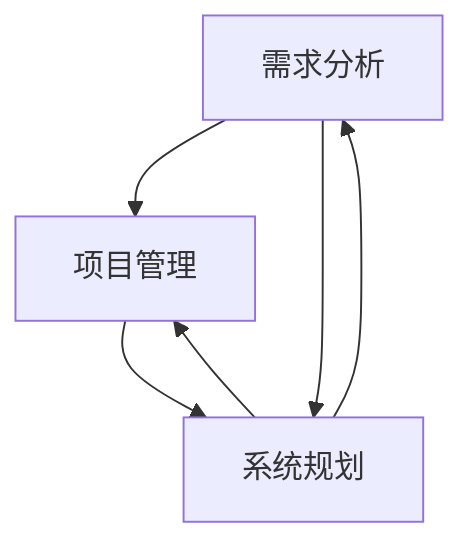
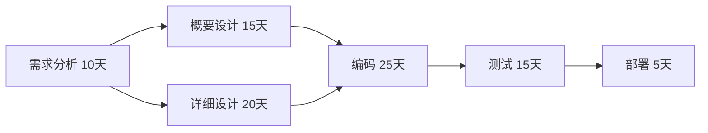

# 需求分析、项目管理、系统规划能力核心培养

关键词：需求分析、项目管理、系统规划、软件工程、IT技能培养

## 1. 背景介绍
### 1.1  问题的由来
在软件开发和IT项目实施过程中,需求分析、项目管理和系统规划是至关重要的三大核心能力。很多项目之所以失败,往往是由于在这三个方面存在严重缺陷导致的。没有准确全面的需求分析,项目的目标和范围就无从谈起；没有科学有效的项目管理,项目的进度、质量和成本就难以控制；没有合理完善的系统规划,软件系统的架构就如同一盘散沙。因此,对于每一个软件工程师和IT从业者而言,需求分析能力、项目管理能力、系统规划能力的培养和提升都是职业发展路上的必修课。

### 1.2  研究现状
国内外针对需求工程、项目管理和系统架构设计开展了广泛的研究,形成了一系列行之有效的方法学和最佳实践。需求工程领域的代表性成果包括用例分析法、场景分析法、原型法等；项目管理领域的研究成果有PMBOK知识体系、敏捷管理方法论等；在系统架构设计方面,则有TOGAF、4+1视图、微服务架构等。这些研究为培养软件工程师的核心能力提供了重要的理论基础和实践指导。

### 1.3  研究意义
软件工程师的核心竞争力主要体现在需求分析、项目管理、系统规划三个方面。一个优秀的软件工程师必须具备准确把握用户需求、合理控制项目进度、设计可扩展高性能系统架构的能力。对这三项核心能力的系统培养和锻炼,不仅能够帮助个人在职业发展道路上走得更高更远,也将为企业的数字化转型升级提供源源不断的智力支持和人才保障。因此,深入研究需求分析、项目管理、系统规划能力的培养路径和方法,对于软件工程专业人才的培养和IT产业的发展都具有重要意义。

### 1.4  本文结构
本文将重点围绕需求分析、项目管理、系统规划三大核心能力,系统阐述其内涵、重要性、主要方法,并就如何培养和提升这三项能力提出切实可行的路径和建议。文章主要包括以下内容:

第1部分,背景介绍,分析问题的由来、研究现状及研究意义；
第2部分,核心概念解析,明确需求分析、项目管理、系统规划的内涵和联系；
第3部分,需求分析方法和步骤详解；
第4部分,项目管理核心知识体系和技能要点； 
第5部分,系统规划设计的主要原则和架构模式；
第6部分,能力培养的路径探索和实践建议；
第7部分,总结提炼和展望未来。

## 2. 核心概念与联系

需求分析、项目管理、系统规划是软件工程的三大核心能力,它们相辅相成,缺一不可。

需求分析是指对用户的业务需求进行充分调研和系统分析,准确定义软件系统的功能性和非功能性需求,并以规范化的形式(如需求规格说明书)进行描述和管理的过程。需求分析是软件工程的首要任务,是项目成败的关键。只有基于对需求的准确理解,后续的设计、开发、测试等环节才能正确展开。

项目管理是指对项目的范围、进度、成本、质量、资源、风险等要素进行科学的计划、组织、指挥、协调和控制,以达成项目目标的管理活动。项目管理贯穿软件项目全生命周期,其有效性直接影响项目能否如期完成。作为项目的领导者和组织者,项目经理必须全面掌握项目管理的知识体系和实践技能。

系统规划是指根据需求分析的结果,运用系统论、软件工程的原理和方法,设计满足功能性和非功能性需求的系统蓝图,包括系统的逻辑架构、物理架构、数据架构、技术架构等。系统规划是连接需求分析和软件实现的桥梁,对系统的性能、可靠性、可扩展性起决定性作用。

需求分析为项目管理和系统规划提供输入和依据,项目管理为需求分析和系统规划提供组织保障,系统规划为需求分析和项目管理提供技术蓝图。三者相互依存,共同构成软件工程的核心内容。下图展示了三者之间的关系:

## 3. 核心算法原理 & 具体操作步骤
### 3.1  算法原理概述
需求分析通常采用结构化分析方法,通过自顶向下逐层分解的方式,将复杂的用户需求转化为清晰明确的功能需求和约束条件。其主要原理包括:
1. 将复杂的业务需求分解为若干个可管理的子需求
2. 从用户的角度出发识别和定义系统的参与者和用例
3. 通过用例分析和场景分析细化需求模型
4. 定义系统的功能边界和外部接口
5. 明确系统必须遵循的约束条件和质量属性

### 3.2  算法步骤详解
需求分析的一般步骤如下:
1. 可行性分析:分析项目的商业价值、技术可行性和组织可行性,为决策提供依据。
2. 需求获取:通过与用户访谈、问卷调查、观察等方式广泛收集原始需求。
3. 需求分析:对收集到的原始需求进行分类整理,识别出功能需求和非功能需求,并以用例图、流程图等形式表示。
4. 需求定义:编写需求规格说明书,明确定义每个需求的输入、处理、输出、约束条件等,消除需求的歧义和不一致。
5. 需求验证:对需求规格说明书进行评审,检查其完整性、一致性、可理解性、可测试性。
6. 需求管理:建立需求跟踪矩阵,记录需求变更,并评估变更对项目的影响。

### 3.3  算法优缺点
结构化需求分析方法的优点在于:
1. 采用自顶向下逐层分解的方式,便于管理复杂的需求
2. 强调从用户的角度分析问题,以用例为驱动
3. 需求规格说明书的编写有利于需求的传递和管理

其缺点包括:
1. 过于强调需求的结构化和文档化,灵活性不够 
2. 用户参与不足,难以应对需求的频繁变化
3. 分析建模的工作量大,周期长

### 3.4  算法应用领域
结构化需求分析方法适用于需求相对稳定、项目规模较大、参与人员较多的情况,特别是传统的瀑布式开发模型。对于需求不确定、强调快速响应的项目,则更适合采用敏捷的需求分析方法。

## 4. 数学模型和公式 & 详细讲解 & 举例说明
### 4.1  数学模型构建
项目管理涉及对项目进度、成本、资源等多个变量的量化分析和优化决策,通常借助一些数学模型和方法,例如:

1. 网络图模型:用节点表示活动,用有向边表示活动之间的优先关系,借助关键路径法计算项目工期。设$G(V,E)$表示一个AOE网络,其中$V$表示活动集合,$E$表示活动之间的优先关系集合,则$G$的关键路径长度$L$可表示为:

$$
L = \max_{P_i \in P} \left\{ \sum_{v_j \in P_i} d(v_j) \right\}
$$

其中,$P$为$G$中所有从起点到终点的路径集合,$P_i$为其中一条路径,$v_j$为$P_i$上的一个活动,$d(v_j)$为$v_j$的持续时间。

2. 资源优化模型:用于在资源约束下优化项目进度和成本。常用的优化目标包括最小化项目工期、最小化资源占用量、最小化成本等。例如,考虑一个资源受限的项目调度问题,设$x_{ij}$表示活动$i$是否在第$j$天执行,$d_i$表示活动$i$的持续时间,$r_{ik}$表示活动$i$对资源$k$的需求量,$a_{kt}$表示资源$k$在第$t$天的可用量,则最小化工期的数学模型可表示为:

$$
\begin{align}
\min & \quad T \\
\text{s.t.} & \quad \sum_{j=1}^T x_{ij} = d_i, \quad \forall i \\
& \quad \sum_{i=1}^n r_{ik} x_{ijt} \le a_{kt}, \quad \forall k, t \\
& \quad x_{ij} \in \{0, 1\}, \quad \forall i, j
\end{align}
$$

其中,$T$为项目的完成时间,$n$为活动数量。约束条件确保每个活动的持续时间满足要求,同时任意时刻资源占用不超过可用量。

### 4.2  公式推导过程
以上两个数学模型的推导过程如下:

1. 关键路径长度的计算公式:
- 从起点到每个活动的最早开始时间$ES(i)$可通过从前向后的递推计算得到:
$ES(i) = \max\limits_{j \in P(i)} \{ ES(j) + d(j) \}$
其中,$P(i)$表示活动$i$的所有直接前驱。
- 从终点到每个活动的最晚开始时间$LS(i)$可通过从后向前的递推计算得到:  
$LS(i) = \min\limits_{j \in S(i)} \{ LS(j) - d(i) \}$
其中,$S(i)$表示活动$i$的所有直接后继。
- 关键路径是从起点到终点具有最大长度的路径,其长度等于终点的最早开始时间,即项目的工期。

2. 资源优化模型的推导:
- 目标函数最小化项目完成时间$T$。
- 约束条件1确保每个活动$i$的执行时间之和等于其持续时间$d_i$。
- 约束条件2确保任意时刻$t$,所有执行中的活动占用的第$k$种资源量不超过当天的可用量$a_{kt}$。
- 约束条件3限定决策变量$x_{ij}$为0-1变量。

### 4.3  案例分析与讲解
下面以一个软件项目为例,说明如何应用上述模型进行项目管理。

某软件项目包括需求分析、概要设计、详细设计、编码、测试、部署六个活动,其先后关系和估计工期如下图所示:

1. 运用关键路径法计算项目的最短工期:
- 从起点A开始,A的最早开始时间为0,B和C的最早开始时间分别为10和10;
- D的最早开始时间取B和C的最大值,为30;
- E的最早开始时间为D的最早开始时间加上D的工期,为55;
- 终点F的最早开始时间为70,也即项目的最短工期为70天。
- 从终点F开始回溯,F的最晚开始时间就是项目工期70,E的最晚开始时间为65;
- D的最晚开始时间为E的最晚开始时间减去D的工期,为40;
- B和C的最晚开始时间分别为25和20;
- 起点A的最晚开始时间为0。
- 关键路径为A-C-D-E-F,长度为70天。

2. 假设项目有三种资源:需求分析师、设计师、程序员,其每天可用量分别为2人、3人、5人。六个活动对三种资源的需求量如下表:

| 活动      | 需求分析师 | 设计师 | 程序员 | 
|-----------|------------|--------|--------|