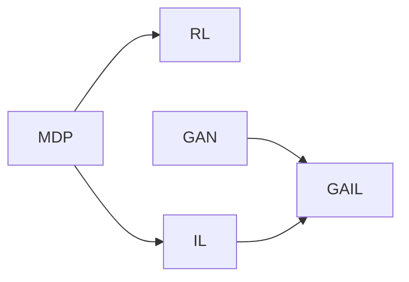

# 马尔可夫决策过程中的生成对抗模仿学习

## 1. 背景介绍
### 1.1 问题的由来
强化学习(Reinforcement Learning, RL)是一种重要的机器学习范式,旨在通过智能体(Agent)与环境的交互来学习最优策略,以最大化长期累积奖励。马尔可夫决策过程(Markov Decision Process, MDP)为强化学习提供了理论基础。然而,在许多实际应用场景中,获取大量高质量的专家示范数据并不容易。模仿学习(Imitation Learning, IL)通过模仿专家的行为来学习策略,为解决这一问题提供了一种有效的途径。近年来,生成对抗网络(Generative Adversarial Network, GAN)在生成模型领域取得了巨大成功,其思想也被引入到模仿学习中,催生了生成对抗模仿学习(Generative Adversarial Imitation Learning, GAIL)。GAIL将模仿学习问题转化为一个对抗学习过程,通过生成器网络和判别器网络的博弈来学习接近专家策略的策略。

### 1.2 研究现状 
自从何恩等人[1]在2016年首次提出GAIL以来,该领域涌现出许多后续工作。例如,InfoGAIL[2]在GAIL的基础上引入了互信息最大化,以学习解耦的策略和奖励函数;GoalGAIL[3]将目标条件引入GAIL,实现了目标导向的模仿学习;VAIL[4]利用变分推断实现了一个统一的IL框架。此外,GAIL在机器人控制[5]、自动驾驶[6]等实际应用中也取得了不错的效果。尽管如此,GAIL仍然面临一些挑战,如样本效率低、鲁棒性不足等问题有待进一步研究。

### 1.3 研究意义
研究GAIL对于推动模仿学习的发展具有重要意义。首先,GAIL为模仿学习引入了对抗学习机制,极大地提升了模仿学习的性能。其次,GAIL所倡导的思想为其他学习任务如逆强化学习、对比学习等提供了新的视角。再者,深入理解GAIL有助于设计更高效、更鲁棒的模仿学习算法,推动强化学习在实际场景中的应用。最后,GAIL研究也为探索强化学习和生成对抗网络的融合提供了范例,具有一定的理论价值。

### 1.4 本文结构
本文将全面介绍GAIL的原理和应用。第2节介绍GAIL中涉及的核心概念。第3节重点阐述GAIL的算法原理和实现步骤。第4节从数学角度对GAIL的模型和公式进行详细推导和讲解。第5节通过代码实例来演示GAIL的具体实现。第6节讨论GAIL在实际应用场景中的表现。第7节总结了GAIL相关的学习资源、开发工具等。第8节对全文进行总结,并对GAIL的未来发展趋势和面临的挑战进行展望。

## 2. 核心概念与联系

在阐述GAIL原理之前,有必要先对其中涉及的几个核心概念进行简要介绍:

- 马尔可夫决策过程(MDP):描述了一个带有状态转移的序贯决策问题,为强化学习提供了理论框架。一个MDP由状态空间、动作空间、转移概率、奖励函数和折扣因子构成。求解MDP即是寻找一个最优策略函数,使得在该策略下智能体能获得最大的期望累积奖励。

- 强化学习(RL):一种重要的机器学习范式。与监督学习不同,RL通过智能体与环境的交互来学习最优行为策略,而无须预先标注的样本数据。RL的目标是使得智能体获得最大的长期累积奖励。

- 模仿学习(IL):通过模仿专家的行为来学习策略,避免了对奖励函数的设计。常见的IL方法包括行为克隆(Behavioral Cloning)和逆强化学习(Inverse RL)等。前者直接学习专家行为到动作的映射,而后者先估计奖励函数,再利用强化学习求解。

- 生成对抗网络(GAN):一种深度生成模型,由生成器和判别器两个神经网络构成。生成器试图生成接近真实数据分布的样本,而判别器则试图判别样本来自真实分布还是生成器。GAN通过两个网络的对抗博弈来不断优化,最终使生成器能生成以假乱真的样本。

GAIL创新性地将GAN引入模仿学习,将模仿学习问题转化为一个对抗学习过程。具体而言,GAIL将策略视作一个生成器,将奖励函数视作一个判别器,通过两者的博弈来最小化策略分布与专家分布之间的JS散度,从而使学习到的策略接近专家策略。下图展示了MDP、RL、IL、GAN和GAIL之间的关系:

## 3. 核心算法原理 & 具体操作步骤
### 3.1 算法原理概述
GAIL的核心思想是将模仿学习问题转化为一个对抗学习过程。具体而言,它引入一个策略网络作为生成器 $G$,一个奖励函数作为判别器 $D$。生成器 $G$ 的目标是生成一个与专家策略接近的策略 $\pi_\theta$,而判别器 $D$ 的目标是最大化区分专家轨迹 $\tau_E$ 和策略轨迹 $\tau_\theta$ 的能力。形式化地,GAIL 试图求解如下的最小最大优化问题:

$$\min_{\theta} \max_{D} \mathbb{E}_{\tau_E}[\log D(\tau)] + \mathbb{E}_{\tau_\theta}[\log(1-D(\tau))] - \lambda H(\pi_\theta)$$

其中 $H(\pi_\theta)$ 为策略 $\pi_\theta$ 的熵,是一个正则化项,用于鼓励策略的探索性。通过交替地更新生成器和判别器,GAIL最终使得生成器学习到一个接近专家策略的策略。

### 3.2 算法步骤详解
GAIL算法主要包含以下几个步骤:

1. 随机初始化策略网络 $\pi_\theta$ 和判别网络 $D_\omega$ 的参数 $\theta$ 和 $\omega$。

2. 重复以下步骤直到收敛:
   
   a. 运行策略 $\pi_\theta$ 与环境交互,收集一组轨迹 $\tau_\theta$。
   
   b. 从专家轨迹 $\tau_E$ 中采样一组轨迹。
   
   c. 更新判别器 $D_\omega$ 的参数 $\omega$,最大化目标函数:
   
   $$\mathbb{E}_{\tau_E}[\log D_\omega(\tau)] + \mathbb{E}_{\tau_\theta}[\log(1-D_\omega(\tau))]$$
   
   d. 利用更新后的 $D_\omega$ 构造奖励函数 $r(s,a) = -\log(1-D_\omega(s,a))$。
   
   e. 利用 $r(s,a)$ 作为奖励信号,通过任意强化学习算法(如TRPO、PPO等)更新策略 $\pi_\theta$,最大化目标函数:
   
   $$\mathbb{E}_{\tau_\theta}[\sum_{t=0}^T \gamma^t r(s_t,a_t)] + \lambda H(\pi_\theta)$$

3. 输出学习到的策略 $\pi_\theta$ 作为最终的模仿策略。

### 3.3 算法优缺点
GAIL相比传统的模仿学习方法具有以下优点:

- 不需要直接学习专家行为到动作的映射,而是通过对抗学习隐式地学习接近专家策略的策略。这使得GAIL能处理高维、连续的状态和动作空间。

- 引入了生成对抗网络的思想,通过生成器和判别器的博弈来不断优化策略,使得最终学习到的策略更加鲁棒。

- 理论上证明了GAIL所学习到的策略能以任意精度逼近专家策略。

但GAIL也存在一些局限性:

- 训练过程不够稳定,容易受到训练技巧的影响。这主要是由GAN本身的训练不稳定性所致。

- 样本效率较低,需要与环境进行大量的交互才能学到较好的策略。这限制了它在一些数据稀缺的场景中的应用。

- 学习到的策略缺乏可解释性。由于GAIL是一种端到端的方法,很难去解释学习到的策略的内在逻辑。

### 3.4 算法应用领域
GAIL 作为一种通用的模仿学习算法,在许多领域都有广泛的应用前景,例如:

- 机器人控制:通过模仿人类专家的示范轨迹,GAIL 可以用于训练各种机器人完成复杂的控制任务,如机械臂操作、人形机器人行走等。

- 自动驾驶:利用人类驾驶员的行车记录数据,GAIL 可以学习到一个与人类驾驶风格相近的自动驾驶策略,提高自动驾驶系统的安全性和可接受性。

- 游戏 AI:通过模仿人类玩家的游戏记录,GAIL 可以训练出一个与人类水平相当的游戏 AI,用于游戏测试或提供陪练。

- 行为模仿动画:利用专业演员的动作捕捉数据,GAIL 可以合成逼真的角色动画,用于影视制作、虚拟现实等领域。

- 自然语言处理:GAIL 可以用于建模人类的对话行为,训练出一个与人类交互风格接近的对话系统,提升人机交互的自然性。

## 4. 数学模型和公式 & 详细讲解 & 举例说明
### 4.1 数学模型构建
GAIL 的数学模型建立在马尔可夫决策过程的基础上。考虑一个由 $\langle \mathcal{S}, \mathcal{A}, \mathcal{P}, r, \rho_0, \gamma \rangle$ 所定义的 MDP,其中:

- $\mathcal{S}$ 表示状态空间
- $\mathcal{A}$ 表示动作空间 
- $\mathcal{P}: \mathcal{S} \times \mathcal{A} \mapsto \mathcal{S}$ 表示状态转移概率
- $r: \mathcal{S} \times \mathcal{A} \mapsto \mathbb{R}$ 表示奖励函数
- $\rho_0: \mathcal{S} \mapsto \mathbb{R}$ 表示初始状态分布
- $\gamma \in (0,1]$ 表示折扣因子

一个轨迹 $\tau$ 定义为一系列状态-动作对: $\tau = \{(s_0,a_0),(s_1,a_1),\cdots\}$,其中 $s_0 \sim \rho_0, a_t \sim \pi(\cdot|s_t), s_{t+1} \sim \mathcal{P}(\cdot|s_t,a_t)$。一个策略 $\pi$ 诱导了一个轨迹分布 $\rho_\pi$:

$$\rho_\pi(\tau) = \rho_0(s_0) \prod_{t=0}^{\infty} \pi(a_t|s_t) \mathcal{P}(s_{t+1}|s_t,a_t)$$

给定一组专家轨迹 $\mathcal{D}_E = \{\tau_1,\cdots,\tau_N\}$,其中 $\tau_i \sim \rho_{\pi_E}$,即这些轨迹是根据某个未知的专家策略 $\pi_E$ 采样得到的。模仿学习的目标是根据 $\mathcal{D}_E$ 学习一个策略 $\pi$,使得 $\rho_\pi$ 尽可能接近 $\rho_{\pi_E}$。

GAIL 将上述模仿学习问题转化为求解一个最小最大优化问题:

$$\min_{\pi} \max_{D} \mathbb{E}_{\tau \sim \rho_{\pi}}[\log D(\tau)] + \mathbb{E}_{\tau \sim \rho_{\pi_E}}[\log(1-D(\tau))] - \lambda H(\pi)$$

其中 $D: \mathcal{