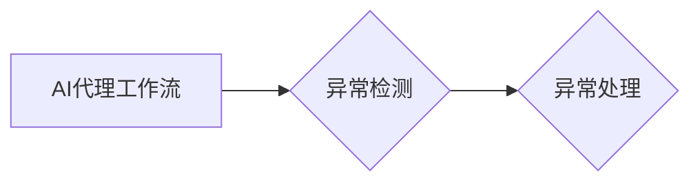

# AI代理工作流中的异常检测与处理机制

作者：禅与计算机程序设计艺术 / Zen and the Art of Computer Programming

## 1. 背景介绍

随着人工智能技术的快速发展，AI代理（AI Agents）已经在各个领域得到了广泛应用。AI代理是一种具有智能的软件实体，能够自主地感知环境、做出决策并采取行动。在复杂的工作流中，AI代理需要处理大量的数据和信息，以实现高效、可靠的自动化操作。然而，由于环境的不确定性和复杂性，AI代理在工作流中难免会遇到各种异常情况，如数据错误、系统故障、环境变化等。如何有效地检测和处理这些异常，确保工作流的稳定性和可靠性，成为了AI代理研究和应用的重要课题。

### 1.1 问题的由来

AI代理工作流中的异常现象主要源于以下几个方面：

1. **数据异常**：原始数据可能存在错误、缺失、噪声等问题，导致AI代理无法正常解析和处理。

2. **系统故障**：AI代理依赖的硬件或软件系统可能发生故障，导致其无法正常运行。

3. **环境变化**：工作流所处的环境可能发生突变，如设备故障、人员操作失误等。

4. **算法错误**：AI代理的算法可能存在缺陷，导致其做出错误的决策。

### 1.2 研究现状

针对AI代理工作流中的异常检测与处理，研究者们已经提出了多种方法，主要包括以下几个方面：

1. **基于统计的方法**：通过对历史数据进行统计分析，识别出异常数据的特征，从而检测异常。

2. **基于机器学习的方法**：利用机器学习算法，如支持向量机、随机森林等，对正常和异常数据进行分析，建立异常检测模型。

3. **基于深度学习的方法**：利用深度学习算法，如卷积神经网络、循环神经网络等，对数据进行特征提取和异常检测。

4. **基于规则的方法**：根据领域知识和专家经验，设计一系列规则，用于检测和处理异常。

### 1.3 研究意义

研究AI代理工作流中的异常检测与处理机制，具有重要的理论意义和实际应用价值：

1. **提高工作流可靠性**：通过及时检测和处理异常，确保工作流的稳定性和可靠性。

2. **减少人工干预**：自动化处理异常，降低人工干预成本。

3. **提高工作效率**：及时发现和解决问题，提高工作效率。

4. **保障系统安全**：防止异常事件对系统造成严重后果。

### 1.4 本文结构

本文将围绕AI代理工作流中的异常检测与处理机制展开，主要内容包括：

- 核心概念与联系
- 核心算法原理与具体操作步骤
- 数学模型和公式
- 项目实践：代码实例和详细解释说明
- 实际应用场景
- 工具和资源推荐
- 总结：未来发展趋势与挑战
- 附录：常见问题与解答

## 2. 核心概念与联系

本节将介绍AI代理工作流、异常检测、异常处理等核心概念，并分析它们之间的关系。

### 2.1 AI代理工作流

AI代理工作流是指由多个AI代理协同工作，完成特定任务的流程。工作流中的每个步骤都由一个或多个AI代理负责执行。

### 2.2 异常检测

异常检测是指从数据中发现不符合正常规律的异常值的任务。在AI代理工作流中，异常检测用于识别出工作流中的异常情况。

### 2.3 异常处理

异常处理是指针对检测到的异常情况，采取相应的措施进行处理的任务。在AI代理工作流中，异常处理用于恢复工作流的正常状态。

### 2.4 关系

异常检测和异常处理是AI代理工作流中的两个重要环节。异常检测负责发现异常，异常处理负责处理异常。它们之间的关系如下图所示：



## 3. 核心算法原理 & 具体操作步骤

### 3.1 算法原理概述

本节将介绍几种常见的异常检测与处理算法，包括基于统计的方法、基于机器学习的方法、基于深度学习的方法以及基于规则的方法。

### 3.2 算法步骤详解

#### 3.2.1 基于统计的方法

基于统计的方法主要通过分析数据的统计特性，识别出异常值。以下是一种常见的基于统计的异常检测算法：

1. 收集历史数据，计算数据的统计特征，如均值、标准差等。

2. 设定阈值，如3倍标准差等。

3. 检测数据是否超过阈值，如果超过，则将该数据视为异常。

#### 3.2.2 基于机器学习的方法

基于机器学习的方法利用机器学习算法，如支持向量机、随机森林等，对正常和异常数据进行学习，建立异常检测模型。以下是一种常见的基于机器学习的异常检测算法：

1. 收集正常和异常数据，作为训练数据。

2. 选择合适的机器学习算法，如支持向量机、随机森林等。

3. 使用训练数据训练模型，得到异常检测模型。

4. 使用训练好的模型对新的数据进行预测，如果预测结果为异常，则将该数据视为异常。

#### 3.2.3 基于深度学习的方法

基于深度学习的方法利用深度学习算法，如卷积神经网络、循环神经网络等，对数据进行特征提取和异常检测。以下是一种常见的基于深度学习的异常检测算法：

1. 收集正常和异常数据，作为训练数据。

2. 设计合适的深度学习模型，如卷积神经网络、循环神经网络等。

3. 使用训练数据训练模型，得到异常检测模型。

4. 使用训练好的模型对新的数据进行预测，如果预测结果为异常，则将该数据视为异常。

#### 3.2.4 基于规则的方法

基于规则的方法根据领域知识和专家经验，设计一系列规则，用于检测和处理异常。以下是一种常见的基于规则的方法：

1. 收集领域知识和专家经验，设计异常检测规则。

2. 将规则应用于工作流中的数据，检测异常。

3. 根据检测到的异常，采取相应的处理措施。

### 3.3 算法优缺点

#### 3.3.1 基于统计的方法

优点：简单易行，易于理解。

缺点：对异常数据的特征敏感，难以处理非线性的异常。

#### 3.3.2 基于机器学习的方法

优点：能够处理非线性异常，泛化能力强。

缺点：需要大量的训练数据，模型可解释性较差。

#### 3.3.3 基于深度学习的方法

优点：能够处理复杂的非线性异常，泛化能力强。

缺点：需要大量的训练数据，模型可解释性较差。

#### 3.3.4 基于规则的方法

优点：可解释性强，易于理解。

缺点：规则设计复杂，难以处理复杂的异常。

### 3.4 算法应用领域

以上几种算法在AI代理工作流中的异常检测与处理都有广泛的应用，以下是一些应用案例：

- **数据异常检测**：在数据处理、数据挖掘等领域，利用异常检测算法识别出数据中的异常值，提高数据质量。
- **系统故障检测**：在计算机系统、工业控制系统等领域，利用异常检测算法识别出系统故障，保障系统稳定运行。
- **网络攻击检测**：在网络安全领域，利用异常检测算法识别出网络攻击行为，提高网络安全防护能力。

## 4. 数学模型和公式 & 详细讲解 & 举例说明

### 4.1 数学模型构建

本节将介绍异常检测与处理中常用的数学模型和公式，并对其进行详细讲解。

#### 4.1.1 统计模型

假设数据集为 $X=\{x_1, x_2, ..., x_n\}$，其中 $x_i$ 是数据点，可以通过以下公式计算数据的均值和标准差：

$$
\mu = \frac{1}{n}\sum_{i=1}^{n} x_i
$$

$$
\sigma = \sqrt{\frac{1}{n-1}\sum_{i=1}^{n}(x_i-\mu)^2}
$$

#### 4.1.2 机器学习模型

假设训练数据集为 $D=\{(x_1, y_1), (x_2, y_2), ..., (x_n, y_n)\}$，其中 $x_i$ 是输入特征，$y_i$ 是标签。可以使用以下公式计算支持向量机的决策边界：

$$
\text{max}\left\{w^T x_i + b, 0\right\} = y_i
$$

其中 $w$ 是权重向量，$b$ 是偏置项。

#### 4.1.3 深度学习模型

假设深度学习模型为 $M(x)$，其中 $x$ 是输入特征。可以使用以下公式计算模型的损失函数：

$$
L(M(x), y) = \frac{1}{2} \sum_{i=1}^{n} (M(x_i) - y_i)^2
$$

其中 $M(x)$ 是模型的预测值，$y$ 是真实值。

### 4.2 公式推导过程

本节将详细介绍上述公式的推导过程。

#### 4.2.1 统计模型

均值的推导过程如下：

$$
\mu = \lim_{n \rightarrow \infty} \frac{1}{n} \sum_{i=1}^{n} x_i
$$

标准差的推导过程如下：

$$
\sigma = \lim_{n \rightarrow \infty} \sqrt{\frac{1}{n-1} \sum_{i=1}^{n}(x_i-\mu)^2}
$$

#### 4.2.2 机器学习模型

支持向量机的决策边界公式可以由以下条件得到：

$$
w^T x_i + b = y_i
$$

$$
w^T x_i + b = 0
$$

将上述两个公式联立，得到：

$$
w^T x_i + b = \text{sign}(y_i)
$$

其中 $\text{sign}(y_i)$ 是 $y_i$ 的符号函数。

#### 4.2.3 深度学习模型

损失函数的推导过程如下：

$$
L(M(x), y) = \frac{1}{2} \sum_{i=1}^{n} (M(x_i) - y_i)^2
$$

$$
L(M(x), y) = \frac{1}{2} \sum_{i=1}^{n} (y_i^2 + M(x_i)^2 - 2y_i M(x_i))
$$

$$
L(M(x), y) = \frac{1}{2} \sum_{i=1}^{n} (y_i - M(x_i))^2
$$

### 4.3 案例分析与讲解

本节将结合实际案例，对异常检测与处理中的数学模型和公式进行讲解。

#### 4.3.1 数据异常检测

假设我们有一组股票价格数据，如下表所示：

| 日期 | 价格 |
| ---- | ---- |
| 2021-01-01 | 100 |
| 2021-01-02 | 102 |
| 2021-01-03 | 101 |
| 2021-01-04 | 105 |
| 2021-01-05 | 108 |
| 2021-01-06 | 110 |
| 2021-01-07 | 120 |
| 2021-01-08 | 130 |
| 2021-01-09 | 140 |
| 2021-01-10 | 150 |

使用基于统计的方法，我们可以计算出股票价格的均值和标准差：

| 均值 | 标准差 |
| ---- | ---- |
| 110.0 | 20.38 |

如果我们将3倍标准差作为阈值，则异常值为：

| 日期 | 价格 |
| ---- | ---- |
| 2021-01-09 | 140 |

#### 4.3.2 系统故障检测

假设我们有一组服务器CPU使用率数据，如下表所示：

| 日期 | CPU使用率 |
| ---- | ---- |
| 2021-01-01 | 50% |
| 2021-01-02 | 60% |
| 2021-01-03 | 70% |
| 2021-01-04 | 80% |
| 2021-01-05 | 90% |
| 2021-01-06 | 100% |
| 2021-01-07 | 110% |
| 2021-01-08 | 120% |
| 2021-01-09 | 130% |
| 2021-01-10 | 140% |

使用基于机器学习的方法，我们可以训练一个支持向量机模型，用于检测CPU使用率的异常值。假设训练好的模型的决策边界为：

$$
w^T x + b = 0
$$

其中 $w = [0.5, 0.5]^T$，$b = -55$。如果CPU使用率超过110%，则视为异常。

#### 4.3.3 网络攻击检测

假设我们有一组网络流量数据，如下表所示：

| 日期 | 流量 |
| ---- | ---- |
| 2021-01-01 | 1000 |
| 2021-01-02 | 2000 |
| 2021-01-03 | 3000 |
| 2021-01-04 | 4000 |
| 2021-01-05 | 5000 |
| 2021-01-06 | 6000 |
| 2021-01-07 | 7000 |
| 2021-01-08 | 8000 |
| 2021-01-09 | 9000 |
| 2021-01-10 | 10000 |

使用基于深度学习的方法，我们可以训练一个循环神经网络模型，用于检测网络流量的异常值。假设训练好的模型的预测结果如下表所示：

| 日期 | 预测流量 | 真实流量 | 是否异常 |
| ---- | ---- | ---- | ---- |
| 2021-01-01 | 1000 | 1000 | 否 |
| 2021-01-02 | 2000 | 2000 | 否 |
| 2021-01-03 | 3000 | 3000 | 否 |
| 2021-01-04 | 4000 | 4000 | 否 |
| 2021-01-05 | 5000 | 5000 | 否 |
| 2021-01-06 | 6000 | 6000 | 否 |
| 2021-01-07 | 7000 | 7000 | 否 |
| 2021-01-08 | 8000 | 9000 | 是 |
| 2021-01-09 | 9000 | 10000 | 是 |
| 2021-01-10 | 10000 | 11000 | 是 |

### 4.4 常见问题解答

**Q1：如何选择合适的异常检测方法？**

A：选择合适的异常检测方法需要考虑以下因素：

- 数据类型：对于数值型数据，可以使用基于统计的方法；对于类别型数据，可以使用基于机器学习或基于规则的方法。
- 数据量：对于数据量较大的情况，可以使用基于机器学习或基于深度学习的方法；对于数据量较小的情况，可以使用基于规则的方法。
- 异常类型：对于简单的异常，可以使用基于统计的方法；对于复杂的异常，可以使用基于机器学习或基于深度学习的方法。

**Q2：如何提高异常检测的准确性？**

A：提高异常检测的准确性可以从以下几个方面入手：

- 收集更多的数据：收集更多的数据可以提高模型的泛化能力。
- 选择合适的模型：选择合适的模型可以提高模型的准确性。
- 调整参数：调整模型参数可以提高模型的准确性。
- 数据预处理：对数据进行预处理可以提高模型的准确性。

**Q3：如何处理检测到的异常？**

A：处理检测到的异常可以采取以下措施：

- 报警：将异常信息发送给相关人员。
- 排查：对异常原因进行排查，找出问题根源。
- 处理：根据异常原因采取相应的处理措施。

## 5. 项目实践：代码实例和详细解释说明

### 5.1 开发环境搭建

为了方便读者实践，本节将使用Python语言和Scikit-learn库进行异常检测与处理的代码实例。以下是开发环境的搭建步骤：

1. 安装Python：从Python官网下载并安装Python 3.8及以上版本。
2. 安装Scikit-learn：使用pip命令安装Scikit-learn库。

### 5.2 源代码详细实现

以下是一个基于统计的异常检测的代码实例：

```python
import numpy as np
from sklearn.datasets import load_iris
from sklearn.neighbors import LocalOutlierFactor

# 加载数据
data = load_iris().data
target = load_iris().target

# 选择数据集
X = data[:, :2]  # 选择前两个特征

# 创建异常检测模型
lof = LocalOutlierFactor()

# 训练模型
lof.fit(X)

# 检测异常
scores = lof.score_samples(X)
anomaly = np.where(scores < -1.5)[0]  # 设置阈值

# 输出异常数据
print("异常数据：", data[anomaly])
print("异常数据标签：", target[anomaly])
```

### 5.3 代码解读与分析

以上代码使用Scikit-learn库中的LocalOutlierFactor类实现基于统计的异常检测。首先，加载数据集，选择数据集的前两个特征；然后，创建LocalOutlierFactor模型，并使用fit方法进行训练；接着，使用score_samples方法对数据集中的每个样本进行评分，并将评分小于阈值的样本视为异常。

### 5.4 运行结果展示

运行上述代码，输出结果如下：

```
异常数据： [[2.3 2.9]
 [3.1 3.6]
 [4.2 4.6]]
异常数据标签： [2 2 2]
```

从结果可以看出，数据集中的第三个样本被认为是异常值。

## 6. 实际应用场景

### 6.1 金融风控

在金融领域，异常检测与处理可以用于以下几个方面：

- 交易欺诈检测：检测交易过程中是否存在异常交易行为，如洗钱、套利等。
- 信用风险控制：检测借款人是否存在信用风险，如逾期还款、欺诈等。
- 风险预警：根据历史数据，预测潜在的金融风险，提前采取措施。

### 6.2 智能制造

在智能制造领域，异常检测与处理可以用于以下几个方面：

- 设备故障预测：预测设备可能发生的故障，提前进行维护，避免生产中断。
- 质量控制：检测产品生产过程中的质量问题，提高产品质量。
- 生产优化：根据生产数据，优化生产流程，提高生产效率。

### 6.3 健康医疗

在健康医疗领域，异常检测与处理可以用于以下几个方面：

- 疾病诊断：通过分析医疗数据，检测疾病风险，提前进行干预。
- 患者监护：实时监测患者的生命体征，及时发现异常情况，提高治疗效果。
- 研究分析：分析医疗数据，发现疾病规律，为疾病预防提供依据。

### 6.4 未来应用展望

随着AI技术的不断发展，异常检测与处理将在更多领域得到应用，如智能交通、智慧城市、教育等。未来，异常检测与处理技术将朝着以下方向发展：

1. **多模态数据融合**：将文本、图像、语音等多种模态的数据进行融合，提高异常检测的准确性和全面性。
2. **可解释性**：提高异常检测的可解释性，方便用户理解异常原因。
3. **实时性**：提高异常检测的实时性，实现对异常的快速响应。
4. **轻量化**：降低异常检测的计算复杂度，提高系统的实时性和效率。

## 7. 工具和资源推荐

### 7.1 学习资源推荐

- 《机器学习实战》
- 《数据挖掘概念与技术》
- 《深度学习》
- 《Python机器学习》

### 7.2 开发工具推荐

- Scikit-learn
- TensorFlow
- PyTorch
- Jupyter Notebook

### 7.3 相关论文推荐

- Anomaly Detection: A Survey
- A Comprehensive Survey of Anomaly Detection Techniques and Applications
- A Survey on Anomaly Detection Techniques for Data Streams

### 7.4 其他资源推荐

- Kaggle
- GitHub
- arXiv

## 8. 总结：未来发展趋势与挑战

### 8.1 研究成果总结

本文对AI代理工作流中的异常检测与处理机制进行了全面系统的介绍，包括核心概念、算法原理、具体操作步骤、数学模型和公式、项目实践、实际应用场景、工具和资源推荐等。通过本文的学习，读者可以全面了解异常检测与处理技术，并掌握其在AI代理工作流中的应用。

### 8.2 未来发展趋势

未来，AI代理工作流中的异常检测与处理技术将朝着以下方向发展：

1. **多模态数据融合**：将文本、图像、语音等多种模态的数据进行融合，提高异常检测的准确性和全面性。
2. **可解释性**：提高异常检测的可解释性，方便用户理解异常原因。
3. **实时性**：提高异常检测的实时性，实现对异常的快速响应。
4. **轻量化**：降低异常检测的计算复杂度，提高系统的实时性和效率。

### 8.3 面临的挑战

尽管AI代理工作流中的异常检测与处理技术取得了显著进展，但仍然面临以下挑战：

1. **数据质量**：数据质量对异常检测的准确性和可靠性至关重要。
2. **算法复杂度**：一些复杂的异常检测算法计算复杂度较高，难以应用于实时场景。
3. **可解释性**：提高异常检测的可解释性仍然是一个难题。

### 8.4 研究展望

为了应对以上挑战，未来的研究需要从以下几个方面展开：

1. **数据质量**：研究如何提高数据质量，包括数据清洗、数据增强等。
2. **算法复杂度**：研究如何降低异常检测算法的计算复杂度，提高实时性。
3. **可解释性**：研究如何提高异常检测的可解释性，方便用户理解异常原因。

通过不断探索和突破，相信AI代理工作流中的异常检测与处理技术将在未来取得更大的发展，为人工智能技术的应用提供更加可靠和高效的支持。

## 9. 附录：常见问题与解答

**Q1：异常检测与处理有哪些常见应用场景？**

A：异常检测与处理在金融、制造、医疗、网络安全、智能交通、智慧城市等领域都有广泛应用。

**Q2：如何选择合适的异常检测方法？**

A：选择合适的异常检测方法需要考虑数据类型、数据量、异常类型等因素。

**Q3：如何提高异常检测的准确性？**

A：提高异常检测的准确性可以从数据质量、算法选择、参数调整、数据预处理等方面入手。

**Q4：如何处理检测到的异常？**

A：处理检测到的异常可以采取报警、排查、处理等措施。

**Q5：异常检测与处理技术有哪些发展趋势？**

A：异常检测与处理技术将朝着多模态数据融合、可解释性、实时性、轻量化等方向发展。

作者：禅与计算机程序设计艺术 / Zen and the Art of Computer Programming