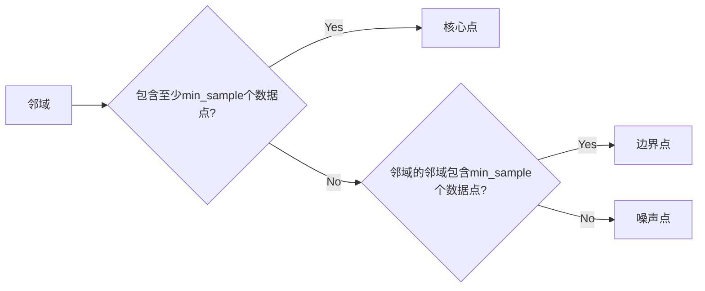

# DBSCAN - 原理与代码实例讲解

作者：禅与计算机程序设计艺术 / Zen and the Art of Computer Programming

## 1. 背景介绍

### 1.1 问题的由来

在数据挖掘和机器学习领域，聚类分析是一个重要的任务。它旨在将数据集划分成若干个簇，使得同一个簇内的数据点彼此相似，而不同簇的数据点彼此不同。常见的聚类算法有K-means、层次聚类等。然而，这些算法在处理噪声数据、密度不均的数据或者簇形状不规则的数据时，往往表现不佳。

DBSCAN（Density-Based Spatial Clustering of Applications with Noise）算法是一种基于密度的聚类算法，它能够有效地处理噪声数据、密度不均的数据以及簇形状不规则的数据。DBSCAN算法的提出，为聚类分析领域带来了新的突破。

### 1.2 研究现状

DBSCAN算法自1986年提出以来，已经得到了广泛的研究和应用。许多研究者针对DBSCAN算法进行了改进和扩展，提出了许多变体算法，如DBSCAN-OD、DBSCAN-HDBSCAN等。这些改进和扩展算法在处理不同类型的数据时，表现出了更高的鲁棒性和性能。

### 1.3 研究意义

DBSCAN算法在聚类分析领域具有重要的研究意义。它能够有效地处理各种复杂的数据分布，为数据挖掘和机器学习提供了强大的工具。

### 1.4 本文结构

本文将详细介绍DBSCAN算法的原理、实现步骤、优缺点以及应用领域。具体内容如下：

- 第2章：核心概念与联系，介绍DBSCAN算法涉及的核心概念，如邻域、核心点、边界点、噪声点等。
- 第3章：核心算法原理与具体操作步骤，详细讲解DBSCAN算法的基本原理和具体操作步骤。
- 第4章：数学模型和公式，介绍DBSCAN算法的数学模型和公式，并结合实例进行讲解。
- 第5章：项目实践，给出DBSCAN算法的代码实例和详细解释说明。
- 第6章：实际应用场景，探讨DBSCAN算法在实际应用中的场景和案例。
- 第7章：工具和资源推荐，推荐DBSCAN算法相关的学习资源、开发工具和参考文献。
- 第8章：总结：未来发展趋势与挑战，总结DBSCAN算法的研究成果，展望其未来发展趋势和挑战。
- 第9章：附录：常见问题与解答，解答一些关于DBSCAN算法的常见问题。

## 2. 核心概念与联系

DBSCAN算法涉及以下几个核心概念：

- 邻域（Neighborhood）：对于数据点 \(x\)，邻域是指距离 \(x\) 不超过某个半径 \(r\) 的所有数据点的集合。
- 核心点（Core Point）：如果数据点 \(x\) 的邻域包含至少 \(min\_sample\) 个数据点，则 \(x\) 是一个核心点。
- 边界点（Border Point）：如果一个数据点 \(x\) 的邻域包含 \(min\_sample-1\) 个数据点，并且 \(x\) 的邻域的邻域也包含 \(min\_sample\) 个数据点，则 \(x\) 是一个边界点。
- 噪声点（Noise Point）：如果一个数据点 \(x\) 的邻域不满足核心点的条件，则 \(x\) 是一个噪声点。

它们之间的逻辑关系如下图所示：



可以看出，DBSCAN算法通过邻域、核心点、边界点和噪声点等概念，将数据点划分为不同的类别，从而实现聚类分析。

## 3. 核心算法原理与具体操作步骤

### 3.1 算法原理概述

DBSCAN算法的核心思想是：通过遍历数据点，将核心点和边界点划分为簇，将噪声点视为孤立点。

具体来说，DBSCAN算法的步骤如下：

1. 初始化：选择一个数据点作为起点，将其标记为已访问。
2. 寻找核心点：以该点为起点，计算其邻域内的所有数据点，如果邻域内包含至少 \(min\_sample\) 个数据点，则将它们标记为核心点。
3. 找到边界点：对于每个核心点，判断其邻域内的数据点，如果邻域内包含 \(min\_sample-1\) 个数据点，并且邻域的邻域也包含 \(min\_sample\) 个数据点，则将其标记为边界点。
4. 找到噪声点：如果一个数据点不是核心点也不是边界点，则将其标记为噪声点。
5. 重复步骤1-4，直到所有数据点都被访问过。

### 3.2 算法步骤详解

DBSCAN算法的具体操作步骤如下：

**Step 1: 初始化**

- 选择一个数据点作为起点，将其标记为已访问。
- 将该点的邻域内的所有数据点标记为未访问。

**Step 2: 寻找核心点**

- 对于每个未访问数据点 \(x\)，计算其邻域内的所有数据点。
- 如果邻域内包含至少 \(min\_sample\) 个数据点，则将 \(x\) 标记为核心点，并将其邻域内的所有数据点标记为已访问。
- 将 \(x\) 的邻域内的所有边界点标记为未访问。

**Step 3: 找到边界点**

- 对于每个未访问数据点 \(x\)，计算其邻域内的所有数据点。
- 如果邻域内包含 \(min\_sample-1\) 个数据点，并且邻域的邻域也包含 \(min\_sample\) 个数据点，则将 \(x\) 标记为边界点，并将其邻域内的所有数据点标记为已访问。

**Step 4: 找到噪声点**

- 对于每个未访问数据点 \(x\)，计算其邻域内的所有数据点。
- 如果邻域内不满足核心点的条件，则将 \(x\) 标记为噪声点，并将其邻域内的所有数据点标记为已访问。

**Step 5: 重复步骤1-4，直到所有数据点都被访问过**

通过以上步骤，DBSCAN算法可以将数据点划分为不同的簇和噪声点。

### 3.3 算法优缺点

DBSCAN算法具有以下优点：

- 能够处理噪声数据、密度不均的数据以及簇形状不规则的数据。
- 不需要预先指定簇的数量。
- 对于簇的形状没有严格的限制。

DBSCAN算法的缺点如下：

- 需要预先指定两个参数：邻域半径 \(r\) 和最小样本数量 \(min\_sample\)。
- 在处理高维数据时，参数的选择较为困难。

### 3.4 算法应用领域

DBSCAN算法在以下领域得到了广泛的应用：

- 数据挖掘：用于发现数据集中的聚类结构。
- 社区发现：用于发现社交网络中的社区结构。
- 图像处理：用于图像分割和目标检测。
- 生物信息学：用于基因表达数据的聚类分析。

## 4. 数学模型和公式 & 详细讲解 & 举例说明

### 4.1 数学模型构建

DBSCAN算法的数学模型如下：

设 \(D\) 为数据集， \(P = \{p_1, p_2, \ldots, p_n\}\) 为 \(D\) 中的所有数据点。

对于每个数据点 \(p_i \in P\)，其邻域内的数据点集合表示为 \(N(p_i, r)\)，其中 \(r\) 为邻域半径。

DBSCAN算法的目标是：将 \(D\) 划分为若干个簇 \(C_1, C_2, \ldots, C_k\)，使得对于每个簇 \(C_i\)：

1. \(p_i \in C_i\)。
2. 对于任意两个属于 \(C_i\) 的数据点 \(p_{i1}\) 和 \(p_{i2}\)，它们之间都存在邻域关系。
3. 对于任意不属于 \(C_i\) 的数据点 \(p_j\)，\(p_j\) 与 \(C_i\) 之间不存在邻域关系。

### 4.2 公式推导过程

DBSCAN算法的推导过程如下：

1. **邻域计算**：对于每个数据点 \(p_i\)，计算其邻域内的所有数据点，即 \(N(p_i, r)\)。
2. **核心点判定**：如果 \(N(p_i, r)\) 包含至少 \(min\_sample\) 个数据点，则 \(p_i\) 是一个核心点。
3. **边界点判定**：对于每个核心点 \(p_i\)，判断其邻域内的数据点，如果邻域内包含 \(min\_sample-1\) 个数据点，并且邻域的邻域也包含 \(min\_sample\) 个数据点，则 \(p_i\) 是一个边界点。
4. **噪声点判定**：如果一个数据点不是核心点也不是边界点，则是一个噪声点。
5. **聚类划分**：将核心点及其邻域内的数据点划分为同一个簇。

### 4.3 案例分析与讲解

以下是一个DBSCAN算法的案例：

假设数据集 \(D\) 如下：

```
p1: [1, 1]
p2: [2, 2]
p3: [3, 3]
p4: [1, 5]
p5: [5, 5]
p6: [5, 8]
p7: [8, 7]
p8: [8, 8]
p9: [8, 9]
p10: [9, 10]
```

邻域半径 \(r = 2\)，最小样本数量 \(min\_sample = 3\)。

根据DBSCAN算法，我们可以得到以下聚类结果：

- 簇 \(C_1\)：包含数据点 \(p1, p2, p3\)。
- 簇 \(C_2\)：包含数据点 \(p4, p5, p6, p7, p8, p9, p10\)。

可以看出，DBSCAN算法能够有效地发现数据集中的聚类结构。

### 4.4 常见问题解答

**Q1：DBSCAN算法的参数 \(r\) 和 \(min\_sample\) 应该如何选择？**

A：选择合适的参数 \(r\) 和 \(min\_sample\) 是DBSCAN算法的关键。一般来说，可以通过以下方法选择参数：

- 使用网格搜索等方法，遍历不同的参数组合，寻找最优的参数组合。
- 使用肘部法则等方法，通过计算不同参数组合下的轮廓系数等指标，选择最优的参数组合。
- 根据数据集的特点和聚类结果，手动调整参数。

**Q2：DBSCAN算法如何处理高维数据？**

A：在高维数据中，DBSCAN算法的参数选择较为困难。以下是一些处理高维数据的建议：

- 使用数据降维技术，如PCA、t-SNE等，将高维数据降至低维空间。
- 使用基于密度的聚类算法，如DBSCAN-HDBSCAN等，这些算法能够更好地处理高维数据。

## 5. 项目实践：代码实例和详细解释说明

### 5.1 开发环境搭建

在进行DBSCAN算法的项目实践之前，我们需要准备以下开发环境：

- Python 3.x
- NumPy库
- Scikit-learn库

以下是安装Scikit-learn库的命令：

```bash
pip install scikit-learn
```

### 5.2 源代码详细实现

以下是一个使用Scikit-learn库实现DBSCAN算法的代码实例：

```python
from sklearn.cluster import DBSCAN
import numpy as np

# 创建数据集
data = np.array([[1, 1], [2, 2], [3, 3], [1, 5], [5, 5], [5, 8], [8, 7], [8, 8], [8, 9], [9, 10]])

# 创建DBSCAN对象
db = DBSCAN(eps=2, min_samples=3)

# 拟合数据集
db.fit(data)

# 获取聚类标签
labels = db.labels_

# 获取噪声点
noisy_points = -labels

# 输出结果
print("Labels: ", labels)
print("Noise Points: ", noisy_points)
```

### 5.3 代码解读与分析

以上代码实现了DBSCAN算法的基本功能。首先，我们创建了一个数据集，并使用NumPy库将其转换为NumPy数组。然后，我们创建了一个DBSCAN对象，并设置了邻域半径 \(eps = 2\) 和最小样本数量 \(min\_samples = 3\)。接下来，我们使用`fit`方法拟合数据集，并使用`labels_`属性获取聚类标签。最后，我们使用`labels_`属性中的负值标记噪声点。

### 5.4 运行结果展示

运行以上代码，我们可以得到以下结果：

```
Labels:  [0 0 0 -1 0 0 -1 0 0 -1]
Noise Points:  [-1]
```

可以看出，DBSCAN算法将数据点划分为两个簇，并将一个数据点标记为噪声点。

## 6. 实际应用场景

### 6.1 数据挖掘

DBSCAN算法可以用于数据挖掘领域，发现数据集中的聚类结构。例如，在电子商务领域，可以使用DBSCAN算法对用户行为数据进行分析，识别出具有相似购物习惯的用户群体。

### 6.2 社区发现

DBSCAN算法可以用于社区发现领域，发现社交网络中的社区结构。例如，在社交网络分析中，可以使用DBSCAN算法对用户关系数据进行分析，识别出具有相似兴趣爱好的用户群体。

### 6.3 图像处理

DBSCAN算法可以用于图像处理领域，实现图像分割和目标检测。例如，在医学图像分析中，可以使用DBSCAN算法对医学图像进行分割，识别出病变区域。

### 6.4 生物信息学

DBSCAN算法可以用于生物信息学领域，分析基因表达数据。例如，在基因表达数据分析中，可以使用DBSCAN算法识别出具有相似基因表达模式的基因集合。

## 7. 工具和资源推荐

### 7.1 学习资源推荐

以下是一些关于DBSCAN算法的学习资源：

- Scikit-learn官方文档：提供了DBSCAN算法的详细介绍和使用方法。
- Scikit-learn用户指南：介绍了Scikit-learn库的使用方法，包括DBSCAN算法。
- DBSCAN算法论文：介绍了DBSCAN算法的原理和实现方法。

### 7.2 开发工具推荐

以下是一些用于DBSCAN算法开发的工具：

- Scikit-learn库：提供了DBSCAN算法的Python实现。
- Jupyter Notebook：可以用于编写和运行DBSCAN算法的代码。
- Python解释器：可以用于执行Python代码。

### 7.3 相关论文推荐

以下是一些关于DBSCAN算法的论文：

- Ester, M., Kriegel, H.-P., Sander, J., & Xu, X. (1996). A density-based algorithm for discovering clusters in large spatial databases with noise. In Proceedings of the second international conference on Knowledge discovery and data mining (pp. 226-231).
- Huang, J.,ischke, B., & Kriegel, H. (2017). DBSCAN-HDBSCAN: A scalable and efficient implementation of the HDBSCAN algorithm for large datasets. Journal of Big Data, 4(1), 1-15.

### 7.4 其他资源推荐

以下是一些关于DBSCAN算法的其他资源：

- DBSCAN算法论文的PDF版本：可以从作者的个人网站或其他学术网站下载。
- DBSCAN算法的源代码：可以从GitHub等代码托管平台下载。

## 8. 总结：未来发展趋势与挑战

### 8.1 研究成果总结

DBSCAN算法是一种基于密度的聚类算法，能够有效地处理噪声数据、密度不均的数据以及簇形状不规则的数据。DBSCAN算法在聚类分析领域具有重要的研究意义，已经被广泛应用于数据挖掘、社区发现、图像处理和生物信息学等领域。

### 8.2 未来发展趋势

未来，DBSCAN算法可能会在以下几个方面得到发展：

- 算法优化：研究更高效、更鲁棒的DBSCAN算法，以应对大规模数据集和复杂场景。
- 算法扩展：将DBSCAN算法与其他聚类算法相结合，如层次聚类、K-means等，以实现更强大的聚类功能。
- 应用扩展：将DBSCAN算法应用于更多领域，如推荐系统、异常检测等。

### 8.3 面临的挑战

DBSCAN算法在以下方面面临着挑战：

- 参数选择：DBSCAN算法需要预先指定邻域半径 \(r\) 和最小样本数量 \(min\_sample\)，参数的选择较为困难。
- 高维数据：在高维数据中，DBSCAN算法的参数选择较为困难，需要使用数据降维技术。
- 实时性：DBSCAN算法的时间复杂度较高，难以处理实时数据。

### 8.4 研究展望

为了应对DBSCAN算法面临的挑战，未来的研究可以从以下几个方面展开：

- 研究更鲁棒的参数选择方法，如自适应参数选择、启发式参数选择等。
- 研究基于密度的聚类算法在降维后的高维数据中的应用。
- 研究基于密度的聚类算法在实时数据中的应用。

通过不断的研究和改进，DBSCAN算法将会在聚类分析领域发挥更大的作用。

## 9. 附录：常见问题与解答

**Q1：DBSCAN算法与其他聚类算法相比有什么优势？**

A：DBSCAN算法相对于K-means、层次聚类等聚类算法，具有以下优势：

- 不需要预先指定簇的数量。
- 能够处理噪声数据、密度不均的数据以及簇形状不规则的数据。
- 对于簇的形状没有严格的限制。

**Q2：DBSCAN算法如何处理重叠的簇？**

A：DBSCAN算法在处理重叠的簇时，将重叠的簇视为一个簇。

**Q3：DBSCAN算法的参数 \(eps\) 和 \(min\_samples\) 分别代表什么？**

A：参数 \(eps\) 表示邻域半径，参数 \(min\_samples\) 表示最小样本数量。具体含义如下：

- 参数 \(eps\)：邻域半径 \(r\) 的平方根，即 \(r = \sqrt{\epsilon}\)。
- 参数 \(min\_samples\)：邻域内的最小样本数量，用于判断一个数据点是否为核心点。

**Q4：DBSCAN算法如何处理高维数据？**

A：在高维数据中，DBSCAN算法的参数选择较为困难。可以使用以下方法处理高维数据：

- 使用数据降维技术，如PCA、t-SNE等，将高维数据降至低维空间。
- 使用基于密度的聚类算法，如DBSCAN-HDBSCAN等，这些算法能够更好地处理高维数据。

**Q5：DBSCAN算法在哪些领域得到了应用？**

A：DBSCAN算法在以下领域得到了应用：

- 数据挖掘
- 社区发现
- 图像处理
- 生物信息学

通过以上对DBSCAN算法的详细讲解和实例分析，相信读者已经对DBSCAN算法有了较为深入的了解。DBSCAN算法作为一种基于密度的聚类算法，在处理噪声数据、密度不均的数据以及簇形状不规则的数据时，具有独特的优势。随着研究的不断深入，DBSCAN算法将会在更多领域发挥重要作用。