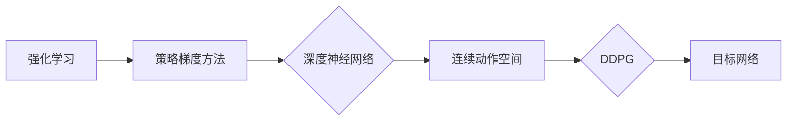
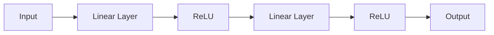

# DDPG的代码实现与源码分析

作者：禅与计算机程序设计艺术 / Zen and the Art of Computer Programming

## 1. 背景介绍
### 1.1 问题的由来

深度确定性策略梯度（Deep Deterministic Policy Gradient，DDPG）是一种基于深度学习的强化学习算法，它结合了深度神经网络和策略梯度方法，能够在高维连续动作空间中学习到稳健的决策策略。DDPG算法自2016年提出以来，在机器人控制、自动驾驶、游戏AI等领域取得了显著的应用成果。

### 1.2 研究现状

目前，DDPG及其变体已经被广泛应用于各种强化学习任务中。研究者们从不同角度对DDPG算法进行了改进，包括改进网络结构、优化学习策略、引入探索策略等，以提高算法的稳定性和性能。

### 1.3 研究意义

DDPG算法的提出，为解决高维连续动作空间的强化学习问题提供了新的思路。通过对DDPG算法的深入研究，我们可以更好地理解深度学习在强化学习中的应用，并推动强化学习算法在实际应用中的发展。

### 1.4 本文结构

本文将围绕DDPG算法展开，首先介绍DDPG的基本原理，然后分析其代码实现，并结合实际案例进行讲解，最后探讨DDPG的未来发展趋势和挑战。

## 2. 核心概念与联系

DDPG算法涉及以下核心概念：

- 强化学习（Reinforcement Learning，RL）：一种通过与环境交互来学习决策策略的方法，旨在最大化累积奖励。

- 策略梯度方法（Policy Gradient）：一种基于策略的方法，直接学习一个策略函数来指导智能体在环境中进行决策。

- 深度神经网络（Deep Neural Network，DNN）：一种具有多层结构的神经网络，能够学习复杂的数据特征。

- 连续动作空间（Continuous Action Space）：动作空间为连续值，如机器人关节角度、自动驾驶中的速度等。

- 目标网络（Target Network）：一种在DDPG中用于稳定训练过程的辅助网络。

DDPG算法的逻辑关系可以表示为：



## 3. 核心算法原理 & 具体操作步骤
### 3.1 算法原理概述

DDPG算法的核心思想是利用深度神经网络学习一个策略函数 $\pi(\boldsymbol{\theta})$，其中 $\boldsymbol{\theta}$ 是策略网络的参数。策略函数的输出为连续动作，表示智能体在某个状态下应该执行的动作。

DDPG算法的流程如下：

1. 初始化策略网络 $\pi(\boldsymbol{\theta})$ 和目标网络 $\pi_{\text{target}}(\boldsymbol{\theta}_{\text{target}})$，其中 $\boldsymbol{\theta} \
eq \boldsymbol{\theta}_{\text{target}}$。
2. 初始化智能体的动作空间范围 $\mathcal{A}$ 和奖励函数 $R(\boldsymbol{s}, \boldsymbol{a})$。
3. 对于每个仿真步骤：
    - 随机选择一个起始状态 $\boldsymbol{s} \in \mathcal{S}$。
    - 根据 $\pi(\boldsymbol{\theta})$，从动作空间 $\mathcal{A}$ 中采样一个动作 $\boldsymbol{a}$。
    - 将 $(\boldsymbol{s}, \boldsymbol{a})$ 输入环境，得到下一个状态 $\boldsymbol{s}'$ 和奖励 $R(\boldsymbol{s}, \boldsymbol{a})$。
    - 将 $(\boldsymbol{s}', \boldsymbol{a}, R(\boldsymbol{s}, \boldsymbol{a}))$ 存储在经验回放（Experience Replay）缓冲区中。
    - 从经验回放缓冲区中采样一个批量样本，并计算目标值 $V^{\text{target}}(\boldsymbol{s}', \boldsymbol{a}')$，其中 $\boldsymbol{a}' = \pi_{\text{target}}(\boldsymbol{s}')$。
    - 更新策略网络参数 $\boldsymbol{\theta}$ 和目标网络参数 $\boldsymbol{\theta}_{\text{target}}$。

### 3.2 算法步骤详解

**步骤1：初始化网络**

初始化策略网络 $\pi(\boldsymbol{\theta})$ 和目标网络 $\pi_{\text{target}}(\boldsymbol{\theta}_{\text{target}})$，通常使用相同的网络结构。以下是一个简单的DNN结构示例：



**步骤2：选择动作**

根据策略网络 $\pi(\boldsymbol{\theta})$，从动作空间 $\mathcal{A}$ 中采样一个动作 $\boldsymbol{a}$。以下是一个简单的均匀采样示例：

```python
import numpy as np

def sample_action(action_space, noise_scale=0.2):
    return np.random.uniform(-action_space, action_space, size=action_space.shape) + noise_scale * np.random.randn(*action_space.shape)
```

**步骤3：与环境交互**

将 $(\boldsymbol{s}, \boldsymbol{a})$ 输入环境，得到下一个状态 $\boldsymbol{s}'$ 和奖励 $R(\boldsymbol{s}, \boldsymbol{a})$。

**步骤4：存储样本**

将 $(\boldsymbol{s}', \boldsymbol{a}, R(\boldsymbol{s}, \boldsymbol{a}))$ 存储在经验回放缓冲区中。

**步骤5：更新目标网络**

从经验回放缓冲区中采样一个批量样本，并计算目标值 $V^{\text{target}}(\boldsymbol{s}', \boldsymbol{a}')$。

**步骤6：更新策略网络**

更新策略网络参数 $\boldsymbol{\theta}$ 和目标网络参数 $\boldsymbol{\theta}_{\text{target}}$。

### 3.3 算法优缺点

**优点**：

- 能够处理连续动作空间。
- 不需要对环境的动态模型进行假设。
- 稳定性较好，易于实现。

**缺点**：

- 训练过程可能较慢。
- 对参数选择敏感。
- 难以解释决策过程。

### 3.4 算法应用领域

DDPG算法在以下领域得到了广泛的应用：

- 机器人控制：如机器人手臂控制、无人驾驶等。
- 自动驾驶：如自动驾驶汽车、无人机等。
- 游戏AI：如Atari游戏、棋类游戏等。
- 机器人足球：如RoboCup足球比赛等。

## 4. 数学模型和公式 & 详细讲解 & 举例说明
### 4.1 数学模型构建

DDPG算法的数学模型主要包括以下部分：

- 策略网络：$\pi(\boldsymbol{\theta}) = \boldsymbol{f}(\boldsymbol{s}) \odot \boldsymbol{g}(\boldsymbol{s})$，其中 $\boldsymbol{f}(\boldsymbol{s})$ 和 $\boldsymbol{g}(\boldsymbol{s})$ 分别为两个神经网络，$\odot$ 表示元素乘积。
- 目标网络：$\pi_{\text{target}}(\boldsymbol{\theta}_{\text{target}}) = \boldsymbol{f}(\boldsymbol{s}) \odot \boldsymbol{g}(\boldsymbol{s})$。
- 奖励函数：$R(\boldsymbol{s}, \boldsymbol{a})$。
- 目标值：$V^{\text{target}}(\boldsymbol{s}', \boldsymbol{a}') = R(\boldsymbol{s}, \boldsymbol{a}) + \gamma V_{\text{target}}(\boldsymbol{s}')$，其中 $\gamma$ 为折扣因子。

以下是一个简单的DNN结构示例：


### 4.2 公式推导过程

**策略网络**：

策略网络的输出为连续动作，可以表示为：

$$
\boldsymbol{a} = \pi(\boldsymbol{\theta})(\boldsymbol{s}) = \boldsymbol{f}(\boldsymbol{s}) \odot \boldsymbol{g}(\boldsymbol{s})
$$

其中，$\boldsymbol{f}(\boldsymbol{s})$ 和 $\boldsymbol{g}(\boldsymbol{s})$ 分别为两个神经网络，$\odot$ 表示元素乘积。

**目标网络**：

目标网络的输出为目标值，可以表示为：

$$
\boldsymbol{v} = \pi_{\text{target}}(\boldsymbol{\theta}_{\text{target}})(\boldsymbol{s}) = \boldsymbol{f}(\boldsymbol{s}) \odot \boldsymbol{g}(\boldsymbol{s})
$$

其中，$\boldsymbol{f}(\boldsymbol{s})$ 和 $\boldsymbol{g}(\boldsymbol{s})$ 分别为两个神经网络，$\odot$ 表示元素乘积。

**奖励函数**：

奖励函数用于衡量智能体在环境中的表现，可以表示为：

$$
R(\boldsymbol{s}, \boldsymbol{a}) = \text{...}
$$

具体奖励函数的设置取决于具体应用场景。

**目标值**：

目标值用于评估策略网络的性能，可以表示为：

$$
V^{\text{target}}(\boldsymbol{s}', \boldsymbol{a}') = R(\boldsymbol{s}, \boldsymbol{a}) + \gamma V_{\text{target}}(\boldsymbol{s}')
$$

其中，$\gamma$ 为折扣因子，表示对未来奖励的折扣。

### 4.3 案例分析与讲解

以下是一个简单的Atari游戏控制案例：

**环境**：Pong游戏

**策略网络**：

使用一个简单的DNN结构，输入为游戏画面，输出为控制左右移动杆的动作。

**目标网络**：

使用与策略网络相同的网络结构，但参数与策略网络有所不同。

**奖励函数**：

奖励函数根据游戏得分进行设置。

**目标值**：

目标值根据游戏得分和游戏持续时间进行设置。

通过DDPG算法，我们可以训练出一个能够控制Pong游戏的智能体。

### 4.4 常见问题解答

**Q1：为什么使用目标网络？**

A：目标网络可以稳定训练过程，避免策略网络在训练过程中出现发散现象。

**Q2：如何选择网络结构？**

A：网络结构的选取取决于具体应用场景和任务需求。

**Q3：如何选择参数？**

A：参数的选择需要根据具体任务进行调整，可以参考相关文献或实验结果。

## 5. 项目实践：代码实例和详细解释说明
### 5.1 开发环境搭建

在进行DDPG算法的代码实现之前，需要搭建以下开发环境：

- Python 3.x
- PyTorch 1.5.0 或更高版本
- Gym：用于构建强化学习环境

### 5.2 源代码详细实现

以下是一个简单的DDPG算法代码实现示例：

```python
import torch
import torch.nn as nn
import torch.optim as optim
import gym

class DDPGAgent:
    def __init__(self, state_dim, action_dim, actor, critic, action_space):
        self.actor = actor
        self.actor_target = actor.copy()
        self.actor_optimizer = optim.Adam(actor.parameters(), lr=0.001)
        self.critic = critic
        self.critic_target = critic.copy()
        self.critic_optimizer = optim.Adam(critic.parameters(), lr=0.001)
        self.action_space = action_space

    def select_action(self, state, noise_scale=0.2):
        action = self.actor(state)
        noise = torch.randn_like(action) * noise_scale
        action += noise
        action = torch.clamp(action, -self.action_space, self.action_space)
        return action

    def update(self, batch):
        states, actions, rewards, next_states, dones = batch

        next_actions = self.actor_target(next_states)
        Q_targets = self.critic_target(next_states, next_actions)

        Q_targets.next_state_values = Q_targets.next_state_values * (1 - dones)
        Q_targets = Q_targets + rewards

        Q_expected = self.critic(states, actions)

        critic_loss = nn.MSELoss()(Q_expected, Q_targets)
        self.critic_optimizer.zero_grad()
        critic_loss.backward()
        self.critic_optimizer.step()

        actor_loss = -self.critic(states, self.actor(states)).mean()
        self.actor_optimizer.zero_grad()
        actor_loss.backward()
        self.actor_optimizer.step()

        self.actor_target.load_state_dict(self.actor.state_dict())
        self.critic_target.load_state_dict(self.critic.state_dict())

def main():
    env = gym.make('Pong-v0')
    state_dim = env.observation_space.shape[0]
    action_dim = env.action_space.shape[0]
    action_space = env.action_space界限
    actor = ActorNetwork(state_dim, action_dim)
    critic = CriticNetwork(state_dim, action_dim)
    agent = DDPGAgent(state_dim, action_dim, actor, critic, action_space)

    for episode in range(1000):
        state = env.reset()
        done = False
        while not done:
            action = agent.select_action(state)
            next_state, reward, done, _ = env.step(action)
            agent.update([state, action, reward, next_state, done])
            state = next_state

if __name__ == '__main__':
    main()
```

### 5.3 代码解读与分析

以上代码实现了DDPG算法的核心功能：

- `DDPGAgent` 类定义了DDPG智能体的结构，包括策略网络、目标网络、优化器等。
- `select_action` 方法用于根据策略网络选择动作。
- `update` 方法用于更新策略网络和目标网络。
- `main` 函数用于初始化环境和智能体，并进行训练。

### 5.4 运行结果展示

运行以上代码，可以在Pong游戏中训练出一个能够控制游戏杆的智能体。

## 6. 实际应用场景
### 6.1 机器人控制

DDPG算法在机器人控制领域有着广泛的应用，如机器人手臂控制、无人机控制等。通过DDPG算法，可以实现对机器人关节角度、速度等连续动作的精确控制。

### 6.2 自动驾驶

自动驾驶是DDPG算法的重要应用领域。通过DDPG算法，可以学习到自动驾驶车辆的行驶策略，实现自动驾驶车辆的自主行驶。

### 6.3 游戏AI

DDPG算法在游戏AI领域有着广泛的应用，如Atari游戏、棋类游戏等。通过DDPG算法，可以训练出能够战胜人类玩家的智能体。

### 6.4 未来应用展望

随着深度学习和强化学习技术的不断发展，DDPG算法将在更多领域得到应用，如：

- 机器人操作：如工业机器人、服务机器人等。
- 虚拟现实：如虚拟现实游戏、虚拟现实训练等。
- 金融服务：如智能投资、风险管理等。

## 7. 工具和资源推荐
### 7.1 学习资源推荐

以下是一些学习DDPG算法的推荐资源：

- 《Reinforcement Learning: An Introduction》
- 《Deep Reinforcement Learning》
- 《Deep Reinforcement Learning Hands-On》

### 7.2 开发工具推荐

以下是一些开发DDPG算法的推荐工具：

- PyTorch：用于实现深度学习模型
- Gym：用于构建强化学习环境
- OpenAI Baselines：提供预训练的强化学习算法和评估环境

### 7.3 相关论文推荐

以下是一些关于DDPG算法的推荐论文：

- Deep Deterministic Policy Gradient
- Soft Actor-Critic: Off-Policy Maximum Entropy Deep Reinforcement Learning via Entropy-Bounded Optimism
- Deep Deterministic Policy Gradient for Continuous Control

### 7.4 其他资源推荐

以下是一些其他学习DDPG算法的资源：

- arXiv.org：论文预印本网站
- GitHub：开源代码和项目
- 机器之心：AI领域的中文社区

## 8. 总结：未来发展趋势与挑战
### 8.1 研究成果总结

本文对DDPG算法进行了详细的介绍，包括算法原理、代码实现、实际应用场景等。通过本文的学习，读者可以了解DDPG算法的基本原理，并具备实现和应用DDPG算法的能力。

### 8.2 未来发展趋势

未来，DDPG算法将在以下方面取得进一步发展：

- 算法改进：改进网络结构、优化学习策略、引入探索策略等，以提高算法的稳定性和性能。
- 应用拓展：在更多领域得到应用，如机器人控制、自动驾驶、游戏AI等。
- 理论研究：深入研究强化学习理论和算法，推动DDPG算法的理论发展。

### 8.3 面临的挑战

DDPG算法在以下方面仍面临挑战：

- 算法稳定性：如何提高算法的稳定性，避免训练过程中的发散现象。
- 计算复杂度：如何降低算法的计算复杂度，提高算法的效率。
- 可解释性：如何提高算法的可解释性，理解算法的决策过程。

### 8.4 研究展望

未来，DDPG算法的研究方向包括：

- 算法改进：改进网络结构、优化学习策略、引入探索策略等，以提高算法的稳定性和性能。
- 应用拓展：在更多领域得到应用，如机器人控制、自动驾驶、游戏AI等。
- 理论研究：深入研究强化学习理论和算法，推动DDPG算法的理论发展。

通过不断改进和完善，DDPG算法将在未来的人工智能领域发挥更加重要的作用。

## 9. 附录：常见问题与解答

**Q1：DDPG算法与Q-Learning有何区别？**

A：Q-Learning是一种基于值函数的强化学习算法，而DDPG算法是一种基于策略的算法。Q-Learning需要维护一个值函数，而DDPG算法直接学习一个策略函数。

**Q2：DDPG算法如何解决高维连续动作空间问题？**

A：DDPG算法使用深度神经网络来学习策略函数，从而能够处理高维连续动作空间。

**Q3：DDPG算法如何解决探索和利用的矛盾？**

A：DDPG算法使用噪声方法来平衡探索和利用的矛盾。

**Q4：DDPG算法如何实现目标网络的更新？**

A：DDPG算法通过软更新策略来实现目标网络的更新，即逐渐将目标网络参数更新为策略网络参数。

**Q5：DDPG算法如何选择网络结构？**

A：网络结构的选取取决于具体应用场景和任务需求。

**Q6：DDPG算法如何选择参数？**

A：参数的选择需要根据具体任务进行调整，可以参考相关文献或实验结果。

**Q7：DDPG算法如何解决过拟合问题？**

A：DDPG算法可以通过以下方法来解决过拟合问题：数据增强、正则化、Dropout等。

**Q8：DDPG算法在哪些领域得到了应用？**

A：DDPG算法在机器人控制、自动驾驶、游戏AI等领域得到了广泛的应用。

**Q9：DDPG算法有哪些优点和缺点？**

A：DDPG算法的优点包括：能够处理连续动作空间、不依赖于环境的动态模型、稳定性较好。缺点包括：训练过程可能较慢、对参数选择敏感、难以解释决策过程。

**Q10：DDPG算法的未来发展趋势是什么？**

A：DDPG算法的未来发展趋势包括：算法改进、应用拓展、理论研究等。

通过本文的学习，读者可以更好地了解DDPG算法，并将其应用于实际任务中。