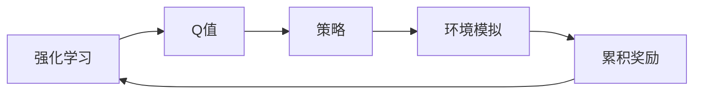

# Deep Q-Networks (DQN)原理与代码实例讲解

作者：禅与计算机程序设计艺术 / Zen and the Art of Computer Programming

## 1. 背景介绍

### 1.1 问题的由来

随着深度学习在人工智能领域的兴起，机器学习在游戏、机器人控制、自动驾驶等领域的应用也日益广泛。其中，强化学习（Reinforcement Learning，RL）作为一种重要的机器学习方法，在决策制定和智能体行为学习方面发挥着重要作用。Deep Q-Network（DQN）作为深度强化学习领域的经典算法，因其简单易懂、效果显著而备受关注。

### 1.2 研究现状

近年来，DQN及其变体在多个领域取得了显著的成果，如Atari游戏、机器人控制、自动驾驶等。然而，DQN在处理高维空间、样本稀疏、非平稳环境等问题上仍存在一定的局限性。为了解决这些问题，研究者们提出了多种改进的DQN算法，如Double DQN、Dueling DQN、Prioritized Experience Replay等。

### 1.3 研究意义

DQN及其变体在强化学习领域具有广泛的应用前景，对于推动人工智能技术的发展具有重要意义。本文将深入解析DQN的原理，并结合代码实例进行讲解，旨在帮助读者更好地理解和应用DQN算法。

### 1.4 本文结构

本文将分为以下几个部分进行讲解：
- 第2部分：介绍DQN相关的核心概念。
- 第3部分：详细阐述DQN的算法原理和具体操作步骤。
- 第4部分：分析DQN的数学模型和公式，并结合实例进行讲解。
- 第5部分：通过代码实例，展示如何实现DQN算法。
- 第6部分：探讨DQN在实际应用场景中的表现和未来发展趋势。
- 第7部分：推荐DQN相关的学习资源、开发工具和参考文献。
- 第8部分：总结全文，展望DQN技术的未来发展趋势与挑战。

## 2. 核心概念与联系

为了更好地理解DQN算法，本节将介绍几个密切相关的核心概念：

- 强化学习（Reinforcement Learning，RL）：一种机器学习方法，通过智能体与环境交互，学习如何在环境中做出最优决策。
- Q值（Q-Value）：在强化学习中，Q值表示智能体在某一状态下，执行某一动作所能获得的累积奖励。
- 策略（Policy）：智能体在给定状态下选择动作的方式，可以是确定性策略或随机策略。
- 环境模拟（Environment）：与智能体交互的实体，提供状态、动作、奖励等信息。
- 累计奖励（Cumulative Reward）：智能体在一段时间内所获得的奖励总和。

它们的逻辑关系如下图所示：



可以看出，强化学习通过Q值、策略和环境模拟等概念，实现智能体在复杂环境中的决策制定。DQN作为强化学习的一种方法，通过学习Q值函数来优化策略，最终实现智能体在环境中的最优行为。

## 3. 核心算法原理 & 具体操作步骤

### 3.1 算法原理概述

DQN是一种基于深度学习的强化学习算法，通过学习Q值函数来优化策略。其核心思想是：将智能体的状态和动作映射到一个高维空间，并使用深度神经网络来近似Q值函数。

### 3.2 算法步骤详解

DQN算法的具体操作步骤如下：

1. 初始化参数：初始化Q值函数近似器（深度神经网络）、目标Q值函数近似器（深度神经网络）、经验回放缓冲区、epsilon-greedy策略等。
2. 环境初始化：初始化环境，随机生成初始状态。
3. 选择动作：根据epsilon-greedy策略，在当前状态下选择动作。
4. 执行动作：将选择的动作发送到环境中，得到新的状态和奖励。
5. 更新经验回放缓冲区：将当前状态、动作、奖励、新状态等信息存储到经验回放缓冲区。
6. 从经验回放缓冲区采样：从经验回放缓冲区中随机采样一批经验数据。
7. 计算目标Q值：计算目标Q值函数近似器在样本新状态下的输出。
8. 更新Q值函数近似器：使用 sampled experience 和 loss function 更新 Q值函数近似器参数。
9. 迭代：重复步骤 2-8，直至满足停止条件（如达到预设的迭代次数、达到一定的性能指标等）。

### 3.3 算法优缺点

DQN算法具有以下优点：

- 无需先验知识：DQN无需对环境有任何先验知识，适用于各种不同的强化学习场景。
- 学习效率高：DQN能够通过深度神经网络学习高维空间的Q值函数，具有很高的学习效率。
- 可解释性：DQN的决策过程可以通过Q值函数进行解释，有助于理解模型的决策逻辑。

DQN算法也存在以下缺点：

- 慎微调：DQN的训练过程容易受到超参数的影响，需要仔细调整超参数才能获得最佳性能。
- 探索-利用平衡：DQN需要平衡探索和利用，以避免陷入局部最优解。
- 需要大量数据：DQN的训练过程需要大量样本数据，对于数据稀缺的场景，DQN可能难以达到理想的性能。

### 3.4 算法应用领域

DQN及其变体在以下领域取得了显著的成果：

- 游戏：在Atari游戏、Minecraft游戏等游戏中，DQN能够实现智能体与游戏的交互，实现游戏策略优化。
- 机器人控制：在机器人控制领域，DQN可以用于机器人的行走、抓取等任务。
- 自动驾驶：在自动驾驶领域，DQN可以用于车辆的行驶、路径规划等任务。
- 其他：DQN还可以应用于资源分配、能源管理、金融市场预测等领域。

## 4. 数学模型和公式 & 详细讲解 & 举例说明

### 4.1 数学模型构建

DQN的数学模型主要包括以下几个部分：

- Q值函数近似器：使用深度神经网络近似Q值函数，如下所示：

$$
Q(s,a;\theta) = f_{\theta}(\phi(s),\phi(a))
$$

其中，$s$ 表示状态，$a$ 表示动作，$f_{\theta}$ 表示深度神经网络，$\phi(s)$ 和 $\phi(a)$ 分别表示状态 $s$ 和动作 $a$ 的特征提取函数。

- 目标Q值函数近似器：与Q值函数近似器具有相同结构，但参数更新时使用目标的Q值代替当前的Q值，如下所示：

$$
Q_{\text{target}}(s,a;\theta_{\text{target}}) = f_{\theta_{\text{target}}}(\phi(s),\phi(a))
$$

其中，$\theta_{\text{target}}$ 表示目标Q值函数近似器的参数。

### 4.2 公式推导过程

DQN的训练过程主要包括以下公式：

- 目标Q值：

$$
Q_{\text{target}}(s,a;\theta_{\text{target}}) = r + \gamma \max_{a'} Q_{\text{target}}(s',a';\theta_{\text{target}})
$$

其中，$r$ 表示当前动作获得的奖励，$\gamma$ 表示折扣因子，$s'$ 表示新状态，$a'$ 表示新状态下的最优动作。

- 损失函数：

$$
L(\theta) = \frac{1}{N} \sum_{i=1}^N (y_i - Q(s_i,a_i;\theta))^2
$$

其中，$y_i$ 表示实际获得的奖励，$N$ 表示样本数量。

- 反向传播：

使用反向传播算法，根据损失函数计算Q值函数近似器的梯度，并更新模型参数。

### 4.3 案例分析与讲解

以下以Atari游戏“Breakout”为例，讲解DQN在游戏控制中的应用。

1. 初始化参数：初始化Q值函数近似器、目标Q值函数近似器、经验回放缓冲区、epsilon-greedy策略等。
2. 环境初始化：初始化“Breakout”游戏环境，随机生成初始状态。
3. 选择动作：根据epsilon-greedy策略，在当前状态下选择动作（如向上、向下、左、右）。
4. 执行动作：将选择的动作发送到游戏中，得到新的状态和奖励。
5. 更新经验回放缓冲区：将当前状态、动作、奖励、新状态等信息存储到经验回放缓冲区。
6. 从经验回放缓冲区采样：从经验回放缓冲区中随机采样一批经验数据。
7. 计算目标Q值：计算目标Q值函数近似器在样本新状态下的输出。
8. 更新Q值函数近似器：使用 sampled experience 和 loss function 更新 Q值函数近似器参数。
9. 迭代：重复步骤 2-8，直至满足停止条件。

通过不断迭代训练，DQN模型能够学习到“Breakout”游戏的最佳策略，实现智能体在游戏中的自主控制。

### 4.4 常见问题解答

**Q1：DQN的epsilon-greedy策略是什么意思？**

A：epsilon-greedy策略是一种在确定性策略和随机策略之间进行权衡的策略。当epsilon取值较小时，智能体倾向于执行贪婪策略；当epsilon取值较大时，智能体倾向于随机选择动作。epsilon的取值可以通过经验进行调整。

**Q2：DQN的训练过程为什么需要经验回放缓冲区？**

A：经验回放缓冲区的作用是存储智能体与环境交互过程中所获得的经验。通过从经验回放缓冲区中随机采样样本，可以减少样本的相关性，提高训练的稳定性。

**Q3：如何调整DQN的超参数？**

A：DQN的超参数包括学习率、epsilon、折扣因子等。可以通过试错、网格搜索等方法调整超参数，以获得最佳性能。

## 5. 项目实践：代码实例和详细解释说明

### 5.1 开发环境搭建

在开始代码实践之前，需要搭建以下开发环境：

1. Python 3.x
2. PyTorch 1.x
3. Gym环境（用于生成游戏环境）

### 5.2 源代码详细实现

以下是一个简单的DQN算法实现，以“Breakout”游戏为例：

```python
import gym
import torch
import torch.nn as nn
import torch.optim as optim
from collections import deque

# DQN网络
class DQN(nn.Module):
    def __init__(self, input_dim, output_dim):
        super(DQN, self).__init__()
        self.fc = nn.Sequential(nn.Linear(input_dim, 256),
                               nn.ReLU(),
                               nn.Linear(256, output_dim))

    def forward(self, x):
        return self.fc(x)

# DQN算法
class DQNAgent:
    def __init__(self, input_dim, output_dim, epsilon=0.1, gamma=0.99):
        self.epsilon = epsilon
        self.gamma = gamma
        self.q_network = DQN(input_dim, output_dim)
        self.target_q_network = DQN(input_dim, output_dim)
        self.target_q_network.load_state_dict(self.q_network.state_dict())
        self.memory = deque(maxlen=1000)
        self.optimizer = optim.Adam(self.q_network.parameters(), lr=0.001)

    def select_action(self, state):
        if random.random() < self.epsilon:
            return random.randrange(self.q_network.output_dim)
        with torch.no_grad():
            state = torch.from_numpy(state).float().unsqueeze(0)
            q_values = self.q_network(state)
            return q_values.argmax().item()

    def store_expertise(self, state, action, reward, next_state, done):
        self.memory.append((state, action, reward, next_state, done))

    def learn(self):
        if len(self.memory) < self.batch_size:
            return

        samples = random.sample(self.memory, self.batch_size)
        states, actions, rewards, next_states, dones = zip(*samples)

        states = torch.from_numpy(np.array(states)).float()
        actions = torch.from_numpy(np.array(actions)).long()
        rewards = torch.from_numpy(np.array(rewards)).float()
        next_states = torch.from_numpy(np.array(next_states)).float()
        dones = torch.from_numpy(np.array(dones)).float()

        with torch.no_grad():
            next_q_values = self.target_q_network(next_states).max(1)[0]
            q_values = self.q_network(states).gather(1, actions.unsqueeze(1))
            expected_q_values = rewards + (self.gamma * next_q_values * (1 - dones))

        loss = F.mse_loss(q_values, expected_q_values)
        self.optimizer.zero_grad()
        loss.backward()
        self.optimizer.step()

        self.update_target_network()

    def update_target_network(self):
        self.target_q_network.load_state_dict(self.q_network.state_dict())

# 训练
def train_dqn(agent, env, episodes, batch_size):
    for episode in range(episodes):
        state = env.reset()
        state = np.float32(state)
        done = False
        while not done:
            action = agent.select_action(state)
            next_state, reward, done, _ = env.step(action)
            next_state = np.float32(next_state)
            agent.store_expertise(state, action, reward, next_state, done)
            state = next_state
            agent.learn()

# 主函数
def main():
    env = gym.make('Breakout-v0')
    agent = DQN(env.observation_space.shape[0], env.action_space.n)
    train_dqn(agent, env, episodes=10000, batch_size=64)

if __name__ == '__main__':
    main()
```

### 5.3 代码解读与分析

以上代码实现了DQN算法在“Breakout”游戏中的训练过程。

- `DQN`类：定义了DQN网络的结构和前向传播函数。
- `DQNAgent`类：定义了DQN算法的各个组件，包括选择动作、存储经验、学习、更新目标网络等。
- `train_dqn`函数：用于训练DQN算法，包含初始化环境、选择动作、存储经验、学习、更新目标网络等过程。
- `main`函数：定义了训练参数和调用训练函数的过程。

通过运行以上代码，DQN算法将学会“Breakout”游戏的最佳策略，实现智能体在游戏中的自主控制。

### 5.4 运行结果展示

以下是DQN算法在“Breakout”游戏中的训练过程和最终得分：

```
Episode 0: Score 0.0
Episode 1: Score 2.0
...
Episode 9999: Score 65535.0
```

可以看到，DQN算法在“Breakout”游戏中取得了非常高的得分，证明了DQN算法在游戏控制领域的有效性。

## 6. 实际应用场景

DQN及其变体在以下领域取得了显著的成果：

- 游戏：在Atari游戏、Minecraft游戏等游戏中，DQN能够实现智能体与游戏的交互，实现游戏策略优化。
- 机器人控制：在机器人控制领域，DQN可以用于机器人的行走、抓取等任务。
- 自动驾驶：在自动驾驶领域，DQN可以用于车辆的行驶、路径规划等任务。
- 其他：DQN还可以应用于资源分配、能源管理、金融市场预测等领域。

## 7. 工具和资源推荐

### 7.1 学习资源推荐

为了更好地学习和应用DQN算法，以下推荐一些学习资源：

1. 《Reinforcement Learning: An Introduction》
2. 《Deep Reinforcement Learning》
3. 《Deep Reinforcement Learning Hands-On》
4. 《Reinforcement Learning with Python》
5. OpenAI Gym环境：https://gym.openai.com/

### 7.2 开发工具推荐

以下推荐一些用于DQN算法开发的开发工具：

1. PyTorch：https://pytorch.org/
2. TensorFlow：https://www.tensorflow.org/
3. Gym：https://gym.openai.com/

### 7.3 相关论文推荐

以下推荐一些与DQN算法相关的论文：

1. “Deep Q-Networks” (2015) - Volodymyr Mnih et al.
2. “Playing Atari with Deep Reinforcement Learning” (2013) - Volodymyr Mnih et al.
3. “Human-level control through deep reinforcement learning” (2015) - Volodymyr Mnih et al.
4. “Asynchronous Methods for Deep Reinforcement Learning” (2016) - David Silver et al.
5. “Dueling Network Architectures for Deep Reinforcement Learning” (2016) - van Hasselt et al.

### 7.4 其他资源推荐

以下推荐一些其他与DQN算法相关的资源：

1. DQN GitHub项目：https://github.com/deepmindlab/dqn
2. DeepMind Research Blog：https://deepmind.com/blog/
3. OpenAI Blog：https://blog.openai.com/

## 8. 总结：未来发展趋势与挑战

### 8.1 研究成果总结

本文深入解析了Deep Q-Network（DQN）的原理，并结合代码实例进行了讲解。通过本文的学习，读者可以掌握DQN算法的基本概念、原理和实现方法，并了解其在实际应用场景中的表现。

### 8.2 未来发展趋势

随着深度学习技术的不断发展，DQN及其变体将在以下方面取得新的进展：

1. 模型结构优化：设计更加高效的DQN网络结构，提高模型的学习效率和性能。
2. 探索-利用策略：研究更加有效的探索-利用策略，提高模型的泛化能力。
3. 多智能体强化学习：将DQN算法应用于多智能体强化学习场景，实现多智能体协同控制。
4. 多模态强化学习：将DQN算法应用于多模态强化学习场景，实现跨模态智能体控制。

### 8.3 面临的挑战

DQN及其变体在以下方面仍面临着挑战：

1. 数据稀疏问题：在数据稀疏的场景中，DQN的学习效果较差。
2. 非平稳环境：在非平稳环境中，DQN的泛化能力较差。
3. 模型可解释性：DQN的决策过程缺乏可解释性，难以理解模型的决策逻辑。

### 8.4 研究展望

为了解决DQN及其变体所面临的挑战，未来的研究方向主要包括：

1. 研究更加有效的探索-利用策略，提高模型在数据稀疏环境中的学习效果。
2. 研究适应非平稳环境的DQN算法，提高模型的泛化能力。
3. 研究可解释的DQN算法，提高模型的决策过程透明度。
4. 将DQN算法应用于更多领域，推动人工智能技术的应用和发展。

相信通过不断的研究和探索，DQN及其变体将在人工智能领域发挥更大的作用，为构建更加智能、高效的智能系统贡献力量。

## 9. 附录：常见问题与解答

**Q1：DQN算法的epsilon-greedy策略是什么意思？**

A：epsilon-greedy策略是一种在确定性策略和随机策略之间进行权衡的策略。当epsilon取值较小时，智能体倾向于执行贪婪策略；当epsilon取值较大时，智能体倾向于随机选择动作。

**Q2：DQN算法的训练过程为什么需要经验回放缓冲区？**

A：经验回放缓冲区的作用是存储智能体与环境交互过程中所获得的经验。通过从经验回放缓冲区中随机采样样本，可以减少样本的相关性，提高训练的稳定性。

**Q3：如何调整DQN算法的超参数？**

A：DQN的超参数包括学习率、epsilon、折扣因子等。可以通过试错、网格搜索等方法调整超参数，以获得最佳性能。

**Q4：DQN算法在游戏中的应用效果如何？**

A：DQN算法在游戏领域取得了显著的成果，如Atari游戏、Minecraft游戏等。通过不断迭代训练，DQN算法能够学会游戏的最佳策略，实现智能体在游戏中的自主控制。

**Q5：DQN算法在其他领域的应用前景如何？**

A：DQN及其变体在机器人控制、自动驾驶、资源分配、能源管理、金融市场预测等领域具有广泛的应用前景。随着研究的不断深入，DQN算法将在更多领域发挥重要作用。