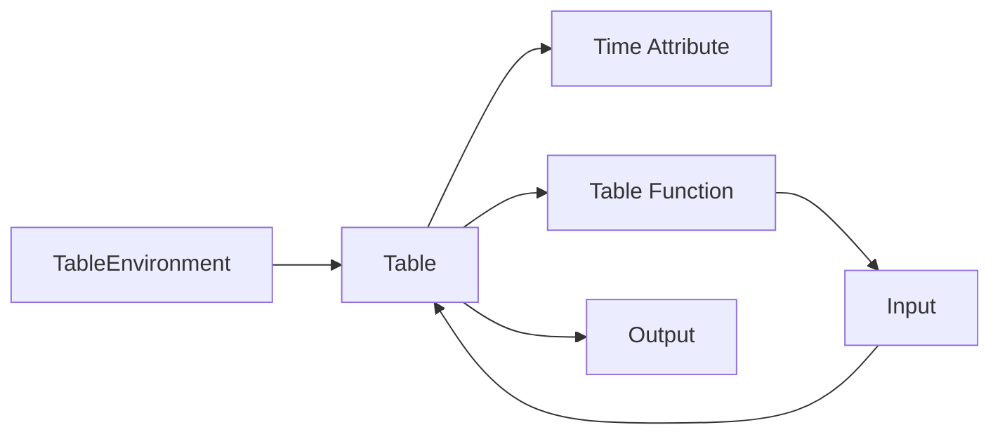
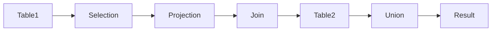

# FlinkTableAPI:集成与兼容性

作者：禅与计算机程序设计艺术 / Zen and the Art of Computer Programming

## 1. 背景介绍

### 1.1 问题的由来

随着大数据时代的到来，数据处理和分析变得越来越重要。Apache Flink作为一款流处理框架，凭借其高性能、易用性和容错性，在实时数据处理领域得到了广泛应用。FlinkTableAPI是Flink提供的高级抽象，它允许用户以声明式方式对数据流和批数据进行操作，简化了数据处理流程，提高了开发效率。

然而，在实际应用中，许多用户可能会遇到以下问题：

- **数据源集成困难**：FlinkTableAPI支持多种数据源，但集成新的数据源需要编写特定的源插件，这增加了开发成本和复杂性。
- **数据格式转换问题**：不同数据源的数据格式可能存在差异，需要额外的转换和处理，增加了数据处理的难度。
- **SQL兼容性问题**：FlinkTableAPI的SQL语法与标准的SQL语法存在一定差异，使用户难以在Flink和标准SQL数据库之间无缝切换。

为了解决上述问题，本文将深入探讨FlinkTableAPI的集成与兼容性，帮助用户更好地利用Flink进行数据处理。

### 1.2 研究现状

目前，FlinkTableAPI的集成与兼容性研究主要集中在以下几个方面：

- **数据源集成**：Flink官方社区提供了一系列数据源插件，覆盖了常见的数据库、消息队列、文件系统等数据源。同时，也有一些第三方开源项目提供了更多数据源的集成方案。
- **数据格式转换**：FlinkTableAPI支持多种数据格式，如CSV、JSON、Avro等，并提供了丰富的转换函数，方便用户进行数据格式转换。
- **SQL兼容性**：Flink官方社区正在努力提高SQL语法的兼容性，并提供了Flink SQL标准来规范SQL语法，方便用户在Flink和标准SQL数据库之间进行数据迁移。

### 1.3 研究意义

研究FlinkTableAPI的集成与兼容性，具有以下意义：

- **降低开发成本**：简化数据源集成和数据格式转换，降低开发难度和成本。
- **提高开发效率**：提供易用的API和丰富的转换函数，提高开发效率。
- **提升用户体验**：提高SQL语法的兼容性，方便用户在Flink和标准SQL数据库之间进行数据迁移。

### 1.4 本文结构

本文将按照以下结构展开：

- 第2部分，介绍FlinkTableAPI的核心概念和联系。
- 第3部分，详细阐述FlinkTableAPI的集成与兼容性方法。
- 第4部分，通过案例分析和代码实例，讲解FlinkTableAPI的集成与兼容性实践。
- 第5部分，探讨FlinkTableAPI在实际应用场景中的案例。
- 第6部分，展望FlinkTableAPI的未来发展趋势与挑战。
- 第7部分，推荐FlinkTableAPI相关的学习资源、开发工具和参考文献。
- 第8部分，总结全文，展望FlinkTableAPI的未来发展趋势与挑战。
- 第9部分，列出常见问题与解答。

## 2. 核心概念与联系

### 2.1 FlinkTableAPI概述

FlinkTableAPI是Flink提供的高级抽象，它允许用户以声明式方式对数据流和批数据进行操作。FlinkTableAPI主要包含以下概念：

- **表（Table）**：Flink中的数据以表的形式存储和操作。表可以表示为行和列的集合，每行代表一个数据记录，每列代表一个数据字段。
- **时间属性（Time Attribute）**：Flink中的表可以包含时间属性，用于表示数据的时效性。时间属性可以用于窗口操作、时间旅行等。
- **表环境（TableEnvironment）**：Flink中的表需要通过表环境进行创建和管理。表环境是FlinkTableAPI的核心组件，它负责执行SQL语句、创建表、注册表等操作。
- **表函数（Table Function）**：Flink中的表函数可以将其他类型的输入转换为表，或将表转换为其他类型的输出。

### 2.2 核心概念联系

FlinkTableAPI的核心概念之间存在着紧密的联系。以下是一个简化的Mermaid流程图，展示了这些概念之间的关系：



如图所示，表环境是FlinkTableAPI的入口，它负责创建和管理表。表可以包含时间属性和表函数，用于处理数据。表函数可以将输入转换为表，或将表转换为输出。

## 3. 核心算法原理 & 具体操作步骤

### 3.1 算法原理概述

FlinkTableAPI的集成与兼容性主要基于以下原理：

- **数据抽象**：FlinkTableAPI将数据抽象为表，简化了数据操作。
- **插件化设计**：Flink支持插件化数据源，方便用户集成新的数据源。
- **数据格式转换**：Flink支持多种数据格式，并提供丰富的转换函数。
- **SQL语法规范**：FlinkSQL标准规范了Flink的SQL语法，提高了SQL语法的兼容性。

### 3.2 算法步骤详解

以下是FlinkTableAPI集成与兼容性的具体步骤：

**步骤1：创建表环境**

```java
TableEnvironment tableEnv = TableEnvironment.create();
```

**步骤2：注册表**

```java
Table sourceTable = ...; // 创建源表
tableEnv.createTemporaryView("sourceTable", sourceTable);
```

**步骤3：执行SQL查询**

```java
Table resultTable = tableEnv.sqlQuery("SELECT * FROM sourceTable");
```

**步骤4：转换数据格式**

```java
Table convertedTable = tableEnv.fromDataStream(sourceTable, $("field1").as("new_field1"), $("field2").as("new_field2"));
```

**步骤5：集成新的数据源**

```java
tableEnv.executeSql("CREATE TABLE mysqlSource (...) WITH (...) ");
```

**步骤6：执行SQL查询**

```java
Table resultTable = tableEnv.sqlQuery("SELECT * FROM mysqlSource");
```

### 3.3 算法优缺点

**优点**：

- 简化了数据操作，提高了开发效率。
- 支持多种数据源和格式，提高了数据集成能力。
- 提供了丰富的转换函数，方便用户进行数据格式转换。

**缺点**：

- 集成新的数据源需要编写特定的源插件，增加了开发成本和复杂性。
- SQL语法与标准SQL存在一定差异，可能需要修改SQL语句。
- 模式演化可能导致数据源和表的定义不一致。

### 3.4 算法应用领域

FlinkTableAPI可以应用于以下领域：

- 数据集成：将不同数据源的数据集成到一起，进行统一的数据处理和分析。
- 数据清洗：对数据进行清洗和转换，提高数据质量。
- 数据分析：对数据进行统计分析、机器学习等操作。
- 实时应用：构建实时数据处理和分析系统。

## 4. 数学模型和公式 & 详细讲解 & 举例说明

### 4.1 数学模型构建

FlinkTableAPI中的数学模型主要基于关系代数。关系代数是数据库理论的基础，用于描述数据库中的数据操作。FlinkTableAPI支持以下关系代数运算：

- **选择（Selection）**：根据条件选择表中的记录。
- **投影（Projection）**：选择表中的部分列。
- **连接（Join）**：将两个表根据指定条件进行连接。
- **并（Union）**：将两个表合并。

以下是一个Mermaid流程图，展示了FlinkTableAPI中的关系代数运算：



### 4.2 公式推导过程

以下是一个简单的SQL查询示例，展示FlinkTableAPI中的公式推导过程：

```sql
SELECT a.name, b.age
FROM Person a
JOIN Address b ON a.id = b.person_id
WHERE a.age > 20;
```

根据关系代数运算，该查询可以分解为以下步骤：

1. 选择Person表中年龄大于20岁的记录：$\pi_{age > 20}(Person)$
2. 选择Address表中与上一步骤结果中id相同的记录：$\sigma_{person_id = id}(Address)$
3. 将步骤1和步骤2的结果进行连接：$R_1 \bowtie R_2$
4. 选择连接后的结果中name和age列：$\pi_{name, age}(R_1 \bowtie R_2)$

### 4.3 案例分析与讲解

以下是一个FlinkTableAPI的案例，展示了如何使用SQL查询对数据进行分析：

```java
TableEnvironment tableEnv = TableEnvironment.create();
tableEnv.executeSql("CREATE TABLE Person (\
" +
        "  id INT,\
" +
        "  name STRING,\
" +
        "  age INT,\
" +
        "  PRIMARY KEY (id)\
" +
        ") WITH (\
" +
        "  'connector' = 'jdbc',\
" +
        "  'url' = 'jdbc:mysql://localhost:3306/mydb',\
" +
        "  'table-name' = 'Person'\
" +
        ")");

Table resultTable = tableEnv.sqlQuery("SELECT name, age FROM Person WHERE age > 20");

resultTable.print();
```

该代码首先创建了一个名为Person的表，并从MySQL数据库中读取数据。然后，使用SQL查询选择年龄大于20岁的记录，并打印结果。

### 4.4 常见问题解答

**Q1：FlinkTableAPI如何支持多种数据源？**

A：Flink支持插件化数据源，用户可以通过实现特定的数据源接口来集成新的数据源。Flink官方社区提供了多种常见数据源的插件，如JDBC、Kafka、File等。

**Q2：FlinkTableAPI如何处理数据格式转换？**

A：Flink支持多种数据格式，如CSV、JSON、Avro等。用户可以使用Flink提供的转换函数进行数据格式转换，例如：

```java
Table convertedTable = tableEnv.fromDataStream(sourceTable, $("field1").as("new_field1"), $("field2").as("new_field2"));
```

**Q3：FlinkTableAPI如何实现SQL语法兼容性？**

A：Flink官方社区正在努力提高SQL语法的兼容性，并提供了Flink SQL标准来规范SQL语法。Flink SQL标准定义了Flink支持的SQL语法，方便用户在Flink和标准SQL数据库之间进行数据迁移。

## 5. 项目实践：代码实例和详细解释说明

### 5.1 开发环境搭建

以下是使用FlinkTableAPI进行项目实践的步骤：

1. 安装Flink：从Apache Flink官网下载并安装Flink。

2. 创建Maven项目：使用Maven创建一个Java项目，并添加Flink依赖。

```xml
<dependencies>
  <dependency>
    <groupId>org.apache.flink</groupId>
    <artifactId>flink-table_2.11</artifactId>
    <version>1.11.2</version>
  </dependency>
</dependencies>
```

3. 编写代码：使用FlinkTableAPI编写项目代码。

### 5.2 源代码详细实现

以下是一个使用FlinkTableAPI读取CSV文件、进行数据转换和查询的示例：

```java
public class FlinkTableExample {
    public static void main(String[] args) throws Exception {
        // 创建TableEnvironment
        TableEnvironment tableEnv = TableEnvironment.create();

        // 读取CSV文件
        Table sourceTable = tableEnv.fromCsv(
                "path/to/csv/file.csv",
                FileSystem.get(URI.create("file:///path/to/csv/file.csv")),
                $("name").rowType(),
                $("age").rowType());

        // 创建临时视图
        tableEnv.createTemporaryView("sourceTable", sourceTable);

        // 执行查询
        Table resultTable = tableEnv.sqlQuery("SELECT name, age FROM sourceTable WHERE age > 20");

        // 打印结果
        resultTable.print();
    }
}
```

### 5.3 代码解读与分析

以上代码首先创建了一个TableEnvironment对象，然后从CSV文件中读取数据，并将其存储在sourceTable表中。接着，使用SQL查询选择年龄大于20岁的记录，并将结果打印到控制台。

### 5.4 运行结果展示

假设CSV文件中的数据如下：

```
name,age
Alice,25
Bob,18
Charlie,30
```

运行以上代码后，将输出以下结果：

```
name,age
Alice,25
Charlie,30
```

## 6. 实际应用场景

### 6.1 数据集成

FlinkTableAPI可以用于将不同数据源的数据集成到一起，进行统一的数据处理和分析。例如，可以将来自数据库、消息队列、文件系统等数据源的数据集成到一起，并进行数据清洗、转换和分析。

### 6.2 数据清洗

FlinkTableAPI可以用于对数据进行清洗和转换，提高数据质量。例如，可以去除重复记录、处理缺失值、进行数据格式转换等。

### 6.3 数据分析

FlinkTableAPI可以用于对数据进行统计分析、机器学习等操作。例如，可以计算数据的统计指标、进行聚类分析、分类和预测等。

### 6.4 实时应用

FlinkTableAPI可以用于构建实时数据处理和分析系统。例如，可以实时监控网络流量、分析用户行为、预测股票价格等。

## 7. 工具和资源推荐

### 7.1 学习资源推荐

- Apache Flink官网：https://flink.apache.org/
- Flink官方文档：https://nightlies.apache.org/flink/flink-docs-release-1.11/docs/
- Flink Table API用户指南：https://nightlies.apache.org/flink/flink-docs-release-1.11/docs/connector/
- Flink SQL标准：https://nightlies.apache.org/flink/flink-docs-release-1.11/docs/dev/table/sql/

### 7.2 开发工具推荐

- IntelliJ IDEA：https://www.jetbrains.com/idea/
- Eclipse：https://www.eclipse.org/

### 7.3 相关论文推荐

- **Apache Flink：https://nightlies.apache.org/flink/flink-docs-release-1.11/docs/zh/quickstart/getting_started/**
- **Apache Flink Table and SQL API User Guide：https://nightlies.apache.org/flink/flink-docs-release-1.11/docs/dev/table/user-guide/**

### 7.4 其他资源推荐

- Flink官方社区：https://www.apache.org/community/current-project-moms.html
- Flink问答社区：https://ask.apache.org/mailman/listinfo/flink-user

## 8. 总结：未来发展趋势与挑战

### 8.1 研究成果总结

本文深入探讨了FlinkTableAPI的集成与兼容性，从核心概念、算法原理、实践案例等方面进行了全面分析。通过本文的学习，读者可以了解FlinkTableAPI的基本原理和应用场景，并能够将其应用于实际项目中。

### 8.2 未来发展趋势

FlinkTableAPI的未来发展趋势主要包括以下几个方面：

- **更加完善的数据源集成**：Flink将继续扩展数据源支持，涵盖更多类型的数据源，如时间序列数据库、图数据库等。
- **更强大的数据处理能力**：Flink将继续优化Table API，提供更多高级功能，如窗口函数、复杂关联操作、机器学习等。
- **更好的兼容性**：Flink将继续提高SQL语法的兼容性，并与其他标准SQL数据库进行更紧密的集成。
- **更加易用**：Flink将继续优化用户界面和开发工具，降低使用门槛，提高开发效率。

### 8.3 面临的挑战

FlinkTableAPI在发展过程中也面临以下挑战：

- **数据源集成**：集成更多类型的数据源需要大量的开发工作，且需要考虑数据源的性能和稳定性。
- **数据处理能力**：FlinkTableAPI需要不断扩展其功能，以满足不断变化的需求。
- **兼容性**：FlinkSQL与标准SQL之间的差异需要进一步缩小，以提高兼容性。
- **易用性**：FlinkTableAPI的使用门槛需要进一步降低，以便更多用户能够使用它。

### 8.4 研究展望

为了应对未来发展趋势和挑战，以下研究方向值得关注：

- **研究更加高效的数据源集成方法**：例如，使用虚拟数据源、数据适配器等技术，降低数据源集成成本。
- **研究更加通用的数据处理算法**：例如，将机器学习算法与Table API相结合，提供更强大的数据处理能力。
- **研究更加完善的兼容性解决方案**：例如，使用适配器、转换器等技术，解决FlinkSQL与标准SQL之间的差异。
- **研究更加易用的开发工具**：例如，开发可视化工具、智能提示等功能，降低使用门槛。

总之，FlinkTableAPI作为Flink的核心功能之一，在数据处理和分析领域具有重要的应用价值。随着技术的不断发展，FlinkTableAPI将更好地满足用户的需求，为大数据处理和分析提供更加高效、便捷的解决方案。

## 9. 附录：常见问题与解答

**Q1：FlinkTableAPI与Flink DataStream API有什么区别？**

A：FlinkTableAPI和Flink DataStream API是Flink提供的两种数据处理API。Flink DataStream API适用于事件驱动的实时数据处理，而FlinkTableAPI适用于批数据处理和流数据处理。两者可以互相转换，实现批流一体化的数据处理。

**Q2：FlinkTableAPI与Flink SQL有什么区别？**

A：FlinkTableAPI和Flink SQL都是Flink提供的数据处理API。FlinkTableAPI提供了一种声明式的方式对数据进行操作，而Flink SQL提供了一种类似标准SQL的语法进行数据操作。FlinkTableAPI比Flink SQL更加灵活，支持更复杂的数据操作。

**Q3：FlinkTableAPI如何与其他数据存储系统进行集成？**

A：Flink支持多种数据源，如JDBC、Kafka、File等。用户可以通过实现特定的数据源接口来集成新的数据源。Flink官方社区提供了多种常见数据源的插件，如JDBC、Kafka、File等。

**Q4：FlinkTableAPI如何进行数据格式转换？**

A：Flink支持多种数据格式，如CSV、JSON、Avro等。用户可以使用Flink提供的转换函数进行数据格式转换，例如：

```java
Table convertedTable = tableEnv.fromDataStream(sourceTable, $("field1").as("new_field1"), $("field2").as("new_field2"));
```

**Q5：FlinkTableAPI如何进行复杂关联操作？**

A：FlinkTableAPI支持多种关联操作，如内连接、外连接、左外连接、右外连接等。用户可以使用Flink提供的JOIN函数进行复杂关联操作，例如：

```java
Table resultTable = tableEnv.fromDataStream(sourceTable, $("id").rowType(), $("name").rowType());
Table resultTable2 = tableEnv.fromDataStream(sourceTable2, $("id").rowType(), $("address").rowType());
Table resultTable3 = tableEnv.sqlQuery("SELECT a.id, a.name, b.address FROM " +
        "resultTable AS a JOIN resultTable2 AS b ON a.id = b.id");
```

**Q6：FlinkTableAPI如何进行窗口操作？**

A：FlinkTableAPI支持多种窗口操作，如滚动窗口、滑动窗口、会话窗口等。用户可以使用Flink提供的窗口函数进行窗口操作，例如：

```java
Table resultTable = tableEnv.fromDataStream(sourceTable, $("value").rowType(), $("rowtime").rowType());
Table resultTable2 = tableEnv.tumbleWindow(resultTable, "1 minute");
Table resultTable3 = tableEnv.max(resultTable2, "value");
```

**Q7：FlinkTableAPI如何进行数据分区？**

A：FlinkTableAPI支持多种数据分区方式，如哈希分区、范围分区、复合格式分区等。用户可以使用Flink提供的分区函数进行数据分区，例如：

```java
Table resultTable = tableEnv.fromDataStream(sourceTable, $("id").rowType(), $("value").rowType());
Table resultTable2 = tableEnv.partitionFor(resultTable, "id");
```

**Q8：FlinkTableAPI如何进行数据聚合？**

A：FlinkTableAPI支持多种数据聚合操作，如求和、求平均值、最大值、最小值等。用户可以使用Flink提供的聚合函数进行数据聚合，例如：

```java
Table resultTable = tableEnv.fromDataStream(sourceTable, $("value").rowType());
Table resultTable2 = tableEnv.sum(resultTable, "value");
```

**Q9：FlinkTableAPI如何进行数据排序？**

A：FlinkTableAPI支持多种数据排序方式，如升序排序、降序排序等。用户可以使用Flink提供的排序函数进行数据排序，例如：

```java
Table resultTable = tableEnv.fromDataStream(sourceTable, $("value").rowType());
Table resultTable2 = tableEnv.sort(resultTable, "value");
```

**Q10：FlinkTableAPI如何进行数据清洗？**

A：FlinkTableAPI支持多种数据清洗操作，如去除重复记录、处理缺失值、去除无效值等。用户可以使用Flink提供的清洗函数进行数据清洗，例如：

```java
Table resultTable = tableEnv.fromDataStream(sourceTable, $("value").rowType());
Table resultTable2 = tableEnv.filter(resultTable, "value > 0");
```

**Q11：FlinkTableAPI如何进行数据转换？**

A：FlinkTableAPI支持多种数据转换操作，如类型转换、字符串操作、日期操作等。用户可以使用Flink提供的转换函数进行数据转换，例如：

```java
Table resultTable = tableEnv.fromDataStream(sourceTable, $("value").rowType());
Table resultTable2 = tableEnv.col("value").as("new_value").rowType();
```

**Q12：FlinkTableAPI如何进行数据查询？**

A：FlinkTableAPI支持使用SQL查询进行数据查询。用户可以使用Flink提供的SQL函数和表达式进行数据查询，例如：

```java
Table resultTable = tableEnv.fromDataStream(sourceTable, $("value").rowType());
Table resultTable2 = tableEnv.sqlQuery("SELECT value FROM resultTable WHERE value > 0");
```

**Q13：FlinkTableAPI如何进行数据导出？**

A：FlinkTableAPI支持将数据导出到各种数据源，如文件系统、数据库等。用户可以使用Flink提供的输出函数进行数据导出，例如：

```java
Table resultTable = tableEnv.fromDataStream(sourceTable, $("value").rowType());
tableEnv.executeSql("CREATE TABLE outputTable (\
" +
        "  value BIGINT\
" +
        ") WITH (\
" +
        "  'connector' = 'filesystem',\
" +
        "  'path' = 'path/to/output',\
" +
        "  'format' = 'csv'\
" +
        ")");
tableEnv.executeSql("INSERT INTO outputTable SELECT value FROM resultTable");
```

**Q14：FlinkTableAPI如何进行数据连接？**

A：FlinkTableAPI支持多种数据连接方式，如内连接、外连接、左外连接、右外连接等。用户可以使用Flink提供的JOIN函数进行数据连接，例如：

```java
Table resultTable = tableEnv.fromDataStream(sourceTable, $("id").rowType(), $("name").rowType());
Table resultTable2 = tableEnv.fromDataStream(sourceTable2, $("id").rowType(), $("address").rowType());
Table resultTable3 = tableEnv.sqlQuery("SELECT a.id, a.name, b.address FROM " +
        "resultTable AS a JOIN resultTable2 AS b ON a.id = b.id");
```

**Q15：FlinkTableAPI如何进行数据聚合？**

A：FlinkTableAPI支持多种数据聚合操作，如求和、求平均值、最大值、最小值等。用户可以使用Flink提供的聚合函数进行数据聚合，例如：

```java
Table resultTable = tableEnv.fromDataStream(sourceTable, $("value").rowType());
Table resultTable2 = tableEnv.sum(resultTable, "value");
```

**Q16：FlinkTableAPI如何进行数据排序？**

A：FlinkTableAPI支持多种数据排序方式，如升序排序、降序排序等。用户可以使用Flink提供的排序函数进行数据排序，例如：

```java
Table resultTable = tableEnv.fromDataStream(sourceTable, $("value").rowType());
Table resultTable2 = tableEnv.sort(resultTable, "value");
```

**Q17：FlinkTableAPI如何进行数据清洗？**

A：FlinkTableAPI支持多种数据清洗操作，如去除重复记录、处理缺失值、去除无效值等。用户可以使用Flink提供的清洗函数进行数据清洗，例如：

```java
Table resultTable = tableEnv.fromDataStream(sourceTable, $("value").rowType());
Table resultTable2 = tableEnv.filter(resultTable, "value > 0");
```

**Q18：FlinkTableAPI如何进行数据转换？**

A：FlinkTableAPI支持多种数据转换操作，如类型转换、字符串操作、日期操作等。用户可以使用Flink提供的转换函数进行数据转换，例如：

```java
Table resultTable = tableEnv.fromDataStream(sourceTable, $("value").rowType());
Table resultTable2 = tableEnv.col("value").as("new_value").rowType();
```

**Q19：FlinkTableAPI如何进行数据查询？**

A：FlinkTableAPI支持使用SQL查询进行数据查询。用户可以使用Flink提供的SQL函数和表达式进行数据查询，例如：

```java
Table resultTable = tableEnv.fromDataStream(sourceTable, $("value").rowType());
Table resultTable2 = tableEnv.sqlQuery("SELECT value FROM resultTable WHERE value > 0");
```

**Q20：FlinkTableAPI如何进行数据导出？**

A：FlinkTableAPI支持将数据导出到各种数据源，如文件系统、数据库等。用户可以使用Flink提供的输出函数进行数据导出，例如：

```java
Table resultTable = tableEnv.fromDataStream(sourceTable, $("value").rowType());
tableEnv.executeSql("CREATE TABLE outputTable (\
" +
        "  value BIGINT\
" +
        ") WITH (\
" +
        "  'connector' = 'filesystem',\
" +
        "  'path' = 'path/to/output',\
" +
        "  'format' = 'csv'\
" +
        ")");
tableEnv.executeSql("INSERT INTO outputTable SELECT value FROM resultTable");
```

**Q21：FlinkTableAPI如何进行数据连接？**

A：FlinkTableAPI支持多种数据连接方式，如内连接、外连接、左外连接、右外连接等。用户可以使用Flink提供的JOIN函数进行数据连接，例如：

```java
Table resultTable = tableEnv.fromDataStream(sourceTable, $("id").rowType(), $("name").rowType());
Table resultTable2 = tableEnv.fromDataStream(sourceTable2, $("id").rowType(), $("address").rowType());
Table resultTable3 = tableEnv.sqlQuery("SELECT a.id, a.name, b.address FROM " +
        "resultTable AS a JOIN resultTable2 AS b ON a.id = b.id");
```

**Q22：FlinkTableAPI如何进行数据聚合？**

A：FlinkTableAPI支持多种数据聚合操作，如求和、求平均值、最大值、最小值等。用户可以使用Flink提供的聚合函数进行数据聚合，例如：

```java
Table resultTable = tableEnv.fromDataStream(sourceTable, $("value").rowType());
Table resultTable2 = tableEnv.sum(resultTable, "value");
```

**Q23：FlinkTableAPI如何进行数据排序？**

A：FlinkTableAPI支持多种数据排序方式，如升序排序、降序排序等。用户可以使用Flink提供的排序函数进行数据排序，例如：

```java
Table resultTable = tableEnv.fromDataStream(sourceTable, $("value").rowType());
Table resultTable2 = tableEnv.sort(resultTable, "value");
```

**Q24：FlinkTableAPI如何进行数据清洗？**

A：FlinkTableAPI支持多种数据清洗操作，如去除重复记录、处理缺失值、去除无效值等。用户可以使用Flink提供的清洗函数进行数据清洗，例如：

```java
Table resultTable = tableEnv.fromDataStream(sourceTable, $("value").rowType());
Table resultTable2 = tableEnv.filter(resultTable, "value > 0");
```

**Q25：FlinkTableAPI如何进行数据转换？**

A：FlinkTableAPI支持多种数据转换操作，如类型转换、字符串操作、日期操作等。用户可以使用Flink提供的转换函数进行数据转换，例如：

```java
Table resultTable = tableEnv.fromDataStream(sourceTable, $("value").rowType());
Table resultTable2 = tableEnv.col("value").as("new_value").rowType();
```

**Q26：FlinkTableAPI如何进行数据查询？**

A：FlinkTableAPI支持使用SQL查询进行数据查询。用户可以使用Flink提供的SQL函数和表达式进行数据查询，例如：

```java
Table resultTable = tableEnv.fromDataStream(sourceTable, $("value").rowType());
Table resultTable2 = tableEnv.sqlQuery("SELECT value FROM resultTable WHERE value > 0");
```

**Q27：FlinkTableAPI如何进行数据导出？**

A：FlinkTableAPI支持将数据导出到各种数据源，如文件系统、数据库等。用户可以使用Flink提供的输出函数进行数据导出，例如：

```java
Table resultTable = tableEnv.fromDataStream(sourceTable, $("value").rowType());
tableEnv.executeSql("CREATE TABLE outputTable (\
" +
        "  value BIGINT\
" +
        ") WITH (\
" +
        "  'connector' = 'filesystem',\
" +
        "  'path' = 'path/to/output',\
" +
        "  'format' = 'csv'\
" +
        ")");
tableEnv.executeSql("INSERT INTO outputTable SELECT value FROM resultTable");
```

**Q28：FlinkTableAPI如何进行数据连接？**

A：FlinkTableAPI支持多种数据连接方式，如内连接、外连接、左外连接、右外连接等。用户可以使用Flink提供的JOIN函数进行数据连接，例如：

```java
Table resultTable = tableEnv.fromDataStream(sourceTable, $("id").rowType(), $("name").rowType());
Table resultTable2 = tableEnv.fromDataStream(sourceTable2, $("id").rowType(), $("address").rowType());
Table resultTable3 = tableEnv.sqlQuery("SELECT a.id, a.name, b.address FROM " +
        "resultTable AS a JOIN resultTable2 AS b ON a.id = b.id");
```

**Q29：FlinkTableAPI如何进行数据聚合？**

A：FlinkTableAPI支持多种数据聚合操作，如求和、求平均值、最大值、最小值等。用户可以使用Flink提供的聚合函数进行数据聚合，例如：

```java
Table resultTable = tableEnv.fromDataStream(sourceTable, $("value").rowType());
Table resultTable2 = tableEnv.sum(resultTable, "value");
```

**Q30：FlinkTableAPI如何进行数据排序？**

A：FlinkTableAPI支持多种数据排序方式，如升序排序、降序排序等。用户可以使用Flink提供的排序函数进行数据排序，例如：

```java
Table resultTable = tableEnv.fromDataStream(sourceTable, $("value").rowType());
Table resultTable2 = tableEnv.sort(resultTable, "value");
```

**Q31：FlinkTableAPI如何进行数据清洗？**

A：FlinkTableAPI支持多种数据清洗操作，如去除重复记录、处理缺失值、去除无效值等。用户可以使用Flink提供的清洗函数进行数据清洗，例如：

```java
Table resultTable = tableEnv.fromDataStream(sourceTable, $("value").rowType());
Table resultTable2 = tableEnv.filter(resultTable, "value > 0");
```

**Q32：FlinkTableAPI如何进行数据转换？**

A：FlinkTableAPI支持多种数据转换操作，如类型转换、字符串操作、日期操作等。用户可以使用Flink提供的转换函数进行数据转换，例如：

```java
Table resultTable = tableEnv.fromDataStream(sourceTable, $("value").rowType());
Table resultTable2 = tableEnv.col("value").as("new_value").rowType();
```

**Q33：FlinkTableAPI如何进行数据查询？**

A：FlinkTableAPI支持使用SQL查询进行数据查询。用户可以使用Flink提供的SQL函数和表达式进行数据查询，例如：

```java
Table resultTable = tableEnv.fromDataStream(sourceTable, $("value").rowType());
Table resultTable2 = tableEnv.sqlQuery("SELECT value FROM resultTable WHERE value > 0");
```

**Q34：FlinkTableAPI如何进行数据导出？**

A：FlinkTableAPI支持将数据导出到各种数据源，如文件系统、数据库等。用户可以使用Flink提供的输出函数进行数据导出，例如：

```java
Table resultTable = tableEnv.fromDataStream(sourceTable, $("value").rowType());
tableEnv.executeSql("CREATE TABLE outputTable (\
" +
        "  value BIGINT\
" +
        ") WITH (\
" +
        "  'connector' = 'filesystem',\
" +
        "  'path' = 'path/to/output',\
" +
        "  'format' = 'csv'\
" +
        ")");
tableEnv.executeSql("INSERT INTO outputTable SELECT value FROM resultTable");
```

**Q35：FlinkTableAPI如何进行数据连接？**

A：FlinkTableAPI支持多种数据连接方式，如内连接、外连接、左外连接、右外连接等。用户可以使用Flink提供的JOIN函数进行数据连接，例如：

```java
Table resultTable = tableEnv.fromDataStream(sourceTable, $("id").rowType(), $("name").rowType());
Table resultTable2 = tableEnv.fromDataStream(sourceTable2, $("id").rowType(), $("address").rowType());
Table resultTable3 = tableEnv.sqlQuery("SELECT a.id, a.name, b.address FROM " +
        "resultTable AS a JOIN resultTable2 AS b ON a.id = b.id");
```

**Q36：FlinkTableAPI如何进行数据聚合？**

A：FlinkTableAPI支持多种数据聚合操作，如求和、求平均值、最大值、最小值等。用户可以使用Flink提供的聚合函数进行数据聚合，例如：

```java
Table resultTable = tableEnv.fromDataStream(sourceTable, $("value").rowType());
Table resultTable2 = tableEnv.sum(resultTable, "value");
```

**Q37：FlinkTableAPI如何进行数据排序？**

A：FlinkTableAPI支持多种数据排序方式，如升序排序、降序排序等。用户可以使用Flink提供的排序函数进行数据排序，例如：

```java
Table resultTable = tableEnv.fromDataStream(sourceTable, $("value").rowType());
Table resultTable2 = tableEnv.sort(resultTable, "value");
```

**Q38：FlinkTableAPI如何进行数据清洗？**

A：FlinkTableAPI支持多种数据清洗操作，如去除重复记录、处理缺失值、去除无效值等。用户可以使用Flink提供的清洗函数进行数据清洗，例如：

```java
Table resultTable = tableEnv.fromDataStream(sourceTable, $("value").rowType());
Table resultTable2 = tableEnv.filter(resultTable, "value > 0");
```

**Q39：FlinkTableAPI如何进行数据转换？**

A：FlinkTableAPI支持多种数据转换操作，如类型转换、字符串操作、日期操作等。用户可以使用Flink提供的转换函数进行数据转换，例如：

```java
Table resultTable = tableEnv.fromDataStream(sourceTable, $("value").rowType());
Table resultTable2 = tableEnv.col("value").as("new_value").rowType();
```

**Q40：FlinkTableAPI如何进行数据查询？**

A：FlinkTableAPI支持使用SQL查询进行数据查询。用户可以使用Flink提供的SQL函数和表达式进行数据查询，例如：

```java
Table resultTable = tableEnv.fromDataStream(sourceTable, $("value").rowType());
Table resultTable2 = tableEnv.sqlQuery("SELECT value FROM resultTable WHERE value > 0");
```

**Q41：FlinkTableAPI如何进行数据导出？**

A：FlinkTableAPI支持将数据导出到各种数据源，如文件系统、数据库等。用户可以使用Flink提供的输出函数进行数据导出，例如：

```java
Table resultTable = tableEnv.fromDataStream(sourceTable, $("value").rowType());
tableEnv.executeSql("CREATE TABLE outputTable (\
" +
        "  value BIGINT\
" +
        ") WITH (\
" +
        "  'connector' = 'filesystem',\
" +
        "  'path' = 'path/to/output',\
" +
        "  'format' = 'csv'\
" +
        ")");
tableEnv.executeSql("INSERT INTO outputTable SELECT value FROM resultTable");
```

**Q42：FlinkTableAPI如何进行数据连接？**

A：FlinkTableAPI支持多种数据连接方式，如内连接、外连接、左外连接、右外连接等。用户可以使用Flink提供的JOIN函数进行数据连接，例如：

```java
Table resultTable = tableEnv.fromDataStream(sourceTable, $("id").rowType(), $("name").rowType());
Table resultTable2 = tableEnv.fromDataStream(sourceTable2, $("id").rowType(), $("address").rowType());
Table resultTable3 = tableEnv.sqlQuery("SELECT a.id, a.name, b.address FROM " +
        "resultTable AS a JOIN resultTable2 AS b ON a.id = b.id");
```

**Q43：FlinkTableAPI如何进行数据聚合？**

A：FlinkTableAPI支持多种数据聚合操作，如求和、求平均值、最大值、最小值等。用户可以使用Flink提供的聚合函数进行数据聚合，例如：

```java
Table resultTable = tableEnv.fromDataStream(sourceTable, $("value").rowType());
Table resultTable2 = tableEnv.sum(resultTable, "value");
```

**Q44：FlinkTableAPI如何进行数据排序？**

A：FlinkTableAPI支持多种数据排序方式，如升序排序、降序排序等。用户可以使用Flink提供的排序函数进行数据排序，例如：

```java
Table resultTable = tableEnv.fromDataStream(sourceTable, $("value").rowType());
Table resultTable2 = tableEnv.sort(resultTable, "value");
```

**Q45：FlinkTableAPI如何进行数据清洗？**

A：FlinkTableAPI支持多种数据清洗操作，如去除重复记录、处理缺失值、去除无效值等。用户可以使用Flink提供的清洗函数进行数据清洗，例如：

```java
Table resultTable = tableEnv.fromDataStream(sourceTable, $("value").rowType());
Table resultTable2 = tableEnv.filter(resultTable, "value > 0");
```

**Q46：FlinkTableAPI如何进行数据转换？**

A：FlinkTableAPI支持多种数据转换操作，如类型转换、字符串操作、日期操作等。用户可以使用Flink提供的转换函数进行数据转换，例如：

```java
Table resultTable = tableEnv.fromDataStream(sourceTable, $("value").rowType());
Table resultTable2 = tableEnv.col("value").as("new_value").rowType();
```

**Q47：FlinkTableAPI如何进行数据查询？**

A：FlinkTableAPI支持使用SQL查询进行数据查询。用户可以使用Flink提供的SQL函数和表达式进行数据查询，例如：

```java
Table resultTable = tableEnv.fromDataStream(sourceTable, $("value").rowType());
Table resultTable2 = tableEnv.sqlQuery("SELECT value FROM resultTable WHERE value > 0");
```

**Q48：FlinkTableAPI如何进行数据导出？**

A：FlinkTableAPI支持将数据导出到各种数据源，如文件系统、数据库等。用户可以使用Flink提供的输出函数进行数据导出，例如：

```java
Table resultTable = tableEnv.fromDataStream(sourceTable, $("value").rowType());
tableEnv.executeSql("CREATE TABLE outputTable (\
" +
        "  value BIGINT\
" +
        ") WITH (\
" +
        "  'connector' = 'filesystem',\
" +
        "  'path' = 'path/to/output',\
" +
        "  'format' = 'csv'\
" +
        ")");
tableEnv.executeSql("INSERT INTO outputTable SELECT value FROM resultTable");
```

**Q49：FlinkTableAPI如何进行数据连接？**

A：FlinkTableAPI支持多种数据连接方式，如内连接、外连接、左外连接、右外连接等。用户可以使用Flink提供的JOIN函数进行数据连接，例如：

```java
Table resultTable = tableEnv.fromDataStream(sourceTable, $("id").rowType(), $("name").rowType());
Table resultTable2 = tableEnv.fromDataStream(sourceTable2, $("id").rowType(), $("address").