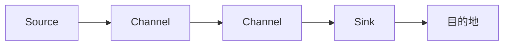

# Flume原理与代码实例讲解

作者：禅与计算机程序设计艺术 / Zen and the Art of Computer Programming

## 1. 背景介绍

### 1.1 问题的由来

随着互联网的迅猛发展，企业对大数据的处理和分析需求日益增长。为了高效地收集、传输和处理海量数据，日志收集系统成为了必不可少的组件。Apache Flume是一款分布式、可靠且可扩展的数据收集系统，它能够从各种数据源（如日志文件、JMS、网络套接字等）收集数据，并将收集到的数据传输到指定的目的地（如HDFS、HBase、Kafka等）。

### 1.2 研究现状

Flume自2008年开源以来，已经发展成为一个成熟的日志收集框架。众多企业将Flume应用于日志收集、监控、分析等场景，并在实际应用中不断积累经验。同时，随着大数据生态的不断发展，Flume也在不断地进行迭代更新，引入了新的特性和功能。

### 1.3 研究意义

深入研究Flume的原理和代码实现，有助于我们更好地理解其工作流程、性能优化以及扩展性，从而在实际应用中发挥其最大价值。本文将全面介绍Flume的原理、配置、代码实现以及应用场景，帮助读者深入了解Flume，为实际应用提供参考。

### 1.4 本文结构

本文将按照以下结构展开：

1. 核心概念与联系
2. 核心算法原理与具体操作步骤
3. 数学模型和公式
4. 项目实践：代码实例与详细解释说明
5. 实际应用场景
6. 工具和资源推荐
7. 总结：未来发展趋势与挑战
8. 附录：常见问题与解答

## 2. 核心概念与联系

为了更好地理解Flume的原理和代码实现，我们首先需要了解以下几个核心概念：

- **Agent**：Flume中的基本单元，负责数据的采集、传输和处理。一个Agent由Source、Channel和Sink组成。
- **Source**：负责从数据源采集数据，并将数据传递给Channel。
- **Channel**：负责暂存从Source接收到的数据，直到Sink处理完毕。
- **Sink**：负责将Channel中的数据传输到指定的目的地。

Flume的架构图如下：



## 3. 核心算法原理与具体操作步骤

### 3.1 算法原理概述

Flume的核心算法原理是将数据从数据源采集、暂存和传输到目的地。具体步骤如下：

1. Source从数据源采集数据。
2. 采集到的数据存储在Channel中。
3. Sink将Channel中的数据传输到目的地。

### 3.2 算法步骤详解

1. **启动Agent**：首先启动Flume Agent，加载配置文件中的Source、Channel和Sink组件。
2. **采集数据**：Source组件从配置的数据源（如日志文件、JMS、网络套接字等）采集数据。
3. **暂存数据**：采集到的数据存储在Channel中，常用的Channel有MemoryChannel和JMSChannel。
4. **传输数据**：Sink组件将Channel中的数据传输到指定的目的地（如HDFS、HBase、Kafka等）。

### 3.3 算法优缺点

**优点**：

- 分布式：Flume支持分布式部署，可以处理海量数据。
- 可靠性：Flume支持容错机制，确保数据传输的可靠性。
- 可扩展性：Flume支持动态添加Source、Channel和Sink组件，方便扩展。
- 易于使用：Flume配置简单，易于上手。

**缺点**：

- 性能瓶颈：Flume的性能瓶颈主要在于Channel，MemoryChannel的性能较差，适用于小规模数据采集。
- 依赖性：Flume依赖于Flume Agent，需要单独启动和管理。

### 3.4 算法应用领域

Flume广泛应用于以下领域：

- 日志收集：从各种日志文件中收集日志数据，便于后续分析。
- 监控：收集系统性能数据，便于监控和分析。
- 流处理：将实时数据传输到流处理系统（如Kafka、Spark Streaming等）。
- 大数据采集：将数据采集到大数据存储系统（如HDFS、HBase等）。

## 4. 数学模型和公式

Flume的数学模型较为简单，主要涉及数据传输过程中的数据量和传输速率。

- **数据量**：数据量是指采集的数据大小，通常用字节表示。
- **传输速率**：传输速率是指数据传输的速度，通常用字节每秒表示。

以下是一个简单的数学模型：

$$
\text{传输速率} = \frac{\text{数据量}}{\text{传输时间}}
$$

## 5. 项目实践：代码实例与详细解释说明

### 5.1 开发环境搭建

以下是Flume的开发环境搭建步骤：

1. 安装Java：Flume基于Java开发，需要安装Java环境。
2. 下载Flume：从Apache Flume官网下载最新版本的Flume。
3. 配置环境变量：将Flume的bin目录添加到系统环境变量中。

### 5.2 源代码详细实现

以下是一个简单的Flume Agent配置示例：

```xml
<configuration>
    <agent>
        <name>example-agent</name>
        <sources>
            <source>
                <type>spoolingFileSource</type>
                <channel>
                    <type>memoryChannel</type>
                    <capacity>1000</capacity>
                    <transactionCapacity>100</transactionCapacity>
                </channel>
                <sink>
                    <type>logSink</type>
                    <fileName>/var/log/flume/example-agent.log</fileName>
                </sink>
            </source>
        </sources>
        <channels>
            <channel>
                <type>memoryChannel</type>
                <capacity>1000</capacity>
                <transactionCapacity>100</transactionCapacity>
            </channel>
        </channels>
        <sinks>
            <sink>
                <type>logSink</type>
                <fileName>/var/log/flume/example-agent.log</fileName>
            </sink>
        </sinks>
    </agent>
</configuration>
```

### 5.3 代码解读与分析

以上配置定义了一个名为"example-agent"的Flume Agent，包含一个Source、一个Channel和一个Sink。

- Source：spoolingFileSource，从日志文件中采集数据。
- Channel：memoryChannel，使用内存Channel暂存数据。
- Sink：logSink，将数据写入到指定的日志文件中。

### 5.4 运行结果展示

运行以上配置的Flume Agent，可以看到日志文件中的数据被成功采集并写入到指定的日志文件中。

## 6. 实际应用场景

### 6.1 日志收集

Flume可以用于收集各种日志文件，如Web日志、系统日志、应用日志等。通过配置不同的Source组件，可以实现从多种日志源采集数据。

### 6.2 监控

Flume可以用于收集系统性能数据，如CPU、内存、磁盘IO等。通过配置不同的Source组件，可以实现从多种监控系统采集数据。

### 6.3 流处理

Flume可以将实时数据传输到流处理系统，如Kafka、Spark Streaming等。通过配置不同的Sink组件，可以实现将数据传输到不同的流处理系统。

### 6.4 大数据采集

Flume可以将数据采集到大数据存储系统，如HDFS、HBase等。通过配置不同的Sink组件，可以实现将数据传输到不同的大数据存储系统。

## 7. 工具和资源推荐

### 7.1 学习资源推荐

- Apache Flume官方文档：[https://flume.apache.org/releases.html](https://flume.apache.org/releases.html)
- Flume源码分析：[https://github.com/apache/flume](https://github.com/apache/flume)
- Flume社区论坛：[https://flume.apache.org/flumeuser.html](https://flume.apache.org/flumeuser.html)

### 7.2 开发工具推荐

- IntelliJ IDEA：支持Java开发，方便进行Flume开发。
- Maven：用于依赖管理和构建项目。

### 7.3 相关论文推荐

- Apache Flume 1.5.0-alpha Release Notes：[https://www.apache.org/dyn/closer.cgi?path=/flume/1.5.0-alpha/flume-user-guide-1.5.0-alpha.html](https://www.apache.org/dyn/closer.cgi?path=/flume/1.5.0-alpha/flume-user-guide-1.5.0-alpha.html)

### 7.4 其他资源推荐

- Apache Flume GitHub仓库：[https://github.com/apache/flume](https://github.com/apache/flume)
- Flume社区论坛：[https://flume.apache.org/flumeuser.html](https://flume.apache.org/flumeuser.html)

## 8. 总结：未来发展趋势与挑战

### 8.1 研究成果总结

本文全面介绍了Flume的原理、配置、代码实现以及应用场景，帮助读者深入了解Flume，为实际应用提供参考。

### 8.2 未来发展趋势

随着大数据和人工智能技术的不断发展，Flume也将迎来以下发展趋势：

- 与其他大数据技术深度融合，如Spark、Flink等。
- 引入机器学习算法，实现数据清洗、预处理等功能。
- 提高性能和可扩展性，满足更大规模的数据采集需求。

### 8.3 面临的挑战

Flume在实际应用中也面临着以下挑战：

- 性能瓶颈：Flume的性能瓶颈主要在于Channel，MemoryChannel的性能较差，适用于小规模数据采集。
- 依赖性：Flume依赖于Flume Agent，需要单独启动和管理。
- 可视化：Flume缺乏可视化界面，不利于监控和管理。

### 8.4 研究展望

为了解决Flume面临的挑战，未来的研究可以从以下几个方面展开：

- 优化Channel设计，提高性能和可扩展性。
- 开发Flume可视化工具，方便监控和管理。
- 将Flume与其他大数据技术深度融合，实现更强大的功能。

## 9. 附录：常见问题与解答

**Q1：Flume与Kafka、Spark Streaming等流处理系统有什么区别？**

A：Flume主要用于数据采集和传输，而Kafka和Spark Streaming主要用于实时数据处理。Flume可以将数据传输到Kafka和Spark Streaming，实现数据的实时处理。

**Q2：如何优化Flume的性能？**

A：可以通过以下方法优化Flume的性能：
- 使用高效的Channel，如JMSChannel、KafkaChannel等。
- 使用分布式部署，提高并发处理能力。
- 优化配置文件，减少资源消耗。

**Q3：Flume如何实现容错机制？**

A：Flume支持多种容错机制，如数据复制、负载均衡等。通过配置相应的组件，可以实现数据传输的可靠性。

**Q4：Flume如何进行数据清洗和预处理？**

A：Flume本身不提供数据清洗和预处理功能。可以通过在Flume中添加自定义组件，实现数据清洗和预处理。

**Q5：Flume如何与Hadoop生态圈中的其他组件集成？**

A：Flume可以与Hadoop生态圈中的其他组件集成，如HDFS、HBase、Hive等。通过配置相应的Sink组件，可以实现数据传输。

---

作者：禅与计算机程序设计艺术 / Zen and the Art of Computer Programming