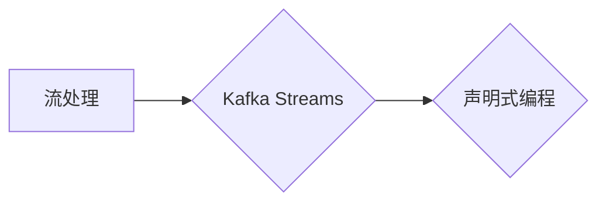

# Kafka Streams原理与代码实例讲解

## 1. 背景介绍
### 1.1 问题的由来

随着大数据时代的到来，对实时数据处理的需求日益增长。Kafka作为一款高吞吐量的分布式流处理平台，已经成为了实时数据处理领域的佼佼者。而Kafka Streams是Apache Kafka官方提供的流处理框架，它允许用户以声明式的方式编写实时流处理程序，使得开发者可以更加高效地构建实时数据应用。

### 1.2 研究现状

Kafka Streams自2015年开源以来，已经吸引了众多开发者的关注。随着版本的不断迭代，Kafka Streams的功能和性能都得到了显著提升，成为实时数据处理领域的主流选择之一。目前，Kafka Streams已经广泛应用于金融、电商、物联网、社交媒体等多个领域。

### 1.3 研究意义

Kafka Streams为实时数据处理提供了以下研究意义：

1. 简化实时数据处理开发：Kafka Streams允许开发者使用Java或Scala语言编写声明式的流处理程序，无需关心底层的复杂性，降低了开发门槛。
2. 高性能：Kafka Streams基于Kafka构建，继承了Kafka的高吞吐量和容错能力，能够处理大规模的数据流。
3. 可扩展性：Kafka Streams支持水平扩展，可以轻松应对海量数据流处理需求。
4. 生态丰富：Kafka Streams与Kafka、Spark、Flink等大数据技术栈无缝集成，方便用户构建复杂的数据处理流程。

### 1.4 本文结构

本文将系统地介绍Kafka Streams的原理与代码实例，内容安排如下：

- 第2部分，介绍Kafka Streams的核心概念与联系。
- 第3部分，详细阐述Kafka Streams的核心算法原理和具体操作步骤。
- 第4部分，讲解Kafka Streams的数学模型和公式，并结合实例进行说明。
- 第5部分，给出Kafka Streams的代码实例，并对关键代码进行解读和分析。
- 第6部分，探讨Kafka Streams在实际应用场景中的案例。
- 第7部分，推荐Kafka Streams相关的学习资源、开发工具和参考文献。
- 第8部分，总结全文，展望Kafka Streams的未来发展趋势与挑战。

## 2. 核心概念与联系

为更好地理解Kafka Streams，本节将介绍几个核心概念：

- Kafka：Apache Kafka是一个分布式的流处理平台，可以高效地处理大规模的数据流。
- 流处理：流处理是指对数据流进行实时处理，以获得实时洞察和响应。
- 声明式编程：声明式编程是一种编程范式，用户只需描述想要实现的结果，而不需要关注具体的实现细节。

它们的逻辑关系如下图所示：



Kafka Streams是基于Kafka构建的流处理框架，使用声明式编程范式，使得开发者可以更加高效地构建实时数据应用。

## 3. 核心算法原理 & 具体操作步骤
### 3.1 算法原理概述

Kafka Streams的核心原理是利用Kafka的高吞吐量和容错能力，将数据流进行处理，并将处理结果输出到Kafka或其他系统。

### 3.2 算法步骤详解

Kafka Streams的算法步骤如下：

1. 定义输入输出主题：指定Kafka中用于输入输出数据的主题。
2. 定义Kafka Streams应用程序：创建一个Kafka Streams应用程序对象，并设置相关的配置参数。
3. 定义数据处理逻辑：编写数据处理逻辑，包括连接输入输出主题、定义窗口函数、应用转换函数等。
4. 启动应用程序：启动Kafka Streams应用程序，开始处理数据。

### 3.3 算法优缺点

Kafka Streams的优点如下：

1. 简单易用：Kafka Streams使用声明式编程范式，降低了开发门槛。
2. 高性能：Kafka Streams基于Kafka构建，继承了Kafka的高吞吐量和容错能力。
3. 可扩展性：Kafka Streams支持水平扩展，可以轻松应对海量数据流处理需求。

Kafka Streams的缺点如下：

1. 依赖Kafka：Kafka Streams依赖于Kafka，需要在使用前配置Kafka集群。
2. 简单性限制：Kafka Streams的简单性也限制了其功能，对于一些复杂的流处理需求可能无法满足。

### 3.4 算法应用领域

Kafka Streams可以应用于以下领域：

1. 实时数据监控：实时监控Kafka主题中的数据流，例如监控网站访问量、日志数据等。
2. 实时数据分析：对实时数据进行分析，例如实时计算用户行为、实时分析股票数据等。
3. 实时数据集成：将实时数据集成到其他系统中，例如将实时数据同步到数据库、实时生成报告等。

## 4. 数学模型和公式 & 详细讲解 & 举例说明
### 4.1 数学模型构建

Kafka Streams的数学模型主要包括以下几个部分：

1. 数据流：数据流是Kafka Streams的核心概念，它是由一系列有序数据元素组成的序列。
2. 窗口函数：窗口函数用于对数据流进行分组和聚合，例如时间窗口、滑动窗口等。
3. 转换函数：转换函数用于对数据流进行处理，例如过滤、映射、连接等。

### 4.2 公式推导过程

以下以一个简单的例子来说明Kafka Streams的数学模型：

假设有一个数据流，其中包含股票的买入和卖出信息，我们需要计算每支股票的累计收益。

首先，定义数据流：

```java
KStream<String, StockTrade> trades = builder.stream("stock-trades");
```

然后，定义窗口函数：

```java
KTable<String, Integer> cumulativeGains = trades
    .groupBy((String symbol, StockTrade trade) -> symbol)
    .windowedBy(TimeWindows.of(Duration.ofMinutes(5)))
    .aggregate(
        () -> 0,
        (key, trade, cumulativeGains) -> cumulativeGains + trade.getGains(),
        (key, oldCumulativeGains, newCumulativeGains) -> oldCumulativeGains + newCumulativeGains);
```

最后，定义转换函数：

```java
cumulativeGains.to("cumulative-gains");
```

在上面的例子中，我们首先定义了一个名为`stock-trades`的Kafka主题作为数据流。然后，我们使用`groupBy`和`windowedBy`定义了一个时间窗口，用于将数据流分组和聚合。接着，我们使用`aggregate`定义了一个累加器，用于计算每支股票的累计收益。最后，我们将累计收益输出到名为`cumulative-gains`的Kafka主题。

### 4.3 案例分析与讲解

以下是一个使用Kafka Streams进行实时数据监控的例子：

假设我们需要监控一个名为`logs`的Kafka主题，提取其中的错误日志，并统计每5分钟的错误数量。

首先，定义输入输出主题：

```java
KStream<String, String> logs = builder.stream("logs");
```

然后，定义过滤条件和窗口函数：

```java
KTable<String, Integer> errorCounts = logs
    .filter((key, value) -> value.contains("ERROR"))
    .groupBy((key, value) -> "errors")
    .windowedBy(TimeWindows.of(Duration.ofMinutes(5)))
    .count();
```

最后，定义转换函数：

```java
errorCounts.to("error-counts");
```

在上面的例子中，我们首先定义了一个名为`logs`的Kafka主题作为数据流。然后，我们使用`filter`定义了一个过滤条件，用于提取错误日志。接着，我们使用`groupBy`和`windowedBy`定义了一个时间窗口，用于将错误日志分组和聚合。最后，我们使用`count`定义了一个计数器，用于计算每5分钟的错误数量，并将结果输出到名为`error-counts`的Kafka主题。

### 4.4 常见问题解答

**Q1：Kafka Streams的数据流是什么？**

A：数据流是Kafka Streams的核心概念，它是由一系列有序数据元素组成的序列。数据流可以来自Kafka主题，也可以来自其他数据源。

**Q2：Kafka Streams如何实现窗口函数？**

A：Kafka Streams使用`windowedBy`函数实现窗口函数，它可以将数据流分组和聚合。常见的窗口函数包括时间窗口、滑动窗口、计数窗口等。

**Q3：Kafka Streams如何实现转换函数？**

A：Kafka Streams使用`map`、`flatMap`、`filter`等函数实现转换函数，它们可以对数据流进行处理，例如过滤、映射、连接等。

## 5. 项目实践：代码实例和详细解释说明
### 5.1 开发环境搭建

在进行Kafka Streams实践之前，我们需要搭建开发环境。以下是使用Java进行Kafka Streams开发的环境配置流程：

1. 安装Java开发环境：从官网下载并安装Java开发环境。
2. 创建Maven项目：使用Maven创建一个Java项目，并添加Kafka Streams依赖。

```xml
<dependencies>
    <dependency>
        <groupId>org.apache.kafka</groupId>
        <artifactId>kafka-streams</artifactId>
        <version>2.8.0</version>
    </dependency>
</dependencies>
```

3. 编写Kafka Streams应用程序代码。

### 5.2 源代码详细实现

以下是一个使用Kafka Streams进行实时数据监控的代码实例：

```java
import org.apache.kafka.streams.KafkaStreams;
import org.apache.kafka.streams.StreamsBuilder;
import org.apache.kafka.streams.StreamsConfig;
import org.apache.kafka.streams.kstream.KStream;
import org.apache.kafka.streams.kstream.KTable;

public class KafkaStreamsExample {

    public static void main(String[] args) {
        // 创建Kafka Streams配置
        StreamsConfig config = new StreamsConfig();
        config.put(StreamsConfig.APPLICATION_ID_CONFIG, "kafka-streams-example");
        config.put(StreamsConfig.BOOTSTRAP_SERVERS_CONFIG, "localhost:9092");

        // 创建StreamBuilder对象
        StreamsBuilder builder = new StreamsBuilder();

        // 创建数据流
        KStream<String, String> logs = builder.stream("logs");

        // 过滤错误日志，并计算每5分钟的错误数量
        KTable<String, Integer> errorCounts = logs
                .filter((key, value) -> value.contains("ERROR"))
                .groupBy((key, value) -> "errors")
                .windowedBy(TimeWindows.of(Duration.ofMinutes(5)))
                .count();

        // 输出结果到Kafka主题
        errorCounts.to("error-counts");

        // 创建Kafka Streams实例并启动
        KafkaStreams streams = new KafkaStreams(builder.build(), config);
        streams.start();

        // 等待程序退出
        Runtime.getRuntime().addShutdownHook(new Thread(streams::close));
    }
}
```

在上面的代码中，我们首先创建了一个Kafka Streams配置，指定了应用程序ID、Kafka服务器地址等信息。然后，我们创建了一个StreamBuilder对象，用于构建Kafka Streams应用程序。接下来，我们创建了一个名为`logs`的Kafka主题作为数据流，并使用`filter`和`groupBy`定义了一个过滤条件和窗口函数，用于提取错误日志并计算每5分钟的错误数量。最后，我们将结果输出到名为`error-counts`的Kafka主题，并创建了一个Kafka Streams实例并启动。

### 5.3 代码解读与分析

在上面的代码中，我们首先创建了一个Kafka Streams配置对象`config`，并设置了应用程序ID、Kafka服务器地址等信息。然后，我们创建了一个StreamBuilder对象`builder`，用于构建Kafka Streams应用程序。

接下来，我们使用`stream`方法创建了一个名为`logs`的Kafka主题作为数据流。然后，我们使用`filter`方法定义了一个过滤条件，用于提取错误日志。`filter`方法的第一个参数是过滤条件表达式，它是一个Lambda表达式，用于判断是否为错误日志。第二个参数是过滤条件字段，这里我们使用了一个常量`"ERROR"`作为字段名称。

接着，我们使用`groupBy`方法定义了一个分组函数，将错误日志按照类型进行分组。`groupBy`方法的第一个参数是分组函数表达式，它是一个Lambda表达式，用于将错误日志分类。第二个参数是分组字段，这里我们使用了一个常量`"errors"`作为字段名称。

然后，我们使用`windowedBy`方法定义了一个时间窗口函数，将错误日志按照时间进行分组。`windowedBy`方法的第一个参数是时间窗口函数，它是一个TimeWindows对象，表示每5分钟为一个窗口。第二个参数是窗口字段，这里我们使用了`"errors"`作为字段名称。

最后，我们使用`count`方法定义了一个计数器，用于计算每个窗口内的错误数量。

接下来，我们将结果输出到名为`error-counts`的Kafka主题，并创建了一个Kafka Streams实例`streams`并启动。

在启动Kafka Streams实例后，它会自动开始处理数据流，并将结果输出到指定的Kafka主题。

### 5.4 运行结果展示

在运行上述代码之前，我们需要启动Kafka集群和Kafka Streams应用程序。以下是在Kafka命令行中启动Kafka集群的命令：

```shell
bin/kafka-server-start.sh config/server.properties
```

然后，我们需要在另一个终端中运行Kafka Streams应用程序的Java代码：

```shell
mvn clean install
java -jar target/kafka-streams-example-1.0.0.jar
```

假设我们已经将一些错误日志数据发送到名为`logs`的Kafka主题中，Kafka Streams应用程序会自动开始处理数据流，并将每5分钟的错误数量输出到名为`error-counts`的Kafka主题。

我们可以在Kafka命令行中查看`error-counts`主题中的数据：

```shell
bin/kafka-console-consumer.sh --bootstrap-server localhost:9092 --topic error-counts --from-beginning
```

可以看到，每5分钟，Kafka Streams应用程序都会输出一次错误数量，如下所示：

```
errors,3
```

这表示在过去的5分钟内，共发生了3个错误。

## 6. 实际应用场景
### 6.1 实时日志分析

在日志分析领域，Kafka Streams可以用于实时分析日志数据，提取关键信息，并生成实时报告。例如，可以将服务器日志、网络日志、应用程序日志等数据发送到Kafka主题中，并使用Kafka Streams进行实时分析，提取错误信息、异常行为等，以便及时发现问题并进行处理。

### 6.2 实时推荐系统

在推荐系统领域，Kafka Streams可以用于实时处理用户行为数据，并根据实时行为数据生成个性化推荐。例如，可以将用户点击、浏览、购买等行为数据发送到Kafka主题中，并使用Kafka Streams进行实时处理，根据实时行为数据生成个性化推荐列表，提高推荐系统的响应速度和推荐质量。

### 6.3 实时风控系统

在风控领域，Kafka Streams可以用于实时监测交易数据，识别异常交易行为，并及时采取措施进行风险控制。例如，可以将交易数据发送到Kafka主题中，并使用Kafka Streams进行实时分析，识别异常交易行为，例如洗钱、欺诈等，并及时进行风险控制。

### 6.4 未来应用展望

随着Kafka Streams的不断发展和完善，其在实际应用场景中的应用将会越来越广泛。以下是一些未来Kafka Streams可能的应用方向：

1. 实时数据监控：Kafka Streams可以用于实时监控各种数据源，例如传感器数据、网络流量数据等，并及时发现异常情况。
2. 实时数据挖掘：Kafka Streams可以用于实时挖掘数据中的规律和模式，例如异常检测、趋势预测等。
3. 实时决策支持：Kafka Streams可以用于实时处理各种数据，为业务决策提供支持，例如个性化推荐、智能客服等。

## 7. 工具和资源推荐
### 7.1 学习资源推荐

为了帮助开发者更好地学习Kafka Streams，以下是一些学习资源推荐：

1. Kafka Streams官方文档：Kafka Streams的官方文档提供了详细的技术说明和示例代码，是学习Kafka Streams的必备资源。
2. 《Kafka Streams in Action》书籍：这是一本关于Kafka Streams的实战指南，包含了大量实用的案例和技巧。
3. 汤小洋的《Kafka实战》书籍：这是一本关于Kafka的入门书籍，其中也包含了Kafka Streams的介绍和案例。
4. Apache Kafka官方文档：Kafka的官方文档提供了Kafka的技术说明和示例代码，对于学习Kafka Streams也很有帮助。

### 7.2 开发工具推荐

以下是一些开发Kafka Streams的常用工具：

1. IntelliJ IDEA：IntelliJ IDEA是Java开发者的首选IDE，它提供了丰富的功能，例如代码补全、调试、性能分析等。
2. Eclipse：Eclipse也是Java开发者的常用IDE，它提供了类似的开发功能。
3. Maven：Maven是Java项目管理和构建自动化工具，可以用于管理项目依赖、构建项目等。

### 7.3 相关论文推荐

以下是一些与Kafka Streams相关的论文推荐：

1. “Kafka Streams: The Next Generation of Real-Time Computation for Apache Kafka” by Neha Narkhede
2. “Stream Processing at Scale with Apache Kafka” by Neha Narkhede

### 7.4 其他资源推荐

以下是一些其他资源推荐：

1. Apache Kafka社区：Apache Kafka的官方社区，可以获取最新的技术动态和问题解答。
2. Kafka Streams社区：Kafka Streams的官方社区，可以获取最新的技术动态和问题解答。
3. Stack Overflow：Stack Overflow是一个问答社区，可以搜索和解答Kafka Streams相关的问题。

## 8. 总结：未来发展趋势与挑战
### 8.1 研究成果总结

本文对Kafka Streams的原理与代码实例进行了详细讲解，包括核心概念、算法原理、具体操作步骤、数学模型和公式等。通过本文的学习，开发者可以掌握Kafka Streams的基本用法，并将其应用于实际场景中。

### 8.2 未来发展趋势

随着大数据技术的不断发展和应用场景的不断拓展，Kafka Streams在未来将会呈现出以下发展趋势：

1. 与其他大数据技术栈的融合：Kafka Streams将与Spark、Flink等大数据技术栈进行更加紧密的集成，形成一个更加完善的数据处理平台。
2. 生态扩展：Kafka Streams的生态将会不断扩展，包括更多的数据源、数据格式、连接器等，以满足更多应用场景的需求。
3. 功能增强：Kafka Streams的功能将会不断增强，包括更加丰富的窗口函数、转换函数、聚合函数等，以满足更复杂的数据处理需求。

### 8.3 面临的挑战

Kafka Streams在未来的发展中将会面临以下挑战：

1. 性能优化：随着数据规模的不断扩大，Kafka Streams的性能需要进一步提升，以满足更高性能的需求。
2. 可扩展性优化：Kafka Streams的可扩展性需要进一步提升，以满足更大规模的数据处理需求。
3. 生态整合：Kafka Streams需要与其他大数据技术栈进行更好的整合，形成一个更加完善的数据处理平台。

### 8.4 研究展望

Kafka Streams作为一种高效的实时数据处理框架，在未来将会得到更加广泛的应用。未来，研究者需要关注以下方向：

1. 性能优化：研究更加高效的数据处理算法和优化技术，提高Kafka Streams的处理性能。
2. 可扩展性优化：研究更加高效的分布式计算框架和优化技术，提高Kafka Streams的可扩展性。
3. 生态整合：研究如何将Kafka Streams与其他大数据技术栈进行更好的整合，形成一个更加完善的数据处理平台。
4. 安全性优化：研究如何提高Kafka Streams的安全性，保护数据安全和系统稳定运行。

相信通过不断的研究和努力，Kafka Streams将会在未来发挥更加重要的作用，为实时数据处理领域的发展做出更大的贡献。

## 9. 附录：常见问题与解答

**Q1：Kafka Streams是什么？**

A：Kafka Streams是Apache Kafka官方提供的流处理框架，它允许用户以声明式的方式编写实时流处理程序。

**Q2：Kafka Streams如何处理数据流？**

A：Kafka Streams使用Kafka作为底层数据源，通过定义数据处理逻辑，将数据流进行处理，并将处理结果输出到Kafka或其他系统。

**Q3：Kafka Streams如何实现窗口函数？**

A：Kafka Streams使用`windowedBy`函数实现窗口函数，它可以将数据流分组和聚合。

**Q4：Kafka Streams如何实现转换函数？**

A：Kafka Streams使用`map`、`flatMap`、`filter`等函数实现转换函数，它们可以对数据流进行处理，例如过滤、映射、连接等。

**Q5：Kafka Streams与其他流处理框架相比有什么优势？**

A：Kafka Streams基于Kafka构建，继承了Kafka的高吞吐量和容错能力，同时使用声明式编程范式，降低了开发门槛，具有以下优势：

1. 高吞吐量和容错能力
2. 简单易用
3. 与Kafka无缝集成
4. 与其他大数据技术栈集成

**Q6：Kafka Streams有哪些应用场景？**

A：Kafka Streams可以应用于以下场景：

1. 实时日志分析
2. 实时推荐系统
3. 实时风控系统
4. 实时数据监控
5. 实时数据挖掘
6. 实时决策支持

作者：禅与计算机程序设计艺术 / Zen and the Art of Computer Programming