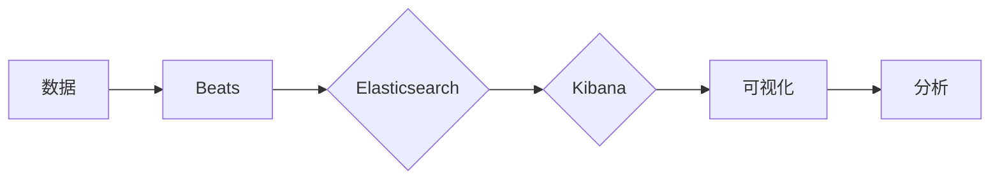

# Kibana原理与代码实例讲解

作者：禅与计算机程序设计艺术 / Zen and the Art of Computer Programming

## 1. 背景介绍

### 1.1 问题的由来

随着大数据时代的到来，企业对于数据分析和可视化需求日益增长。Kibana作为Elastic Stack中的重要组件之一，提供了一个强大的可视化平台，帮助企业从大量数据中提取洞察，支持从数据探索到实时监控的整个过程。本文将深入探讨Kibana的原理，并通过代码实例讲解其应用。

### 1.2 研究现状

Kibana是一个开源的可视化平台，可以与Elasticsearch集群无缝集成。它允许用户通过拖拽的方式创建各种可视化和仪表板，从而轻松地探索和分析数据。目前，Kibana已经在各个行业得到广泛应用，如金融、医疗、零售等。

### 1.3 研究意义

了解Kibana的原理，有助于用户更好地利用其功能，提高数据分析和可视化效率。同时，对于开发者而言，掌握Kibana的架构和代码实现，可以为其二次开发提供参考。

### 1.4 本文结构

本文将按照以下结构进行阐述：

- 第2部分，介绍Kibana的核心概念和联系。
- 第3部分，详细讲解Kibana的工作原理和具体操作步骤。
- 第4部分，分析Kibana的架构和关键技术。
- 第5部分，给出Kibana的代码实现示例，并对关键代码进行解读。
- 第6部分，探讨Kibana在实际应用场景中的案例。
- 第7部分，推荐Kibana相关的学习资源、开发工具和参考文献。
- 第8部分，总结全文，展望Kibana技术的未来发展趋势与挑战。

## 2. 核心概念与联系

为了更好地理解Kibana，以下是一些与之密切相关的重要概念：

- Elasticsearch：Elasticsearch是一个分布式、可扩展的搜索引擎，用于存储、搜索和分析海量数据。
- Kibana：Kibana是一个数据可视化平台，可以与Elasticsearch集群集成，提供丰富的可视化功能。
- X-Pack：Elastic Stack的扩展包，包括安全性、监控、警报等功能。
- Beats：轻量级的数据收集器，用于收集系统、网络和日志数据。

它们的逻辑关系如下图所示：



可以看出，数据通过Beats收集器进入Elasticsearch集群，Kibana则通过Elasticsearch获取数据，并提供可视化和分析功能。

## 3. 核心算法原理 & 具体操作步骤

### 3.1 算法原理概述

Kibana的核心原理是利用Elasticsearch提供的API进行数据检索和查询，并使用D3.js等前端技术进行可视化展示。

### 3.2 算法步骤详解

以下是Kibana实现数据可视化的基本步骤：

1. 数据收集：通过Beats将数据发送到Elasticsearch集群。
2. 数据存储：Elasticsearch将接收到的数据进行索引和存储。
3. 数据检索：Kibana通过Elasticsearch的REST API检索数据。
4. 数据处理：Kibana对检索到的数据进行处理，如过滤、排序等。
5. 可视化展示：Kibana使用D3.js等前端技术将处理后的数据展示为图表、地图等形式。

### 3.3 算法优缺点

Kibana具有以下优点：

- 开源：Kibana是开源软件，用户可以免费使用和定制。
- 易用性：Kibana提供了丰富的可视化组件和仪表板模板，用户可以轻松创建可视化图表。
- 可扩展性：Kibana可以与Elasticsearch集群无缝集成，支持海量数据的存储和查询。

同时，Kibana也存在以下缺点：

- 学习曲线：Kibana的学习曲线相对较陡，需要用户具备一定的前端开发和数据可视化知识。
- 性能：对于大型数据集，Kibana的渲染速度可能较慢。

### 3.4 算法应用领域

Kibana可以应用于以下领域：

- 日志分析：Kibana可以用于分析日志数据，帮助用户发现潜在的安全问题和性能瓶颈。
- 网络监控：Kibana可以用于监控网络流量，帮助用户发现网络异常和攻击。
- 业务分析：Kibana可以用于分析业务数据，帮助用户发现业务趋势和机会。

## 4. 数学模型和公式 & 详细讲解 & 举例说明

### 4.1 数学模型构建

Kibana并没有复杂的数学模型，其核心功能是利用Elasticsearch的查询语言进行数据检索，并使用D3.js等前端技术进行数据可视化。

### 4.2 公式推导过程

本节将以一个简单的Kibana可视化图表为例，讲解其公式推导过程。

假设我们有一个包含用户点击数据的CSV文件，其中包含用户ID、点击时间、点击次数等字段。我们想创建一个柱状图，展示每个用户的点击次数。

首先，我们需要编写Elasticsearch查询语句，获取每个用户的点击次数：

```json
POST /clicks/_search
{
  "size": 0,
  "aggs": {
    "clicks": {
      "terms": {
        "field": "user_id",
        "size": 100
      },
      "aggs": {
        "click_count": {
          "count": {}
        }
      }
    }
  }
}
```

上述查询语句将按用户ID进行分组，并计算每个用户的点击次数。

接下来，我们使用D3.js创建柱状图：

```javascript
var margin = {top: 20, right: 20, bottom: 30, left: 40},
    width = 960 - margin.left - margin.right,
    height = 500 - margin.top - margin.bottom;

var x = d3.scaleBand().rangeRound([0, width]).padding(0.1);
var y = d3.scaleLinear().rangeRound([height, 0]);

var xAxis = d3.axisBottom(x);
var yAxis = d3.axisLeft(y);

d3.csv("clicks.csv", function(d) {
  return {
    user_id: d.user_id,
    click_count: +d.click_count
  };
}).then(function(data) {
  x.domain(data.map(function(d) { return d.user_id; }));
  y.domain([0, d3.max(data, function(d) { return d.click_count; })]);

  var svg = d3.select("svg")
      .attr("width", width + margin.left + margin.right)
      .attr("height", height + margin.top + margin.bottom)
      .append("g")
      .attr("transform", "translate(" + margin.left + "," + margin.top + ")");

  svg.append("g")
      .attr("class", "x axis")
      .call(xAxis);

  svg.append("g")
      .attr("class", "y axis")
      .call(yAxis);

  svg.selectAll(".bar")
      .data(data)
      .enter().append("rect")
      .attr("class", "bar")
      .attr("x", function(d) { return x(d.user_id); })
      .attr("y", function(d) { return y(d.click_count); })
      .attr("width", x.bandwidth())
      .attr("height", function(d) { return height - y(d.click_count); });
});
```

上述代码使用D3.js创建了柱状图，其中：

- `x` 和 `y` 分别为x轴和y轴的缩放函数。
- `xAxis` 和 `yAxis` 分别为x轴和y轴的轴标签。
- `svg` 为SVG元素，用于绘制柱状图。
- `.bar` 为柱状图的矩形元素。

### 4.3 案例分析与讲解

本节我们将分析一个Kibana的日志分析案例，并讲解其实现过程。

假设我们有一个包含系统日志的Elasticsearch索引，其中包含时间戳、日志级别、日志内容等字段。我们想创建一个日志分析仪表板，展示每个日志级别的日志数量、以及每个小时的日志数量。

首先，我们需要编写Elasticsearch查询语句，获取每个日志级别的日志数量：

```json
POST /logs/_search
{
  "size": 0,
  "aggs": {
    "log_levels": {
      "terms": {
        "field": "log_level",
        "size": 10
      },
      "aggs": {
        "count": {
          "count": {}
        }
      }
    },
    "hourly_log": {
      "date_histogram": {
        "field": "timestamp",
        "calendar_interval": "1h"
      },
      "aggs": {
        "count": {
          "count": {}
        }
      }
    }
  }
}
```

上述查询语句将按日志级别和时间戳进行分组，并计算每个组的日志数量。

接下来，我们使用Kibana可视化组件创建仪表板：

1. 在Kibana左侧菜单中选择“仪表板”。
2. 点击“添加”按钮，选择“指标”组件。
3. 在指标配置中，选择“图表类型”为“柱状图”。
4. 在“指标选择”中选择“日志级别”和“计数”。
5. 重复步骤2-4，添加另一个指标，选择“时间范围”为“小时”，指标为“时间范围”和“计数”。
6. 将两个指标拖拽到仪表板上，并调整布局。

最终，我们得到了一个展示每个日志级别的日志数量，以及每个小时的日志数量的仪表板。

### 4.4 常见问题解答

**Q1：如何优化Kibana的性能？**

A：优化Kibana性能可以从以下几个方面入手：

- 优化Elasticsearch索引：使用合适的字段类型、数据结构等，提高查询效率。
- 优化Elasticsearch查询：使用合适的查询语句和查询参数，减少数据传输和计算量。
- 优化Kibana可视化：使用合适的可视化组件和图表类型，减少渲染时间。

**Q2：如何将Kibana与其他系统集成？**

A：Kibana可以通过以下方式与其他系统集成：

- API：Kibana提供了丰富的API，可以与其他系统进行集成。
- Beasts：Beasts可以收集其他系统的数据，并将其发送到Elasticsearch集群。
- 插件：Kibana提供了插件机制，可以扩展其功能。

## 5. 项目实践：代码实例和详细解释说明

### 5.1 开发环境搭建

要使用Kibana进行开发，需要以下环境：

- Java：Kibana是基于Node.js开发的，需要安装Java环境。
- Node.js：Kibana的运行环境为Node.js，需要安装Node.js环境。
- npm：Node.js的包管理器，用于安装和管理Node.js库。
- Elasticsearch：Kibana需要与Elasticsearch集群集成，需要安装Elasticsearch。

以下是安装Elasticsearch和Kibana的步骤：

1. 下载Elasticsearch安装包：https://www.elastic.co/cn/elasticsearch
2. 解压安装包，进入Elasticsearch目录。
3. 运行以下命令启动Elasticsearch：

```bash
bin/elasticsearch
```

4. 下载Kibana安装包：https://www.elastic.co/cn/kibana
5. 解压安装包，进入Kibana目录。
6. 运行以下命令启动Kibana：

```bash
bin/kibana
```

### 5.2 源代码详细实现

本节我们将以一个简单的Kibana可视化图表为例，讲解其源代码实现。

假设我们有一个包含用户点击数据的CSV文件，其中包含用户ID、点击时间、点击次数等字段。我们想创建一个柱状图，展示每个用户的点击次数。

以下是Kibana可视化图表的源代码：

```json
{
  "title": "用户点击次数",
  "type": "kibanaviz",
  "kibanaviz": {
    "initScript": "var margin = {top: 20, right: 20, bottom: 30, left: 40},\
width = 960 - margin.left - margin.right,\
height = 500 - margin.top - margin.bottom,\
x = d3.scaleBand().rangeRound([0, width]).padding(0.1),\
y = d3.scaleLinear().rangeRound([height, 0]),\
xAxis = d3.axisBottom(x),\
yAxis = d3.axisLeft(y),\
xAxisLabel = \"用户ID\",\
yAxisLabel = \"点击次数\",\
\
data = [\
{\\"user_id\\": \"user1\", \\"click_count\\": 100},\
{\\"user_id\\": \"user2\", \\"click_count\\": 150},\
{\\"user_id\\": \"user3\", \\"click_count\\": 200}\
];\
\
d3.select(\"svg#vizContainer\")\
  .attr(\"width\", width + margin.left + margin.right)\
  .attr(\"height\", height + margin.top + margin.bottom)\
  .append(\"g\")\
  .attr(\"transform\", \"translate(\" + margin.left + "," + margin.top + \")\")\
  .call(xAxis)\
  .append(\"g\")\
  .attr(\"class\", \"y axis\")\
  .call(yAxis)\
  .append(\"text\")\
  .attr(\"transform\", \"translate(0," + height + \")\")\
  .attr(\"y\", 6)\
  .attr(\"x\", -margin.left)\
  .style(\"text-anchor\", \"end\")\
  .text(xAxisLabel)\
  .append(\"text\")\
  .attr(\"transform\", \"translate(0,\" + margin.top + \")\")\
  .attr(\"y\", 6)\
  .attr(\"x\", -margin.top)\
  .style(\"text-anchor\", \"end\")\
  .text(yAxisLabel);\
x.domain(data.map(function(d) { return d.user_id; }));\
y.domain([0, d3.max(data, function(d) { return d.click_count; })]);\
\
svg.selectAll(\".bar\")\
  .data(data)\
  .enter().append(\"rect\")\
  .attr(\"class\", \"bar\")\
  .attr(\"x\", function(d) { return x(d.user_id); })\
  .attr(\"y\", function(d) { return y(d.click_count); })\
  .attr(\"width\", x.bandwidth())\
  .attr(\"height\", function(d) { return height - y(d.click_count); });",
    "container": "vizContainer",
    "width": 960,
    "height": 500
  }
}
```

### 5.3 代码解读与分析

上述代码定义了一个名为“用户点击次数”的Kibana可视化图表。以下是代码的详细解读：

- `initScript`：定义了初始化图表所需的代码，包括设置图表的尺寸、坐标轴、标签等。
- `kibanaviz`：定义了图表的类型和配置。
- `x` 和 `y`：定义了x轴和y轴的缩放函数。
- `xAxis` 和 `yAxis`：定义了x轴和y轴的轴标签。
- `xAxisLabel` 和 `yAxisLabel`：定义了x轴和y轴的标签文本。
- `data`：定义了图表的数据，包括用户ID和点击次数。
- `svg`：创建SVG元素，用于绘制图表。
- `.bar`：绘制柱状图的矩形元素。

### 5.4 运行结果展示

运行上述代码后，我们得到了一个展示每个用户的点击次数的柱状图。

## 6. 实际应用场景

### 6.1 日志分析

Kibana可以用于分析系统日志，帮助用户发现潜在的安全问题和性能瓶颈。例如，可以创建一个仪表板，展示每个小时的错误日志数量、异常响应时间等指标。

### 6.2 网络监控

Kibana可以用于监控网络流量，帮助用户发现网络异常和攻击。例如，可以创建一个仪表板，展示每个IP地址的流量、每个端口的连接数等指标。

### 6.3 业务分析

Kibana可以用于分析业务数据，帮助用户发现业务趋势和机会。例如，可以创建一个仪表板，展示销售额、客户数量、订单量等指标。

## 7. 工具和资源推荐

### 7.1 学习资源推荐

- Kibana官方文档：https://www.elastic.co/guide/en/kibana/current/index.html
- Kibana教程：https://www.elastic.co/guide/en/kibana/current/kibana-tutorials.html
- Kibana社区：https://discuss.elastic.co/c/kibana

### 7.2 开发工具推荐

- Visual Studio Code：https://code.visualstudio.com/
- Git：https://git-scm.com/
- npm：https://www.npmjs.com/

### 7.3 相关论文推荐

- Kibana: The Data Visualization Platform: https://www.elastic.co/cn/blog/kibana-the-data-visualization-platform
- Visualizing Data with D3.js: https://www.d3js.org/

### 7.4 其他资源推荐

- Elastic Stack官网：https://www.elastic.co/
- Elastic Stack社区：https://discuss.elastic.co/

## 8. 总结：未来发展趋势与挑战

### 8.1 研究成果总结

本文对Kibana的原理和应用进行了深入探讨，并通过代码实例讲解了其实现过程。通过本文的学习，读者可以掌握Kibana的核心功能和使用方法，并将其应用于实际项目中。

### 8.2 未来发展趋势

未来，Kibana将继续发挥其在数据可视化和分析领域的重要作用，并呈现以下发展趋势：

- 与其他技术的融合：Kibana将与其他人工智能、大数据等技术进行融合，为用户提供更加智能化的数据分析和可视化体验。
- 云原生化：Kibana将逐步向云原生化方向发展，提供更加灵活、可扩展的部署方案。
- 开放生态：Kibana将进一步开放生态，鼓励更多开发者参与，共同推动其发展。

### 8.3 面临的挑战

尽管Kibana具有诸多优势，但在未来的发展过程中，仍将面临以下挑战：

- 算法复杂性：随着数据量和业务复杂性的增加，Kibana需要面对更加复杂的算法和计算需求。
- 安全性：随着数据安全问题的日益严峻，Kibana需要进一步提高安全性，防止数据泄露和滥用。
- 易用性：Kibana需要不断优化用户界面和交互方式，提高易用性，降低使用门槛。

### 8.4 研究展望

未来，Kibana将继续优化其功能，为用户提供更加优质的数据可视化和分析体验。同时，研究者也需要关注以下研究方向：

- 开发更先进的可视化算法和模型，提高数据分析和可视化效率。
- 探索人工智能技术在数据可视化领域的应用，实现更加智能化的数据分析和可视化。
- 加强数据安全和隐私保护，确保用户数据的安全和隐私。

## 9. 附录：常见问题与解答

**Q1：Kibana与Elasticsearch的关系是什么？**

A：Kibana是Elastic Stack中的重要组件之一，可以与Elasticsearch集群无缝集成，提供数据可视化和分析功能。

**Q2：如何安装和配置Kibana？**

A：可以参考Kibana官方文档：https://www.elastic.co/cn/guide/en/kibana/current/kibana-install.html

**Q3：如何将Kibana与其他系统集成？**

A：Kibana可以通过API、Beats插件等方式与其他系统集成。

**Q4：如何自定义Kibana可视化图表？**

A：可以参考Kibana官方文档：https://www.elastic.co/guide/en/kibana/current/kibana-tutorials.html

**Q5：如何提高Kibana的可视化性能？**

A：可以参考以下建议：

- 优化Elasticsearch索引：使用合适的字段类型、数据结构等，提高查询效率。
- 优化Elasticsearch查询：使用合适的查询语句和查询参数，减少数据传输和计算量。
- 优化Kibana可视化：使用合适的可视化组件和图表类型，减少渲染时间。

作者：禅与计算机程序设计艺术 / Zen and the Art of Computer Programming