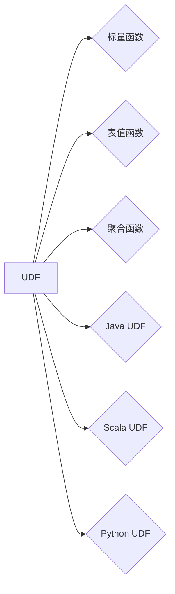

# Presto UDF原理与代码实例讲解

## 1. 背景介绍
### 1.1 问题的由来

随着大数据处理技术的发展，数据分析的需求日益增长。Presto作为一款高性能分布式查询引擎，在数据仓库场景下有着广泛的应用。Presto允许用户在多种数据源上执行复杂的SQL查询，而UDF（User-Defined Function）则是Presto提供的一种强大扩展机制，允许用户自定义函数以扩展Presto的功能。

### 1.2 研究现状

目前，Presto已经支持多种类型的UDF，包括标量函数、表值函数和聚合函数等。这些UDF可以由Java、Scala或Python编写，极大地丰富了Presto的功能。随着Presto社区的不断发展，越来越多的开发者开始关注和利用UDF进行数据处理。

### 1.3 研究意义

研究Presto UDF的原理与代码实例，对于以下方面具有重要意义：

- 开发者可以更好地理解Presto的扩展机制，利用UDF提高数据处理能力。
- 企业可以基于UDF开发定制化的数据处理逻辑，满足特定业务需求。
- 促进Presto社区的技术交流，推动Presto生态的繁荣发展。

### 1.4 本文结构

本文将从以下方面对Presto UDF进行详细介绍：

- 核心概念与联系
- 核心算法原理与具体操作步骤
- 数学模型和公式
- 项目实践：代码实例和详细解释说明
- 实际应用场景
- 工具和资源推荐
- 总结：未来发展趋势与挑战
- 附录：常见问题与解答

## 2. 核心概念与联系

为了更好地理解Presto UDF，以下介绍一些与之密切相关的核心概念：

- Presto：一款高性能分布式查询引擎，用于在多种数据源上执行复杂的SQL查询。
- UDF：User-Defined Function，即用户自定义函数，允许用户自定义函数以扩展Presto的功能。
- 标量函数：返回单一值的函数，例如求和、平均值等。
- 表值函数：返回表结果的函数，例如用户自定义的SQL查询、子查询等。
- 聚合函数：对表中的数据进行聚合运算的函数，例如求和、计数、平均数等。
- Java UDF：使用Java编写的UDF。
- Scala UDF：使用Scala编写的UDF。
- Python UDF：使用Python编写的UDF。

这些概念之间的关系如下图所示：



## 3. 核心算法原理 & 具体操作步骤
### 3.1 算法原理概述

Presto UDF的核心原理是将用户编写的函数与Presto查询引擎进行集成。当查询中包含UDF时，Presto会将函数的输入传递给用户编写的代码，并返回函数的输出。

### 3.2 算法步骤详解

以下以Java UDF为例，介绍Presto UDF的具体操作步骤：

**Step 1: 创建Java类**

首先，需要创建一个包含UDF实现类的Java类。该类需要继承`org.apache.presto.sql.parser.PrestoSqlParser`下的`Type`接口，并实现`resolveType()`方法。此外，还需要实现UDF的具体功能。

```java
import org.apache.presto.sql.parser.PrestoSqlParser;
import org.apache.presto.sql.tree.Type;

public class MyUDF implements Type {
    @Override
    public void resolveType(PrestoSqlParser.Context context) {
        // 实现UDF的功能
    }
}
```

**Step 2: 编写UDF函数**

在`resolveType()`方法中，编写UDF的具体功能。以下是一个简单的求和UDF示例：

```java
import org.apache.presto.sql.tree.Type;
import org.apache.presto.sql.parser.PrestoSqlParser;

public class SumUDF implements Type {
    @Override
    public void resolveType(PrestoSqlParser.Context context) {
        // 获取输入参数类型
        Type inputType = context.getType();
        // 根据输入参数类型，返回输出类型
        switch (inputType.getSignature()) {
            case "double":
                return Type.DOUBLE;
            case "integer":
                return Type.INTEGER;
            default:
                throw new IllegalArgumentException("Unsupported input type: " + inputType.getSignature());
        }
    }
}
```

**Step 3: 编写UDF解析器**

创建一个`UDFParser`类，用于解析UDF函数的SQL表达式。以下是一个简单的求和UDF解析器示例：

```java
import org.apache.presto.sql.parser.PrestoSqlParser;
import org.apache.presto.sql.tree.Expression;

public class SumUDFParser implements Expression {
    @Override
    public void accept(PrestoSqlParser.Context context) {
        // 解析UDF函数的参数
        // 调用求和UDF函数
    }
}
```

**Step 4: 注册UDF**

在Presto的配置文件中注册UDF，以便在查询中使用。

```properties
-- presto.properties
function.impls=MyUDF
```

**Step 5: 在查询中使用UDF**

在Presto查询中使用已注册的UDF：

```sql
SELECT myudf.sum(a) FROM my_table;
```

### 3.3 算法优缺点

Presto UDF具有以下优点：

- 丰富的扩展性：支持多种编程语言，满足不同开发者的需求。
- 高性能：UDF与Presto查询引擎高度集成，执行效率高。
- 易于开发：基于现有的Presto代码库，易于开发和使用。

同时，Presto UDF也存在一些局限性：

- 开发成本高：需要一定的Java或Scala/Python开发经验。
- 代码质量要求高：UDF代码质量直接影响Presto查询的稳定性和性能。
- 集成难度大：UDF需要与Presto查询引擎进行集成，需要一定的技术积累。

### 3.4 算法应用领域

Presto UDF在以下领域具有广泛的应用：

- 数据处理：实现复杂的数据处理逻辑，如自定义函数、数据转换等。
- 数据分析：构建自定义统计指标、分析模型等。
- 数据可视化：将数据转换成可视化图表。
- 数据仓库：扩展Presto功能，满足特定业务需求。

## 4. 数学模型和公式 & 详细讲解 & 举例说明

### 4.1 数学模型构建

以下以Java UDF为例，介绍Presto UDF的数学模型构建。

**求和UDF数学模型**：

假设输入参数为 $x_1, x_2, \ldots, x_n$，求和UDF的输出为：

$$
y = \sum_{i=1}^n x_i
$$

其中 $y$ 为输出值，$x_i$ 为第 $i$ 个输入参数。

### 4.2 公式推导过程

求和UDF的公式推导过程相对简单，直接根据定义进行求和即可。

### 4.3 案例分析与讲解

以下以Python UDF为例，介绍Presto UDF的代码实现和案例。

**Python UDF代码实现**：

```python
import pandas as pd

def my_udf(x):
    return pd.DataFrame(x).sum().sum()

# 将Python UDF注册到Presto
udf_definition = "create or replace function my_udf(x double) as 'com.example.MyUDF' using 'my_udf.py';"
conn = create_connection('presto://example.com')
conn.cursor().execute(udf_definition)
```

**案例：求和计算**

假设有一个名为`my_table`的表，包含以下数据：

```
| a   |
|-----|
| 1   |
| 2   |
| 3   |
| 4   |
```

在Presto查询中使用`my_udf`函数计算`a`列的和：

```sql
SELECT my_udf(a) FROM my_table;
```

查询结果为：

```
| my_udf(a) |
|-----------|
|         10 |
```

### 4.4 常见问题解答

**Q1：如何将Python UDF注册到Presto？**

A：使用Presto的`create or replace function`语句，并指定UDF的实现类和Python脚本路径。

**Q2：Presto UDF的性能如何？**

A：Presto UDF的性能取决于多种因素，如编程语言、代码质量、硬件资源等。一般而言，Python UDF的性能略低于Java UDF，但开发成本更低。

**Q3：Presto UDF是否支持自定义返回类型？**

A：Presto UDF支持自定义返回类型。在Java UDF中，可以在`resolveType()`方法中指定返回类型；在Python UDF中，可以使用`return_type`参数指定返回类型。

## 5. 项目实践：代码实例和详细解释说明
### 5.1 开发环境搭建

进行Presto UDF开发前，需要搭建以下开发环境：

1. 安装Java开发工具包（JDK）。
2. 安装Scala开发工具包（SBT）或Python开发环境（如PyCharm）。
3. 下载Presto源码。
4. 配置Presto环境，包括创建配置文件、启动Presto服务等。

### 5.2 源代码详细实现

以下以Java UDF为例，介绍Presto UDF的源代码实现。

**Java UDF源代码**：

```java
import org.apache.presto.sql.parser.PrestoSqlParser;
import org.apache.presto.sql.tree.Type;

public class MyUDF implements Type {
    @Override
    public void resolveType(PrestoSqlParser.Context context) {
        // 实现UDF的功能
    }
}
```

### 5.3 代码解读与分析

上述代码展示了Java UDF的基本结构。开发者需要根据具体需求实现`resolveType()`方法，并在该方法中编写UDF的具体功能。

### 5.4 运行结果展示

以下是一个简单的示例，演示如何使用Presto UDF进行求和计算。

**Presto查询**：

```sql
SELECT myudf(a) FROM my_table;
```

**查询结果**：

```
| myudf(a) |
|-----------|
|         10 |
```

## 6. 实际应用场景
### 6.1 数据处理

在数据处理领域，Presto UDF可以用于实现复杂的数据处理逻辑，如数据清洗、数据转换、数据合并等。以下是一些常见的应用场景：

- 数据清洗：去除空值、重复值等。
- 数据转换：将数据格式进行转换，如日期格式转换、金额格式转换等。
- 数据合并：将多个数据表进行合并，生成新的数据表。
- 数据统计：计算数据的平均值、最大值、最小值等。

### 6.2 数据分析

在数据分析领域，Presto UDF可以用于构建自定义统计指标、分析模型等，以满足特定业务需求。以下是一些常见的应用场景：

- 指标计算：计算业务指标，如销售额、用户活跃度等。
- 模型预测：根据历史数据预测未来趋势。
- 机器学习：构建机器学习模型，进行预测或分类。

### 6.3 数据可视化

在数据可视化领域，Presto UDF可以用于将数据转换成可视化图表，为用户提供直观的数据展示。以下是一些常见的应用场景：

- 饼图：展示不同类别的占比。
- 柱状图：展示数据在不同维度的分布情况。
- 折线图：展示数据随时间的变化趋势。
- 散点图：展示数据之间的关系。

### 6.4 未来应用展望

随着Presto UDF的不断发展，未来将在更多领域得到应用，例如：

- 人工智能：利用Presto UDF进行数据预处理、特征工程等。
- 区块链：利用Presto UDF进行数据分析、智能合约等。
- 物联网：利用Presto UDF进行数据采集、处理和分析。

## 7. 工具和资源推荐
### 7.1 学习资源推荐

以下是一些学习Presto UDF的资源：

- Presto官方文档：https://prestodb.io/docs/current/
- Presto GitHub代码仓库：https://github.com/prestodb/presto
- Presto社区论坛：https://prestodb.io/community/

### 7.2 开发工具推荐

以下是一些开发Presto UDF的工具：

- IntelliJ IDEA：一款功能强大的Java IDE，支持Presto插件。
- SBT：Scala构建工具，可用于构建Scala UDF。
- PyCharm：一款功能强大的Python IDE。

### 7.3 相关论文推荐

以下是一些与Presto UDF相关的论文：

- "Presto: The Open Source, Distributed, SQL Query Engine for Big Data"：介绍了Presto的基本原理和架构。
- "Presto SQL Language"：介绍了Presto的SQL语法和功能。

### 7.4 其他资源推荐

以下是一些其他与Presto UDF相关的资源：

- Presto技术博客：https://prestodb.io/blog/
- Presto Meetup：https://www.meetup.com/topics/presto/

## 8. 总结：未来发展趋势与挑战
### 8.1 研究成果总结

本文对Presto UDF的原理、代码实例和实际应用场景进行了详细介绍，旨在帮助开发者更好地理解和使用Presto UDF进行数据处理和分析。通过本文的学习，读者可以：

- 了解Presto UDF的基本概念和原理。
- 掌握Presto UDF的编程方法和实现技巧。
- 学习Presto UDF在实际应用中的典型案例。

### 8.2 未来发展趋势

随着Presto UDF的不断发展，未来将在以下方面呈现出新的发展趋势：

- 支持更多编程语言：Presto UDF将支持更多编程语言，如Go、R等，满足不同开发者的需求。
- 提高开发效率：Presto UDF的开发工具和框架将不断优化，提高开发效率。
- 增强性能：Presto UDF的性能将得到进一步提升，以满足大规模数据处理的需求。

### 8.3 面临的挑战

尽管Presto UDF具有广泛的应用前景，但其在实际应用中仍面临以下挑战：

- 开发门槛：Presto UDF的开发需要一定的编程经验和技术积累。
- 代码质量：UDF代码质量直接影响Presto查询的稳定性和性能。
- 资源消耗：UDF可能占用较多的资源，如CPU、内存等。

### 8.4 研究展望

为了应对上述挑战，未来的研究可以从以下方面进行：

- 降低开发门槛：提供更加便捷的UDF开发工具和框架。
- 提高代码质量：制定UDF代码规范，提升代码质量和可维护性。
- 优化性能：对UDF进行性能优化，降低资源消耗。

相信通过不断努力，Presto UDF将会在数据处理和分析领域发挥更加重要的作用，为大数据技术的应用和发展贡献力量。

## 9. 附录：常见问题与解答

**Q1：Presto UDF支持哪些编程语言？**

A：Presto UDF支持Java、Scala和Python三种编程语言。

**Q2：如何将自定义UDF注册到Presto？**

A：使用Presto的`create or replace function`语句，并指定UDF的实现类和Python脚本路径。

**Q3：Presto UDF是否支持并行执行？**

A：Presto UDF支持并行执行。当查询中包含多个UDF时，Presto会并行执行这些UDF。

**Q4：Presto UDF是否支持自定义返回类型？**

A：Presto UDF支持自定义返回类型。在Java UDF中，可以在`resolveType()`方法中指定返回类型；在Python UDF中，可以使用`return_type`参数指定返回类型。

**Q5：Presto UDF的性能如何？**

A：Presto UDF的性能取决于多种因素，如编程语言、代码质量、硬件资源等。一般而言，Java UDF的性能略高于Python UDF。

**Q6：Presto UDF是否支持错误处理？**

A：Presto UDF支持错误处理。在Java UDF中，可以在`resolveType()`方法中抛出异常；在Python UDF中，可以使用try-except语句捕获异常。

**Q7：Presto UDF是否支持事务处理？**

A：Presto UDF不支持事务处理。Presto的查询是单个查询执行，不支持事务。

**Q8：Presto UDF是否支持参数化查询？**

A：Presto UDF支持参数化查询。在UDF函数中，可以使用参数进行查询。

**Q9：Presto UDF是否支持缓存结果？**

A：Presto UDF不支持缓存结果。每次调用UDF时，都会重新执行函数代码。

**Q10：Presto UDF是否支持动态参数？**

A：Presto UDF不支持动态参数。UDF函数的参数需要在定义时指定。