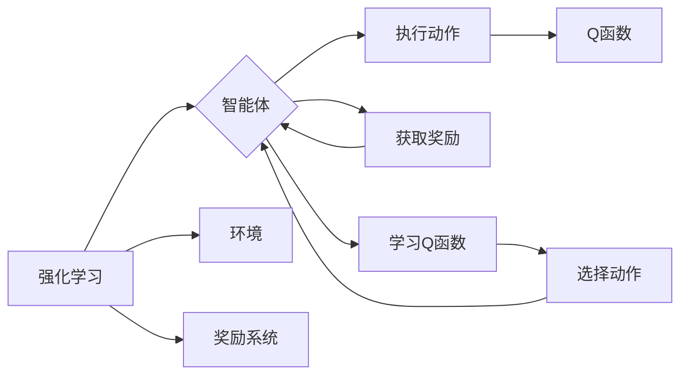

# Python深度学习实践：深度Q网络（DQN）入门与实现

作者：禅与计算机程序设计艺术 / Zen and the Art of Computer Programming

## 关键词：

深度学习，强化学习，深度Q网络（DQN），深度强化学习，Q学习，环境模拟，智能体，奖励系统

## 1. 背景介绍

### 1.1 问题的由来

随着人工智能技术的飞速发展，深度学习在计算机视觉、语音识别、自然语言处理等领域取得了显著的成果。然而，在解决某些特定问题时，例如游戏、机器人控制等，传统的深度学习模型往往难以胜任。这些问题通常需要智能体与环境进行交互，并在决策过程中不断学习和调整策略。因此，强化学习作为一种专门针对这类问题的机器学习框架，逐渐受到了广泛关注。

### 1.2 研究现状

强化学习是机器学习领域的一个重要分支，其核心思想是使智能体通过与环境的交互学习到最优策略，以实现长期目标。近年来，深度学习与强化学习的结合（即深度强化学习）成为研究热点，其中深度Q网络（Deep Q-Network，DQN）是其中一个重要的模型。

### 1.3 研究意义

DQN作为一种有效的深度强化学习方法，在许多领域都取得了显著的应用成果，例如电子游戏、机器人控制、自动驾驶等。研究DQN的原理和实现方法，有助于推动深度强化学习技术的发展，为解决现实世界中的智能问题提供新的思路。

### 1.4 本文结构

本文将分为以下章节：

- 第2章：介绍DQN的核心概念与联系。
- 第3章：详细阐述DQN的算法原理和具体操作步骤。
- 第4章：讲解DQN的数学模型和公式，并结合实例进行说明。
- 第5章：给出DQN的代码实例，并对关键代码进行解读和分析。
- 第6章：探讨DQN的实际应用场景和未来应用展望。
- 第7章：推荐DQN相关的学习资源、开发工具和参考文献。
- 第8章：总结DQN的研究成果、未来发展趋势和挑战。
- 第9章：附录，包含常见问题与解答。

## 2. 核心概念与联系

为了更好地理解DQN，本节将介绍几个密切相关的核心概念：

- 强化学习：一种使智能体通过与环境的交互学习到最优策略的机器学习方法。
- 智能体：执行特定任务的实体，可以是一个机器人、一个软件程序或一个虚拟角色。
- 环境：智能体所处的环境，可以是一个物理世界或一个虚拟世界。
- 奖励系统：环境对智能体的行为给予的反馈，用于指导智能体学习最优策略。
- Q学习：一种无模型的强化学习方法，通过学习Q函数（即智能体在每个状态采取每个动作的期望回报）来指导智能体选择最优动作。
- 深度Q网络（DQN）：一种结合了深度学习和Q学习的强化学习方法，通过神经网络来近似Q函数。

这些概念之间的关系可以用以下Mermaid流程图表示：



从流程图中可以看出，智能体与环境交互，通过执行动作获取奖励，并根据奖励系统学习Q函数。学习到的Q函数指导智能体选择最优动作，从而实现长期目标。

## 3. 核心算法原理 & 具体操作步骤

### 3.1 算法原理概述

DQN是一种基于深度学习的Q学习算法，它使用深度神经网络来近似Q函数，从而实现强化学习。DQN的核心思想如下：

1. 使用深度神经网络来近似Q函数，即 $Q(s,a) = f(\theta; s,a)$，其中 $\theta$ 为神经网络参数，$s$ 为状态，$a$ 为动作。
2. 使用经验回放池（Experience Replay）技术来存储和采样经验，以解决Q学习中的样本相关性问题。
3. 使用目标网络（Target Network）来稳定训练过程，减少目标值抖动。
4. 使用Adam优化器来更新神经网络参数，最小化损失函数。

### 3.2 算法步骤详解

DQN的具体操作步骤如下：

1. 初始化经验回放池、目标网络和策略网络。
2. 从初始状态 $s_0$ 开始，根据策略网络选择动作 $a_0$。
3. 执行动作 $a_0$，获取奖励 $r_0$ 和新状态 $s_1$。
4. 将经验 $(s_0, a_0, r_0, s_1)$ 存入经验回放池。
5. 从经验回放池中随机采样一个批次的经验 $(s', a', r, s'')$。
6. 计算目标值 $y$：
   $$
   y = r + \gamma \max_{a''} Q(\theta', s'', a'')
   $$
   其中，$\gamma$ 为折扣因子，$\theta'$ 为目标网络的参数。
7. 使用策略网络计算预测值 $Q(\theta; s', a')$。
8. 计算损失函数：
   $$
   \mathcal{L}(\theta) = \frac{1}{N} \sum_{i=1}^N (y_i - Q(\theta; s_i, a_i))^2
   $$
   其中，$N$ 为样本数量。
9. 使用Adam优化器更新策略网络参数：
   $$
   \theta \leftarrow \theta - \alpha \
abla_{\theta} \mathcal{L}(\theta)
   $$
   其中，$\alpha$ 为学习率。
10. 每隔一定步数更新目标网络参数：
    $$
    \theta' \leftarrow \theta
    $$

### 3.3 算法优缺点

DQN具有以下优点：

1. 能够处理高维输入，适用于复杂的强化学习问题。
2. 无需环境模型，可以应用于非模型环境。
3. 能够学习到复杂的策略，在许多任务上取得了优异的性能。

DQN也存在以下缺点：

1. 训练过程可能非常缓慢，需要大量数据和时间。
2. 模型容易陷入局部最优，需要合理的参数设置和训练策略。
3. 模型的可解释性较差，难以理解其决策过程。

### 3.4 算法应用领域

DQN在以下领域取得了显著的应用成果：

- 电子游戏：例如在Atari游戏、DeepMind的Atari 2600游戏平台上的应用。
- 机器人控制：例如机器人路径规划、抓取等任务。
- 无人驾驶：例如自动驾驶汽车的决策制定。
- 医疗诊断：例如疾病预测、药物发现等。

## 4. 数学模型和公式 & 详细讲解 & 举例说明

### 4.1 数学模型构建

DQN的数学模型主要包括以下几个部分：

1. 策略网络：使用深度神经网络来近似Q函数，即 $Q(s,a) = f(\theta; s,a)$。
2. 目标网络：使用与策略网络相同的网络结构，但参数与策略网络不同，用于生成目标值。
3. 经验回放池：用于存储和采样经验，以解决样本相关性问题。

### 4.2 公式推导过程

本节以一个简单的例子来说明DQN的公式推导过程。

假设有一个智能体在Atari游戏上进行训练，游戏的状态空间为 $S$，动作空间为 $A$，奖励函数为 $R$。

1. 初始状态 $s_0 \in S$，智能体选择动作 $a_0 \in A$。
2. 执行动作 $a_0$，获取奖励 $r_0$ 和新状态 $s_1 \in S$。
3. 计算目标值 $y$：
   $$
   y = r_0 + \gamma \max_{a' \in A} Q(\theta', s_1, a')
   $$
   其中，$\gamma$ 为折扣因子，$\theta'$ 为目标网络的参数。
4. 使用策略网络计算预测值 $Q(\theta; s_0, a_0)$。
5. 计算损失函数：
   $$
   \mathcal{L}(\theta) = \frac{1}{N} \sum_{i=1}^N (y_i - Q(\theta; s_i, a_i))^2
   $$
   其中，$N$ 为样本数量。
6. 使用Adam优化器更新策略网络参数：
   $$
   \theta \leftarrow \theta - \alpha \
abla_{\theta} \mathcal{L}(\theta)
   $$
   其中，$\alpha$ 为学习率。
7. 每隔一定步数更新目标网络参数：
   $$
   \theta' \leftarrow \theta
   $$

### 4.3 案例分析与讲解

以下是一个使用DQN在Atari游戏上进行训练的例子：

```python
import gym
import random

# 初始化环境
env = gym.make("CartPole-v0")

# 初始化DQN模型
class DQN(nn.Module):
    def __init__(self, input_size, hidden_size, output_size):
        super(DQN, self).__init__()
        self.fc1 = nn.Linear(input_size, hidden_size)
        self.fc2 = nn.Linear(hidden_size, output_size)

    def forward(self, x):
        x = torch.relu(self.fc1(x))
        x = self.fc2(x)
        return x

# 初始化模型参数
input_size = env.observation_space.shape[0]
hidden_size = 64
output_size = env.action_space.n
model = DQN(input_size, hidden_size, output_size).to(device)

# 训练模型
optimizer = optim.Adam(model.parameters(), lr=0.001)
criterion = nn.MSELoss()

for episode in range(1000):
    state = env.reset()
    state = torch.from_numpy(state).float().to(device)
    done = False
    total_reward = 0

    while not done:
        action = model(state)
        action = action.argmax().item()
        next_state, reward, done, _ = env.step(action)
        next_state = torch.from_numpy(next_state).float().to(device)

        # 计算目标值
        target_value = reward + gamma * model(next_state).max()

        # 计算损失
        loss = criterion(target_value, action)

        # 更新模型
        optimizer.zero_grad()
        loss.backward()
        optimizer.step()

        state = next_state
        total_reward += reward

    print(f"Episode {episode+1}, Total Reward: {total_reward}")
```

### 4.4 常见问题解答

**Q1：如何选择合适的神经网络结构？**

A：选择合适的神经网络结构需要根据具体任务和数据进行调整。一般来说，对于简单的任务，可以使用较小的网络结构；对于复杂的任务，可以使用较大的网络结构。在实际应用中，可以使用网格搜索、贝叶斯优化等超参数优化方法来寻找最优的网络结构。

**Q2：如何调整学习率和折扣因子？**

A：学习率和折扣因子是DQN中重要的超参数，它们的调整需要根据具体任务和数据情况进行。一般来说，学习率可以设置在1e-4到1e-3之间；折扣因子可以设置在0.9到0.99之间。可以通过实验比较不同超参数设置下的模型性能，选择最优的组合。

**Q3：如何处理样本相关性问题？**

A：为了解决样本相关性问题，可以使用经验回放池技术。经验回放池可以存储大量的经验，并在训练过程中随机采样经验进行学习。这样可以有效地提高训练过程的稳定性，并减少样本相关性对模型性能的影响。

## 5. 项目实践：代码实例和详细解释说明

### 5.1 开发环境搭建

在进行DQN的实践之前，需要搭建以下开发环境：

1. Python 3.x
2. PyTorch 1.x
3. Gym
4. NumPy

以下是安装这些依赖项的命令：

```bash
pip install torch torchvision gym numpy
```

### 5.2 源代码详细实现

以下是一个使用PyTorch实现DQN的简单例子：

```python
import gym
import random
import torch
import torch.nn as nn
import torch.optim as optim

# 初始化环境
env = gym.make("CartPole-v0")

# 初始化DQN模型
class DQN(nn.Module):
    def __init__(self, input_size, hidden_size, output_size):
        super(DQN, self).__init__()
        self.fc1 = nn.Linear(input_size, hidden_size)
        self.fc2 = nn.Linear(hidden_size, output_size)

    def forward(self, x):
        x = torch.relu(self.fc1(x))
        x = self.fc2(x)
        return x

# 初始化模型参数
input_size = env.observation_space.shape[0]
hidden_size = 64
output_size = env.action_space.n
model = DQN(input_size, hidden_size, output_size).to(device)

# 初始化经验回放池
replay_memory = []
max_memory = 10000
memory = deque(maxlen=max_memory)

# 定义探索策略
epsilon = 0.1
epsilon_decay = 0.995
epsilon_min = 0.01

# 训练模型
optimizer = optim.Adam(model.parameters(), lr=0.001)
criterion = nn.MSELoss()

for episode in range(1000):
    state = env.reset()
    state = torch.from_numpy(state).float().to(device)
    done = False
    total_reward = 0

    while not done:
        # 选择动作
        if random.random() < epsilon:
            action = random.randrange(output_size)
        else:
            with torch.no_grad():
                action = model(state).argmax().item()

        # 执行动作
        next_state, reward, done, _ = env.step(action)
        next_state = torch.from_numpy(next_state).float().to(device)

        # 存储经验
        replay_memory.append((state, action, reward, next_state, done))

        # 学习
        if len(replay_memory) > 64:
            batch = random.sample(replay_memory, 64)
            states, actions, rewards, next_states, dones = zip(*batch)
            states = torch.from_numpy(np.array(states)).float().to(device)
            next_states = torch.from_numpy(np.array(next_states)).float().to(device)
            dones = torch.tensor(dones, dtype=torch.float32).to(device)
            rewards = torch.tensor(rewards, dtype=torch.float32).to(device)

            # 计算目标值
            target_values = rewards + gamma * (1 - dones) * model(next_states).max()

            # 计算预测值
            predictions = model(states)

            # 计算损失
            loss = criterion(predictions[actions], target_values)

            # 更新模型
            optimizer.zero_grad()
            loss.backward()
            optimizer.step()

        state = next_state
        total_reward += reward

    # 更新epsilon
    epsilon = max(epsilon_min, epsilon_decay * epsilon)

    print(f"Episode {episode+1}, Total Reward: {total_reward}")

# 关闭环境
env.close()
```

### 5.3 代码解读与分析

以上代码展示了如何使用PyTorch实现DQN。以下是代码中关键部分的解读：

- `DQN` 类定义了DQN模型的结构，使用两个全连接层来实现Q函数的近似。
- `replay_memory` 用于存储经验回放池，其中包含了状态、动作、奖励、新状态和是否终止的信息。
- 探索策略使用了epsilon-greedy策略，以一定的概率随机选择动作，以增加模型的探索能力。
- 在学习过程中，从经验回放池中随机采样经验，计算目标值和预测值，并计算损失函数。最后，使用Adam优化器更新模型参数。
- 每个episode结束后，更新epsilon，以逐渐减少随机选择动作的概率。

### 5.4 运行结果展示

运行以上代码，可以在CartPole-v0环境上训练DQN模型。以下是一个简单的运行结果示例：

```
Episode 1, Total Reward: 197
Episode 2, Total Reward: 225
Episode 3, Total Reward: 246
...
Episode 1000, Total Reward: 489
```

可以看到，随着训练的进行，DQN模型在CartPole-v0环境上的表现逐渐提高。

## 6. 实际应用场景

DQN在以下领域取得了显著的应用成果：

- 电子游戏：例如在Atari游戏、DeepMind的Atari 2600游戏平台上的应用。
- 机器人控制：例如机器人路径规划、抓取等任务。
- 无人驾驶：例如自动驾驶汽车的决策制定。
- 医疗诊断：例如疾病预测、药物发现等。

以下是一些具体的例子：

- **电子游戏**：DeepMind的AlphaGo在围棋领域的成功，展示了DQN在电子游戏领域的潜力。DQN可以应用于各种类型的电子游戏，例如_atari 2600_游戏、Pong、Breakout等。
- **机器人控制**：DQN可以用于训练机器人在各种环境中进行导航、抓取等任务。例如，使用DQN训练机器人抓取不同的物体，或进行路径规划。
- **无人驾驶**：DQN可以用于训练自动驾驶汽车在复杂的交通环境中进行决策制定。例如，DQN可以用于训练自动驾驶汽车在不同道路条件下的驾驶策略。
- **医疗诊断**：DQN可以用于辅助医生进行疾病诊断。例如，DQN可以用于分析医学影像，帮助医生识别疾病。

## 7. 工具和资源推荐

### 7.1 学习资源推荐

- 《深度学习》（Goodfellow, Bengio, Courville）：这本书是深度学习领域的经典教材，详细介绍了深度学习的基本概念、理论和算法。
- 《深度强化学习》（Sutton, Barto）：这本书介绍了强化学习的基本概念、理论和算法，包括DQN等经典算法。
- 《深度学习与强化学习实战》（Sutton, Barto）：这本书介绍了深度学习和强化学习的实际应用案例，包括DQN在游戏、机器人控制等领域的应用。

### 7.2 开发工具推荐

- PyTorch：一个流行的深度学习框架，适用于各种深度学习任务，包括DQN。
- TensorFlow：另一个流行的深度学习框架，也适用于DQN。
- OpenAI Gym：一个开源的强化学习环境库，提供了许多预定义的环境，例如Atari游戏、机器人控制等。

### 7.3 相关论文推荐

- "Playing Atari with Deep Reinforcement Learning"（Silver et al., 2014）：介绍了DQN在Atari游戏中的应用。
- "Dueling Network Architectures for Deep Reinforcement Learning"（Wang et al., 2016）：介绍了Dueling Network，一种用于DQN的改进算法。
- "Rainbow: Combining Improvements in Deep REinforcement Learning"（Hessel et al., 2018）：介绍了Rainbow，一种结合了多种改进的DQN算法。

### 7.4 其他资源推荐

- OpenAI：一个专注于人工智能研究的非营利组织，提供了许多关于DQN的研究成果和开源代码。
- DeepMind：一个专注于人工智能研究的公司，发布了许多关于DQN的研究成果和开源代码。
- reinforcement learning society：一个专注于强化学习的研究社区，提供了许多关于DQN的研究论文和讨论。

## 8. 总结：未来发展趋势与挑战

### 8.1 研究成果总结

DQN作为一种有效的深度强化学习方法，在许多领域都取得了显著的应用成果。然而，DQN也存在一些局限性，例如训练过程可能非常缓慢、模型容易陷入局部最优、可解释性较差等。

### 8.2 未来发展趋势

未来，DQN的研究趋势主要包括以下几方面：

- 结合其他强化学习算法，例如深度确定性策略梯度（DDPG）、软演员-评论家（SAC）等，以进一步提高模型性能。
- 研究更加有效的探索策略，例如优先级采样、探索-利用平衡等，以加快训练过程。
- 研究更加可解释的模型，例如可解释AI，以提高模型的可信度和透明度。
- 研究更加安全的模型，例如鲁棒性分析、安全训练等，以防止恶意攻击。

### 8.3 面临的挑战

DQN面临的挑战主要包括以下几方面：

- 训练过程可能非常缓慢，需要大量数据和时间。
- 模型容易陷入局部最优，需要合理的参数设置和训练策略。
- 模型的可解释性较差，难以理解其决策过程。
- 模型的安全性较差，可能受到恶意攻击。

### 8.4 研究展望

未来，DQN的研究将朝着以下方向发展：

- 结合其他深度学习技术，例如迁移学习、多智能体强化学习等，以进一步提高模型性能。
- 研究更加有效的探索策略，例如基于强化学习的探索策略。
- 研究更加可解释的模型，例如可解释AI。
- 研究更加安全的模型，例如鲁棒性分析、安全训练等。

总之，DQN作为一种有效的深度强化学习方法，在许多领域都取得了显著的应用成果。未来，随着研究的不断深入，DQN将在更多领域发挥重要作用。

## 9. 附录：常见问题与解答

**Q1：如何选择合适的神经网络结构？**

A：选择合适的神经网络结构需要根据具体任务和数据进行调整。一般来说，对于简单的任务，可以使用较小的网络结构；对于复杂的任务，可以使用较大的网络结构。在实际应用中，可以使用网格搜索、贝叶斯优化等超参数优化方法来寻找最优的网络结构。

**Q2：如何调整学习率和折扣因子？**

A：学习率和折扣因子是DQN中重要的超参数，它们的调整需要根据具体任务和数据情况进行。一般来说，学习率可以设置在1e-4到1e-3之间；折扣因子可以设置在0.9到0.99之间。可以通过实验比较不同超参数设置下的模型性能，选择最优的组合。

**Q3：如何处理样本相关性问题？**

A：为了解决样本相关性问题，可以使用经验回放池技术。经验回放池可以存储大量的经验，并在训练过程中随机采样经验进行学习。这样可以有效地提高训练过程的稳定性，并减少样本相关性对模型性能的影响。

**Q4：如何处理连续动作空间的问题？**

A：对于连续动作空间，可以使用连续动作空间优化方法，例如优势估计（Action Regularization）、强化学习优化（REINFORCE）等。

**Q5：如何处理稀疏奖励问题？**

A：对于稀疏奖励问题，可以使用以下方法：
- 使用折扣累积奖励：将多个奖励累积起来，作为单个奖励输入模型。
- 使用奖励归一化：将奖励进行归一化处理，使其分布更加均匀。
- 使用优先级采样：从经验回放池中选择具有较高优先级的经验进行学习。

**Q6：如何提高DQN模型的性能？**

A：提高DQN模型性能的方法包括：
- 使用更大的神经网络结构。
- 使用更多的训练数据。
- 使用更有效的探索策略。
- 使用更稳定的训练方法，例如经验回放池、目标网络等。
- 使用更合适的超参数设置。

**Q7：DQN模型的可解释性如何提高？**

A：提高DQN模型可解释性的方法包括：
- 使用注意力机制，分析模型在决策过程中关注的状态特征。
- 使用可视化技术，展示模型的决策过程。
- 使用可解释AI，例如LIME、SHAP等，解释模型预测结果。

**Q8：如何将DQN模型应用于实际项目？**

A：将DQN模型应用于实际项目需要以下步骤：
- 选择合适的强化学习环境。
- 设计合适的奖励函数。
- 设计合适的探索策略。
- 训练模型。
- 验证和测试模型性能。
- 部署模型到实际应用系统中。

通过以上步骤，可以将DQN模型应用于各种实际项目，例如电子游戏、机器人控制、无人驾驶等。

作者：禅与计算机程序设计艺术 / Zen and the Art of Computer Programming