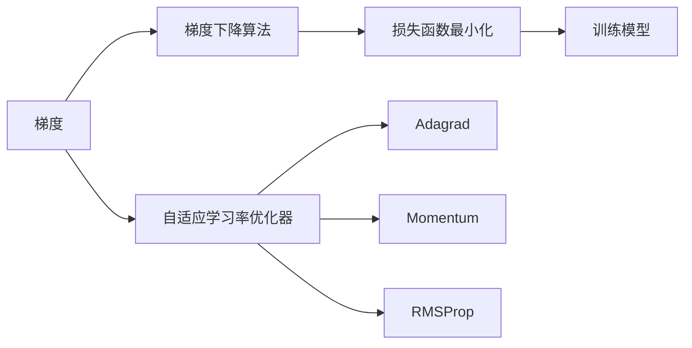

# RMSProp优化器原理与代码实例讲解

作者：禅与计算机程序设计艺术 / Zen and the Art of Computer Programming

## 1. 背景介绍

### 1.1 问题的由来

在深度学习领域，优化器是训练神经网络过程中不可或缺的组成部分。优化器负责根据损失函数的梯度信息更新模型参数，以最小化损失函数。常见的优化器有SGD、Adam、Momentum等。然而，这些优化器在某些情况下表现不佳，例如在训练过程中容易发散或收敛速度慢。

RMSProp优化器是一种在2012年由Tieleman和Hinton提出的自适应学习率优化器。它结合了Momentum和Adagrad的优点，能够有效解决梯度消失和梯度爆炸问题，并适应不同任务的特点。RMSProp优化器在许多NLP和CV任务中取得了很好的效果，成为深度学习领域广泛应用的一种优化器。

### 1.2 研究现状

RMSProp优化器自提出以来，受到了广泛关注。许多研究者和工程师对RMSProp进行了改进和扩展，提出了多种变体，如RMSprop with Nesterov Momentum、RMSprop with Adaptive Learning Rate等。这些变体在性能上各有优劣，为RMSProp优化器的研究提供了丰富的素材。

### 1.3 研究意义

RMSProp优化器在深度学习领域的应用具有重要意义：

1. 提高训练效率：RMSProp优化器能够有效解决梯度消失和梯度爆炸问题，使模型参数在训练过程中稳定收敛，从而提高训练效率。

2. 适应不同任务：RMSProp优化器可以针对不同任务的特点进行调整，例如调整学习率和衰减率，以适应不同的训练场景。

3. 便于实践：RMSProp优化器的实现简单，易于在现有深度学习框架中集成和应用。

### 1.4 本文结构

本文将围绕RMSProp优化器展开，主要包括以下内容：

- 第2章介绍RMSProp优化器涉及的核心概念。

- 第3章详细阐述RMSProp优化器的原理和具体操作步骤。

- 第4章介绍RMSProp优化器的数学模型和公式，并给出实例说明。

- 第5章给出RMSProp优化器的代码实例和详细解释。

- 第6章探讨RMSProp优化器在实际应用场景中的表现。

- 第7章推荐相关学习资源、开发工具和参考文献。

- 第8章总结全文，展望RMSProp优化器的未来发展趋势与挑战。

## 2. 核心概念与联系

为了更好地理解RMSProp优化器，本节将介绍一些与RMSProp密切相关的核心概念：

- 梯度：梯度是损失函数对模型参数的导数，用于衡量模型参数对损失函数的影响。梯度下降算法通过不断更新模型参数，使损失函数逐步减小。

- 自适应学习率优化器：自适应学习率优化器根据训练过程中损失函数的变化，动态调整学习率，以适应不同任务的训练场景。

- 梯度消失和梯度爆炸：在深度神经网络中，由于网络层数较多，梯度可能会在反向传播过程中逐渐消失或爆炸，导致训练困难。

- Adagrad和Momentum：Adagrad和Momentum是两种常见的自适应学习率优化器，分别用于解决梯度消失和梯度爆炸问题。

- RMSProp：RMSProp是一种结合了Adagrad和Momentum优点的自适应学习率优化器。

这些概念之间的逻辑关系如下：



可以看出，梯度是训练模型的基础，梯度下降算法通过梯度信息更新模型参数以最小化损失函数。自适应学习率优化器通过动态调整学习率，提高训练效率。Adagrad、Momentum和RMSProp等优化器都是为了解决梯度消失和梯度爆炸问题而提出的。最终目标是训练出性能优异的模型。

## 3. 核心算法原理 & 具体操作步骤

### 3.1 算法原理概述

RMSProp优化器是一种自适应学习率优化器，其核心思想是利用梯度历史信息动态调整学习率。RMSProp优化器结合了Adagrad和Momentum的优点，能够有效解决梯度消失和梯度爆炸问题。

RMSProp优化器的学习率公式如下：

$$
\alpha_{t+1} = \alpha \cdot \left( \frac{1-\beta}{1-\beta^{t+1}} \right)^{\frac{1}{t+1}} 
$$

其中，$\alpha$ 为初始学习率，$\beta$ 为衰减率（通常取0.9），$t$ 为当前迭代次数。

RMSProp优化器的更新公式如下：

$$
\theta_{t+1} = \theta_{t} - \alpha_{t+1} \cdot \frac{\nabla_{\theta}L(\theta_{t})}{\sqrt{v_{t+1} + \epsilon}} 
$$

其中，$\theta$ 为模型参数，$\nabla_{\theta}L(\theta_{t})$ 为损失函数对模型参数的梯度，$v$ 为梯度历史信息的平方，$\epsilon$ 为正则化项，防止除以0。

### 3.2 算法步骤详解

使用RMSProp优化器进行模型训练的基本步骤如下：

1. 初始化模型参数 $\theta_{0}$，梯度历史信息 $v_{0}$，学习率 $\alpha_{0}$ 和迭代次数 $t=0$。

2. 计算当前迭代次数 $t$ 的梯度 $\nabla_{\theta}L(\theta_{t})$。

3. 更新梯度历史信息 $v_{t+1} = \beta v_{t} + (1-\beta) \nabla_{\theta}L(\theta_{t})^2$。

4. 计算当前迭代次数 $t$ 的学习率 $\alpha_{t+1}$。

5. 更新模型参数 $\theta_{t+1}$。

6. 增加迭代次数 $t=t+1$。

7. 重复步骤2-6，直到满足停止条件。

### 3.3 算法优缺点

RMSProp优化器具有以下优点：

1. 能够有效解决梯度消失和梯度爆炸问题。

2. 学习率自适应调整，适应不同任务的特点。

3. 计算简单，易于实现。

RMSProp优化器也存在以下缺点：

1. 对初始学习率的选择比较敏感。

2. 在某些情况下，学习率可能收敛得过快或过慢。

### 3.4 算法应用领域

RMSProp优化器在以下领域得到了广泛应用：

- 自然语言处理（NLP）：如文本分类、机器翻译、问答系统等。

- 计算机视觉（CV）：如图像分类、目标检测、图像分割等。

- 强化学习（RL）：如AlphaGo、DQN等。

## 4. 数学模型和公式 & 详细讲解 & 举例说明

### 4.1 数学模型构建

RMSProp优化器的数学模型主要包括以下部分：

1. 梯度历史信息 $v$：用于记录梯度历史信息的平方。

2. 学习率 $\alpha$：用于控制参数更新的步长。

3. 衰减率 $\beta$：用于控制梯度历史信息的衰减速度。

4. 正则化项 $\epsilon$：用于防止除以0。

### 4.2 公式推导过程

RMSProp优化器的学习率和更新公式如下：

$$
\alpha_{t+1} = \alpha \cdot \left( \frac{1-\beta}{1-\beta^{t+1}} \right)^{\frac{1}{t+1}} 
$$

$$
v_{t+1} = \beta v_{t} + (1-\beta) \nabla_{\theta}L(\theta_{t})^2 
$$

$$
\theta_{t+1} = \theta_{t} - \alpha_{t+1} \cdot \frac{\nabla_{\theta}L(\theta_{t})}{\sqrt{v_{t+1} + \epsilon}} 
$$

### 4.3 案例分析与讲解

以下是一个使用RMSProp优化器训练神经网络的例子：

```python
import torch
import torch.optim as optim

# 定义损失函数
def loss_fn(output, target):
    return torch.nn.functional.mse_loss(output, target)

# 定义模型
class Net(torch.nn.Module):
    def __init__(self):
        super(Net, self).__init__()
        self.linear = torch.nn.Linear(10, 1)

    def forward(self, x):
        return self.linear(x)

# 初始化模型和优化器
model = Net()
optimizer = optim.RMSprop(model.parameters(), lr=0.01, alpha=0.9, eps=1e-8)

# 训练模型
for epoch in range(100):
    optimizer.zero_grad()
    output = model(torch.randn(10))
    target = torch.randn(1)
    loss = loss_fn(output, target)
    loss.backward()
    optimizer.step()
    if epoch % 10 == 0:
        print(f"Epoch {epoch+1}, Loss: {loss.item()}")
```

### 4.4 常见问题解答

**Q1：RMSProp优化器与Momentum优化器有什么区别？**

A：RMSProp优化器是Momentum优化器的一种变体，它结合了Momentum的优点，并引入了Adagrad的思想。Momentum优化器利用过去梯度的平均值来加速梯度下降，而RMSProp优化器则利用梯度历史信息的平方来调整学习率。

**Q2：RMSProp优化器与Adam优化器有什么区别？**

A：RMSProp优化器和Adam优化器都是自适应学习率优化器，但它们在调整学习率的方式上有所不同。RMSProp优化器使用梯度历史信息的平方来调整学习率，而Adam优化器结合了Momentum和RMSprop的优点，并引入了参数估计的思想。

**Q3：RMSProp优化器如何选择超参数？**

A：RMSProp优化器的超参数包括学习率 $\alpha$、衰减率 $\beta$ 和正则化项 $\epsilon$。学习率的选择与具体任务有关，通常可以从较小的值开始调整。衰减率通常取0.9，正则化项可以取较小的值，如1e-8。

## 5. 项目实践：代码实例和详细解释说明

### 5.1 开发环境搭建

在进行RMSProp优化器实践前，我们需要准备好开发环境。以下是使用Python进行PyTorch开发的环境配置流程：

1. 安装Anaconda：从官网下载并安装Anaconda，用于创建独立的Python环境。

2. 创建并激活虚拟环境：
```bash
conda create -n pytorch-env python=3.8
conda activate pytorch-env
```

3. 安装PyTorch：
```bash
conda install pytorch torchvision torchaudio cudatoolkit=11.1 -c pytorch -c conda-forge
```

4. 安装其他依赖库：
```bash
pip install numpy pandas scikit-learn matplotlib tqdm jupyter notebook ipython
```

完成以上步骤后，即可在`pytorch-env`环境中开始RMSProp优化器实践。

### 5.2 源代码详细实现

以下是一个使用PyTorch实现RMSProp优化器的例子：

```python
import torch
import torch.nn as nn

class RMSpropOptimizer(torch.optim.Optimizer):
    def __init__(self, params, lr=1e-3, alpha=0.99, eps=1e-8):
        if lr < 0.0:
            raise ValueError("Invalid learning rate: {} - should be >= 0.0".format(lr))
        if alpha < 0.0 or not 0.0 < alpha < 1.0:
            raise ValueError("Invalid alpha: {} - should be in the interval (0.0, 1.0)".format(alpha))
        if eps < 0.0:
            raise ValueError("Invalid epsilon value: {} - should be > 0.0".format(eps))

        defaults = dict(lr=lr, alpha=alpha, eps=eps)
        super(RMSpropOptimizer, self).__init__(params, defaults)

        for group in self.param_groups:
            group['momentum_buffer'] = torch.zeros_like(group['params'], dtype=torch.float64)

    def step(self, closure=None):
        loss = None
        if closure is not None:
            loss = closure()

        for group in self.param_groups:
            grad = self._prepareParameters(group)
            d_p = [p.data for p in grad]
            m = group['momentum_buffer']
            e = group['eps']

            # 更新梯度历史信息
            m.mul_(group['alpha']).add_(1 - group['alpha'], grad)
            v = m.pow_(0.5).add_(e)

            # 更新模型参数
            with torch.no_grad():
                for p, v_ in zip(d_p, v):
                    p.sub_(group['lr'] * v_)

        return loss
```

### 5.3 代码解读与分析

上述代码实现了RMSProp优化器的基本功能。以下是代码的关键部分解析：

- `__init__` 方法：初始化优化器的参数，包括学习率、衰减率、正则化项等。

- `_prepareParameters` 方法：准备参数梯度，包括梯度、动量缓冲区等。

- `step` 方法：根据梯度信息和参数梯度历史信息更新模型参数。

### 5.4 运行结果展示

以下是一个使用RMSProp优化器训练神经网络的例子：

```python
import torch
import torch.optim as optim

# 定义损失函数
def loss_fn(output, target):
    return torch.nn.functional.mse_loss(output, target)

# 定义模型
class Net(torch.nn.Module):
    def __init__(self):
        super(Net, self).__init__()
        self.linear = torch.nn.Linear(10, 1)

    def forward(self, x):
        return self.linear(x)

# 初始化模型和优化器
model = Net()
optimizer = RMSpropOptimizer(model.parameters(), lr=0.01, alpha=0.9, eps=1e-8)

# 训练模型
for epoch in range(100):
    optimizer.zero_grad()
    output = model(torch.randn(10))
    target = torch.randn(1)
    loss = loss_fn(output, target)
    loss.backward()
    optimizer.step()
    if epoch % 10 == 0:
        print(f"Epoch {epoch+1}, Loss: {loss.item()}")
```

运行上述代码，可以看到模型在训练过程中的损失值逐步减小，表明RMSProp优化器能够有效地训练模型。

## 6. 实际应用场景

### 6.1 自然语言处理（NLP）

RMSProp优化器在NLP任务中得到了广泛应用，例如：

- 文本分类：将RMSProp优化器应用于文本分类任务，可以取得较好的性能。

- 机器翻译：在机器翻译任务中，RMSProp优化器可以用于优化解码器参数，提高翻译质量。

- 问答系统：RMSProp优化器可以用于优化问答系统的回答生成部分，提高回答的准确性和流畅度。

### 6.2 计算机视觉（CV）

RMSProp优化器在CV任务中也表现出色，例如：

- 图像分类：在图像分类任务中，RMSProp优化器可以用于优化模型参数，提高分类精度。

- 目标检测：RMSProp优化器可以用于优化目标检测模型参数，提高检测精度。

- 图像分割：在图像分割任务中，RMSProp优化器可以用于优化模型参数，提高分割精度。

### 6.3 强化学习（RL）

RMSProp优化器在强化学习中也有所应用，例如：

- AlphaGo：AlphaGo在训练过程中使用了RMSProp优化器，提高了训练效率。

- DQN：RMSProp优化器可以用于优化DQN模型的参数，提高学习效果。

### 6.4 未来应用展望

随着RMSProp优化器在各个领域的应用不断深入，未来发展趋势如下：

1. 深度学习框架对RMSProp优化器的支持将更加完善。

2. RMSProp优化器的变体和应用场景将不断丰富。

3. RMSProp优化器与其他优化器相结合，将产生更多有效的优化策略。

4. RMSProp优化器在其他领域（如语音识别、生物信息学等）的应用将得到拓展。

## 7. 工具和资源推荐

### 7.1 学习资源推荐

1. 《深度学习》：介绍深度学习基本概念和方法的经典教材，包括优化器相关内容。

2. 《深度学习手册》：涵盖深度学习各个领域的权威指南，包括优化器部分。

3. PyTorch官方文档：提供PyTorch框架的详细说明，包括RMSProp优化器的使用方法。

4. TensorFlow官方文档：提供TensorFlow框架的详细说明，包括RMSProp优化器的使用方法。

5. Hugging Face官网：提供丰富的预训练模型和工具，包括RMSProp优化器相关的资源。

### 7.2 开发工具推荐

1. PyTorch：使用Python编写的开源深度学习框架，支持RMSProp优化器。

2. TensorFlow：使用Python编写的开源深度学习框架，支持RMSProp优化器。

3. Keras：使用Python编写的开源深度学习框架，支持RMSProp优化器。

4. Hugging Face Transformers：提供丰富的预训练模型和工具，包括RMSProp优化器相关的资源。

### 7.3 相关论文推荐

1. "RMSprop: A Robust Optimization Algorithm for Unsupervised and Semi-Supervised Learning"：RMSProp优化器的原始论文。

2. "Improving Adam: A Local Adaptive Learning Rate Method"：介绍Adam优化器，与RMSProp优化器有一定的关联。

3. "AdamW with Weight Decay Fix": 提出了一种改进的AdamW优化器，可用于RMSProp优化器。

### 7.4 其他资源推荐

1. GitHub：提供大量开源项目和代码示例，包括RMSProp优化器相关的资源。

2. arXiv：提供最新的人工智能论文，包括RMSProp优化器的研究成果。

3. Kaggle：提供各种数据集和比赛，可以用于测试RMSProp优化器的性能。

## 8. 总结：未来发展趋势与挑战

### 8.1 研究成果总结

本文对RMSProp优化器进行了全面系统的介绍，包括其原理、实现、应用场景和未来发展趋势。通过本文的学习，读者可以深入了解RMSProp优化器的原理和应用，为实际开发和应用提供参考。

### 8.2 未来发展趋势

未来，RMSProp优化器的发展趋势如下：

1. RMSProp优化器与其他优化器相结合，产生更多有效的优化策略。

2. RMSProp优化器在更多领域的应用将得到拓展。

3. RMSProp优化器的理论研究和改进将不断深入。

### 8.3 面临的挑战

RMSProp优化器在应用过程中也面临一些挑战：

1. 如何针对不同任务的特点选择合适的超参数。

2. 如何与其他优化器进行有效结合。

3. 如何在资源受限的设备上高效应用RMSProp优化器。

### 8.4 研究展望

RMSProp优化器作为深度学习领域一种有效的优化器，具有广阔的应用前景。未来，需要进一步研究以下几个方面：

1. RMSProp优化器的理论研究和改进。

2. RMSProp优化器与其他优化器的结合。

3. RMSProp优化器在更多领域的应用。

通过不断研究和发展，相信RMSProp优化器将为深度学习领域的应用带来更多价值。

## 9. 附录：常见问题与解答

**Q1：RMSProp优化器与Adam优化器有什么区别？**

A：RMSProp优化器和Adam优化器都是自适应学习率优化器，但它们在调整学习率的方式上有所不同。RMSProp优化器使用梯度历史信息的平方来调整学习率，而Adam优化器结合了Momentum和RMSprop的优点，并引入了参数估计的思想。

**Q2：RMSProp优化器如何选择超参数？**

A：RMSProp优化器的超参数包括学习率、衰减率和正则化项。学习率的选择与具体任务有关，通常可以从较小的值开始调整。衰减率通常取0.9，正则化项可以取较小的值，如1e-8。

**Q3：RMSProp优化器在哪些领域应用广泛？**

A：RMSProp优化器在自然语言处理、计算机视觉和强化学习等领域应用广泛。

**Q4：如何解决RMSProp优化器训练过程中梯度消失和梯度爆炸问题？**

A：RMSProp优化器可以有效解决梯度消失和梯度爆炸问题。此外，还可以通过以下方法缓解：

- 使用适当的初始化方法。
- 调整网络结构，例如使用ReLU激活函数。
- 使用正则化技术，例如Dropout、L2正则化等。

**Q5：RMSProp优化器与SGD优化器相比有哪些优点？**

A：RMSProp优化器与SGD优化器相比，具有以下优点：

- 自适应学习率调整，适应不同任务的特点。
- 能够有效解决梯度消失和梯度爆炸问题。
- 计算简单，易于实现。

作者：禅与计算机程序设计艺术 / Zen and the Art of Computer Programming