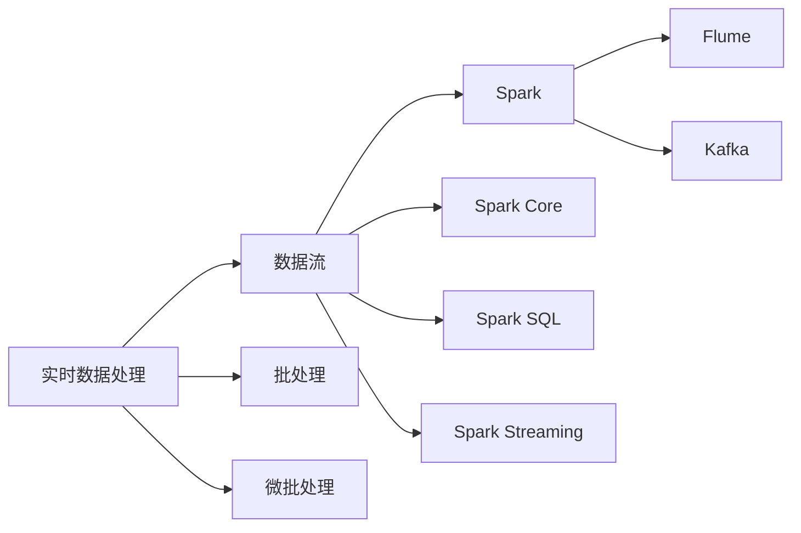

# Spark Streaming原理与代码实例讲解

作者：禅与计算机程序设计艺术 / Zen and the Art of Computer Programming

## 1. 背景介绍

### 1.1 问题的由来

随着互联网和物联网的快速发展，实时数据处理的需求日益增长。传统的批处理系统在实时处理、低延迟等方面存在局限性，难以满足实时性要求较高的应用场景。因此，需要一种能够实时处理大量数据的新技术。

Spark Streaming应运而生，它是Apache Spark生态系统中的一个重要组件，能够对实时数据进行流处理，并提供丰富的API接口，方便开发者进行实时数据处理和分析。

### 1.2 研究现状

自2011年Apache Spark项目启动以来，Spark Streaming已经发展成为一个功能强大、性能优秀的实时数据流处理框架。目前，Spark Streaming在业界得到了广泛应用，被许多知名公司用于实时数据处理和分析，如阿里巴巴、腾讯、美团等。

### 1.3 研究意义

Spark Streaming作为实时数据流处理框架，具有以下重要意义：

- **实时数据处理**：Spark Streaming能够实时处理海量数据，满足实时性要求较高的应用场景。
- **高吞吐量**：Spark Streaming具有高吞吐量，能够处理每秒数百万条记录。
- **易用性**：Spark Streaming提供了丰富的API接口，方便开发者进行实时数据处理和分析。
- **弹性扩展**：Spark Streaming支持弹性扩展，能够根据负载情况自动调整资源分配。
- **容错性**：Spark Streaming具有高容错性，能够在发生故障时自动恢复。

### 1.4 本文结构

本文将详细介绍Spark Streaming的原理、核心算法、代码实例以及实际应用场景，内容安排如下：

- 第2部分，介绍Spark Streaming的核心概念和与相关技术的联系。
- 第3部分，深入讲解Spark Streaming的核心算法原理和具体操作步骤。
- 第4部分，以代码实例的形式展示Spark Streaming的使用方法，并对关键代码进行解读和分析。
- 第5部分，探讨Spark Streaming在实际应用场景中的应用案例。
- 第6部分，展望Spark Streaming的未来发展趋势和挑战。
- 第7部分，推荐Spark Streaming相关的学习资源、开发工具和参考文献。
- 第8部分，总结全文，展望Spark Streaming技术的未来发展趋势与挑战。

## 2. 核心概念与联系

为了更好地理解Spark Streaming，本节将介绍几个密切相关的核心概念：

- **实时数据处理**：实时数据处理是指对数据流进行实时采集、存储、处理和分析的技术。
- **数据流**：数据流是指连续不断地产生、传输和消费的数据序列。
- **批处理**：批处理是指将数据分成批次进行处理，每批数据之间相互独立。
- **微批处理**：微批处理是指将数据分成微批次进行处理，每个微批次的数据量较小。
- **Spark**：Apache Spark是一个开源的分布式计算系统，能够对大规模数据进行快速处理和分析。
- **Spark Core**：Spark Core是Spark的核心模块，提供分布式计算的基础设施。
- **Spark SQL**：Spark SQL是Spark的分布式SQL和DataFrame查询引擎。
- **Spark Streaming**：Spark Streaming是Spark的一个模块，用于实时数据处理。
- **Kafka**：Kafka是一个高吞吐量的分布式消息队列系统，适用于实时数据流处理。
- **Flume**：Flume是一个分布式、可靠、可伸缩的数据收集系统，用于将数据从多个来源移动到统一的数据存储系统中。

它们的逻辑关系如下图所示：



可以看出，Spark Streaming是Spark生态系统中的一个模块，用于实时数据处理。数据流可以来自多种数据源，如Kafka、Flume等，并最终在Spark Streaming中进行处理和分析。

## 3. 核心算法原理 & 具体操作步骤

### 3.1 算法原理概述

Spark Streaming的核心算法原理是将实时数据流分解成微批次，然后对每个微批次进行批处理。具体而言，Spark Streaming采用以下步骤：

1. **数据采集**：从数据源（如Kafka、Flume等）中采集实时数据。
2. **微批次生成**：将实时数据分批处理，每批数据称为一个微批次。
3. **批处理**：对每个微批次进行批处理，使用Spark的批处理能力进行数据处理和分析。
4. **输出**：将处理后的数据输出到目标系统（如HDFS、数据库等）。

### 3.2 算法步骤详解

以下是Spark Streaming的详细操作步骤：

**Step 1：初始化Spark Streaming**

```scala
val ssc = new StreamingContext(sc, Seconds(1))
```

其中，`sc` 是SparkContext对象，`Seconds(1)` 表示批处理间隔为1秒。

**Step 2：从数据源中采集数据**

```scala
val lines = ssc.socketTextStream("localhost", 9999)
```

这里假设我们从本地的9999端口接收实时文本数据。

**Step 3：处理数据**

```scala
val words = lines.flatMap(_.split(" "))
val wordCounts = words.map(x => (x, 1)).reduceByKey(_ + _)
```

这里我们对采集到的文本数据进行分词，并统计每个单词出现的次数。

**Step 4：启动Spark Streaming**

```scala
ssc.start()
```

**Step 5：等待程序停止**

```scala
ssc.awaitTermination()
```

### 3.3 算法优缺点

Spark Streaming的算法优点如下：

- **高吞吐量**：Spark Streaming能够处理每秒数百万条记录，满足实时性要求较高的应用场景。
- **低延迟**：Spark Streaming的批处理间隔可以设置为毫秒级别，降低数据处理延迟。
- **易用性**：Spark Streaming提供了丰富的API接口，方便开发者进行实时数据处理和分析。
- **弹性扩展**：Spark Streaming支持弹性扩展，能够根据负载情况自动调整资源分配。
- **容错性**：Spark Streaming具有高容错性，能够在发生故障时自动恢复。

Spark Streaming的算法缺点如下：

- **资源消耗**：Spark Streaming需要一定的资源消耗，包括CPU、内存和存储等。
- **学习成本**：Spark Streaming的学习成本相对较高，需要掌握Scala或Python语言和Spark生态系统的相关知识。

### 3.4 算法应用领域

Spark Streaming的算法应用领域如下：

- **实时监控**：实时监控网络流量、服务器性能等指标。
- **实时推荐**：实时推荐新闻、商品、音乐等。
- **实时广告**：实时投放广告，提高广告投放效率。
- **实时金融风控**：实时识别异常交易，防范金融风险。
- **实时物联网数据分析**：实时分析物联网设备数据，实现设备故障预警等。

## 4. 数学模型和公式 & 详细讲解 & 举例说明

### 4.1 数学模型构建

Spark Streaming的数学模型可以表示为以下公式：

$$
\text{Spark Streaming} = \text{数据采集} + \text{微批次生成} + \text{批处理} + \text{输出}
$$

其中：

- 数据采集：指从数据源中采集实时数据。
- 微批次生成：指将实时数据分批处理，每批数据称为一个微批次。
- 批处理：指对每个微批次进行批处理，使用Spark的批处理能力进行数据处理和分析。
- 输出：指将处理后的数据输出到目标系统。

### 4.2 公式推导过程

Spark Streaming的公式推导过程如下：

1. **数据采集**：从数据源中采集实时数据，形成数据流。
2. **微批次生成**：将数据流分批处理，每批数据称为一个微批次。
3. **批处理**：对每个微批次进行批处理，使用Spark的批处理能力进行数据处理和分析。
4. **输出**：将处理后的数据输出到目标系统。

### 4.3 案例分析与讲解

以下是一个使用Spark Streaming进行实时词频统计的案例：

```scala
val lines = ssc.socketTextStream("localhost", 9999)
val words = lines.flatMap(_.split(" "))
val wordCounts = words.map(x => (x, 1)).reduceByKey(_ + _)
wordCounts.print()
```

在这个案例中，我们从本地的9999端口接收实时文本数据，对数据进行分词，并统计每个单词出现的次数，最后将结果输出到控制台。

### 4.4 常见问题解答

**Q1：Spark Streaming的批处理间隔是多少？**

A：Spark Streaming的批处理间隔可以设置为毫秒级别，默认值为200毫秒。

**Q2：Spark Streaming可以处理哪些类型的数据？**

A：Spark Streaming可以处理各种类型的数据，包括文本、图像、音频、视频等。

**Q3：Spark Streaming的数据源有哪些？**

A：Spark Streaming支持多种数据源，包括Kafka、Flume、Kinesis、Twitter、ZeroMQ、RabbitMQ等。

## 5. 项目实践：代码实例和详细解释说明

### 5.1 开发环境搭建

为了进行Spark Streaming项目实践，需要搭建以下开发环境：

- Java环境：安装Java 8及以上版本。
- Scala环境：安装Scala 2.11及以上版本。
- Spark环境：下载并安装Spark 2.4及以上版本。
- IntelliJ IDEA：安装IntelliJ IDEA，并导入Spark项目。

### 5.2 源代码详细实现

以下是一个使用Spark Streaming进行实时词频统计的代码实例：

```scala
val lines = ssc.socketTextStream("localhost", 9999)
val words = lines.flatMap(_.split(" "))
val wordCounts = words.map(x => (x, 1)).reduceByKey(_ + _)
wordCounts.print()
```

在这个代码实例中，我们从本地的9999端口接收实时文本数据，对数据进行分词，并统计每个单词出现的次数，最后将结果输出到控制台。

### 5.3 代码解读与分析

在这个代码实例中，我们首先创建了一个Spark Streaming上下文`ssc`，并设置了批处理间隔为1秒。然后，我们从本地的9999端口接收实时文本数据，并使用`flatMap`方法对数据进行分词。接下来，我们使用`map`方法将每个单词映射为一个元组`(word, 1)`，并使用`reduceByKey`方法对元组进行聚合，统计每个单词出现的次数。最后，我们使用`print`方法将结果输出到控制台。

### 5.4 运行结果展示

假设我们在本地启动了一个简单的TCP服务，监听9999端口，并不断发送文本数据。运行上述代码后，控制台将实时显示每个单词出现的次数。

## 6. 实际应用场景

### 6.1 实时监控

Spark Streaming可以用于实时监控网络流量、服务器性能等指标。例如，可以对接入日志、操作日志等数据进行实时分析，及时发现异常情况。

### 6.2 实时推荐

Spark Streaming可以用于实时推荐新闻、商品、音乐等。例如，可以对接入的搜索日志、点击日志等数据进行实时分析，动态更新推荐列表。

### 6.3 实时广告

Spark Streaming可以用于实时投放广告，提高广告投放效率。例如，可以对接入的点击日志、用户行为等数据进行实时分析，实现精准广告投放。

### 6.4 实时金融风控

Spark Streaming可以用于实时识别异常交易，防范金融风险。例如，可以对接入的交易数据进行实时分析，及时发现异常交易并进行预警。

### 6.5 实时物联网数据分析

Spark Streaming可以用于实时分析物联网设备数据，实现设备故障预警等。例如，可以对接入的传感器数据进行实时分析，及时发现设备故障并进行预警。

## 7. 工具和资源推荐

### 7.1 学习资源推荐

为了帮助开发者掌握Spark Streaming技术，以下是一些学习资源推荐：

- 《Spark Streaming编程指南》
- Spark官网：[https://spark.apache.org/](https://spark.apache.org/)
- Spark社区：[https://spark.apache.org/community.html](https://spark.apache.org/community.html)

### 7.2 开发工具推荐

为了进行Spark Streaming开发，以下是一些开发工具推荐：

- IntelliJ IDEA
- PyCharm
- Scala IDE

### 7.3 相关论文推荐

以下是一些与Spark Streaming相关的论文推荐：

- Spark: Spark: A unified engine for big data processing
- Spark Streaming: High-throughput, fault-tolerant streaming processing at scale

### 7.4 其他资源推荐

以下是一些与Spark Streaming相关的其他资源推荐：

- Spark源码：[https://github.com/apache/spark](https://github.com/apache/spark)
- Spark社区论坛：[https://spark.apache.org/docs/latest/streaming.html](https://spark.apache.org/docs/latest/streaming.html)

## 8. 总结：未来发展趋势与挑战

### 8.1 研究成果总结

本文详细介绍了Spark Streaming的原理、核心算法、代码实例以及实际应用场景。通过本文的学习，读者可以全面了解Spark Streaming技术，并能够将其应用于实际项目中。

### 8.2 未来发展趋势

未来，Spark Streaming技术将在以下方面继续发展：

- **性能优化**：进一步提升Spark Streaming的性能，降低延迟，提高吞吐量。
- **功能扩展**：扩展Spark Streaming的功能，支持更多类型的数据源和数据处理操作。
- **易用性提升**：简化Spark Streaming的API接口，降低开发门槛。
- **跨平台支持**：支持更多平台，如Android、iOS等。

### 8.3 面临的挑战

Spark Streaming技术在实际应用中仍面临以下挑战：

- **资源消耗**：Spark Streaming需要一定的资源消耗，包括CPU、内存和存储等。
- **学习成本**：Spark Streaming的学习成本相对较高，需要掌握Scala或Python语言和Spark生态系统的相关知识。
- **数据安全**：实时数据的安全性和隐私保护需要得到重视。

### 8.4 研究展望

展望未来，Spark Streaming技术将在以下方面展开研究：

- **混合架构**：将Spark Streaming与内存数据库、内存缓存等技术结合，构建混合架构的实时数据处理系统。
- **云计算**：将Spark Streaming应用于云计算平台，实现弹性扩展和高效计算。
- **边缘计算**：将Spark Streaming应用于边缘计算场景，实现实时数据本地处理。

相信随着技术的不断发展，Spark Streaming将更好地满足实时数据处理的挑战，为构建智能化的未来世界贡献力量。

## 9. 附录：常见问题与解答

**Q1：Spark Streaming与Flink、Kafka Stream Processing有何区别？**

A：Spark Streaming、Flink和Kafka Stream Processing都是实时数据流处理框架，但它们之间存在一些区别：

- **Spark Streaming**：基于Spark生态系统，具有高吞吐量、低延迟、易用性等特点。
- **Flink**：基于Apache Flink项目，具有高性能、容错性、易用性等特点。
- **Kafka Stream Processing**：基于Apache Kafka项目，提供高吞吐量的消息队列，可与其他流处理框架结合使用。

**Q2：Spark Streaming如何处理大量数据？**

A：Spark Streaming通过以下方式处理大量数据：

- **分布式计算**：Spark Streaming采用分布式计算架构，将数据分散到多个节点上进行处理。
- **内存计算**：Spark Streaming利用内存计算能力，提高数据处理速度。
- **容错性**：Spark Streaming具有高容错性，能够在发生故障时自动恢复。

**Q3：Spark Streaming如何保证实时性？**

A：Spark Streaming通过以下方式保证实时性：

- **微批次**：Spark Streaming将实时数据分批处理，每批数据称为一个微批次。
- **低延迟**：Spark Streaming的批处理间隔可以设置为毫秒级别，降低数据处理延迟。

**Q4：Spark Streaming如何处理异常情况？**

A：Spark Streaming通过以下方式处理异常情况：

- **容错性**：Spark Streaming具有高容错性，能够在发生故障时自动恢复。
- **自动恢复**：Spark Streaming在发生故障时，会自动恢复到最近一次成功的checkpoint。
- **监控告警**：Spark Streaming可以配置监控和告警机制，及时发现并处理异常情况。

Spark Streaming作为实时数据流处理框架，在互联网、物联网、金融等行业领域得到了广泛应用。通过本文的学习，读者可以全面了解Spark Streaming技术，并能够将其应用于实际项目中，为构建智能化的未来世界贡献力量。