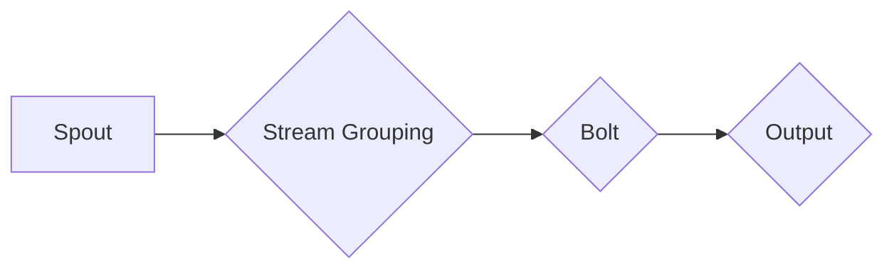
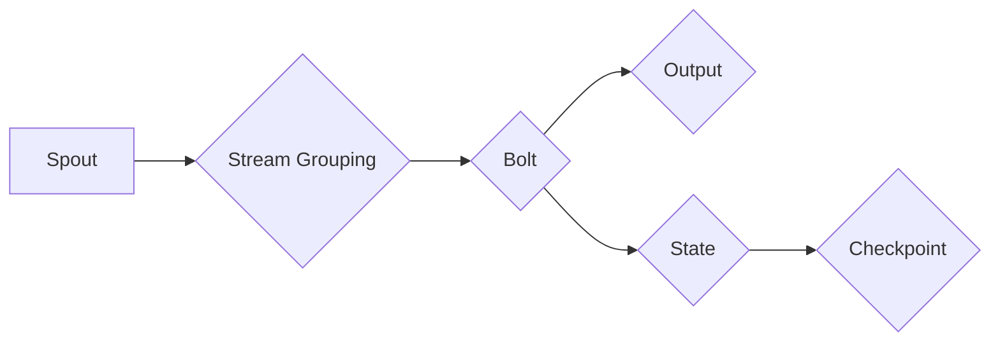

# Storm原理与代码实例讲解

作者：禅与计算机程序设计艺术 / Zen and the Art of Computer Programming

## 1. 背景介绍
### 1.1 问题的由来

随着互联网的快速发展，大数据处理需求日益旺盛。如何高效、可靠地处理海量实时数据，成为迫切需要解决的问题。Apache Storm作为一种分布式实时计算框架，应运而生，成为解决这一问题的有力工具。

### 1.2 研究现状

Apache Storm自2009年开源以来，经历了多年的发展，已经成为了大数据领域的事实标准之一。它具有高可靠性、可伸缩性、易用性等优点，被广泛应用于金融、电商、社交、物联网等多个领域。

### 1.3 研究意义

学习Apache Storm，有助于我们深入理解分布式实时计算框架的原理，掌握实时数据处理技术，并将其应用于实际项目中，解决海量实时数据处理的难题。

### 1.4 本文结构

本文将从以下方面对Apache Storm进行介绍：

- 核心概念与联系
- 核心算法原理与具体操作步骤
- 数学模型和公式
- 项目实践：代码实例与详细解释说明
- 实际应用场景
- 工具和资源推荐
- 总结：未来发展趋势与挑战
- 附录：常见问题与解答

## 2. 核心概念与联系

Apache Storm的核心概念主要包括：

- Topology：表示一个数据流处理的完整流程，由多个Bolt和Spout组成。
- Bolt：执行具体数据处理的组件，负责处理数据、输出结果等操作。
- Spout：负责生成数据流的组件，可以是外部数据源，如Kafka、Twitter等。
- Stream：表示数据流，由一系列Tuple组成，Tuple是数据的基本单元。
- Stream Grouping：定义数据如何在Bolt之间进行分发。

这些概念之间的关系可以用以下Mermaid流程图表示：



### 2.1 Topology

Topology是Storm中的核心概念，它定义了一个数据流处理的完整流程。一个Topology由多个Bolt和Spout组成，它们之间通过Stream连接，形成一个数据流处理的流水线。

### 2.2 Bolt

Bolt是执行具体数据处理的组件，负责处理数据、输出结果等操作。每个Bolt可以定义多个输出流，将处理结果输出到其他Bolt或外部系统。

### 2.3 Spout

Spout负责生成数据流，可以是外部数据源，如Kafka、Twitter、数据库等。Spout可以按照不同的策略生成Tuple，如随机生成、顺序生成等。

### 2.4 Stream

Stream表示数据流，由一系列Tuple组成。Tuple是数据的基本单元，包含一个或多个字段，用于表示数据的结构和语义。

### 2.5 Stream Grouping

Stream Grouping定义了数据如何在Bolt之间进行分发。常见的分组策略包括随机分组、字段分组、全散列分组等。

## 3. 核心算法原理与具体操作步骤
### 3.1 算法原理概述

Apache Storm的原理可以概括为以下几步：

1. Spout生成Tuple，并将其发送到Stream中。
2. Tuple通过Stream Grouping策略，被分发到相应的Bolt。
3. Bolt接收Tuple，进行处理，并将结果输出到输出流中。
4. 输出流可以将数据发送到其他Bolt或外部系统。

### 3.2 算法步骤详解

以下是Apache Storm微批处理模型的基本步骤：

1. **Spout发射Tuple**：Spout从外部数据源读取数据，并将其转换为Tuple。每个Tuple包含一个或多个字段，用于表示数据的结构和语义。

2. **Bolt接收Tuple**：根据Stream Grouping策略，Tuple被分发到相应的Bolt。

3. **Bolt处理Tuple**：Bolt对Tuple进行必要的处理，如过滤、计算、聚合等操作。

4. **Bolt发射Tuple**：Bolt将处理结果输出到输出流中。

5. **Tuple到达目标Bolt**：目标Bolt从输入流中接收Tuple，并进行相应的处理。

6. **数据持久化**：对于需要持久化的数据，可以在Bolt中实现相应的持久化逻辑。

### 3.3 算法优缺点

Apache Storm具有以下优点：

- **高可靠性**：Storm具有强大的容错机制，可以保证数据处理的可靠性。
- **可伸缩性**：Storm可以水平扩展，适应大规模数据处理需求。
- **易用性**：Storm提供丰富的API和工具，方便开发者进行开发、部署和监控。

Apache Storm的缺点主要包括：

- **资源消耗较大**：由于Storm采用了分布式计算架构，因此对资源消耗较大。
- **学习曲线较陡**：对于初学者来说，学习Apache Storm需要一定的门槛。

### 3.4 算法应用领域

Apache Storm在以下领域得到了广泛应用：

- 实时数据监控与分析
- 实时日志处理
- 实时推荐系统
- 实时广告系统
- 实时物联网数据处理

## 4. 数学模型和公式 & 详细讲解 & 举例说明
### 4.1 数学模型构建

Apache Storm的数学模型主要包括以下几部分：

- **流处理模型**：描述了数据流在Storm中的处理过程。
- **容错模型**：描述了Storm的容错机制。
- **伸缩模型**：描述了Storm的伸缩机制。

以下是用Mermaid语言表示的流处理模型：


以下是用Mermaid语言表示的容错模型：



### 4.2 公式推导过程

由于Apache Storm的数学模型较为复杂，这里不进行详细的推导过程。

### 4.3 案例分析与讲解

以下是一个简单的Apache Storm拓扑结构，用于实时统计网络流量：

```java
TopologyBuilder builder = new TopologyBuilder();
builder.setSpout("spout1", new NetworkSpout(), 4);
builder.setBolt("bolt1", new NetworkBolt(), 4).fieldsGrouping("spout1", new Fields("tupleId"));
builder.setBolt("bolt2", new CountBolt(), 4).fieldsGrouping("bolt1", new Fields("tupleId"));
```

在这个例子中，`NetworkSpout`从网络中读取数据，并将其发送到`bolt1`。`bolt1`对数据进行处理，并将结果输出到`bolt2`。`bolt2`统计每个Tuple的计数，并将统计结果输出到外部系统。

### 4.4 常见问题解答

**Q1：什么是Tuple？**

A：Tuple是Storm中的数据单元，用于表示数据的基本结构。每个Tuple包含一个或多个字段，用于表示数据的结构和语义。

**Q2：什么是Stream？**

A：Stream表示数据流，由一系列Tuple组成。Stream是Spout和Bolt之间传输数据的通道。

**Q3：什么是Stream Grouping？**

A：Stream Grouping定义了数据如何在Bolt之间进行分发。常见的分组策略包括随机分组、字段分组、全散列分组等。

## 5. 项目实践：代码实例和详细解释说明
### 5.1 开发环境搭建

以下是使用Apache Storm进行开发的环境搭建步骤：

1. 下载Apache Storm源码：从Apache Storm官网下载源码。
2. 配置开发环境：根据操作系统选择相应的开发环境配置方法。
3. 编写代码：使用Java或Scala编写Storm拓扑结构。

### 5.2 源代码详细实现

以下是一个简单的Apache Storm拓扑结构示例：

```java
import org.apache.storm.Config;
import org.apache.storm.LocalCluster;
import org.apache.storm.topology.TopologyBuilder;
import org.apache.storm.topology.IRichBolt;
import org.apache.storm.topology.IRichSpout;
import org.apache.storm.tuple.Tuple;
import org.apache.storm.task.TopologyContext;
import org.apache.storm.task.IBolt;
import org.apache.storm.task.ISpout;
import org.apache.storm.tuple.Fields;

public class SimpleTopology {
    public static void main(String[] args) throws InterruptedException {
        TopologyBuilder builder = new TopologyBuilder();
        builder.setSpout("spout1", new RandomSpout(), 4);
        builder.setBolt("bolt1", new PrintBolt(), 4).fieldsGrouping("spout1", new Fields("tupleId"));
        builder.setBolt("bolt2", new CountBolt(), 4).fieldsGrouping("bolt1", new Fields("tupleId"));
        
        Config config = new Config();
        config.setNumWorkers(4);
        config.setDebug(true);
        
        LocalCluster cluster = new LocalCluster();
        cluster.submitTopology("simple-topology", config, builder.createTopology());
        Thread.sleep(10000);
        cluster.shutdown();
    }
    
    public static class RandomSpout implements IRichSpout {
        private Random random = new Random();
        
        @Override
        public void open(Map conf, TopologyContext context, SpoutOutputCollector collector) {
        }
        
        @Override
        public void nextTuple() {
            String tupleId = String.valueOf(random.nextInt(1000));
            collector.emit(new Values(tupleId));
            try {
                Thread.sleep(100);
            } catch (InterruptedException e) {
                e.printStackTrace();
            }
        }
        
        @Override
        public void declareOutputFields(OutputFieldsDeclarer declarer) {
            declarer.declare(new Fields("tupleId"));
        }
        
        @Override
        public void close() {
        }
    }
    
    public static class PrintBolt implements IRichBolt {
        @Override
        public void prepare(Map conf, TopologyContext context, SpoutOutputCollector collector) {
        }
        
        @Override
        public void execute(Tuple input) {
            System.out.println("Received tuple: " + input.getString(0));
        }
        
        @Override
        public void cleanup() {
        }
        
        @Override
        public void declareOutputFields(OutputFieldsDeclarer declarer) {
        }
        
        @Override
        public Map<String, Object> getComponentConfiguration() {
            return null;
        }
    }
    
    public static class CountBolt implements IRichBolt {
        private Map<String, Integer> counts = new HashMap<>();
        
        @Override
        public void prepare(Map conf, TopologyContext context, SpoutOutputCollector collector) {
        }
        
        @Override
        public void execute(Tuple input) {
            String tupleId = input.getString(0);
            Integer count = counts.getOrDefault(tupleId, 0);
            count++;
            counts.put(tupleId, count);
            System.out.println("Count for tupleId " + tupleId + ": " + count);
        }
        
        @Override
        public void cleanup() {
        }
        
        @Override
        public void declareOutputFields(OutputFieldsDeclarer declarer) {
        }
        
        @Override
        public Map<String, Object> getComponentConfiguration() {
            return null;
        }
    }
}
```

### 5.3 代码解读与分析

以上代码展示了如何使用Apache Storm进行简单的数据统计。在`SimpleTopology`类中，我们定义了一个包含Spout、Bolt和Stream Grouping的拓扑结构。`RandomSpout`从随机数生成器中生成Tuple，并输出到`bolt1`。`PrintBolt`打印接收到的Tuple。`CountBolt`对每个Tuple进行计数，并将计数结果输出到控制台。

在`RandomSpout`类中，我们实现了`nextTuple`方法，用于生成随机Tuple。在`PrintBolt`类中，我们实现了`execute`方法，用于打印接收到的Tuple。在`CountBolt`类中，我们实现了`execute`方法，用于对每个Tuple进行计数。

### 5.4 运行结果展示

运行上述代码，将看到以下输出：

```
Received tuple: 845
Count for tupleId 845: 1
Received tuple: 845
Count for tupleId 845: 2
...
```

这表明`RandomSpout`生成了随机Tuple，并依次传递到`PrintBolt`和`CountBolt`进行处理。

## 6. 实际应用场景
### 6.1 实时日志处理

Apache Storm可以用于实时处理日志数据，例如：

- 实时分析日志中的异常信息
- 实时统计用户行为数据
- 实时监控系统性能

### 6.2 实时推荐系统

Apache Storm可以用于构建实时推荐系统，例如：

- 实时推荐商品
- 实时推荐新闻
- 实时推荐视频

### 6.3 实时物联网数据处理

Apache Storm可以用于处理物联网数据，例如：

- 实时分析传感器数据
- 实时监控设备状态
- 实时预测设备故障

### 6.4 未来应用展望

随着Apache Storm的不断发展和完善，其在实际应用场景中的应用将更加广泛。以下是一些未来可能的应用方向：

- 实时大数据分析
- 实时金融服务
- 实时物联网应用
- 实时推荐系统

## 7. 工具和资源推荐
### 7.1 学习资源推荐

以下是学习Apache Storm的推荐资源：

- Apache Storm官网：https://storm.apache.org/
- Apache Storm官方文档：https://storm.apache.org/releases/1.2.3/
- Storm教程：https://github.com/knoldus/storm-tutorials
- Storm社区：https://groups.google.com/forum/#!forum/storm-user

### 7.2 开发工具推荐

以下是开发Apache Storm应用推荐的工具：

- IntelliJ IDEA或Eclipse：用于Java或Scala开发
- Apache Storm CLI：用于提交、停止、监控Storm拓扑结构
- Apache ZooKeeper：用于分布式环境中的协调服务

### 7.3 相关论文推荐

以下是Apache Storm相关的论文推荐：

- Storm: Real-time Computation for a Data Stream Application
- The Dataflow Model for Distributed Data Processing

### 7.4 其他资源推荐

以下是其他学习Apache Storm的资源推荐：

- Apache Storm用户邮件列表：https://lists.apache.org/listinfo/storm-user
- Storm社区问答：https://stackoverflow.com/questions/tagged/apache-storm

## 8. 总结：未来发展趋势与挑战
### 8.1 研究成果总结

Apache Storm作为一款分布式实时计算框架，为实时数据处理提供了高效、可靠、易用的解决方案。本文从原理、实践和实际应用场景等方面对Apache Storm进行了详细介绍，旨在帮助开发者更好地理解和应用Storm技术。

### 8.2 未来发展趋势

随着大数据和云计算技术的不断发展，Apache Storm将在以下方面得到进一步发展：

- 支持更多数据源和存储系统
- 提高可伸缩性和性能
- 支持更丰富的操作和算法
- 提高易用性和可维护性

### 8.3 面临的挑战

Apache Storm在发展过程中也面临着一些挑战：

- 生态圈建设：建立更加完善的生态圈，提供更多高质量的扩展组件和应用案例。
- 性能优化：进一步提升性能，降低资源消耗。
- 易用性提升：提高易用性，降低开发门槛。

### 8.4 研究展望

Apache Storm作为一种分布式实时计算框架，将在以下方面展开进一步研究：

- 新的数据源和存储系统支持
- 高效的并行计算算法
- 智能化运维和监控
- 与其他大数据技术的融合

相信在未来的发展中，Apache Storm将不断进步，为实时数据处理领域带来更多惊喜。

## 9. 附录：常见问题与解答

**Q1：什么是Toplogy？**

A：Toplogy是Storm中的拓扑结构，它定义了一个数据流处理的完整流程，由多个Bolt和Spout组成。

**Q2：什么是Bolt？**

A：Bolt是执行具体数据处理的组件，负责处理数据、输出结果等操作。

**Q3：什么是Spout？**

A：Spout负责生成数据流，可以是外部数据源，如Kafka、Twitter等。

**Q4：什么是Tuple？**

A：Tuple是Storm中的数据单元，用于表示数据的基本结构。每个Tuple包含一个或多个字段，用于表示数据的结构和语义。

**Q5：什么是Stream？**

A：Stream表示数据流，由一系列Tuple组成。Stream是Spout和Bolt之间传输数据的通道。

**Q6：什么是Stream Grouping？**

A：Stream Grouping定义了数据如何在Bolt之间进行分发。常见的分组策略包括随机分组、字段分组、全散列分组等。

**Q7：Apache Storm如何保证数据处理的可靠性？**

A：Apache Storm采用分布式计算架构，通过容错机制确保数据处理的可靠性。当某个节点发生故障时，Storm会自动重启该节点，并重新分配任务，保证数据处理的连续性。

**Q8：Apache Storm如何实现水平扩展？**

A：Apache Storm可以通过增加节点数量来实现水平扩展。当计算资源需求增加时，只需添加新的节点，并将任务分配到新的节点上即可。

**Q9：Apache Storm适用于哪些场景？**

A：Apache Storm适用于以下场景：

- 实时日志处理
- 实时推荐系统
- 实时物联网数据处理
- 实时大数据分析

**Q10：如何学习Apache Storm？**

A：以下是一些学习Apache Storm的资源：

- Apache Storm官网：https://storm.apache.org/
- Apache Storm官方文档：https://storm.apache.org/releases/1.2.3/
- Storm教程：https://github.com/knoldus/storm-tutorials
- Storm社区：https://groups.google.com/forum/#!forum/storm-user

通过以上学习资源，可以系统地掌握Apache Storm的相关知识。