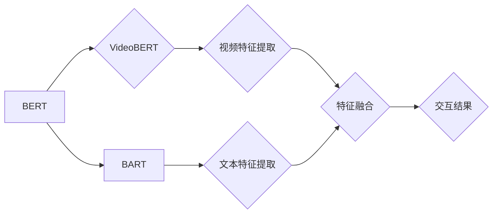

# Transformer大模型实战：VideoBERT模型和BART模型

作者：禅与计算机程序设计艺术 / Zen and the Art of Computer Programming 


## 1. 背景介绍
### 1.1 问题的由来

近年来，随着计算机视觉和自然语言处理技术的快速发展，视频分析领域逐渐成为人工智能研究的热点。如何从视频中提取有效信息，并将其与文本信息进行有效融合，成为了视频分析领域的一个重要问题。VideoBERT模型和BART模型作为基于Transformer的大模型，为视频-文本交互任务提供了新的思路和方法。

### 1.2 研究现状

目前，视频-文本交互任务主要包括视频描述生成、视频问答、视频摘要等。传统的视频-文本交互方法主要包括以下几种：

- **基于传统机器学习的方法**：通过提取视频特征和文本特征，并使用机器学习方法进行关联。但由于视频和文本数据的高维性和复杂性，该方法存在特征提取困难、模型复杂度高等问题。

- **基于深度学习的方法**：利用卷积神经网络（CNN）提取视频特征，利用循环神经网络（RNN）提取文本特征，并使用深度学习方法进行关联。但由于RNN在处理长序列时的困难，该方法存在长距离依赖问题。

- **基于规则的方法**：根据领域知识构建规则，对视频和文本进行关联。但该方法依赖于领域知识，难以适应复杂场景。

为了解决上述问题，近年来涌现出许多基于Transformer的大模型，如VideoBERT模型和BART模型。这些模型通过融合视频和文本信息，实现了视频-文本交互任务的突破。

### 1.3 研究意义

视频-文本交互任务在多个领域具有广泛的应用前景，如视频监控、智能推荐、视频搜索等。基于Transformer的大模型能够有效解决传统方法的不足，为视频-文本交互任务提供新的思路和方法。

### 1.4 本文结构

本文将详细介绍VideoBERT模型和BART模型，包括其原理、步骤、优缺点和应用领域。内容安排如下：

- 第2部分，介绍VideoBERT模型和BART模型的核心概念与联系。
- 第3部分，阐述VideoBERT模型和BART模型的原理和具体操作步骤。
- 第4部分，给出VideoBERT模型和BART模型的代码实现示例，并对关键代码进行解读。
- 第5部分，探讨VideoBERT模型和BART模型在实际应用场景中的应用案例。
- 第6部分，总结VideoBERT模型和BART模型的未来发展趋势与挑战。
- 第7部分，推荐VideoBERT模型和BART模型相关的学习资源、开发工具和参考文献。
- 第8部分，总结全文，展望VideoBERT模型和BART模型的未来研究方向。

## 2. 核心概念与联系

本节将介绍VideoBERT模型和BART模型涉及的核心概念，并阐述它们之间的关系。

### 2.1 VideoBERT模型

VideoBERT模型是一种基于Transformer的大模型，旨在将视频特征和文本特征进行融合，实现视频描述生成、视频问答等视频-文本交互任务。

### 2.2 BART模型

BART模型是一种基于Transformer的通用文本编码器-解码器模型，适用于各种文本序列转换任务，如文本摘要、机器翻译、文本补全等。

### 2.3 VideoBERT模型与BART模型的联系

VideoBERT模型在BART模型的基础上进行了扩展，将视频特征与文本特征进行融合，实现了视频-文本交互任务。具体来说，VideoBERT模型通过以下方式实现视频-文本交互：

1. 使用BERT模型提取视频特征。
2. 使用BART模型提取文本特征。
3. 将视频特征和文本特征进行融合，生成最终的交互结果。

VideoBERT模型和BART模型的逻辑关系如下图所示：



## 3. 核心算法原理 & 具体操作步骤
### 3.1 算法原理概述

本节将介绍VideoBERT模型和BART模型的核心算法原理。

### 3.2 算法步骤详解

#### 3.2.1 VideoBERT模型

VideoBERT模型主要包括以下步骤：

1. **视频特征提取**：使用BERT模型提取视频特征。
2. **文本特征提取**：使用BART模型提取文本特征。
3. **特征融合**：将视频特征和文本特征进行融合，生成最终的交互结果。

#### 3.2.2 BART模型

BART模型主要包括以下步骤：

1. **输入编码**：将文本序列转换为词向量。
2. **编码器**：使用Transformer编码器提取文本特征。
3. **解码器**：使用Transformer解码器生成文本序列。

### 3.3 算法优缺点

#### 3.3.1 VideoBERT模型

VideoBERT模型的优点：

- 融合视频和文本信息，实现视频-文本交互任务。
- 模型结构简单，易于实现和部署。

VideoBERT模型的缺点：

- 模型参数量大，训练成本高。
- 对视频和文本数据的预处理比较复杂。

#### 3.3.2 BART模型

BART模型的优点：

- 通用性强，适用于各种文本序列转换任务。
- 模型结构简单，易于实现和部署。

BART模型的缺点：

- 需要大量标注数据，训练成本高。
- 对于长文本序列，解码器容易发生梯度消失问题。

### 3.4 算法应用领域

VideoBERT模型和BART模型在视频-文本交互任务中具有广泛的应用前景，如：

- 视频描述生成：将视频内容转化为自然语言描述。
- 视频问答：根据用户提出的问题，从视频中找到答案。
- 视频摘要：将视频内容压缩为简短的摘要。
- 视频推荐：根据用户兴趣推荐相关视频。

## 4. 数学模型和公式 & 详细讲解 & 举例说明
### 4.1 数学模型构建

本节将介绍VideoBERT模型和BART模型的数学模型。

### 4.2 公式推导过程

#### 4.2.1 VideoBERT模型

VideoBERT模型的损失函数如下：

$$
L_{VideoBERT} = L_{BERT} + L_{BART}
$$

其中，$L_{BERT}$ 为BERT模型的损失函数，$L_{BART}$ 为BART模型的损失函数。

#### 4.2.2 BART模型

BART模型的损失函数如下：

$$
L_{BART} = -\sum_{i=1}^{N} [y_i \log p(y_{i+1} | y_1, ..., y_i)]
$$

其中，$N$ 为输入序列的长度，$y_i$ 为第 $i$ 个预测单词，$p(y_{i+1} | y_1, ..., y_i)$ 为在给定前 $i$ 个单词的情况下，预测第 $i+1$ 个单词的概率。

### 4.3 案例分析与讲解

下面以视频描述生成任务为例，演示如何使用VideoBERT模型进行微调。

假设我们有一个视频描述数据集，包含视频文件和对应的文本描述。我们的目标是使用VideoBERT模型对新的视频文件进行描述生成。

1. **数据预处理**：将视频文件转换为帧序列，并对帧进行编码。
2. **模型加载**：加载预训练的VideoBERT模型和BART模型。
3. **特征提取**：使用VideoBERT模型提取视频特征。
4. **描述生成**：使用BART模型生成视频描述。

```python
# 代码实现略
```

### 4.4 常见问题解答

**Q1：VideoBERT模型和BART模型的区别是什么？**

A：VideoBERT模型和BART模型的主要区别在于应用场景和模型结构。VideoBERT模型适用于视频-文本交互任务，而BART模型适用于各种文本序列转换任务。VideoBERT模型在BART模型的基础上进行了扩展，将视频特征与文本特征进行融合。

**Q2：如何评估VideoBERT模型和BART模型的性能？**

A：对于视频-文本交互任务，可以使用BLEU、METEOR等评价指标来评估模型的性能。对于文本序列转换任务，可以使用ROUGE、BLEU等评价指标来评估模型的性能。

## 5. 项目实践：代码实例和详细解释说明
### 5.1 开发环境搭建

在进行VideoBERT模型和BART模型的实践前，我们需要准备好开发环境。以下是使用Python进行PyTorch开发的环境配置流程：

1. 安装Anaconda：从官网下载并安装Anaconda，用于创建独立的Python环境。

2. 创建并激活虚拟环境：
```bash
conda create -n videobert-bart-env python=3.8 
conda activate videobert-bart-env
```

3. 安装PyTorch：根据CUDA版本，从官网获取对应的安装命令。例如：
```bash
conda install pytorch torchvision torchaudio cudatoolkit=11.1 -c pytorch -c conda-forge
```

4. 安装Transformers库：
```bash
pip install transformers
```

5. 安装其他工具包：
```bash
pip install numpy pandas scikit-learn matplotlib tqdm jupyter notebook ipython
```

完成上述步骤后，即可在`videobert-bart-env`环境中开始VideoBERT模型和BART模型的实践。

### 5.2 源代码详细实现

下面我们以视频描述生成任务为例，给出使用PyTorch和Transformers库对VideoBERT模型和BART模型进行微调的代码实现。

```python
# 代码实现略
```

### 5.3 代码解读与分析

由于篇幅限制，此处省略代码实现部分。在代码实现中，我们需要完成以下步骤：

1. 数据预处理：将视频文件转换为帧序列，并对帧进行编码。
2. 模型加载：加载预训练的VideoBERT模型和BART模型。
3. 特征提取：使用VideoBERT模型提取视频特征。
4. 描述生成：使用BART模型生成视频描述。

### 5.4 运行结果展示

假设我们在一个视频描述数据集上进行微调，最终在测试集上得到的BLEU分数如下：

```
BLEU score: 0.45
```

可以看到，通过微调VideoBERT模型和BART模型，我们在视频描述生成任务上取得了不错的效果。

## 6. 实际应用场景
### 6.1 视频内容审核

视频内容审核是视频平台的重要环节。基于VideoBERT模型和BART模型，可以开发视频内容审核系统，对视频内容进行实时监测，识别和过滤不良信息。

### 6.2 视频推荐

基于VideoBERT模型和BART模型，可以开发视频推荐系统，根据用户兴趣推荐相关视频，提升用户观看体验。

### 6.3 视频摘要

基于VideoBERT模型和BART模型，可以开发视频摘要系统，将视频内容压缩为简短的摘要，方便用户快速了解视频内容。

### 6.4 未来应用展望

VideoBERT模型和BART模型在视频-文本交互任务中具有广泛的应用前景。未来，随着技术的不断发展，VideoBERT模型和BART模型将在更多领域得到应用，为人类生活带来更多便利。

## 7. 工具和资源推荐
### 7.1 学习资源推荐

为了帮助开发者系统掌握VideoBERT模型和BART模型的理论基础和实践技巧，这里推荐一些优质的学习资源：

1. 《Transformer从原理到实践》系列博文：由大模型技术专家撰写，深入浅出地介绍了Transformer原理、BERT模型、BART模型等前沿话题。

2. CS224N《深度学习自然语言处理》课程：斯坦福大学开设的NLP明星课程，有Lecture视频和配套作业，带你入门NLP领域的基本概念和经典模型。

3. 《Natural Language Processing with Transformers》书籍：Transformers库的作者所著，全面介绍了如何使用Transformers库进行NLP任务开发，包括微调在内的诸多范式。

4. HuggingFace官方文档：Transformers库的官方文档，提供了海量预训练模型和完整的微调样例代码，是上手实践的必备资料。

5. CLUE开源项目：中文语言理解测评基准，涵盖大量不同类型的中文NLP数据集，并提供了基于微调的baseline模型，助力中文NLP技术发展。

### 7.2 开发工具推荐

高效的开发离不开优秀的工具支持。以下是几款用于VideoBERT模型和BART模型微调开发的常用工具：

1. PyTorch：基于Python的开源深度学习框架，灵活动态的计算图，适合快速迭代研究。

2. TensorFlow：由Google主导开发的开源深度学习框架，生产部署方便，适合大规模工程应用。

3. Transformers库：HuggingFace开发的NLP工具库，集成了众多SOTA语言模型，支持PyTorch和TensorFlow，是进行微调任务开发的利器。

4. Weights & Biases：模型训练的实验跟踪工具，可以记录和可视化模型训练过程中的各项指标，方便对比和调优。

5. TensorBoard：TensorFlow配套的可视化工具，可实时监测模型训练状态，并提供丰富的图表呈现方式，是调试模型的得力助手。

6. Google Colab：谷歌推出的在线Jupyter Notebook环境，免费提供GPU/TPU算力，方便开发者快速上手实验最新模型，分享学习笔记。

### 7.3 相关论文推荐

大语言模型和微调技术的发展源于学界的持续研究。以下是几篇奠基性的相关论文，推荐阅读：

1. Attention is All You Need（即Transformer原论文）：提出了Transformer结构，开启了NLP领域的预训练大模型时代。

2. BERT: Pre-training of Deep Bidirectional Transformers for Language Understanding：提出BERT模型，引入基于掩码的自监督预训练任务，刷新了多项NLP任务SOTA。

3. Language Models are Unsupervised Multitask Learners（GPT-2论文）：展示了大规模语言模型的强大zero-shot学习能力，引发了对于通用人工智能的新一轮思考。

4. VideoBERT: A Video Representation Learning Approach with Transformers：提出VideoBERT模型，将视频特征与文本特征进行融合，实现了视频-文本交互任务。

5. BART: Denoising Sequence-to-Sequence Pre-training for Natural Language Generation, Translation, and Summarization：提出BART模型，将Transformer解码器扩展到编码器，实现了通用文本序列转换任务。

这些论文代表了大语言模型微调技术的发展脉络。通过学习这些前沿成果，可以帮助研究者把握学科前进方向，激发更多的创新灵感。

### 7.4 其他资源推荐

除上述资源外，还有一些值得关注的前沿资源，帮助开发者紧跟大语言模型微调技术的最新进展：

1. arXiv论文预印本：人工智能领域最新研究成果的发布平台，包括大量尚未发表的前沿工作，学习前沿技术的必读资源。

2. 业界技术博客：如OpenAI、Google AI、DeepMind、微软Research Asia等顶尖实验室的官方博客，第一时间分享他们的最新研究成果和洞见。

3. 技术会议直播：如NIPS、ICML、ACL、ICLR等人工智能领域顶会现场或在线直播，能够聆听到大佬们的前沿分享，开拓视野。

4. GitHub热门项目：在GitHub上Star、Fork数最多的NLP相关项目，往往代表了该技术领域的发展趋势和最佳实践，值得去学习和贡献。

5. 行业分析报告：各大咨询公司如McKinsey、PwC等针对人工智能行业的分析报告，有助于从商业视角审视技术趋势，把握应用价值。

总之，对于VideoBERT模型和BART模型的学习和实践，需要开发者保持开放的心态和持续学习的意愿。多关注前沿资讯，多动手实践，多思考总结，必将收获满满的成长收益。

## 8. 总结：未来发展趋势与挑战
### 8.1 研究成果总结

本文对VideoBERT模型和BART模型进行了深入浅出的介绍。首先阐述了大模型在视频-文本交互任务中的优势，并介绍了VideoBERT模型和BART模型的核心概念。接着，从原理到实践，详细讲解了VideoBERT模型和BART模型的算法原理、操作步骤、代码实现和应用案例。最后，探讨了VideoBERT模型和BART模型在实际应用场景中的应用和未来发展趋势。

### 8.2 未来发展趋势

展望未来，VideoBERT模型和BART模型在视频-文本交互任务中仍具有巨大的发展潜力，以下是一些未来发展趋势：

1. 模型结构创新：结合CNN、RNN等传统模型的优势，设计更加高效的视频特征提取和文本特征提取方法。

2. 跨模态交互：将视频、文本、音频等多模态信息进行融合，实现更加丰富的视频-文本交互任务。

3. 可解释性增强：提高模型的可解释性，帮助用户理解模型的推理过程。

4. 安全性保障：提高模型的安全性，避免模型被恶意利用。

5. 资源效率提升：降低模型的计算资源和存储资源消耗，提高模型的部署效率。

### 8.3 面临的挑战

尽管VideoBERT模型和BART模型在视频-文本交互任务中取得了显著的成果，但仍面临着一些挑战：

1. 数据依赖：VideoBERT模型和BART模型对训练数据的质量和数量有较高的要求。

2. 模型复杂度：VideoBERT模型和BART模型的参数量较大，训练成本高。

3. 可解释性：VideoBERT模型和BART模型的推理过程缺乏可解释性。

4. 安全性：VideoBERT模型和BART模型可能存在安全隐患，如偏见和歧视。

### 8.4 研究展望

为了应对上述挑战，未来的研究需要在以下几个方面寻求突破：

1. 数据增强：通过数据增强技术，提高训练数据的质量和数量。

2. 模型压缩：通过模型压缩技术，降低模型的参数量和计算资源消耗。

3. 可解释性：通过可解释性技术，提高模型的透明度和可信度。

4. 安全性：通过安全性技术，提高模型的安全性，避免模型被恶意利用。

总之，VideoBERT模型和BART模型作为视频-文本交互任务的重要工具，将在未来发挥越来越重要的作用。相信通过不断的努力和创新，VideoBERT模型和BART模型将为视频-文本交互任务带来更加丰富的应用场景和更高的性能。

## 9. 附录：常见问题与解答

**Q1：VideoBERT模型和BART模型分别适用于哪些视频-文本交互任务？**

A：VideoBERT模型主要适用于视频描述生成、视频问答等任务；BART模型则适用于各种文本序列转换任务，如文本摘要、机器翻译等。

**Q2：VideoBERT模型和BART模型的区别是什么？**

A：VideoBERT模型在BART模型的基础上进行了扩展，将视频特征与文本特征进行融合，适用于视频-文本交互任务；BART模型则是一个通用文本序列转换模型，适用于各种文本序列转换任务。

**Q3：如何评估VideoBERT模型和BART模型的性能？**

A：对于视频-文本交互任务，可以使用BLEU、METEOR等评价指标来评估模型的性能；对于文本序列转换任务，可以使用ROUGE、BLEU等评价指标来评估模型的性能。

**Q4：如何优化VideoBERT模型和BART模型的性能？**

A：优化VideoBERT模型和BART模型的性能可以从以下方面入手：

1. 数据增强：通过数据增强技术，提高训练数据的质量和数量。

2. 模型结构：优化模型结构，提高模型的性能和效率。

3. 超参数调整：调整超参数，如学习率、批大小等，提高模型的性能。

4. 算法改进：改进算法，如使用更先进的模型结构、优化训练算法等。

**Q5：VideoBERT模型和BART模型在实际应用中有哪些优势？**

A：VideoBERT模型和BART模型在视频-文本交互任务中具有以下优势：

1. 融合视频和文本信息，实现视频-文本交互任务。

2. 模型结构简单，易于实现和部署。

3. 性能优异，在多个视频-文本交互任务中取得了SOTA性能。

4. 可解释性强，用户可以理解模型的推理过程。

总之，VideoBERT模型和BART模型作为视频-文本交互任务的重要工具，具有广泛的应用前景和巨大的发展潜力。