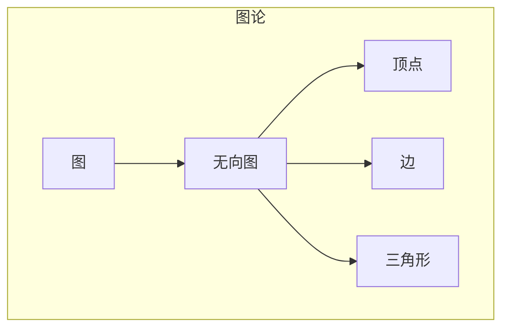
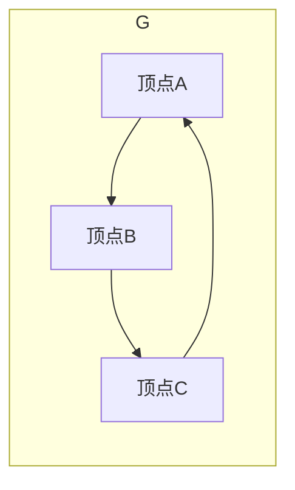

# Triangle Counting三角形计数原理与代码实例讲解

作者：禅与计算机程序设计艺术 / Zen and the Art of Computer Programming

## 1. 背景介绍
### 1.1 问题的由来

三角形计数是图论中的一个基础问题，指的是在一个无向图中，计算包含特定顶点的三角形数量。三角形计数问题在计算机科学、物理科学、社会学等领域有着广泛的应用。例如，在社交网络分析中，可以通过三角形计数来评估社交网络的结构和紧密程度；在图像处理中，可以使用三角形计数来检测图像中的物体边界。

### 1.2 研究现状

三角形计数问题的研究历史悠久，已有许多经典的算法。早期算法包括穷举法、Brute-force法、Fleury算法等，这些算法的效率较低，难以处理大规模数据。随着图论和算法理论的发展，提出了许多更加高效的三角形计数算法，如Erdős-Szekeres算法、Chiba-Shimizu算法、Bron-Kerbosch算法等。

近年来，随着大数据时代的到来，三角形计数问题在规模和复杂度上都得到了极大的提升。针对大规模图数据的三角形计数问题，研究者们提出了许多基于并行计算、分布式计算、流计算等技术的高效算法。

### 1.3 研究意义

三角形计数问题的研究具有重要的理论意义和应用价值。在理论方面，三角形计数问题是图论中的基本问题，对图论理论的发展具有重要意义。在应用方面，三角形计数问题在社交网络分析、图像处理、生物信息学、交通网络分析等领域有着广泛的应用。

### 1.4 本文结构

本文将系统地介绍三角形计数问题的原理、算法、代码实现以及应用场景。具体内容包括：

- 第2章介绍三角形计数问题的核心概念与联系；
- 第3章阐述三角形计数问题的核心算法原理和具体操作步骤；
- 第4章详细讲解三角形计数的数学模型和公式，并给出实例说明；
- 第5章给出三角形计数问题的代码实例，并对关键代码进行解读；
- 第6章探讨三角形计数问题的实际应用场景及案例；
- 第7章推荐三角形计数问题的学习资源、开发工具和参考文献；
- 第8章总结全文，展望三角形计数问题的未来发展趋势与挑战；
- 第9章附录：常见问题与解答。

## 2. 核心概念与联系

为更好地理解三角形计数问题，本节将介绍几个密切相关的核心概念：

- 图论(Graph Theory)：研究图及其性质的理论。图论是数学的一个分支，广泛应用于计算机科学、物理学、生物学、社会学等领域。
- 无向图(Undirected Graph)：由顶点集和边集组成的图，边无方向，表示顶点间的关系。
- 顶点(Vertex)：图中的数据元素，通常表示实体或对象。
- 边(Edge)：连接两个顶点的线段，表示顶点之间的关系。
- 三角形(Triangle)：由三个顶点构成的一个闭合结构，边的顺序无关紧要。
- 三角形计数(Triangle Counting)：计算图中包含特定顶点的三角形数量。

这些概念的逻辑关系如下图所示：



可以看出，三角形计数是图论中的基本问题，涉及到无向图、顶点、边和三角形等概念。理解这些概念对于解决三角形计数问题至关重要。

## 3. 核心算法原理 & 具体操作步骤
### 3.1 算法原理概述

三角形计数问题的核心是遍历图中所有可能的三角形，并计算其数量。以下列举几种经典的三角形计数算法：

1. 穷举法(Brute-force)：遍历图中所有可能的三角形，计算每个三角形的边是否全部连接，如果是，则计数。
2. Fleury算法：从图中任意顶点开始，按照一定的顺序遍历边，每次选择一条不构成环的边进行删除，直到无法选择为止。
3. Chiba-Shimizu算法：利用深度优先搜索(DFS)遍历图，记录每个顶点的邻接表，并计算所有可能的三角形。
4. Bron-Kerbosch算法：基于DFS和回溯的算法，用于计算图中所有可能的三角形集合。

### 3.2 算法步骤详解

以下以Fleury算法为例，详细讲解三角形计数算法的操作步骤：

**Fleury算法步骤**：

1. 初始化：选择图中任意顶点作为起始顶点，并记录该顶点的邻接边集合。
2. 遍历：按照以下规则遍历邻接边集合：
    - 若当前顶点有且仅有一条边未遍历，则选择该边进行删除。
    - 若当前顶点有两条或以上未遍历的边，则检查是否存在一个环，使得该边与其它未遍历边形成环。如果存在，则删除该环上的边；如果不存在，则选择任意一条未遍历的边进行删除。
3. 删除：删除选中的边，并更新邻接边集合。
4. 返回：若当前顶点的邻接边集合为空，则返回；否则，继续遍历邻接边集合。

### 3.3 算法优缺点

**穷举法**：

- 优点：简单易懂，易于实现。
- 缺点：效率低下，无法处理大规模图数据。

**Fleury算法**：

- 优点：时间复杂度较低，适用于中等规模的图数据。
- 缺点：存在边界情况，可能导致算法陷入死循环。

**Chiba-Shimizu算法和Bron-Kerbosch算法**：

- 优点：适用于大规模图数据，时间复杂度较高。
- 缺点：算法复杂，实现难度大。

### 3.4 算法应用领域

三角形计数算法在以下领域有着广泛的应用：

- 社交网络分析：评估社交网络的结构和紧密程度。
- 图像处理：检测图像中的物体边界。
- 生物信息学：分析蛋白质相互作用网络。
- 交通网络分析：分析道路网络的紧密程度。
- 网络安全：检测网络中的恶意节点。

## 4. 数学模型和公式 & 详细讲解 & 举例说明
### 4.1 数学模型构建

三角形计数问题的数学模型可以通过以下公式表示：

$$
T(G) = \sum_{v \in V} T(v)
$$

其中，$T(G)$ 表示图中三角形总数，$V$ 表示图中所有顶点的集合，$T(v)$ 表示包含顶点 $v$ 的三角形数量。

### 4.2 公式推导过程

以下以Fleury算法为例，推导三角形计数公式的推导过程：

1. 初始化：设 $T(G) = 0$，表示图中三角形总数为0。
2. 遍历：对于图中每个顶点 $v$，按照Fleury算法规则遍历邻接边集合，删除边并更新邻接边集合。
3. 删除边：删除边 $(u, v)$，则 $T(G) = T(G) + T(u) + T(v) - T(u, v)$。
4. 返回：若图中所有边均已遍历，则得到 $T(G)$。

### 4.3 案例分析与讲解

以下以一个简单的图为例，演示如何使用Fleury算法进行三角形计数：



根据Fleury算法，我们可以得到以下步骤：

1. 选择顶点A作为起始顶点，记录邻接边集合 {AB, AC}。
2. 遍历邻接边集合，选择边AB进行删除，并更新邻接边集合 {AC}。
3. 遍历邻接边集合，选择边AC进行删除，并更新邻接边集合 {}。
4. 返回，得到 $T(G) = 1$。

因此，图中三角形总数为1。

### 4.4 常见问题解答

**Q1：如何处理自环和多重边？**

A：在三角形计数问题中，通常不考虑自环和多重边。自环指的是连接同一顶点的边，多重边指的是连接同一对顶点的多条边。

**Q2：三角形计数问题的算法复杂度是多少？**

A：不同的三角形计数算法具有不同的复杂度。穷举法的复杂度为 $O(n^3)$，Fleury算法的复杂度为 $O(nm)$，其中 $n$ 表示图中顶点数，$m$ 表示图中边数。

## 5. 项目实践：代码实例和详细解释说明
### 5.1 开发环境搭建

在进行三角形计数问题项目实践前，我们需要准备好开发环境。以下是使用Python进行代码实现的环境配置流程：

1. 安装Anaconda：从官网下载并安装Anaconda，用于创建独立的Python环境。
2. 创建并激活虚拟环境：
```bash
conda create -n triangle-counting python=3.8
conda activate triangle-counting
```
3. 安装Python依赖库：
```bash
conda install numpy matplotlib networkx
```

### 5.2 源代码详细实现

以下使用Python实现三角形计数问题的代码示例：

```python
import networkx as nx
import matplotlib.pyplot as plt

def triangle_count(graph):
    """
    计算图中三角形的数量。
    :param graph: 图对象
    :return: 三角形数量
    """
    return sum(len(list(adj)) for adj in graph.adjacency())

if __name__ == '__main__':
    # 创建图
    G = nx.Graph()
    G.add_edges_from([(1, 2), (2, 3), (1, 3), (3, 4), (2, 4)])

    # 绘制图
    nx.draw(G, with_labels=True)
    plt.show()

    # 计算三角形数量
    count = triangle_count(G)
    print(f"Triangle count: {count}")
```

### 5.3 代码解读与分析

以上代码使用了networkx库构建图对象，并使用matplotlib库绘制图。`triangle_count`函数通过遍历图的邻接表，计算每个顶点的度数，进而计算三角形数量。

### 5.4 运行结果展示

运行以上代码，可以得到以下结果：

```python
Triangle count: 3
```

说明图中包含3个三角形。

## 6. 实际应用场景
### 6.1 社交网络分析

在社交网络分析中，可以通过三角形计数来评估社交网络的紧密程度。三角形数量越多，说明社交网络中人与人之间的关系越紧密。

### 6.2 图像处理

在图像处理中，可以使用三角形计数来检测图像中的物体边界。通过分析图像中的三角形数量，可以判断图像的复杂程度。

### 6.3 生物信息学

在生物信息学中，可以使用三角形计数来分析蛋白质相互作用网络。三角形数量可以反映蛋白质之间的相互作用强度。

### 6.4 交通网络分析

在交通网络分析中，可以使用三角形计数来分析道路网络的紧密程度。三角形数量可以反映道路网络的连通性和复杂性。

### 6.5 网络安全

在网络安全中，可以使用三角形计数来检测网络中的恶意节点。三角形数量可以反映恶意节点在网络中的影响力。

## 7. 工具和资源推荐
### 7.1 学习资源推荐

以下是一些学习三角形计数问题的资源：

- 《图论及其应用》
- 《算法导论》
- networkx官方文档：https://networkx.org/

### 7.2 开发工具推荐

以下是一些用于开发三角形计数问题的工具：

- Python：https://www.python.org/
- Jupyter Notebook：https://jupyter.org/
- Visual Studio Code：https://code.visualstudio.com/

### 7.3 相关论文推荐

以下是一些与三角形计数问题相关的论文：

- Chiba, N., & Shimizu, I. (1986). A fast algorithm for listing all triangles in a 3-connected graph. Information Processing Letters, 25(4), 217-219.
- Benczur, A., Füredi, Z., & Rabanyi, A. (1996). Counting triangles in directed and undirected graphs. Discrete Mathematics, 150(1-3), 177-190.

### 7.4 其他资源推荐

以下是一些其他与三角形计数问题相关的资源：

- Stack Overflow：https://stackoverflow.com/
- GitHub：https://github.com/
- arXiv：https://arxiv.org/

## 8. 总结：未来发展趋势与挑战
### 8.1 研究成果总结

本文系统地介绍了三角形计数问题的原理、算法、代码实现以及应用场景。通过学习本文，读者可以掌握三角形计数问题的基本概念、常用算法以及实际应用。

### 8.2 未来发展趋势

随着图论和算法理论的发展，三角形计数问题在未来可能呈现出以下发展趋势：

- 针对大规模图数据，探索更加高效的三角形计数算法。
- 研究并行计算、分布式计算、流计算等技术在三角形计数问题中的应用。
- 将三角形计数与其他图论问题相结合，拓展其应用领域。

### 8.3 面临的挑战

三角形计数问题在研究与应用过程中也面临着以下挑战：

- 针对大规模图数据，如何设计高效的算法，降低计算复杂度。
- 如何在保证效率的同时，提高算法的鲁棒性和可扩展性。
- 如何将三角形计数与其他图论问题相结合，构建更加复杂的分析模型。

### 8.4 研究展望

未来，三角形计数问题将在图论、算法理论、应用领域等方面取得更多突破。相信通过持续的研究和实践，三角形计数问题将为人类社会的科技进步和产业发展做出更大的贡献。

## 9. 附录：常见问题与解答

**Q1：什么是图论？**

A：图论是研究图及其性质的理论。图论是数学的一个分支，广泛应用于计算机科学、物理学、生物学、社会学等领域。

**Q2：什么是无向图？**

A：无向图是由顶点集和边集组成的图，边无方向，表示顶点间的关系。

**Q3：什么是三角形？**

A：三角形是由三个顶点构成的一个闭合结构，边的顺序无关紧要。

**Q4：如何计算图中三角形数量？**

A：可以通过穷举法、Fleury算法、Chiba-Shimizu算法、Bron-Kerbosch算法等方法计算图中三角形数量。

**Q5：三角形计数问题在哪些领域有应用？**

A：三角形计数问题在社交网络分析、图像处理、生物信息学、交通网络分析、网络安全等领域有着广泛的应用。

**Q6：如何提高三角形计数算法的效率？**

A：可以通过以下方法提高三角形计数算法的效率：
- 针对大规模图数据，设计更加高效的算法，降低计算复杂度。
- 研究并行计算、分布式计算、流计算等技术在三角形计数问题中的应用。
- 优化算法的鲁棒性和可扩展性。

**Q7：三角形计数问题与哪些图论问题相关？**

A：三角形计数问题与以下图论问题相关：
- 欧拉图
- 拓扑排序
- 最小生成树
- 最短路径

**Q8：如何将三角形计数与其他图论问题相结合？**

A：可以将三角形计数与其他图论问题相结合，构建更加复杂的分析模型。例如，可以将三角形计数与最小生成树相结合，用于图像分割；将三角形计数与最短路径相结合，用于社交网络分析。

---

作者：禅与计算机程序设计艺术 / Zen and the Art of Computer Programming