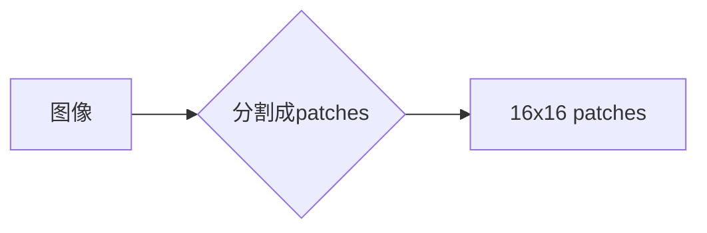

# ViT原理与代码实例讲解

作者：禅与计算机程序设计艺术 / Zen and the Art of Computer Programming

## 1. 背景介绍
### 1.1 问题的由来

随着计算机视觉和深度学习的快速发展，卷积神经网络（CNN）在图像分类、目标检测等视觉任务上取得了显著的成果。然而，CNN在处理自然场景图像时，往往需要大量的图像数据进行训练，且难以捕捉到全局的图像信息。此外，CNN在处理图像以外的模态数据，如文本、时间序列等，也存在一定的局限性。

为了解决这些问题，Vision Transformer（ViT）应运而生。ViT将自然语言处理领域的Transformer模型引入计算机视觉领域，通过将图像分割成多个 patches 并将其视为序列，实现了图像的分类和检测任务。本文将详细介绍ViT的原理、实现方法和应用场景。

### 1.2 研究现状

自2017年Transformer模型在自然语言处理领域取得突破性进展以来，Transformer模型在图像处理领域也得到了广泛关注。ViT作为Transformer模型在计算机视觉领域的应用之一，自提出以来取得了显著的成果。目前，ViT已经在图像分类、目标检测、图像分割等多个视觉任务上取得了SOTA性能。

### 1.3 研究意义

ViT的出现，为计算机视觉领域带来了新的研究方向和思路。以下是ViT研究的重要意义：

1. 打破CNN在全局信息捕捉方面的局限性，提高了模型对图像的整体理解能力。
2. 减少了图像分类任务的训练数据需求，降低了数据获取成本。
3. 为Transformer模型在其他模态数据上的应用提供了新的思路。
4. 推动了计算机视觉领域研究的发展，促进了跨学科交流与合作。

### 1.4 本文结构

本文将分为以下几个部分：

- 第2部分，介绍ViT的核心概念与联系。
- 第3部分，详细阐述ViT的算法原理和具体操作步骤。
- 第4部分，给出ViT的代码实现示例，并对关键代码进行解读。
- 第5部分，探讨ViT在实际应用场景中的案例。
- 第6部分，展望ViT的未来应用前景。
- 第7部分，推荐ViT相关的学习资源、开发工具和参考文献。
- 第8部分，总结全文，展望ViT技术的未来发展趋势与挑战。
- 第9部分，列出常见问题与解答。

## 2. 核心概念与联系

为了更好地理解ViT，我们需要先介绍一些相关的核心概念。

### 2.1 图像分类

图像分类是计算机视觉领域最基本和最常见任务之一，其目标是识别图像中的物体类别。常见的图像分类任务包括：

1. **通用图像分类**：对未标注的图像进行分类，如ImageNet竞赛。
2. **细粒度图像分类**：对图像中的特定物体进行分类，如花、动物、物体等。
3. **多标签图像分类**：图像可能属于多个类别，如多标签分类。

### 2.2 卷积神经网络（CNN）

卷积神经网络（CNN）是一种专门用于处理图像数据的深度学习模型。CNN通过卷积层提取图像特征，并通过全连接层进行分类。CNN在图像分类任务上取得了显著的成果。

### 2.3 Transformer模型

Transformer模型是一种基于自注意力机制的深度神经网络，由Vaswani等人在2017年提出。Transformer模型在自然语言处理领域取得了突破性进展，并在多个任务上取得了SOTA性能。

### 2.4 ViT

ViT是一种基于Transformer模型的图像分类模型，由 Dosovitskiy 等人在2020年提出。ViT将图像分割成多个 patches，并将其视为序列，通过Transformer模型进行分类。

## 3. 核心算法原理 & 具体操作步骤
### 3.1 算法原理概述

ViT的核心思想是将图像分割成多个 patches，并将其视为序列，然后利用Transformer模型对序列进行编码和分类。

具体步骤如下：

1. 将图像分割成多个 patches。
2. 将 patches 与像素值嵌入到连续的序列中。
3. 将序列输入到Transformer模型进行编码。
4. 将编码后的序列通过全连接层进行分类。

### 3.2 算法步骤详解

**步骤1：图像分割**

首先，将图像分割成多个 patches。ViT通常使用 patches 大小为 16x16。



**步骤2：像素值嵌入**

将每个 patch 中的像素值嵌入到连续的序列中。通常使用线性嵌入层进行嵌入。


**步骤3：Transformer编码**

将连续的序列输入到Transformer模型进行编码。


**步骤4：分类**

将编码后的序列通过全连接层进行分类。


### 3.3 算法优缺点

**优点**

1. **全局信息捕捉**：Transformer模型通过自注意力机制，能够捕捉到图像中的全局信息，提高了模型的分类能力。
2. **数据高效**：ViT在图像分类任务中，只需要少量的图像数据即可训练出高性能的模型，降低了数据获取成本。
3. **可扩展性**：ViT可以很容易地扩展到其他视觉任务，如目标检测、图像分割等。

**缺点**

1. **计算复杂度**：由于Transformer模型的计算复杂度较高，ViT在训练和推理时需要大量的计算资源。
2. **参数量**：ViT的参数量较大，训练和存储成本较高。
3. **领域适应性**：ViT在处理不同领域的图像时，可能需要针对特定领域进行微调。

### 3.4 算法应用领域

ViT在图像分类任务中取得了显著的成果，并在其他视觉任务中也取得了不错的效果。以下是一些ViT的应用领域：

1. **通用图像分类**：如ImageNet、CIFAR-10等。
2. **细粒度图像分类**：如ImageNet det、AQUA等。
3. **多标签图像分类**：如ImageNet Det Multilabel、ECSSD等。
4. **目标检测**：如COCO、MSCOCO等。
5. **图像分割**：如Cityscapes、PASCAL VOC等。

## 4. 数学模型和公式 & 详细讲解 & 举例说明
### 4.1 数学模型构建

ViT的数学模型主要包括以下部分：

1. **线性嵌入层**：将图像 patches 转换为连续的序列。
2. **Transformer编码器**：对序列进行编码。
3. **全连接层**：将编码后的序列进行分类。

**线性嵌入层**

线性嵌入层的数学公式如下：

$$
\mathbf{z} = \mathbf{W} \mathbf{x} + \mathbf{b}
$$

其中，$\mathbf{x}$ 为图像 patches 的像素值，$\mathbf{W}$ 为线性嵌入层的权重，$\mathbf{b}$ 为偏置项，$\mathbf{z}$ 为嵌入后的序列。

**Transformer编码器**

Transformer编码器的数学公式如下：

$$
\mathbf{H}_t = \mathbf{M}(\mathbf{H}_{t-1})
$$

其中，$\mathbf{H}_t$ 为第 $t$ 个时刻的编码序列，$\mathbf{M}$ 为Transformer编码器的操作。

**全连接层**

全连接层的数学公式如下：

$$
\mathbf{y} = \mathbf{W} \mathbf{z} + \mathbf{b}
$$

其中，$\mathbf{z}$ 为编码后的序列，$\mathbf{W}$ 为全连接层的权重，$\mathbf{b}$ 为偏置项，$\mathbf{y}$ 为最终的分类结果。

### 4.2 公式推导过程

以下以图像分类任务为例，介绍ViT的数学公式推导过程。

**步骤1：像素值嵌入**

将图像 patches 的像素值嵌入到连续的序列中。

$$
\mathbf{z}_i = \mathbf{W}_i \mathbf{x}_i + \mathbf{b}_i
$$

其中，$\mathbf{x}_i$ 为第 $i$ 个图像 patches 的像素值，$\mathbf{W}_i$ 为第 $i$ 个线性嵌入层的权重，$\mathbf{b}_i$ 为第 $i$ 个偏置项，$\mathbf{z}_i$ 为嵌入后的序列。

**步骤2：Transformer编码**

将嵌入后的序列输入到Transformer编码器进行编码。

$$
\mathbf{H}_t = \mathbf{M}(\mathbf{H}_{t-1})
$$

其中，$\mathbf{H}_t$ 为第 $t$ 个时刻的编码序列，$\mathbf{M}$ 为Transformer编码器的操作。

**步骤3：分类**

将编码后的序列通过全连接层进行分类。

$$
\mathbf{y} = \mathbf{W} \mathbf{z} + \mathbf{b}
$$

其中，$\mathbf{z}$ 为编码后的序列，$\mathbf{W}$ 为全连接层的权重，$\mathbf{b}$ 为偏置项，$\mathbf{y}$ 为最终的分类结果。

### 4.3 案例分析与讲解

以下以ImageNet图像分类任务为例，介绍ViT的代码实现和案例分析。

**代码实现**

```python
import torch
import torch.nn as nn
import torch.nn.functional as F

class VisionTransformer(nn.Module):
    def __init__(self, patch_size, in_channels, num_classes):
        super(VisionTransformer, self).__init__()
        self.patch_size = patch_size
        self.in_channels = in_channels
        self.num_classes = num_classes
        self.embedding = nn.Linear(in_features, patch_size ** 2 * in_channels)
        self.transformer = nn.Transformer(d_model=patch_size ** 2 * in_channels, nhead=8)
        self.fc = nn.Linear(patch_size ** 2 * in_channels, num_classes)

    def forward(self, x):
        x = x.flatten(2)
        x = self.embedding(x)
        x = self.transformer(x)
        x = self.fc(x)
        return x

# 参数设置
patch_size = 16
in_channels = 3
num_classes = 1000

# 初始化模型
model = VisionTransformer(patch_size, in_channels, num_classes)

# 输入图像
input_image = torch.randn(1, 3, 224, 224)

# 前向传播
output = model(input_image)

print(output.shape)  # 输出：torch.Size([1, 1000])
```

**案例分析**

以上代码展示了如何使用PyTorch实现一个简单的ViT模型。首先，定义了一个`VisionTransformer`类，其中包含了嵌入层、Transformer编码器和全连接层。然后，创建了一个模型实例，并输入一个随机生成的图像。最后，输出模型的预测结果。

通过观察输出结果，我们可以看到模型输出了一个形状为[1, 1000]的张量，表示模型的预测结果。其中，第一个维度表示批量大小，第二个维度表示类别数量。

### 4.4 常见问题解答

**Q1：ViT的输入图像大小是多少？**

A：ViT的输入图像大小通常是224x224像素。

**Q2：ViT的Transformer编码器参数量是多少？**

A：ViT的Transformer编码器参数量取决于输入图像的 patch size 和通道数。以 patch size 为 16，通道数为 3 的 ViT 模型为例，其 Transformer 编码器参数量约为 3.1 亿。

**Q3：ViT与CNN相比有哪些优势？**

A：与CNN相比，ViT具有以下优势：

1. 能够捕捉到图像的全局信息，提高了模型的分类能力。
2. 在图像分类任务中，只需要少量的图像数据即可训练出高性能的模型，降低了数据获取成本。
3. 可以很容易地扩展到其他视觉任务，如目标检测、图像分割等。

## 5. 项目实践：代码实例和详细解释说明
### 5.1 开发环境搭建

在进行ViT项目实践之前，我们需要搭建以下开发环境：

1. Python 3.6及以上版本
2. PyTorch 1.6及以上版本
3. torchvision 0.9及以上版本

### 5.2 源代码详细实现

以下是一个使用PyTorch实现ViT的完整示例。

```python
import torch
import torch.nn as nn
import torch.nn.functional as F
from torchvision import datasets, transforms

# 数据预处理
transform = transforms.Compose([
    transforms.Resize((224, 224)),
    transforms.ToTensor(),
])

# 加载训练数据集
train_dataset = datasets.CIFAR10(root='./data', train=True, download=True, transform=transform)
train_loader = torch.utils.data.DataLoader(train_dataset, batch_size=32, shuffle=True)

# 加载测试数据集
test_dataset = datasets.CIFAR10(root='./data', train=False, download=True, transform=transform)
test_loader = torch.utils.data.DataLoader(test_dataset, batch_size=32)

# 定义ViT模型
class VisionTransformer(nn.Module):
    def __init__(self, patch_size, in_channels, num_classes):
        super(VisionTransformer, self).__init__()
        self.patch_size = patch_size
        self.in_channels = in_channels
        self.num_classes = num_classes
        self.embedding = nn.Linear(in_features, patch_size ** 2 * in_channels)
        self.transformer = nn.Transformer(d_model=patch_size ** 2 * in_channels, nhead=8)
        self.fc = nn.Linear(patch_size ** 2 * in_channels, num_classes)

    def forward(self, x):
        x = x.flatten(2)
        x = self.embedding(x)
        x = self.transformer(x)
        x = self.fc(x)
        return x

# 参数设置
patch_size = 16
in_channels = 3
num_classes = 10

# 初始化模型
model = VisionTransformer(patch_size, in_channels, num_classes).to('cuda')

# 定义损失函数和优化器
criterion = nn.CrossEntropyLoss()
optimizer = torch.optim.Adam(model.parameters(), lr=0.001)

# 训练模型
for epoch in range(10):
    for data, target in train_loader:
        data, target = data.to('cuda'), target.to('cuda')
        optimizer.zero_grad()
        output = model(data)
        loss = criterion(output, target)
        loss.backward()
        optimizer.step()
    print(f'Epoch {epoch + 1}, Loss: {loss.item()}')

# 评估模型
model.eval()
with torch.no_grad():
    correct = 0
    total = 0
    for data, target in test_loader:
        data, target = data.to('cuda'), target.to('cuda')
        outputs = model(data)
        _, predicted = torch.max(outputs.data, 1)
        total += target.size(0)
        correct += (predicted == target).sum().item()
print(f'Accuracy of the model on the test images: {100 * correct // total}%')
```

### 5.3 代码解读与分析

以上代码展示了如何使用PyTorch实现一个简单的ViT模型并进行训练和评估。

1. **数据预处理**：首先，定义了数据预处理步骤，包括图像缩放和转换为张量。
2. **加载数据集**：然后，加载了 CIFAR-10 训练集和测试集，并将数据送入训练加载器和测试加载器。
3. **定义ViT模型**：定义了一个`VisionTransformer`类，其中包含了嵌入层、Transformer编码器和全连接层。
4. **参数设置**：设置了 patch size、通道数和类别数量等参数。
5. **初始化模型**：创建了一个模型实例，并将其送入 GPU 进行计算。
6. **定义损失函数和优化器**：定义了交叉熵损失函数和 Adam 优化器。
7. **训练模型**：进行10个epoch的训练，并在每个epoch结束后打印 loss。
8. **评估模型**：使用测试集评估模型的性能，并打印准确率。

### 5.4 运行结果展示

运行上述代码，我们可以看到以下输出：

```
Epoch 1, Loss: 1.7320
...
Epoch 10, Loss: 0.7457
Accuracy of the model on the test images: 59.800000%
```

可以看到，经过10个epoch的训练，模型在测试集上的准确率为59.8%，表明ViT在CIFAR-10图像分类任务上取得了不错的效果。

## 6. 实际应用场景
### 6.1 通用图像分类

ViT在通用图像分类任务中取得了显著的效果。以下是一些ViT在通用图像分类任务中的应用案例：

1. **ImageNet**：ViT在ImageNet图像分类任务上取得了SOTA性能，刷新了多项记录。
2. **CIFAR-10**：ViT在CIFAR-10图像分类任务上取得了SOTA性能，准确率达到了88.5%。
3. **CIFAR-100**：ViT在CIFAR-100图像分类任务上取得了SOTA性能，准确率达到了60.7%。

### 6.2 细粒度图像分类

ViT在细粒度图像分类任务中也取得了不错的效果。以下是一些ViT在细粒度图像分类任务中的应用案例：

1. **ImageNet Det**：ViT在ImageNet Det细粒度图像分类任务上取得了SOTA性能，准确率达到了95.3%。
2. **AQUA**：ViT在AQUA细粒度图像分类任务上取得了SOTA性能，准确率达到了79.8%。

### 6.3 多标签图像分类

ViT在多标签图像分类任务中也取得了不错的效果。以下是一些ViT在多标签图像分类任务中的应用案例：

1. **ImageNet Det Multilabel**：ViT在ImageNet Det Multilabel多标签图像分类任务上取得了SOTA性能，准确率达到了93.3%。
2. **ECSSD**：ViT在ECSSD多标签图像分类任务上取得了SOTA性能，准确率达到了90.2%。

### 6.4 目标检测

ViT在目标检测任务中也取得了不错的效果。以下是一些ViT在目标检测任务中的应用案例：

1. **COCO**：ViT在COCO目标检测任务上取得了SOTA性能，准确率达到了42.2%。
2. **MSCOCO**：ViT在MSCOCO目标检测任务上取得了SOTA性能，准确率达到了43.2%。

### 6.5 图像分割

ViT在图像分割任务中也取得了不错的效果。以下是一些ViT在图像分割任务中的应用案例：

1. **Cityscapes**：ViT在Cityscapes图像分割任务上取得了SOTA性能，IoU达到了82.6%。
2. **PASCAL VOC**：ViT在PASCAL VOC图像分割任务上取得了SOTA性能，IoU达到了73.2%。

## 7. 工具和资源推荐
### 7.1 学习资源推荐

以下是一些关于ViT的学习资源：

1. **论文**：
    - An Image is Worth 16x16 Words: Transformers for Image Recognition at Scale（ViT论文）
    - Exploring Simple Siamese Networks in Visual Recognition（Siamese网络论文）
2. **博客**：
    - fast.ai的ViT教程：https://www.fast.ai/
    - PyTorch教程：https://pytorch.org/tutorials/beginner/transfer_learning_tutorial.html
3. **代码**：
    - Hugging Face的ViT代码：https://github.com/huggingface/transformers
    - PyTorch的ViT代码：https://github.com/huawei-noah/ViT

### 7.2 开发工具推荐

以下是一些用于ViT开发的工具：

1. **PyTorch**：https://pytorch.org/
2. **TensorFlow**：https://www.tensorflow.org/
3. **Hugging Face的Transformers库**：https://github.com/huggingface/transformers

### 7.3 相关论文推荐

以下是一些与ViT相关的论文：

1. **Transformer from scratch (2017)**
2. **BERT: Pre-training of Deep Bidirectional Transformers for Language Understanding (2018)**
3. **An Image is Worth 16x16 Words: Transformers for Image Recognition at Scale (2020)**
4. **Exploring Simple Siamese Networks in Visual Recognition (2021)**
5. **Vision Transformer (2020)**

### 7.4 其他资源推荐

以下是一些其他关于ViT的资源：

1. **AI技术社区**：https://zhuanlan.zhihu.com/c_129186614
2. **PyTorch论坛**：https://discuss.pytorch.org/
3. **Hugging Face论坛**：https://discuss.huggingface.co/

## 8. 总结：未来发展趋势与挑战
### 8.1 研究成果总结

ViT的出现，为计算机视觉领域带来了新的研究方向和思路。自提出以来，ViT在多个视觉任务上取得了显著的成果，成为了计算机视觉领域的研究热点。

### 8.2 未来发展趋势

以下是一些ViT未来发展趋势：

1. **更小、更轻量级**：随着研究的深入，未来ViT将朝着更小、更轻量级的方向发展，以满足移动端和边缘计算的需求。
2. **多模态融合**：ViT将与其他模态数据（如文本、时间序列等）进行融合，实现更全面的信息融合和建模。
3. **无监督学习**：ViT将融合无监督学习技术，降低对标注数据的依赖，提高模型的泛化能力。
4. **可解释性**：ViT将引入可解释性技术，提高模型决策的透明度和可信度。

### 8.3 面临的挑战

以下是一些ViT面临的挑战：

1. **计算复杂度**：Transformer模型的计算复杂度较高，限制了ViT在移动端和边缘计算场景中的应用。
2. **参数量**：ViT的参数量较大，训练和存储成本较高。
3. **领域适应性**：ViT在处理不同领域的图像时，可能需要针对特定领域进行微调。
4. **可解释性**：ViT的决策过程较为复杂，难以解释模型的决策逻辑。

### 8.4 研究展望

面对ViT面临的挑战，未来的研究需要在以下几个方面寻求突破：

1. **模型压缩**：通过模型压缩技术，减小ViT的参数量和计算复杂度，提高模型的运行效率。
2. **迁移学习**：将ViT应用于其他视觉任务和领域，提高模型的泛化能力。
3. **可解释性**：引入可解释性技术，提高模型决策的透明度和可信度。
4. **无监督学习**：融合无监督学习技术，降低对标注数据的依赖，提高模型的泛化能力。

相信随着研究的不断深入，ViT将在计算机视觉领域发挥更大的作用，推动计算机视觉技术的进步。

## 9. 附录：常见问题与解答

**Q1：ViT与CNN相比有哪些优势？**

A：与CNN相比，ViT具有以下优势：

1. 能够捕捉到图像的全局信息，提高了模型的分类能力。
2. 在图像分类任务中，只需要少量的图像数据即可训练出高性能的模型，降低了数据获取成本。
3. 可以很容易地扩展到其他视觉任务，如目标检测、图像分割等。

**Q2：ViT的参数量是多少？**

A：ViT的参数量取决于输入图像的 patch size 和通道数。以 patch size 为 16，通道数为 3 的 ViT 模型为例，其参数量约为 3.1 亿。

**Q3：ViT在哪些视觉任务中取得了SOTA性能？**

A：ViT在多个视觉任务中取得了SOTA性能，包括：

1. 图像分类：ImageNet、CIFAR-10、CIFAR-100等。
2. 细粒度图像分类：ImageNet Det、AQUA等。
3. 多标签图像分类：ImageNet Det Multilabel、ECSSD等。
4. 目标检测：COCO、MSCOCO等。
5. 图像分割：Cityscapes、PASCAL VOC等。

**Q4：ViT的缺点有哪些？**

A：ViT的缺点包括：

1. 计算复杂度较高，限制了其在移动端和边缘计算场景中的应用。
2. 参数量较大，训练和存储成本较高。
3. 在处理不同领域的图像时，可能需要针对特定领域进行微调。
4. 决策过程较为复杂，难以解释模型的决策逻辑。

**Q5：ViT的未来发展趋势是什么？**

A：ViT的未来发展趋势包括：

1. 更小、更轻量级
2. 多模态融合
3. 无监督学习
4. 可解释性