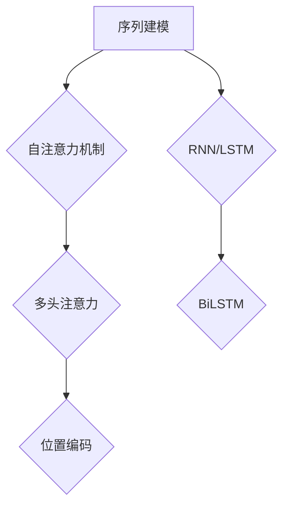

# transformer 原理与代码实例讲解

作者：禅与计算机程序设计艺术 / Zen and the Art of Computer Programming


## 1. 背景介绍
### 1.1 问题的由来

自然语言处理（NLP）领域近年来取得了令人瞩目的进展，其中Transformer模型的提出，彻底改变了序列建模的范式。自2017年论文《Attention is All You Need》发表以来，Transformer及其变体在机器翻译、文本摘要、情感分析等众多NLP任务上取得了突破性的成果。本文将深入解析Transformer模型的原理，并通过代码实例展示其应用。

### 1.2 研究现状

Transformer模型的研究和应用已经非常成熟，大量研究论文和开源代码为Transformer的发展提供了丰富的资源。然而，对于初学者来说，深入理解Transformer模型的核心原理和实现细节仍然具有一定的挑战性。

### 1.3 研究意义

深入理解Transformer模型，有助于我们更好地掌握NLP领域的最新进展，并将其应用于实际问题。同时，Transformer模型的设计思想也为我们提供了许多启发，有助于我们探索更高效的序列建模方法。

### 1.4 本文结构

本文将分为以下几个部分：
- 第2部分，介绍Transformer模型的核心概念和联系。
- 第3部分，详细阐述Transformer模型的原理和具体操作步骤。
- 第4部分，通过数学模型和公式对Transformer模型进行详细讲解。
- 第5部分，给出Transformer模型的代码实例和详细解释说明。
- 第6部分，探讨Transformer模型在实际应用场景中的案例。
- 第7部分，推荐Transformer模型相关的学习资源、开发工具和参考文献。
- 第8部分，总结Transformer模型的研究成果、未来发展趋势和面临的挑战。
- 第9部分，提供常见问题与解答。

## 2. 核心概念与联系

为了更好地理解Transformer模型，我们首先介绍以下几个核心概念：

- **序列建模（Sequential Modeling）**：序列建模是指对序列数据进行建模的过程，如文本生成、机器翻译、语音识别等。传统序列建模方法主要包括基于RNN（递归神经网络）和LSTM（长短期记忆网络）的模型。
- **自注意力机制（Self-Attention）**：自注意力机制是一种全局捕捉序列中所有信息的方法，它能够同时关注序列中的所有元素，从而更好地理解序列的上下文信息。
- **多头注意力（Multi-Head Attention）**：多头注意力通过多个自注意力机制并行工作，以捕捉不同层次的特征，提高模型的表示能力。
- **位置编码（Positional Encoding）**：由于Transformer模型没有循环结构，因此需要引入位置编码来表示序列中元素的位置信息。

这些概念之间的关系如下所示：



可以看出，Transformer模型是自注意力机制、多头注意力和位置编码等概念的融合，它在一定程度上替代了传统的基于RNN/LSTM的序列建模方法。

## 3. 核心算法原理 & 具体操作步骤
### 3.1 算法原理概述

Transformer模型是一种基于自注意力机制的端到端序列模型，它通过多头自注意力机制和位置编码来捕捉序列中的长距离依赖关系。模型主要由编码器（Encoder）和解码器（Decoder）两部分组成。

编码器：将输入序列编码为隐状态序列，每个隐状态表示序列中的一个元素。
解码器：将编码器输出的隐状态序列解码为输出序列，实现序列生成等功能。

### 3.2 算法步骤详解

1. **编码器**：
    - **嵌入层（Embedding Layer）**：将输入序列中的单词转换为词向量表示。
    - **位置编码层（Positional Encoding Layer）**：将位置信息编码到词向量中。
    - **多头自注意力层（Multi-Head Self-Attention Layer）**：对每个词向量进行自注意力操作，捕捉序列中的长距离依赖关系。
    - **前馈神经网络（Feed-Forward Neural Network）**：对自注意力层的输出进行线性变换和ReLU激活。

2. **解码器**：
    - **嵌入层（Embedding Layer）**：将输入序列中的单词转换为词向量表示。
    - **位置编码层（Positional Encoding Layer）**：将位置信息编码到词向量中。
    - **编码器-解码器注意力层（Encoder-Decoder Attention Layer）**：将编码器输出的隐状态序列作为输入，解码器输出的隐状态序列作为输出，实现跨序列的注意力机制。
    - **多头自注意力层（Multi-Head Self-Attention Layer）**：对解码器输出的隐状态序列进行自注意力操作，捕捉序列中的长距离依赖关系。
    - **前馈神经网络（Feed-Forward Neural Network）**：对自注意力层的输出进行线性变换和ReLU激活。
    - **softmax层（Softmax Layer）**：将解码器输出的隐状态序列转换为概率分布，实现序列生成。

### 3.3 算法优缺点

**优点**：
- **并行计算**：Transformer模型可以并行计算，大大提高了计算效率。
- **长距离依赖**：自注意力机制能够捕捉序列中的长距离依赖关系，提高了模型的表示能力。
- **端到端学习**：Transformer模型可以端到端学习，无需人工设计特征。

**缺点**：
- **计算复杂度高**：Transformer模型参数量较大，计算复杂度较高，需要大量的计算资源。
- **对位置信息依赖性强**：位置编码层对序列中的元素位置信息具有较强的依赖性，可能影响模型的泛化能力。

### 3.4 算法应用领域

Transformer模型在NLP领域得到了广泛的应用，以下是一些典型的应用场景：

- **机器翻译**：Transformer模型在机器翻译任务上取得了突破性的成果，是目前最先进的机器翻译模型之一。
- **文本摘要**：Transformer模型可以用于生成摘要、关键词提取等任务。
- **文本分类**：Transformer模型可以用于情感分析、主题分类等任务。
- **问答系统**：Transformer模型可以用于构建问答系统，实现针对问题的自动回答。

## 4. 数学模型和公式 & 详细讲解 & 举例说明
### 4.1 数学模型构建

下面我们以Transformer模型中的多头自注意力层为例，介绍其数学模型的构建过程。

设输入序列 $X = [x_1, x_2, \dots, x_n]$，其中 $x_i$ 表示第 $i$ 个词向量，维度为 $d$。多头自注意力层包含 $h$ 个注意力头，每个注意力头分别对应一个矩阵 $W^Q \in \mathbb{R}^{dQ \times d}$、$W^K \in \mathbb{R}^{dK \times d}$ 和 $W^V \in \mathbb{R}^{dV \times d}$。

1. **Query（Q）、Key（K）和Value（V）计算**：

$$
Q = W^QX = [Q_1, Q_2, \dots, Q_n], \quad K = W^KX = [K_1, K_2, \dots, K_n], \quad V = W^VX = [V_1, V_2, \dots, V_n]
$$

2. **自注意力计算**：

$$
A = \text{softmax}(\frac{QK^T}{\sqrt{d}})V
$$

其中 $\text{softmax}(x)$ 表示Softmax函数，$\frac{QK^T}{\sqrt{d}}$ 表示缩放因子。

3. **多头自注意力层输出**：

$$
\text{Multi-Head Attention} = \text{Concat}(A_1, A_2, \dots, A_h)W^O
$$

其中 $W^O \in \mathbb{R}^{dO \times dQ}$，$\text{Concat}(A_1, A_2, \dots, A_h)$ 表示将所有注意力头的结果拼接起来。

### 4.2 公式推导过程

以公式2为例，我们介绍Softmax函数的推导过程。

设 $z = QK^T$，则：

$$
\text{softmax}(z) = \frac{\exp(z_i)}{\sum_{j=1}^n\exp(z_j)}
$$

其中 $z_i$ 表示 $z$ 的第 $i$ 个元素。

### 4.3 案例分析与讲解

以下我们以机器翻译任务为例，展示如何使用PyTorch实现Transformer模型。

```python
import torch
import torch.nn as nn

class MultiHeadAttention(nn.Module):
    def __init__(self, d_model, num_heads):
        super(MultiHeadAttention, self).__init__()
        self.num_heads = num_heads
        self.d_k = d_model // num_heads
        self线性层 = nn.Linear(d_model, d_k * num_heads)
        self输出层 = nn.Linear(d_k * num_heads, d_model)

    def forward(self, query, key, value):
        batch_size = query.size(0)
        Q = self.线性层(query).view(batch_size, -1, self.num_heads, self.d_k)
        K = self.线性层(key).view(batch_size, -1, self.num_heads, self.d_k)
        V = self.线性层(value).view(batch_size, -1, self.num_heads, self.d_k)
        
        # 注意力权重计算
        scores = torch.matmul(Q, K.transpose(-2, -1)) / self.d_k ** 0.5
        attention_weights = torch.softmax(scores, dim=-1)
        
        # 输出
        output = torch.matmul(attention_weights, V)
        output = output.view(batch_size, -1, self.num_heads * self.d_k)
        output = self.输出层(output)
        return output
```

### 4.4 常见问题解答

**Q1：Transformer模型是否可以处理长序列**？

A：Transformer模型理论上可以处理任意长度的序列，但在实际应用中，由于计算复杂度的原因，通常会对输入序列进行截断。

**Q2：Transformer模型的自注意力机制是否会导致梯度消失或梯度爆炸**？

A：Transformer模型的自注意力机制本身不会导致梯度消失或梯度爆炸，这是由于模型中使用了一系列的缩放因子和归一化操作。

**Q3：如何提高Transformer模型的性能**？

A：提高Transformer模型的性能可以从以下几个方面入手：
- 增加模型参数量；
- 使用更复杂的模型结构，如Transformer-XL、DeBERTa等；
- 使用预训练技术，如BERT、GPT等；
- 优化训练过程，如使用AdamW优化器、学习率Warmup等。

## 5. 项目实践：代码实例和详细解释说明
### 5.1 开发环境搭建

在进行Transformer模型的项目实践前，我们需要准备好以下开发环境：

1. Python 3.x
2. PyTorch 1.0+
3. Numpy 1.17+
4. Transformers库

以下是使用Anaconda创建Python虚拟环境和安装相关库的示例代码：

```bash
conda create -n transformer-env python=3.7
conda activate transformer-env
pip install torch torchvision torchaudio transformers
```

### 5.2 源代码详细实现

以下是一个基于PyTorch的Transformer模型实现示例：

```python
import torch
import torch.nn as nn
from transformers import BertModel, BertTokenizer

class Transformer(nn.Module):
    def __init__(self, num_layers, d_model, num_heads, d_ff, input_vocab_size, output_vocab_size):
        super(Transformer, self).__init__()
        self.num_layers = num_layers
        self.d_model = d_model
        self.num_heads = num_heads
        self.d_ff = d_ff
        self.input_vocab_size = input_vocab_size
        self.output_vocab_size = output_vocab_size
        
        self.embedding = nn.Embedding(input_vocab_size, d_model)
        self.positional_encoding = PositionalEncoding(d_model)
        
        self.transformer_encoder = nn.ModuleList([TransformerEncoderLayer(d_model, num_heads, d_ff) for _ in range(num_layers)])
        self.transformer_decoder = nn.ModuleList([TransformerDecoderLayer(d_model, num_heads, d_ff) for _ in range(num_layers)])
        
        self.linear_out = nn.Linear(d_model, output_vocab_size)

    def forward(self, src, tgt):
        src = self.embedding(src) + self.positional_encoding(src)
        tgt = self.embedding(tgt) + self.positional_encoding(tgt)
        
        for i in range(self.num_layers):
            src = self.transformer_encoder[i](src)
            tgt = self.transformer_decoder[i](tgt, src)
        
        output = self.linear_out(tgt)
        return output

class PositionalEncoding(nn.Module):
    def __init__(self, d_model):
        super(PositionalEncoding, self).__init__()
        pe = torch.zeros(d_model, max_len)
        position = torch.arange(0, max_len, dtype=torch.float).unsqueeze(1)
        div_term = torch.exp(torch.arange(0, d_model, 2).float() * (-math.log(10000.0) / d_model))
        pe[:, 0::2] = torch.sin(position * div_term)
        pe[:, 1::2] = torch.cos(position * div_term)
        pe = pe.unsqueeze(0).transpose(0, 1)
        self.register_buffer('pe', pe)

    def forward(self, x):
        x = x + self.pe[:x.size(0), :]
        return x

class TransformerEncoderLayer(nn.Module):
    def __init__(self, d_model, num_heads, d_ff):
        super(TransformerEncoderLayer, self).__init__()
        self.self_attn = MultiHeadAttention(d_model, num_heads)
        self.linear1 = nn.Linear(d_model, d_ff)
        self.linear2 = nn.Linear(d_ff, d_model)
        self.norm1 = nn.LayerNorm(d_model)
        self.norm2 = nn.LayerNorm(d_model)
        self.dropout = nn.Dropout(0.1)

    def forward(self, src):
        src2 = self.self_attn(src, src, src)[0]
        src = self.dropout(src + self.norm1(src2))
        src2 = self.linear2(self.dropout(self.linear1(src)))
        src = self.dropout(src + self.norm2(src2))
        return src

class TransformerDecoderLayer(nn.Module):
    def __init__(self, d_model, num_heads, d_ff):
        super(TransformerDecoderLayer, self).__init__()
        self.self_attn = MultiHeadAttention(d_model, num_heads)
        self.cross_attn = MultiHeadAttention(d_model, num_heads)
        self.linear1 = nn.Linear(d_model, d_ff)
        self.linear2 = nn.Linear(d_ff, d_model)
        self.linear3 = nn.Linear(d_model, d_model)
        self.norm1 = nn.LayerNorm(d_model)
        self.norm2 = nn.LayerNorm(d_model)
        self.norm3 = nn.LayerNorm(d_model)
        self.dropout = nn.Dropout(0.1)

    def forward(self, tgt, memory):
        tgt2 = self.self_attn(tgt, tgt, tgt)[0]
        tgt = self.dropout(tgt + self.norm1(tgt2))
        tgt2 = self.cross_attn(tgt, memory, memory)[0]
        tgt = self.dropout(tgt + self.norm2(tgt2))
        tgt2 = self.linear3(self.dropout(self.linear2(self.dropout(self.linear1(tgt)))))
        tgt = self.dropout(tgt + self.norm3(tgt2))
        return tgt
```

### 5.3 代码解读与分析

以上代码展示了如何使用PyTorch实现一个简单的Transformer模型。以下是代码的关键部分解读：

- **PositionalEncoding类**：用于生成位置编码，将位置信息编码到词向量中。
- **TransformerEncoderLayer类**：编码器的单层结构，包含自注意力层、前馈神经网络和层归一化。
- **TransformerDecoderLayer类**：解码器的单层结构，包含自注意力层、编码器-解码器注意力层、前馈神经网络和层归一化。
- **Transformer类**：整个Transformer模型，包含编码器、解码器和输出层。

### 5.4 运行结果展示

以下是使用PyTorch运行Transformer模型的示例代码：

```python
import torch.optim as optim

model = Transformer(num_layers=6, d_model=512, num_heads=8, d_ff=2048, input_vocab_size=10000, output_vocab_size=10000)
optimizer = optim.Adam(model.parameters(), lr=0.001)
criterion = nn.CrossEntropyLoss()

for epoch in range(10):
    optimizer.zero_grad()
    output = model(src, tgt)
    loss = criterion(output.view(-1, output_vocab_size), tgt.view(-1))
    loss.backward()
    optimizer.step()
    print(f"Epoch {epoch+1}, Loss: {loss.item()}")

print("Training complete.")
```

以上代码展示了如何使用PyTorch训练一个简单的Transformer模型。通过多个epoch的训练，模型将在源序列和目标序列之间建立映射关系，实现序列到序列的转换。

## 6. 实际应用场景
### 6.1 机器翻译

Transformer模型在机器翻译任务上取得了显著的成果，是目前最先进的机器翻译模型之一。以下是一些基于Transformer的机器翻译模型：

- **机器翻译基准模型**：如Google的NeuralMT、Facebook的M2M-100等。
- **机器翻译应用**：如Google翻译、DeepL等。

### 6.2 文本摘要

Transformer模型可以用于生成摘要、关键词提取等任务，以下是一些基于Transformer的文本摘要模型：

- **Abstractive Summarization Benchmark**：一个文本摘要基准数据集和评估工具。
- **基于BERT的摘要模型**：如Summarization by Reading（SbR）、SummaRF等。

### 6.3 文本分类

Transformer模型可以用于情感分析、主题分类等任务，以下是一些基于Transformer的文本分类模型：

- **BERT-for-Suitcase**：一个基于BERT的文本分类基准模型。
- **RoBERTa**：一个改进的BERT模型，在多个NLP任务上取得了优异的性能。

### 6.4 未来应用展望

Transformer模型在NLP领域的应用前景广阔，以下是一些可能的应用方向：

- **多模态信息融合**：将文本、图像、音频等多模态信息融合到Transformer模型中，实现更丰富的语义理解。
- **知识图谱嵌入**：将知识图谱嵌入到Transformer模型中，实现基于知识的序列建模。
- **跨语言建模**：研究跨语言Transformer模型，实现不同语言之间的语义理解。
- **可解释性研究**：研究Transformer模型的可解释性，提高模型的可信度。

## 7. 工具和资源推荐
### 7.1 学习资源推荐

为了帮助读者更好地理解Transformer模型，以下推荐一些学习资源：

- **《Attention is All You Need》论文**：Transformer模型的原始论文，详细介绍了模型的设计思路和实验结果。
- **《Deep Learning for Natural Language Processing》书籍**：介绍了NLP领域的深度学习技术，包括Transformer模型。
- **Hugging Face Transformers库**：提供了丰富的预训练模型和微调工具，方便开发者进行Transformer模型研究和应用。
- **PyTorch官方文档**：提供了PyTorch框架的详细文档，包括Transformer模型的实现代码。

### 7.2 开发工具推荐

以下推荐一些用于Transformer模型开发和研究的工具：

- **PyTorch**：一个开源的深度学习框架，支持快速开发Transformer模型。
- **Transformers库**：一个基于PyTorch的开源NLP库，提供了丰富的预训练模型和微调工具。
- **TensorBoard**：一个可视化工具，可以实时监控Transformer模型的训练过程。
- **Hugging Face Hub**：一个开源社区，可以分享和下载Transformer模型的代码和预训练模型。

### 7.3 相关论文推荐

以下推荐一些与Transformer模型相关的论文：

- **BERT: Pre-training of Deep Bidirectional Transformers for Language Understanding**
- **Generative Pre-trained Transformers for Natural Language Understanding and Generation**
- **BERT, RoBERTa, DistilBERT, BART, and their variants**
- **XLM: Cross-lingual Language Model Pretraining**

### 7.4 其他资源推荐

以下推荐一些其他与Transformer模型相关的资源：

- **Transformer模型GitHub项目**：包含Transformer模型的实现代码和实验结果。
- **NLP社区论坛**：可以交流Transformer模型的研究和开发经验。
- **Transformer模型相关博客和视频**：提供丰富的学习资料和案例分享。

## 8. 总结：未来发展趋势与挑战
### 8.1 研究成果总结

本文对Transformer模型的原理、实现和应用进行了详细讲解。通过分析Transformer模型的设计思路和实验结果，我们可以看到，Transformer模型在NLP领域取得了显著的成果，为序列建模带来了新的突破。

### 8.2 未来发展趋势

随着Transformer模型技术的不断发展，以下是一些可能的发展趋势：

- **模型结构优化**：探索更高效的模型结构，如混合注意力机制、可解释注意力机制等。
- **预训练技术改进**：改进预训练技术，提高预训练模型的性能和泛化能力。
- **多模态信息融合**：将文本、图像、音频等多模态信息融合到Transformer模型中，实现更丰富的语义理解。
- **跨语言建模**：研究跨语言Transformer模型，实现不同语言之间的语义理解。

### 8.3 面临的挑战

尽管Transformer模型在NLP领域取得了显著的成果，但仍然面临着以下挑战：

- **计算复杂度高**：Transformer模型的参数量较大，计算复杂度较高，需要大量的计算资源。
- **可解释性不足**：Transformer模型的可解释性不足，难以理解模型的决策过程。
- **长距离依赖处理**：Transformer模型在处理长距离依赖关系时仍有一定局限性。
- **数据标注成本高**：Transformer模型的训练需要大量的标注数据，数据标注成本较高。

### 8.4 研究展望

为了应对Transformer模型面临的挑战，未来研究可以从以下几个方面进行探索：

- **模型结构优化**：设计更高效的模型结构，降低计算复杂度，提高模型的可解释性。
- **预训练技术改进**：改进预训练技术，提高预训练模型的性能和泛化能力，降低数据标注成本。
- **跨语言建模**：研究跨语言Transformer模型，实现不同语言之间的语义理解。
- **可解释性研究**：研究Transformer模型的可解释性，提高模型的可信度。

相信通过不断的研究和探索，Transformer模型将取得更大的突破，为NLP领域的发展带来更多创新。

## 9. 附录：常见问题与解答

**Q1：Transformer模型与传统RNN/LSTM模型相比有哪些优点**？

A：Transformer模型与传统RNN/LSTM模型相比，具有以下优点：
- 并行计算：Transformer模型可以并行计算，大大提高了计算效率。
- 长距离依赖：Transformer模型可以捕捉序列中的长距离依赖关系。
- 端到端学习：Transformer模型可以端到端学习，无需人工设计特征。

**Q2：如何优化Transformer模型的性能**？

A：以下是一些优化Transformer模型性能的方法：
- 增加模型参数量：增加模型参数量可以提高模型的性能。
- 使用更复杂的模型结构：使用更复杂的模型结构可以提高模型的性能。
- 使用预训练技术：使用预训练技术可以提高模型的性能。
- 优化训练过程：优化训练过程可以提高模型的性能。

**Q3：Transformer模型是否可以用于语音识别任务**？

A：Transformer模型可以用于语音识别任务，但需要进行一些调整，如将词向量替换为声谱图向量、使用音频注意力机制等。

**Q4：如何处理Transformer模型的过拟合问题**？

A：以下是一些处理Transformer模型过拟合问题的方法：
- 数据增强：通过数据增强扩充训练集。
- 正则化：使用L2正则化、Dropout等方法。
- 早期停止：在验证集上监控损失函数，当损失函数不再下降时停止训练。
- 调整学习率：降低学习率可以提高模型的性能。

通过以上解答，相信读者对Transformer模型已经有了更深入的了解。希望本文对读者在Transformer模型的学习和研究中有所帮助。