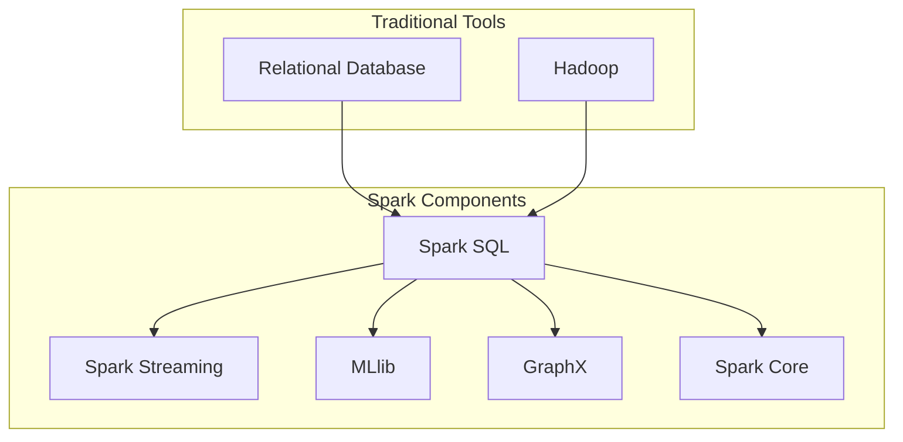

# 【AI大数据计算原理与代码实例讲解】Spark SQL

作者：禅与计算机程序设计艺术 / Zen and the Art of Computer Programming

## 1. 背景介绍
### 1.1 问题的由来

随着互联网、物联网、智能设备等技术的快速发展，数据量呈指数级增长。如何高效、可靠地对海量数据进行处理和分析，成为了当今时代的重要课题。传统的数据处理工具和系统，如关系数据库、Hadoop等，在处理大数据时存在诸多瓶颈，如扩展性差、计算效率低、编程复杂度高等。为了解决这些问题，Spark应运而生。Spark SQL是Spark生态系统中专门用于处理结构化数据的组件，它提供了丰富的API接口，能够方便地处理SQL查询，并与其他Spark组件协同工作，实现高效的大数据处理。

### 1.2 研究现状

Spark SQL自2013年发布以来，已经发展成为大数据处理领域的明星技术。其高性能、易用性、强大的数据源支持等特点，使得Spark SQL在学术界和工业界都得到了广泛的应用。目前，Spark SQL已经成为Apache Spark生态系统中不可或缺的一部分，与Spark Streaming、MLlib等组件共同构成了Spark强大的数据处理和分析平台。

### 1.3 研究意义

Spark SQL作为Spark生态系统中处理结构化数据的核心组件，具有以下研究意义：

1. 提高数据处理效率：Spark SQL利用其先进的内存计算能力，实现了对大规模数据的高效处理，极大提升了数据处理速度。
2. 简化编程模型：Spark SQL提供丰富的API接口，使得开发者能够以类似SQL的方式编写数据查询，降低了数据处理编程的复杂度。
3. 跨平台支持：Spark SQL支持多种数据源，如关系数据库、HDFS、HBase等，方便开发者将现有系统与Spark平台进行整合。
4. 灵活扩展：Spark SQL支持水平扩展，可以轻松应对不断增长的数据规模。

### 1.4 本文结构

本文将围绕Spark SQL展开，详细介绍其原理、API使用方法、项目实践以及实际应用场景。文章结构如下：

- 第2章：介绍Spark SQL的核心概念和联系。
- 第3章：阐述Spark SQL的核心算法原理和具体操作步骤。
- 第4章：讲解Spark SQL的数学模型、公式和实例。
- 第5章：给出Spark SQL的代码实例和详细解释。
- 第6章：探讨Spark SQL的实际应用场景和未来发展趋势。
- 第7章：推荐Spark SQL的学习资源、开发工具和相关论文。
- 第8章：总结Spark SQL的研究成果、未来发展趋势和面临的挑战。
- 第9章：提供Spark SQL的常见问题与解答。

## 2. 核心概念与联系
### 2.1 Spark SQL核心概念

Spark SQL的核心概念包括：

- DataFrame：类似于关系数据库中的表格，用于存储结构化数据。
- Dataset：DataFrame的更加强大的抽象，支持更丰富的操作。
- Catalyst优化器：Spark SQL的核心优化器，负责查询解析、优化和执行。
- SparkSession：Spark SQL的入口，用于创建DataFrame或Dataset。

### 2.2 Spark SQL与相关概念的联系

Spark SQL与其他Spark组件以及传统数据处理工具的关系如下：



Spark SQL作为Spark生态系统中处理结构化数据的核心组件，与Spark的其他组件紧密协作，共同实现高效的大数据处理。同时，Spark SQL也兼容传统数据处理工具，方便开发者将现有系统与Spark平台进行整合。

## 3. 核心算法原理 & 具体操作步骤
### 3.1 算法原理概述

Spark SQL的核心算法原理是Catalyst优化器。Catalyst优化器负责查询解析、优化和执行。其工作流程如下：

1. 解析：将SQL查询语句解析成抽象语法树（AST）。
2. 优化：对AST进行一系列优化操作，如谓词下推、投影剪枝等。
3. 物化：将优化后的AST物化为物理执行计划。
4. 执行：执行物理执行计划，获取最终结果。

### 3.2 算法步骤详解

Spark SQL的算法步骤如下：

1. 创建SparkSession实例。
2. 读取数据源，创建DataFrame或Dataset对象。
3. 对DataFrame或Dataset进行SQL查询或DataFrame API操作。
4. 获取查询结果。

### 3.3 算法优缺点

Spark SQL的优点：

- 高效：利用内存计算和分布式计算，实现了对大规模数据的高效处理。
- 易用：提供丰富的API接口，方便开发者编写数据查询。
- 扩展性强：支持多种数据源，如关系数据库、HDFS、HBase等。

Spark SQL的缺点：

- 学习成本较高：相对于传统关系数据库，Spark SQL的学习成本较高。
- 资源消耗较大：Spark SQL需要较大的内存和计算资源。

### 3.4 算法应用领域

Spark SQL的应用领域包括：

- 数据仓库：处理和分析企业级数据，如销售数据、客户数据等。
- 实时数据分析：对实时数据流进行处理和分析，如股票交易、社交网络等。
- 机器学习：使用Spark SQL进行数据预处理和特征提取，为机器学习算法提供数据支持。

## 4. 数学模型和公式 & 详细讲解 & 举例说明
### 4.1 数学模型构建

Spark SQL的数学模型主要包括：

- 数据库理论：包括关系代数、SQL查询优化等。
- 分布式算法：包括MapReduce、Spark RDD等。

### 4.2 公式推导过程

Spark SQL的公式推导过程主要包括：

- 关系代数公式的推导。
- SQL查询优化算法的推导。

### 4.3 案例分析与讲解

以下是一个Spark SQL的查询示例：

```sql
SELECT name, age FROM people WHERE age > 18;
```

该查询语句的含义是：从people表中选出年龄大于18岁的记录，并选择name和age两个字段。

### 4.4 常见问题解答

**Q1：Spark SQL与关系数据库有什么区别？**

A1：Spark SQL与关系数据库的主要区别在于：

- Spark SQL是分布式计算框架，可以处理大规模数据，而关系数据库是集中式存储系统，只能处理小规模数据。
- Spark SQL提供更丰富的API接口，如DataFrame API和DataFrame Dataset API，而关系数据库的查询语言是SQL。

## 5. 项目实践：代码实例和详细解释说明
### 5.1 开发环境搭建

在进行Spark SQL项目实践前，我们需要搭建Spark开发环境。以下是使用Apache Maven搭建Spark开发环境的步骤：

1. 安装Maven：从官网下载并安装Maven。
2. 创建Maven项目：使用Maven Archetype创建一个Java项目。
3. 添加Spark依赖：在pom.xml文件中添加Spark相关依赖。

### 5.2 源代码详细实现

以下是一个Spark SQL的Java代码实例：

```java
import org.apache.spark.sql.SparkSession;

public class SparkSQLExample {
    public static void main(String[] args) {
        // 创建SparkSession实例
        SparkSession spark = SparkSession.builder()
                .appName("Spark SQL Example")
                .master("local")
                .getOrCreate();

        // 读取CSV文件
        Dataset<Row> df = spark.read().csv("path/to/data.csv");

        // 查询DataFrame
        df.select("name", "age").where("age > 18").show();

        // 关闭SparkSession
        spark.stop();
    }
}
```

### 5.3 代码解读与分析

以上代码展示了如何使用Spark SQL读取CSV文件、查询DataFrame并显示结果。以下是代码的关键部分：

- 创建SparkSession实例：使用SparkSession.builder()创建SparkSession实例，指定应用程序名称和运行模式。
- 读取CSV文件：使用SparkSession的read()方法读取CSV文件，并创建DataFrame对象df。
- 查询DataFrame：使用DataFrame API对df进行查询，选择name和age两个字段，并筛选出年龄大于18岁的记录。
- 显示结果：使用show()方法显示查询结果。

### 5.4 运行结果展示

假设data.csv文件的内容如下：

```
name,age
Alice,20
Bob,15
Charlie,22
```

运行以上代码后，控制台将输出以下结果：

```
+-------+---+
|    name|age|
+-------+---+
|   Alice|20|
| Charlie|22|
+-------+---+
```

可以看到，查询结果中只包含了年龄大于18岁的记录。

## 6. 实际应用场景
### 6.1 数据仓库

Spark SQL可以用于构建数据仓库，处理和分析企业级数据。例如，可以将企业内部的销售数据、客户数据、员工数据等存储在Spark SQL中，并通过SQL查询进行分析和统计。

### 6.2 实时数据分析

Spark SQL可以用于实时数据分析，对实时数据流进行处理和分析。例如，可以将股票交易数据、社交网络数据等实时数据源接入Spark SQL，并实时计算指标、分析趋势。

### 6.3 机器学习

Spark SQL可以用于机器学习，进行数据预处理和特征提取。例如，可以将机器学习算法的输入数据存储在Spark SQL中，并通过DataFrame API进行预处理和特征提取。

### 6.4 未来应用展望

随着Spark SQL技术的不断发展，其应用领域将更加广泛。以下是一些未来Spark SQL可能的应用方向：

- 大数据分析：Spark SQL可以用于处理和分析大规模数据，为用户提供更深入的数据洞察。
- 人工智能：Spark SQL可以与人工智能技术结合，构建智能化的数据分析平台。
- 云计算：Spark SQL可以与云计算平台结合，提供弹性的数据分析服务。

## 7. 工具和资源推荐
### 7.1 学习资源推荐

为了帮助开发者系统掌握Spark SQL的知识，这里推荐以下学习资源：

1. 《Spark SQL: The Definitive Guide》：介绍了Spark SQL的基本概念、API使用方法、优化策略等。
2. Spark SQL官方文档：提供了Spark SQL的详细文档和示例代码。
3. Apache Spark官网：介绍了Spark及其生态系统的最新动态。

### 7.2 开发工具推荐

以下是一些Spark SQL的开发工具：

1. Spark Studio：基于Web的Spark开发环境，可以方便地编写和调试Spark代码。
2. IntelliJ IDEA：支持Spark SQL的集成开发环境，可以方便地编写和调试Spark代码。
3. PyCharm：支持Spark SQL的集成开发环境，可以方便地编写和调试Spark代码。

### 7.3 相关论文推荐

以下是一些Spark SQL相关论文：

1. "Spark SQL: A Structured Data Processing Engine for Big Data"：介绍了Spark SQL的设计和实现。
2. "Catalyst: A New Query Optimization Framework for Spark"：介绍了Catalyst优化器的设计和实现。

### 7.4 其他资源推荐

以下是一些其他Spark SQL资源：

1. Spark SQL社区：Spark SQL的官方社区，可以与其他开发者交流经验。
2. Spark Summit：Spark技术大会，可以了解Spark及其生态系统的最新动态。

## 8. 总结：未来发展趋势与挑战
### 8.1 研究成果总结

本文对Spark SQL的原理、API使用方法、项目实践以及实际应用场景进行了详细介绍。通过学习本文，读者可以全面了解Spark SQL，并能够将其应用到实际项目中。

### 8.2 未来发展趋势

未来Spark SQL将朝着以下方向发展：

1. 支持更多数据源：Spark SQL将支持更多数据源，如NoSQL数据库、图数据库等。
2. 优化查询性能：Spark SQL将不断优化查询性能，降低查询延迟，提高数据处理效率。
3. 简化编程模型：Spark SQL将简化编程模型，降低开发门槛，方便开发者使用。

### 8.3 面临的挑战

Spark SQL在发展过程中也面临着以下挑战：

1. 内存消耗：Spark SQL在处理大规模数据时，内存消耗较大，需要优化内存管理。
2. 扩展性：Spark SQL在扩展性方面还有待提高，需要优化分布式计算架构。

### 8.4 研究展望

展望未来，Spark SQL将继续发展，为用户提供更强大、易用的大数据处理能力。同时，Spark SQL也将与其他人工智能、大数据技术进行融合，为构建智能化的数据分析平台提供技术支持。

## 9. 附录：常见问题与解答

**Q1：Spark SQL与Hive有什么区别？**

A1：Spark SQL与Hive的主要区别如下：

- Spark SQL是分布式计算框架，可以处理大规模数据，而Hive是Hadoop生态系统中处理结构化数据的组件。
- Spark SQL提供更丰富的API接口，如DataFrame API和DataFrame Dataset API，而Hive的查询语言是HiveQL。

**Q2：Spark SQL如何处理大数据？**

A2：Spark SQL利用其内存计算和分布式计算能力，可以高效地处理大规模数据。Spark SQL将数据存储在分布式存储系统（如HDFS）中，并通过分布式计算框架（如Spark RDD）进行并行处理。

**Q3：Spark SQL如何与其他Spark组件协同工作？**

A3：Spark SQL可以与其他Spark组件协同工作，如Spark Streaming、MLlib等。例如，可以使用Spark SQL进行数据预处理，然后使用Spark Streaming进行实时数据分析。

**Q4：Spark SQL的适用场景有哪些？**

A4：Spark SQL适用于以下场景：

- 数据仓库：处理和分析企业级数据。
- 实时数据分析：对实时数据流进行处理和分析。
- 机器学习：进行数据预处理和特征提取。

**Q5：如何优化Spark SQL的性能？**

A5：优化Spark SQL性能可以从以下几个方面入手：

- 优化数据存储：选择合适的分布式存储系统，如HDFS。
- 优化内存管理：合理配置内存资源，减少内存消耗。
- 优化查询计划：优化查询计划，减少查询延迟。
- 优化编程模型：使用DataFrame API和DataFrame Dataset API，提高编程效率。