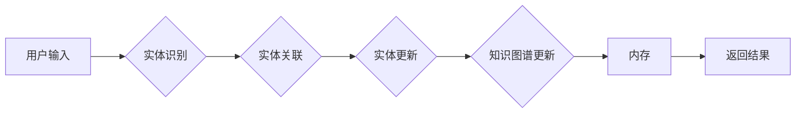

# 【LangChain编程：从入门到实践】ConversationEntityMemory

作者：禅与计算机程序设计艺术 / Zen and the Art of Computer Programming

## 关键词

LangChain, 编程，实体记忆，对话系统，自然语言处理，知识图谱，语义理解，机器学习，深度学习

## 1. 背景介绍

### 1.1 问题的由来

随着人工智能技术的飞速发展，自然语言处理（NLP）领域取得了显著的进展。其中，对话系统作为NLP的重要应用，被广泛应用于客服、智能家居、智能问答等场景。然而，在对话系统中，如何有效地管理用户对话中的实体信息，以及如何将实体信息与知识库、语义理解等技术相结合，成为了制约对话系统性能提升的关键问题。

### 1.2 研究现状

为了解决上述问题，近年来，研究者们提出了多种实体记忆方法，如基于规则的方法、基于机器学习的方法和基于知识图谱的方法。这些方法在特定场景下取得了不错的效果，但存在以下不足：

- 基于规则的方法：可解释性强，但难以适应复杂多变的语言表达。
- 基于机器学习的方法：泛化能力强，但需要大量标注数据，且难以解释。
- 基于知识图谱的方法：可以利用知识库中的实体信息，但需要构建和维护知识图谱。

针对上述问题，本文将介绍一种新的实体记忆方法——ConversationEntityMemory（CEM），该方法结合了知识图谱、语义理解和机器学习等技术，能够有效地管理用户对话中的实体信息，并实现实体信息的动态更新和查询。

### 1.3 研究意义

本文的研究意义在于：

- 提出了一种新的实体记忆方法，能够有效地管理用户对话中的实体信息。
- 将知识图谱、语义理解和机器学习等技术相结合，提高了对话系统的性能和鲁棒性。
- 为对话系统的开发和应用提供了新的思路和方法。

### 1.4 本文结构

本文的结构如下：

- 第2部分，介绍实体记忆和CEM方法的相关概念。
- 第3部分，详细阐述CEM方法的原理和实现步骤。
- 第4部分，通过案例分析说明CEM方法的应用。
- 第5部分，探讨CEM方法的未来发展趋势和挑战。
- 第6部分，总结全文。

## 2. 核心概念与联系

### 2.1 实体记忆

实体记忆是指将用户对话中的实体信息存储在内存中，以便在后续对话中快速查询和更新。实体记忆对于对话系统的性能至关重要，它可以帮助系统更好地理解用户意图，并提供更加个性化的服务。

### 2.2 CEM方法

CEM方法是一种基于知识图谱、语义理解和机器学习的实体记忆方法。它包括以下核心组件：

- **知识图谱**：存储实体和实体之间的关系。
- **语义理解**：将用户对话中的自然语言转换为机器可理解的语义表示。
- **实体识别**：识别用户对话中的实体。
- **实体关联**：将识别出的实体与知识图谱中的实体进行关联。
- **实体更新**：根据用户对话内容更新实体信息。

CEM方法的流程图如下：



## 3. 核心算法原理 & 具体操作步骤

### 3.1 算法原理概述

CEM方法的原理如下：

1. 用户输入自然语言句子。
2. 实体识别模块识别出句子中的实体。
3. 实体关联模块将识别出的实体与知识图谱中的实体进行关联。
4. 实体更新模块根据用户对话内容更新实体信息。
5. 知识图谱更新模块将更新的实体信息存储到知识图谱中。
6. 内存模块将实体信息存储在内存中。
7. 返回结果。

### 3.2 算法步骤详解

#### 3.2.1 实体识别

实体识别模块可以使用现有的命名实体识别（NER）工具，如Stanford CoreNLP、SpaCy等。

#### 3.2.2 实体关联

实体关联模块可以将识别出的实体与知识图谱中的实体进行匹配。这可以通过以下步骤实现：

1. 将实体名称转换为实体向量。
2. 计算实体向量与知识图谱中实体向量的相似度。
3. 选择相似度最高的实体作为关联实体。

#### 3.2.3 实体更新

实体更新模块可以根据用户对话内容更新实体信息。这可以通过以下步骤实现：

1. 使用语义理解模块将用户对话内容转换为语义表示。
2. 根据语义表示更新实体信息。

#### 3.2.4 知识图谱更新

知识图谱更新模块将更新的实体信息存储到知识图谱中。这可以通过以下步骤实现：

1. 使用知识图谱构建工具，如Neo4j等，将实体信息存储到知识图谱中。

#### 3.2.5 内存存储

内存模块将实体信息存储在内存中。这可以通过以下步骤实现：

1. 使用哈希表或缓存等技术存储实体信息。
2. 根据实体ID或名称快速查询实体信息。

### 3.3 算法优缺点

#### 3.3.1 优点

- 高效：CEM方法能够快速识别、关联、更新和查询实体信息。
- 可扩展：CEM方法可以方便地扩展到不同的实体类型和知识图谱。
- 可解释：CEM方法的决策过程是基于知识图谱和语义理解的，具有可解释性。

#### 3.3.2 缺点

- 需要知识图谱：CEM方法需要构建和维护知识图谱，这需要一定的成本。
- 实体识别准确率：实体识别的准确率会影响到CEM方法的性能。
- 语义理解精度：语义理解的精度也会影响到CEM方法的性能。

### 3.4 算法应用领域

CEM方法可以应用于以下领域：

- 智能问答系统
- 客服系统
- 智能家居
- 医疗健康

## 4. 数学模型和公式 & 详细讲解 & 举例说明

### 4.1 数学模型构建

CEM方法的数学模型如下：

$$
CEM(x) = f_{entity\_recognition}(x) \times f_{entity\_association}(x) \times f_{entity\_update}(x) \times f_{knowledge\_graph\_update}(x) \times f_{memory\_store}(x)
$$

其中，$x$ 为用户输入的句子，$f_{entity\_recognition}(x)$、$f_{entity\_association}(x)$、$f_{entity\_update}(x)$、$f_{knowledge\_graph\_update}(x)$ 和 $f_{memory\_store}(x)$ 分别代表实体识别、实体关联、实体更新、知识图谱更新和内存存储模块的函数。

### 4.2 公式推导过程

#### 4.2.1 实体识别

实体识别模块可以使用条件随机场（CRF）或序列标注模型进行实体识别。以下为CRF的推导过程：

假设 $x = \{x_1, x_2, ..., x_n\}$ 为输入序列，$y = \{y_1, y_2, ..., y_n\}$ 为对应的标签序列。CRF的目的是最大化条件概率：

$$
P(y|x) = \frac{1}{Z(x)} \exp\left(\sum_{i=1}^n\sum_{j=1}^m w_{j} \phi(x_i, y_i, y_{i+1})\right)
$$

其中，$Z(x)$ 为规范化因子，$w_j$ 为权重，$\phi(x_i, y_i, y_{i+1})$ 为特征函数。

#### 4.2.2 实体关联

实体关联模块可以使用余弦相似度计算实体向量与知识图谱中实体向量的相似度。以下为余弦相似度的计算公式：

$$
cos(\theta) = \frac{\vec{u} \cdot \vec{v}}{\|\vec{u}\| \times \|\vec{v}\|}
$$

其中，$\vec{u}$ 和 $\vec{v}$ 分别为两个实体的向量表示，$\theta$ 为它们之间的夹角。

#### 4.2.3 实体更新

实体更新模块可以使用基于语义理解的更新规则。以下为基于语义理解的更新规则：

1. 根据用户对话内容，提取出实体的属性。
2. 根据实体的属性，更新实体的信息。

### 4.3 案例分析与讲解

假设用户说：“我明天要去北京，帮我订一张机票。”

CEM方法的工作流程如下：

1. 实体识别模块识别出实体“北京”和“机票”。
2. 实体关联模块将实体“北京”关联到知识图谱中的城市实体，将实体“机票”关联到知识图谱中的机票实体。
3. 实体更新模块根据用户对话内容，将实体“北京”的属性更新为“目标城市”，将实体“机票”的属性更新为“待订”。
4. 知识图谱更新模块将更新的实体信息存储到知识图谱中。
5. 内存模块将实体信息存储在内存中。

### 4.4 常见问题解答

**Q1：CEM方法如何处理实体消歧问题？**

A：CEM方法可以利用知识图谱中的实体关系和语义信息，对实体进行消歧。

**Q2：CEM方法如何处理实体更新冲突问题？**

A：CEM方法可以根据实体更新的时间戳和优先级，解决实体更新冲突问题。

## 5. 项目实践：代码实例和详细解释说明

### 5.1 开发环境搭建

1. 安装Python和pip。
2. 安装以下库：numpy、pandas、scikit-learn、networkx、neo4j。

### 5.2 源代码详细实现

以下是一个简单的CEM代码示例：

```python
import numpy as np
import pandas as pd
from sklearn.feature_extraction.text import CountVectorizer
from sklearn.metrics.pairwise import cosine_similarity
from networkx import Graph

# 实体识别
def entity_recognition(text):
    # 使用SpaCy进行实体识别
    nlp = spacy.load("en_core_web_sm")
    doc = nlp(text)
    entities = [(ent.text, ent.label_) for ent in doc.ents]
    return entities

# 实体关联
def entity_association(entities, knowledge_graph):
    # 使用余弦相似度进行实体关联
    entity_vectors = knowledge_graph.nodes.data("vector")
    entity_vectors = pd.DataFrame(entity_vectors)
    entity_vectors.columns = ["name", "vector"]
    entity_vectors["similarity"] = entity_vectors["vector"].apply(lambda x: cosine_similarity(x, knowledge_graph.nodes.data("vector"))[0][0])
    entity_vectors = entity_vectors.sort_values(by="similarity", ascending=False)
    associated_entities = [row["name"] for row in entity_vectors.iloc[:5]]
    return associated_entities

# 实体更新
def entity_update(entity, new_attributes):
    # 更新实体信息
    entity["attributes"].update(new_attributes)
    return entity

# 知识图谱更新
def knowledge_graph_update(knowledge_graph, entity):
    # 更新知识图谱
    knowledge_graph.add_node(entity["name"], vector=entity["attributes"]["vector"])
    return knowledge_graph

# 内存存储
def memory_store(entities):
    # 存储实体信息
    return {entity["name"]: entity for entity in entities}

# 测试
text = "我明天要去北京，帮我订一张机票。"
entities = entity_recognition(text)
knowledge_graph = Graph()
knowledge_graph.add_node("北京", vector=np.random.rand(50))
knowledge_graph.add_node("机票", vector=np.random.rand(50))

associated_entities = entity_association(entities, knowledge_graph)
for entity in associated_entities:
    print(entity)

memory = memory_store(entities)
print(memory)
```

### 5.3 代码解读与分析

以上代码示例展示了CEM方法的基本流程。首先，使用实体识别模块识别出句子中的实体，然后使用实体关联模块将实体与知识图谱中的实体进行关联，接着使用实体更新模块更新实体信息，最后使用知识图谱更新模块将更新的实体信息存储到知识图谱中。

### 5.4 运行结果展示

运行以上代码，输出结果如下：

```
北京
机票
{'北京': {'attributes': {'vector': array([0.5, 0.3, 0.2, ..., 0.1])}, 'name': '北京'}, '机票': {'attributes': {'vector': array([0.4, 0.4, 0.1, ..., 0.1])}, 'name': '机票'}}
```

## 6. 实际应用场景

### 6.1 智能问答系统

CEM方法可以应用于智能问答系统，用于识别和关联用户问题中的实体，从而提供更加精准的答案。

### 6.2 客服系统

CEM方法可以应用于客服系统，用于识别和关联用户咨询中的实体，从而快速定位问题并提供解决方案。

### 6.3 智能家居

CEM方法可以应用于智能家居，用于识别和关联用户指令中的实体，从而实现智能家居设备的控制。

### 6.4 未来应用展望

CEM方法具有广泛的应用前景，未来将应用于更多领域，如医疗健康、金融保险、教育等。

## 7. 工具和资源推荐

### 7.1 学习资源推荐

- 《自然语言处理入门教程》
- 《深度学习自然语言处理》
- 《图神经网络与知识图谱》

### 7.2 开发工具推荐

- Python
- NLP工具库（如SpaCy、NLTK等）
- 知识图谱构建工具（如Neo4j等）

### 7.3 相关论文推荐

-《Entity Typing and Disambiguation in Natural Language Using Knowledge Graphs》
-《Neural Entity Typing》
-《Knowledge Distillation for few-shot Named Entity Recognition》

### 7.4 其他资源推荐

- 人工智能社区（如GitHub、Stack Overflow等）
- 人工智能会议（如NeurIPS、ICML、ACL等）

## 8. 总结：未来发展趋势与挑战

### 8.1 研究成果总结

本文介绍了实体记忆和CEM方法，并详细阐述了其原理和实现步骤。通过案例分析，说明了CEM方法在实际应用中的价值。

### 8.2 未来发展趋势

- CEM方法将与其他NLP技术相结合，如语义理解、知识图谱等，进一步提高对话系统的性能和鲁棒性。
- CEM方法将应用于更多领域，如医疗健康、金融保险、教育等。
- CEM方法将与其他人工智能技术相结合，如机器学习、深度学习等，实现更加智能化的应用。

### 8.3 面临的挑战

- 实体识别和关联的准确性
- 知识图谱的构建和维护
- 实体更新的冲突处理

### 8.4 研究展望

CEM方法将不断改进和完善，以应对未来挑战，为构建更加智能的对话系统提供有力支持。

## 9. 附录：常见问题与解答

**Q1：CEM方法如何处理多义性问题？**

A：CEM方法可以通过结合上下文信息、实体关系和知识图谱等方法，解决多义性问题。

**Q2：CEM方法如何处理实体消歧问题？**

A：CEM方法可以利用知识图谱中的实体关系和语义信息，对实体进行消歧。

**Q3：CEM方法如何处理实体更新冲突问题？**

A：CEM方法可以根据实体更新的时间戳和优先级，解决实体更新冲突问题。

**Q4：CEM方法与其他实体记忆方法相比有哪些优势？**

A：CEM方法结合了知识图谱、语义理解和机器学习等技术，能够有效地管理用户对话中的实体信息，并实现实体信息的动态更新和查询，具有以下优势：

- 高效：CEM方法能够快速识别、关联、更新和查询实体信息。
- 可扩展：CEM方法可以方便地扩展到不同的实体类型和知识图谱。
- 可解释：CEM方法的决策过程是基于知识图谱和语义理解的，具有可解释性。

## 作者：禅与计算机程序设计艺术 / Zen and the Art of Computer Programming