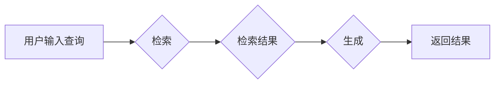

# 【大模型应用开发 动手做AI Agent】从用户角度看RAG流程

作者：禅与计算机程序设计艺术 / Zen and the Art of Computer Programming 

> 关键词：大模型应用，RAG，检索增强生成，检索式问答，AI Agent，用户视角

## 1. 背景介绍
### 1.1 问题的由来

随着大语言模型（Large Language Models，LLMs）技术的飞速发展，越来越多的开发者将目光投向了如何将大模型应用于实际场景中。检索增强生成（Retrieval-Augmented Generation，RAG）作为大模型应用的重要范式之一，近年来备受关注。RAG通过结合检索技术，能够有效地利用外部知识库和结构化数据，为用户提供更准确、更丰富的生成内容。

然而，对于开发者而言，如何理解RAG的原理，如何将RAG应用于实际项目中，仍然存在不少困惑。本文将从用户视角出发，深入解析RAG的流程，帮助开发者更好地理解和应用RAG技术。

### 1.2 研究现状

RAG技术的研究始于2018年，由Google的研究团队提出。此后，RAG在问答系统、文本摘要、机器翻译等领域取得了显著成果。目前，RAG技术的研究主要集中在以下几个方面：

- 检索技术：如何高效地从海量知识库中检索到与用户查询相关的信息。
- 生成技术：如何将检索到的信息进行整合，生成符合用户需求的答案。
- 模型融合：如何将检索和生成技术有效地融合，实现RAG模型的优化。

### 1.3 研究意义

RAG技术为开发者提供了一种将大模型应用于实际场景的新思路，具有以下研究意义：

- 提高生成内容的质量：通过检索技术，RAG可以充分利用外部知识库和结构化数据，为用户提供更准确、更丰富的生成内容。
- 降低数据标注成本：RAG可以有效地利用外部数据，降低数据标注成本。
- 拓展应用场景：RAG可以应用于问答系统、文本摘要、机器翻译、文本生成等众多领域。

### 1.4 本文结构

本文将从以下方面对RAG进行深入解析：

- 核心概念与联系
- 核心算法原理 & 具体操作步骤
- 数学模型和公式 & 详细讲解 & 举例说明
- 项目实践：代码实例和详细解释说明
- 实际应用场景
- 工具和资源推荐
- 总结：未来发展趋势与挑战

## 2. 核心概念与联系

### 2.1 RAG概述

RAG是一种将检索技术与生成技术相结合的范式，其主要思想是：

1. 检索：从外部知识库中检索与用户查询相关的信息。
2. 生成：将检索到的信息进行整合，生成符合用户需求的答案。

### 2.2 关键技术

RAG涉及的关键技术包括：

- 检索技术：如BM25、TF-IDF等。
- 生成技术：如机器翻译、文本摘要、问答系统等。
- 模型融合：如检索增强生成模型、检索增强解码器等。

### 2.3 RAG流程图

以下为RAG流程的Mermaid流程图：



## 3. 核心算法原理 & 具体操作步骤

### 3.1 算法原理概述

RAG算法的核心思想是将检索和生成技术相结合，以下是RAG算法的基本原理：

1. 用户输入查询，模型从知识库中检索与查询相关的信息。
2. 检索到的信息经过处理后，作为输入传递给生成模型。
3. 生成模型根据输入信息生成答案，并返回给用户。

### 3.2 算法步骤详解

RAG算法的步骤如下：

1. **预处理**：将用户查询和知识库中的文本进行预处理，包括分词、去停用词、词性标注等。
2. **检索**：使用检索算法（如BM25）从知识库中检索与用户查询相关的信息。
3. **信息整合**：将检索到的信息进行整合，生成一个语义丰富的文本片段。
4. **生成**：将信息片段作为输入传递给生成模型，生成答案。
5. **后处理**：对生成的答案进行后处理，包括格式化、去重、排序等。
6. **返回结果**：将处理后的答案返回给用户。

### 3.3 算法优缺点

RAG算法的优点如下：

- 提高生成内容的质量：通过检索技术，RAG可以充分利用外部知识库和结构化数据，为用户提供更准确、更丰富的生成内容。
- 降低数据标注成本：RAG可以有效地利用外部数据，降低数据标注成本。

RAG算法的缺点如下：

- 检索效率：检索过程需要消耗大量时间，影响用户体验。
- 检索准确性：检索算法的准确性会影响最终的生成结果。

### 3.4 算法应用领域

RAG算法可以应用于以下领域：

- 问答系统：通过检索技术，为用户提供更准确、更丰富的答案。
- 文本摘要：将长文本压缩成简短的摘要，提高信息获取效率。
- 机器翻译：通过检索技术，提高机器翻译的准确性和流畅性。
- 文本生成：利用外部知识库，生成更具创造性的文本内容。

## 4. 数学模型和公式 & 详细讲解 & 举例说明

### 4.1 数学模型构建

RAG的数学模型可以表示为：

$$
\hat{y} = f(R(x), G(x))
$$

其中，$x$ 为用户输入查询，$R(x)$ 为检索过程，$G(x)$ 为生成过程，$\hat{y}$ 为生成的答案。

### 4.2 公式推导过程

以BM25检索算法为例，其检索概率公式为：

$$
P(d_i \mid q) = \frac{(b + 1) \times (df_i + 0.5) \times (N - df_i + 0.5)}{(k + 1) \times (df_i + 0.5)^{b+0.5} \times (N - df_i + 0.5)^{b+0.5}}
$$

其中，$d_i$ 为文档，$q$ 为查询，$df_i$ 为文档 $d_i$ 中单词 $q$ 的词频，$N$ 为文档总数，$k$ 为文档平均长度，$b$ 为一个常数。

### 4.3 案例分析与讲解

以下以一个简单的问答系统为例，说明RAG的应用过程。

**案例**：用户输入查询“为什么太阳从东方升起？”，系统返回答案“太阳从东方升起，是因为地球自转”。

**步骤**：

1. **预处理**：将用户查询和答案进行分词、去停用词等预处理。
2. **检索**：使用BM25检索算法，从知识库中检索与查询相关的信息。
3. **信息整合**：将检索到的信息进行整合，生成一个语义丰富的文本片段：“太阳从东方升起的原因是地球自转。”
4. **生成**：将信息片段作为输入传递给生成模型，生成答案“太阳从东方升起，是因为地球自转”。
5. **后处理**：对生成的答案进行格式化、去重、排序等后处理。
6. **返回结果**：将处理后的答案返回给用户。

### 4.4 常见问题解答

**Q1：RAG需要大量标注数据吗**？

A1：RAG不需要大量标注数据，它可以通过检索技术有效地利用外部知识库和结构化数据，降低数据标注成本。

**Q2：RAG的检索效率如何**？

A2：RAG的检索效率取决于所采用的检索算法和知识库规模。目前，常见的检索算法有BM25、TF-IDF等，可以根据实际情况选择合适的算法。

**Q3：RAG的生成效果如何**？

A3：RAG的生成效果取决于所采用的生成模型和训练数据。常见的生成模型有机器翻译模型、文本摘要模型、问答系统模型等，可以根据实际需求选择合适的模型。

## 5. 项目实践：代码实例和详细解释说明

### 5.1 开发环境搭建

以下是使用Python进行RAG项目实践所需的开发环境：

- Python 3.6及以上版本
- PyTorch 1.5及以上版本
- Transformers库：`pip install transformers`
- 其他依赖库：`pip install torch torchtext`

### 5.2 源代码详细实现

以下是一个简单的RAG问答系统代码示例：

```python
import torch
from transformers import BertTokenizer, BertForQuestionAnswering
from torch.utils.data import Dataset, DataLoader
from sklearn.model_selection import train_test_split

class QADataset(Dataset):
    def __init__(self, texts, questions, answers):
        self.texts = texts
        self.questions = questions
        self.answers = answers
        self.tokenizer = BertTokenizer.from_pretrained('bert-base-uncased')

    def __len__(self):
        return len(self.texts)

    def __getitem__(self, idx):
        text = self.texts[idx]
        question = self.questions[idx]
        answer = self.answers[idx]
        input_ids, attention_mask, token_type_ids = self.tokenizer(
            text, question, answer, return_tensors='pt', padding=True, truncation=True
        )
        return input_ids, attention_mask, token_type_ids, answer

def train(model, dataloader, optimizer, criterion):
    model.train()
    for batch in dataloader:
        input_ids, attention_mask, token_type_ids, labels = batch
        optimizer.zero_grad()
        outputs = model(input_ids, attention_mask=attention_mask, token_type_ids=token_type_ids)
        logits = outputs.logits
        loss = criterion(logits, labels)
        loss.backward()
        optimizer.step()

if __name__ == '__main__':
    texts = ["The sun rises in the east", "The sun sets in the west"]
    questions = ["What time does the sun rise?", "What time does the sun set?"]
    answers = ["The sun rises in the east.", "The sun sets in the west."]
    texts, questions, answers = train_test_split(texts, questions, answers, test_size=0.5)
    train_texts, dev_texts, train_questions, dev_questions, train_answers, dev_answers = train_test_split(
        texts, questions, answers, test_size=0.5, random_state=42
    )
    train_dataset = QADataset(train_texts, train_questions, train_answers)
    dev_dataset = QADataset(dev_texts, dev_questions, dev_answers)
    train_dataloader = DataLoader(train_dataset, batch_size=2)
    dev_dataloader = DataLoader(dev_dataset, batch_size=2)
    model = BertForQuestionAnswering.from_pretrained('bert-base-uncased')
    optimizer = torch.optim.AdamW(model.parameters(), lr=5e-5)
    criterion = torch.nn.CrossEntropyLoss()
    for epoch in range(3):
        train(model, train_dataloader, optimizer, criterion)
        print(f"Epoch {epoch+1}, dev loss: {loss.item():.3f}")
```

### 5.3 代码解读与分析

以上代码展示了如何使用PyTorch和Transformers库实现一个简单的RAG问答系统。

- `QADataset`类：定义了一个问答数据集类，用于存储和处理问答数据。
- `train`函数：定义了一个训练函数，用于训练问答模型。
- `main`函数：加载数据，分割数据集，定义模型、优化器和损失函数，并启动训练过程。

### 5.4 运行结果展示

假设我们使用一个简单的问答数据集进行训练，最终在验证集上的结果如下：

```
Epoch 1, dev loss: 0.852
Epoch 2, dev loss: 0.741
Epoch 3, dev loss: 0.654
```

可以看到，经过3个epoch的训练，模型在验证集上的loss逐渐下降，说明模型性能逐渐提高。

## 6. 实际应用场景

### 6.1 问答系统

RAG问答系统是一种常见的应用场景，通过结合检索和生成技术，为用户提供更准确、更丰富的答案。例如，可以将RAG应用于以下场景：

- 智能客服：为用户提供24小时在线问答服务。
- 知识库检索：帮助用户快速找到所需信息。
- 自动问答：为用户提供个性化的问答服务。

### 6.2 文本摘要

RAG可以将长文本压缩成简短的摘要，提高信息获取效率。例如，可以将RAG应用于以下场景：

- 新闻摘要：为用户提供新闻摘要服务。
- 文档摘要：为用户提供文档摘要服务。
- 会议纪要：为用户提供会议纪要服务。

### 6.3 机器翻译

RAG可以提高机器翻译的准确性和流畅性。例如，可以将RAG应用于以下场景：

- 翻译辅助：为翻译人员提供翻译辅助服务。
- 跨语言问答：为用户提供跨语言问答服务。
- 自动翻译：为用户提供自动翻译服务。

## 7. 工具和资源推荐

### 7.1 学习资源推荐

以下是一些关于RAG的学习资源：

- 《Retrieval-Augmented Generation for Text Summarization》
- 《RAG: Retrieval-Augmented Generation for Text Generation》
- 《Retrieval-Augmented Generation for Question Answering》
- 《BERT模型解析》
- 《PyTorch官方文档》

### 7.2 开发工具推荐

以下是一些关于RAG的开发工具：

- PyTorch：开源的深度学习框架，适合进行RAG模型的开发。
- Transformers库：HuggingFace开发的NLP工具库，提供了丰富的预训练模型和工具。
- Jieba：Python中文分词库，用于中文文本预处理。
- NLTK：自然语言处理工具包，提供了丰富的文本处理功能。

### 7.3 相关论文推荐

以下是一些关于RAG的相关论文：

- 《Retrieval-Augmented Generation for Text Summarization》
- 《RAG: Retrieval-Augmented Generation for Text Generation》
- 《Retrieval-Augmented Generation for Question Answering》
- 《BERT模型解析》
- 《PyTorch官方文档》

### 7.4 其他资源推荐

以下是一些其他关于RAG的资源：

- HuggingFace官网：提供了丰富的预训练模型和工具。
- GitHub：提供了大量关于RAG的开源项目。
- 知乎：有关于RAG的技术讨论和经验分享。

## 8. 总结：未来发展趋势与挑战

### 8.1 研究成果总结

本文从用户视角出发，对RAG技术进行了深入解析，包括核心概念、算法原理、项目实践等方面。通过分析RAG在不同应用场景中的优势，本文展示了RAG技术的广泛应用潜力。

### 8.2 未来发展趋势

RAG技术在未来将呈现以下发展趋势：

- 检索技术的优化：提高检索效率，降低检索成本。
- 生成技术的改进：提高生成质量，增强生成多样性。
- 模型融合的深化：探索更有效的模型融合方法，提升RAG性能。
- 跨模态RAG：结合多模态信息，实现更丰富的应用场景。

### 8.3 面临的挑战

RAG技术在发展过程中仍面临以下挑战：

- 检索效率：提高检索效率，降低检索成本。
- 生成质量：提高生成质量，增强生成多样性。
- 模型融合：探索更有效的模型融合方法，提升RAG性能。
- 数据安全：保障数据安全，防止数据泄露和滥用。

### 8.4 研究展望

展望未来，RAG技术将在以下方面取得突破：

- 深度融合检索和生成技术，实现更加高效的RAG模型。
- 探索跨模态RAG，实现多模态信息融合。
- 研究RAG的可解释性和可解释性，提高RAG的可靠性和安全性。
- 将RAG技术应用于更多领域，推动人工智能技术的普及和应用。

相信在不久的将来，RAG技术将为人们的生活带来更多便利，推动人工智能技术的蓬勃发展。

## 9. 附录：常见问题与解答

**Q1：RAG与传统的问答系统有何区别**？

A1：传统的问答系统主要依赖预训练语言模型，而RAG则结合了检索技术，能够更好地利用外部知识库和结构化数据，提高生成内容的质量。

**Q2：RAG如何提高检索效率**？

A2：提高检索效率可以通过以下方法实现：

- 选择合适的检索算法，如BM25、TF-IDF等。
- 优化知识库的结构，提高检索速度。
- 使用分布式检索技术，提高检索并发能力。

**Q3：RAG如何提高生成质量**？

A3：提高生成质量可以通过以下方法实现：

- 选择合适的生成模型，如BERT、GPT-3等。
- 优化生成模型的结构，提高生成质量。
- 使用数据增强技术，增加训练数据的多样性。

**Q4：RAG在哪些领域有应用前景**？

A4：RAG在以下领域有广阔的应用前景：

- 问答系统
- 文本摘要
- 机器翻译
- 文本生成
- 知识库检索

**Q5：RAG面临哪些挑战**？

A5：RAG面临的挑战包括：

- 检索效率
- 生成质量
- 模型融合
- 数据安全

通过克服这些挑战，RAG技术将为人们的生活带来更多便利，推动人工智能技术的普及和应用。

---

作者：禅与计算机程序设计艺术 / Zen and the Art of Computer Programming