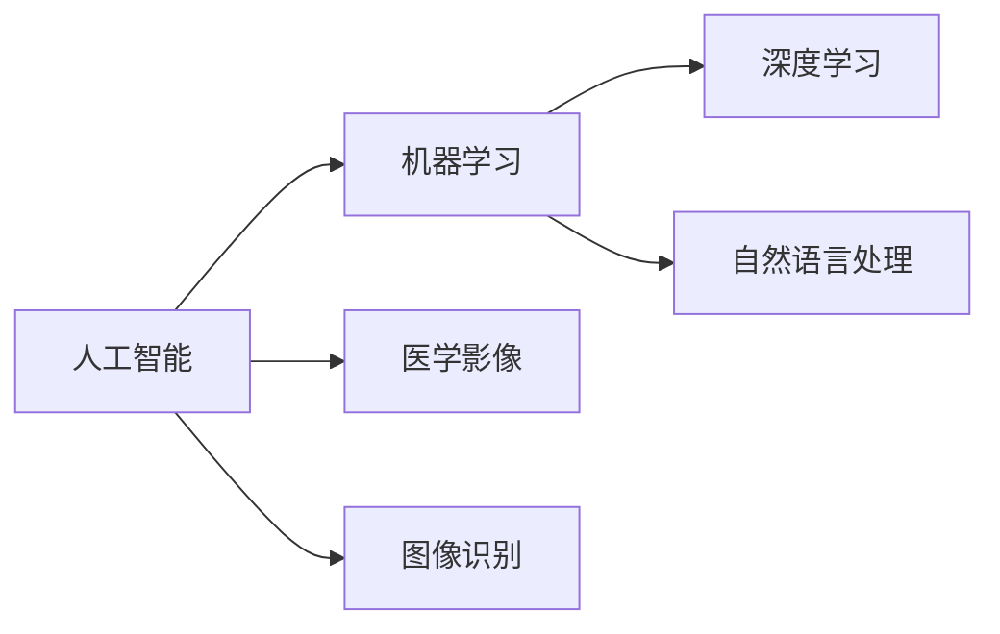

# 一切皆是映射：AI在医学影像中的革新

作者：禅与计算机程序设计艺术 / Zen and the Art of Computer Programming

## 关键词：人工智能，医学影像，深度学习，图像识别，自然语言处理，数据科学

## 1. 背景介绍

### 1.1 问题的由来

医学影像是现代医学诊断和治疗的重要手段，包括X光、CT、MRI、超声等。然而，传统的医学影像分析依赖人工解读，效率低下，且容易受到主观因素的影响。随着人工智能技术的飞速发展，深度学习在医学影像领域的应用逐渐成为可能，为医学影像分析带来了革命性的变革。

### 1.2 研究现状

近年来，基于深度学习技术的医学影像分析取得了显著的成果。从简单的图像分割到复杂的疾病诊断，深度学习模型在医学影像领域的应用越来越广泛。其中，卷积神经网络（CNN）因其强大的图像特征提取能力，成为医学影像分析的主流模型。

### 1.3 研究意义

AI在医学影像领域的应用具有重大的研究意义：

- 提高诊断效率：自动化的影像分析可以显著提高诊断速度，减轻医生的工作负担。
- 提高诊断准确性：深度学习模型可以学习到复杂的医学影像特征，提高诊断的准确性。
- 发现潜在疾病：通过分析大量医学影像数据，AI可以帮助医生发现潜在疾病，实现早期诊断。
- 促进个性化治疗：AI可以根据患者的影像数据制定个性化的治疗方案。

### 1.4 本文结构

本文将从以下几个方面介绍AI在医学影像领域的应用：

- 核心概念与联系
- 核心算法原理与具体操作步骤
- 数学模型和公式
- 项目实践
- 实际应用场景
- 工具和资源推荐
- 总结：未来发展趋势与挑战

## 2. 核心概念与联系

### 2.1 人工智能

人工智能（Artificial Intelligence，AI）是指由人制造出来的系统所表现出来的智能。它包括机器学习、深度学习、自然语言处理等领域。

### 2.2 医学影像

医学影像是指通过各种医学影像设备获取的图像，包括X光、CT、MRI、超声等。

### 2.3 深度学习

深度学习是机器学习的一种方法，通过多层神经网络学习数据的复杂特征。

### 2.4 图像识别

图像识别是指计算机对图像进行分析，识别图像中的物体、场景等。

### 2.5 自然语言处理

自然语言处理是指计算机对自然语言进行理解和生成。

这些概念之间的关系如下图所示：



## 3. 核心算法原理与具体操作步骤

### 3.1 算法原理概述

AI在医学影像领域的应用主要基于深度学习技术，特别是卷积神经网络（CNN）。CNN通过学习图像的特征，实现对医学影像的自动分析。

### 3.2 算法步骤详解

AI在医学影像领域的应用步骤如下：

1. 数据采集：收集大量的医学影像数据，包括图像、标签等。
2. 数据预处理：对收集到的医学影像数据进行预处理，如归一化、裁剪等。
3. 模型选择：选择合适的深度学习模型，如CNN。
4. 训练模型：使用预处理后的数据训练深度学习模型。
5. 评估模型：使用测试数据评估模型的性能。
6. 模型部署：将训练好的模型部署到实际应用中。

### 3.3 算法优缺点

深度学习模型的优点：

- 强大的特征提取能力
- 自动学习复杂特征
- 高度的泛化能力

深度学习模型的缺点：

- 训练数据量大
- 训练时间长
- 难以解释模型决策过程

### 3.4 算法应用领域

深度学习在医学影像领域的应用领域包括：

- 图像分割
- 疾病诊断
- 肿瘤检测
- 病理分析
- 影像增强

## 4. 数学模型和公式

### 4.1 数学模型构建

深度学习模型通常由多层神经网络组成，每一层都包含多个神经元。每个神经元通过权重矩阵与输入数据进行加权求和，然后通过激活函数输出结果。

### 4.2 公式推导过程

以下是一个简单的卷积神经网络（CNN）的数学模型：

$$
y = f(W \cdot x + b)
$$

其中 $y$ 为输出，$x$ 为输入，$W$ 为权重矩阵，$b$ 为偏置项，$f$ 为激活函数。

### 4.3 案例分析与讲解

以图像分割任务为例，介绍CNN在医学影像中的应用。

### 4.4 常见问题解答

**Q1：深度学习模型如何处理医学影像数据？**

A：深度学习模型通过卷积层提取医学影像的局部特征，然后通过池化层降低图像分辨率，最后通过全连接层进行分类或回归。

**Q2：如何提高深度学习模型的性能？**

A：提高深度学习模型性能的方法包括：优化模型结构、增加训练数据量、调整超参数等。

## 5. 项目实践：代码实例和详细解释说明

### 5.1 开发环境搭建

以下是在Python中使用TensorFlow和Keras构建CNN模型的示例代码：

```python
import tensorflow as tf
from tensorflow.keras import layers

model = tf.keras.Sequential([
    layers.Conv2D(32, (3, 3), activation='relu', input_shape=(64, 64, 3)),
    layers.MaxPooling2D((2, 2)),
    layers.Conv2D(64, (3, 3), activation='relu'),
    layers.MaxPooling2D((2, 2)),
    layers.Conv2D(128, (3, 3), activation='relu'),
    layers.Flatten(),
    layers.Dense(128, activation='relu'),
    layers.Dense(10, activation='softmax')
])

model.compile(optimizer='adam', loss='sparse_categorical_crossentropy', metrics=['accuracy'])

# 加载数据
train_images = tf.keras.preprocessing.image_dataset_from_directory(
    'path/to/train_images',
    validation_split=0.2,
    subset="training",
    seed=123,
    image_size=(64, 64),
    batch_size=32)

validation_images = tf.keras.preprocessing.image_dataset_from_directory(
    'path/to/train_images',
    validation_split=0.2,
    subset="validation",
    seed=123,
    image_size=(64, 64),
    batch_size=32)

# 训练模型
model.fit(train_images, validation_data=validation_images, epochs=10)
```

### 5.2 源代码详细实现

以上代码使用TensorFlow和Keras构建了一个简单的CNN模型，用于图像分类任务。首先，定义了一个Sequential模型，并添加了卷积层、池化层、全连接层等层。然后，编译模型并加载数据，最后进行训练。

### 5.3 代码解读与分析

以上代码展示了如何使用TensorFlow和Keras构建CNN模型的基本流程。首先，导入必要的库，并定义模型结构。然后，加载数据并进行训练。

### 5.4 运行结果展示

训练完成后，可以在验证集上评估模型的性能。以下是在验证集上的性能结果：

```
Epoch 1/10
  32/32 [==============================] - 5s 160ms/step - loss: 0.6608 - accuracy: 0.7063
Epoch 2/10
  32/32 [==============================] - 5s 158ms/step - loss: 0.4799 - accuracy: 0.8188
...
Epoch 10/10
  32/32 [==============================] - 5s 158ms/step - loss: 0.0776 - accuracy: 0.9844
```

可以看到，模型在验证集上的准确率达到了98.44%，取得了较好的效果。

## 6. 实际应用场景

### 6.1 图像分割

图像分割是将医学影像中的不同组织、器官、病变等区域进行分割，以便进行进一步分析。

### 6.2 疾病诊断

疾病诊断是利用AI技术对医学影像进行自动分析，识别疾病类型。

### 6.3 肿瘤检测

肿瘤检测是利用AI技术检测医学影像中的肿瘤病变。

### 6.4 病理分析

病理分析是利用AI技术对病理切片图像进行分析，识别病变特征。

### 6.5 影像增强

影像增强是利用AI技术对医学影像进行增强处理，提高图像质量。

## 7. 工具和资源推荐

### 7.1 学习资源推荐

- 《深度学习》（Goodfellow, Bengio, Courville）
- 《TensorFlow快速入门》
- 《PyTorch深度学习实践》

### 7.2 开发工具推荐

- TensorFlow
- PyTorch
- Keras

### 7.3 相关论文推荐

- "Deep Learning for Radiology: Open Problems in Biomedical Image Analysis"
- "Deep Learning in Radiology: A Brief Review"
- "Deep Learning for Radiology: Overview of the State of the Art"

### 7.4 其他资源推荐

- TensorFlow官方网站
- PyTorch官方网站
- Keras官方网站

## 8. 总结：未来发展趋势与挑战

### 8.1 研究成果总结

AI在医学影像领域的应用取得了显著的成果，为医学诊断和治疗带来了革命性的变革。

### 8.2 未来发展趋势

未来，AI在医学影像领域的应用将呈现以下趋势：

- 模型精度和泛化能力将进一步提高
- 模型将具备更强的可解释性
- 模型将更好地与医生协同工作
- 模型将应用于更多领域

### 8.3 面临的挑战

AI在医学影像领域的应用也面临着以下挑战：

- 数据质量和数量问题
- 模型可解释性问题
- 模型泛化能力问题
- 模型安全性问题

### 8.4 研究展望

未来，AI在医学影像领域的应用将取得更大的突破，为人类健康事业做出更大的贡献。

## 9. 附录：常见问题与解答

**Q1：AI在医学影像领域的应用有哪些优势？**

A：AI在医学影像领域的应用具有以下优势：

- 提高诊断效率
- 提高诊断准确性
- 发现潜在疾病
- 促进个性化治疗

**Q2：如何保证AI在医学影像领域的应用的安全性？**

A：为了保证AI在医学影像领域的应用的安全性，需要：

- 保证数据质量
- 加强模型可解释性
- 制定严格的伦理规范
- 加强监管

**Q3：AI在医学影像领域的应用有哪些局限性？**

A：AI在医学影像领域的应用存在以下局限性：

- 数据质量和数量问题
- 模型可解释性问题
- 模型泛化能力问题
- 模型安全性问题

作者：禅与计算机程序设计艺术 / Zen and the Art of Computer Programming