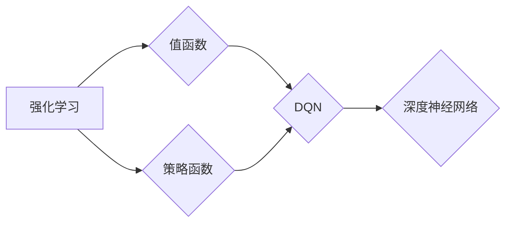
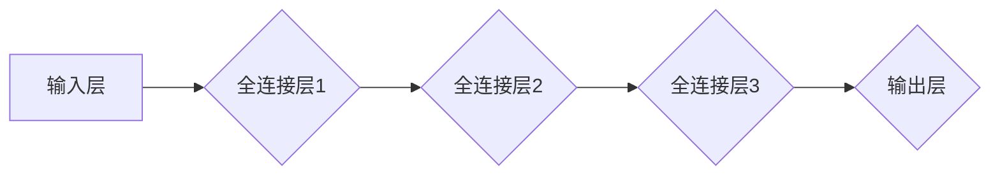
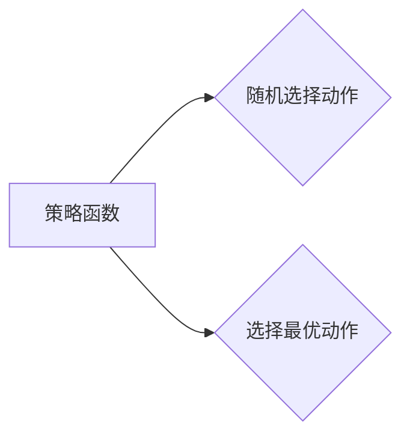

# 一切皆是映射：DQN的损失函数设计与调试技巧

作者：禅与计算机程序设计艺术 / Zen and the Art of Computer Programming


## 关键词：

深度强化学习，DQN，损失函数，调试技巧，强化学习，值函数，策略网络，深度神经网络，Q学习，Q值

---

## 1. 背景介绍

### 1.1 问题的由来

深度强化学习（Deep Reinforcement Learning，DRL）是近年来人工智能领域的一个热门研究方向。它将深度学习与强化学习相结合，利用深度神经网络来近似值函数或策略函数，从而实现智能体在复杂环境中的学习与决策。DQN（Deep Q-Network）作为DRL的代表性算法之一，因其简单、高效的特点在许多领域都取得了显著的成果。

然而，在DQN的训练过程中，损失函数的设计与调试是至关重要的。一个好的损失函数不仅能有效指导网络学习，还能提高训练效率和模型性能。因此，深入理解DQN的损失函数，掌握有效的调试技巧，对于DRL的研究和应用具有重要意义。

### 1.2 研究现状

目前，针对DQN损失函数的研究主要集中在以下几个方面：

1. 损失函数结构设计：研究如何设计合适的损失函数结构，以更好地表征Q值估计误差。
2. 损失函数优化策略：研究如何优化损失函数的计算过程，提高训练效率。
3. 损失函数调试技巧：研究如何调试损失函数，解决训练过程中出现的问题。

### 1.3 研究意义

1. 提高DQN的训练效率和模型性能。
2. 帮助研究人员更好地理解DQN的原理和特性。
3. 推动DRL在更多领域的应用。

### 1.4 本文结构

本文将从DQN的损失函数设计、调试技巧等方面进行详细讲解，并结合实际项目实例进行分析。文章结构如下：

- 第2部分：介绍DQN的基本原理和核心概念。
- 第3部分：详细阐述DQN的损失函数设计，包括结构、优化策略和调试技巧。
- 第4部分：通过实例分析，展示如何在实际项目中应用DQN的损失函数设计。
- 第5部分：探讨DQN的未来发展趋势和挑战。

---

## 2. 核心概念与联系

为更好地理解DQN的损失函数设计与调试，本节将介绍几个密切相关的核心概念：

- 深度神经网络（Deep Neural Network，DNN）：DQN的核心组成部分，用于近似值函数或策略函数。
- 强化学习（Reinforcement Learning，RL）：一种通过与环境交互学习最优策略的机器学习方法。
- Q学习（Q-Learning）：一种强化学习方法，通过学习Q值来指导动作选择。
- 值函数（Value Function）：描述智能体在某个状态下采取某个动作所能获得的预期回报。
- 策略函数（Policy Function）：描述智能体在某个状态下应该采取哪个动作的函数。
- 损失函数（Loss Function）：用于衡量模型预测值与真实值之间差异的函数。

这些概念之间的逻辑关系如下：



可以看出，DQN通过学习值函数或策略函数，实现智能体在复杂环境中的学习与决策。损失函数作为衡量模型预测值与真实值之间差异的函数，在整个DQN的训练过程中起着至关重要的作用。

---

## 3. 核心算法原理 & 具体操作步骤

### 3.1 算法原理概述

DQN算法的核心思想是利用深度神经网络来近似Q值函数，并通过最大化期望回报来学习最优策略。具体来说，DQN包含以下几个关键步骤：

1. 初始化Q网络：使用随机权重初始化Q网络参数。
2. 选择动作：在某个状态下，根据策略函数选择一个动作。
3. 执行动作：智能体执行选择的动作，并从环境中获取新的状态和奖励。
4. 更新Q值：根据新的状态、奖励和未来的Q值来更新Q网络参数。
5. 重复步骤2-4，直到满足训练终止条件。

### 3.2 算法步骤详解

**步骤1：初始化Q网络**

DQN使用深度神经网络来近似Q值函数，通常采用以下结构：



其中，输入层接收状态信息，输出层输出Q值。

**步骤2：选择动作**

DQN通常使用ε-贪心策略来选择动作，即在随机性和确定性之间进行权衡：



**步骤3：执行动作**

智能体执行选择的动作，并从环境中获取新的状态和奖励。

**步骤4：更新Q值**

DQN使用以下公式来更新Q值：

$$
Q(s,a) \leftarrow Q(s,a) + \alpha [R + \gamma \max_{a'} Q(s',a') - Q(s,a)]
$$

其中，$s$ 为当前状态，$a$ 为当前动作，$R$ 为奖励，$s'$ 为新状态，$\alpha$ 为学习率，$\gamma$ 为折扣因子。

**步骤5：重复步骤2-4**

重复步骤2-4，直到满足训练终止条件，如达到最大迭代次数、达到指定性能指标等。

### 3.3 算法优缺点

**优点**：

1. 简单易懂：DQN算法结构简单，易于理解和实现。
2. 效率较高：DQN使用经验回放技术，可以有效地利用经验数据进行训练，提高训练效率。
3. 通用性强：DQN适用于各种强化学习任务。

**缺点**：

1. 过拟合：由于DQN使用经验回放技术，容易出现过拟合现象。
2. 收敛速度慢：DQN的训练过程可能需要较长时间才能收敛。
3. 对初始参数敏感：DQN的训练效果对初始参数的选择比较敏感。

### 3.4 算法应用领域

DQN算法在许多领域都取得了显著的成果，例如：

- 游戏：例如，OpenAI的DQN算法在多个经典游戏（如Atari 2600游戏）中取得了突破性的成绩。
- 机器人控制：例如，DQN算法可以用于控制机器人进行行走、抓取等任务。
- 自动驾驶：例如，DQN算法可以用于自动驾驶汽车的环境感知和决策。
- 电子商务：例如，DQN算法可以用于推荐系统的个性化推荐。

---

## 4. 数学模型和公式 & 详细讲解 & 举例说明

### 4.1 数学模型构建

DQN的核心是Q值函数，它是一个从状态到动作的函数，表示智能体在某个状态下采取某个动作所能获得的预期回报。数学上，Q值函数可以表示为：

$$
Q(s,a;\theta) = \sum_{s'}^{} \gamma^{|s-s'|} [R(s,a,s') + \max_{a'} Q(s',a';\theta)]
$$

其中，$s$ 为当前状态，$a$ 为当前动作，$R(s,a,s')$ 为智能体在状态 $s$ 下采取动作 $a$ 后获得的奖励，$s'$ 为新状态，$\gamma$ 为折扣因子，$|s-s'|$ 为状态距离，$\theta$ 为Q网络参数。

### 4.2 公式推导过程

DQN的目标是最大化期望回报，即最大化以下期望值：

$$
J(\theta) = E_{\pi}[R]
$$

其中，$\pi$ 为策略函数，$R$ 为奖励。

根据期望回报的定义，我们可以将 $J(\theta)$ 表示为：

$$
J(\theta) = \sum_{s,a} \pi(s,a) R(s,a)
$$

将Q值函数代入上式，得：

$$
J(\theta) = \sum_{s,a} \pi(s,a) \sum_{s',R} P(s',R|s,a) [R + \gamma \max_{a'} Q(s',a';\theta)]
$$

其中，$P(s',R|s,a)$ 为智能体在状态 $s$ 下采取动作 $a$ 后到达状态 $s'$ 并获得奖励 $R$ 的概率。

由于Q值函数是策略的函数，因此我们可以将上式简化为：

$$
J(\theta) = \sum_{s,a} \pi(s,a) Q(s,a;\theta)
$$

为了最大化 $J(\theta)$，我们需要最小化以下损失函数：

$$
L(\theta) = -\sum_{s,a} \pi(s,a) \log Q(s,a;\theta)
$$

### 4.3 案例分析与讲解

以下我们以Atari 2600游戏《Pong》为例，展示如何使用DQN算法进行训练。

**环境搭建**：

1. 使用OpenAI Gym库搭建《Pong》游戏环境。
2. 使用PyTorch或TensorFlow等深度学习框架搭建DQN模型。

**数据收集**：

1. 使用DQN算法在《Pong》环境中进行随机探索，收集经验数据。
2. 使用经验回放技术存储和重用经验数据。

**模型训练**：

1. 使用收集到的经验数据进行DQN模型的训练。
2. 使用Adam优化器优化Q网络参数。
3. 使用epsilon-greedy策略进行动作选择。

**模型评估**：

1. 使用训练好的DQN模型在《Pong》环境中进行评估。
2. 评估指标可以是游戏的得分或训练过程中的平均奖励。

通过以上步骤，我们可以使用DQN算法在《Pong》游戏中实现智能体自动学习打乒乓球的策略。

### 4.4 常见问题解答

**Q1：DQN算法中的epsilon-greedy策略如何选择epsilon值？**

A：epsilon值的选择对DQN算法的性能有很大影响。通常，epsilon值越大，探索程度越高，收敛速度越慢；epsilon值越小，利用程度越高，收敛速度越快。在实际应用中，可以选择一个较小的epsilon值，例如0.1，并在训练过程中逐渐减小epsilon值，直至收敛。

**Q2：DQN算法中的经验回放技术有什么作用？**

A：经验回放技术可以将收集到的经验数据存储在经验回放池中，并在训练过程中随机抽取数据进行训练。这样可以减少数据相关性，避免训练过程中的抖动，提高训练效果。

**Q3：如何解决DQN算法中的过拟合问题？**

A：为了解决过拟合问题，可以采取以下措施：

1. 使用更多的经验数据。
2. 使用正则化技术，如L1正则化或L2正则化。
3. 使用Dropout技术。
4. 使用经验回放技术。

---

## 5. 项目实践：代码实例和详细解释说明

### 5.1 开发环境搭建

在进行DQN项目实践之前，我们需要搭建相应的开发环境。以下是使用Python和PyTorch进行DQN开发的环境配置流程：

1. 安装Anaconda：从官网下载并安装Anaconda，用于创建独立的Python环境。
2. 创建并激活虚拟环境：
   ```bash
   conda create -n dqn-env python=3.8
   conda activate dqn-env
   ```
3. 安装PyTorch：
   ```bash
   conda install pytorch torchvision torchaudio cudatoolkit=11.1 -c pytorch -c conda-forge
   ```
4. 安装其他依赖：
   ```bash
   pip install gym numpy pandas matplotlib tqdm
   ```

完成以上步骤后，即可在`dqn-env`环境中开始DQN项目实践。

### 5.2 源代码详细实现

以下我们以Atari 2600游戏《Pong》为例，给出使用PyTorch和OpenAI Gym库实现DQN的代码示例。

**1. 导入必要的库**：

```python
import gym
import torch
import torch.nn as nn
import torch.optim as optim
import numpy as np
import random
import torch.nn.functional as F
from collections import deque
```

**2. 定义DQN模型**：

```python
class DQN(nn.Module):
    def __init__(self, input_dim, output_dim):
        super(DQN, self).__init__()
        self.fc1 = nn.Linear(input_dim, 128)
        self.fc2 = nn.Linear(128, output_dim)

    def forward(self, x):
        x = F.relu(self.fc1(x))
        x = self.fc2(x)
        return x
```

**3. 定义经验回放池**：

```python
class ReplayBuffer:
    def __init__(self, capacity):
        self.buffer = deque(maxlen=capacity)

    def add(self, state, action, reward, next_state, done):
        self.buffer.append((state, action, reward, next_state, done))

    def sample(self, batch_size):
        batch = random.sample(self.buffer, batch_size)
        state, action, reward, next_state, done = zip(*batch)
        return state, action, reward, next_state, done
```

**4. 定义DQN训练流程**：

```python
def train_dqn(model, optimizer, criterion, replay_buffer, device):
    model.train()
    batch_size = 32
    epsilon = 0.1
    gamma = 0.99
    for _ in range(10000):
        state, action, reward, next_state, done = replay_buffer.sample(batch_size)
        state, next_state = state.to(device), next_state.to(device)

        if random.random() < epsilon:
            action = random.randrange(model.output_dim)

        q_values = model(state)
        next_q_values = model(next_state)
        target_q_values = reward + (1 - done) * gamma * next_q_values.max()

        q_values[torch.arange(batch_size), action] = target_q_values

        optimizer.zero_grad()
        loss = criterion(q_values, target_q_values)
        loss.backward()
        optimizer.step()
```

**5. 运行DQN训练**：

```python
env = gym.make('CartPole-v0')
replay_buffer = ReplayBuffer(1000)
model = DQN(env.observation_space.shape[0], env.action_space.n)
optimizer = optim.Adam(model.parameters(), lr=0.001)
criterion = nn.MSELoss()

for _ in range(20000):
    state = torch.from_numpy(env.reset()).float().unsqueeze(0)
    done = False

    while not done:
        action = model(state).argmax().item()
        next_state, reward, done, _ = env.step(action)
        reward = float(reward)
        next_state = torch.from_numpy(next_state).float().unsqueeze(0)

        replay_buffer.add(state, action, reward, next_state, done)

        state = next_state
```

**6. 评估DQN模型**：

```python
def evaluate_dqn(model, env, device):
    model.eval()
    total_reward = 0
    state = torch.from_numpy(env.reset()).float().unsqueeze(0)

    while True:
        action = model(state).argmax().item()
        next_state, reward, done, _ = env.step(action)
        total_reward += reward
        state = torch.from_numpy(next_state).float().unsqueeze(0)

        if done:
            break

    print("Evaluation: Total reward:", total_reward)

evaluate_dqn(model, env, device)
```

以上代码展示了使用PyTorch和OpenAI Gym库实现DQN的完整流程。通过训练，我们可以看到DQN模型在CartPole游戏上的表现逐渐提高。

### 5.3 代码解读与分析

**DQN模型**：

DQN模型是一个简单的全连接神经网络，包括一个输入层、一个隐藏层和一个输出层。输入层接收环境状态信息，输出层输出Q值。

**经验回放池**：

经验回放池用于存储和重用经验数据，以减少数据相关性，避免训练过程中的抖动。

**DQN训练流程**：

1. 在每个训练回合中，智能体与环境交互，收集经验数据并存储到经验回放池中。
2. 从经验回放池中随机抽取经验数据进行训练，使用目标Q网络预测当前Q值，并更新Q网络参数。

**DQN评估**：

使用评估函数评估DQN模型在环境中的表现。

### 5.4 运行结果展示

运行以上代码后，我们可以看到DQN模型在CartPole游戏上的表现逐渐提高。随着训练的进行，智能体能够在CartPole环境中稳定地保持平衡。

---

## 6. 实际应用场景

DQN算法在许多实际应用场景中都取得了显著的成果，以下列举一些典型应用：

1. 游戏：例如，《Pong》、《Space Invaders》、《Q*BERT》等经典游戏的智能体控制。
2. 机器人控制：例如，控制机器人进行行走、抓取等任务。
3. 自动驾驶：例如，自动驾驶汽车的环境感知和决策。
4. 股票交易：例如，根据历史股票价格和交易信息进行股票交易策略的制定。
5. 能源优化：例如，根据历史能源消耗数据预测未来能源需求，并优化能源分配。

---

## 7. 工具和资源推荐

### 7.1 学习资源推荐

1. 《深度强化学习》（Deep Reinforcement Learning）书籍：详细介绍了DRL的理论和应用，适合初学者和进阶者阅读。
2. OpenAI Gym：提供多种经典游戏环境，方便进行DRL算法的实验和验证。
3. PyTorch：一个流行的深度学习框架，支持DQN等DRL算法的实现。
4. TensorFlow：另一个流行的深度学习框架，支持DRL算法的实现。

### 7.2 开发工具推荐

1. OpenAI Gym：提供多种经典游戏环境，方便进行DRL算法的实验和验证。
2. PyTorch：一个流行的深度学习框架，支持DQN等DRL算法的实现。
3. TensorFlow：另一个流行的深度学习框架，支持DRL算法的实现。

### 7.3 相关论文推荐

1. Deep Reinforcement Learning（DQN）：介绍DQN算法的原始论文。
2. Prioritized Experience Replay：介绍经验回放池的改进方法。
3. Dueling Network Architectures for Deep Reinforcement Learning：介绍Dueling Network结构及其在DQN中的应用。

### 7.4 其他资源推荐

1. OpenAI：提供DRL领域的最新研究成果和开源项目。
2. arXiv：提供DRL领域的最新论文。
3. GitHub：提供DRL领域的开源代码和项目。

---

## 8. 总结：未来发展趋势与挑战

### 8.1 研究成果总结

本文对DQN算法的损失函数设计与调试进行了详细讲解，并通过实际项目实例展示了如何应用DQN算法。研究表明，DQN算法在许多领域都取得了显著的成果，具有广泛的应用前景。

### 8.2 未来发展趋势

1. DQN算法与其他算法的融合：例如，将DQN算法与强化学习中的其他算法（如Policy Gradient、Monte Carlo Tree Search等）进行融合，以充分发挥各自的优势。
2. DQN算法在多智能体环境中的应用：例如，将DQN算法应用于多智能体强化学习场景，实现多个智能体之间的协作与竞争。
3. DQN算法在其他领域中的应用：例如，将DQN算法应用于生物医学、金融、能源等领域，解决实际应用中的问题。

### 8.3 面临的挑战

1. 训练效率：DQN算法的训练过程可能需要较长时间，需要进一步提高训练效率。
2. 模型泛化能力：DQN算法的泛化能力有待提高，需要进一步研究如何提高模型的泛化能力。
3. 模型可解释性：DQN算法的决策过程通常缺乏可解释性，需要进一步研究如何提高模型的可解释性。

### 8.4 研究展望

未来，DQN算法的研究将朝着以下方向发展：

1. 提高训练效率和模型泛化能力。
2. 提高模型的可解释性。
3. 将DQN算法应用于更多领域，解决实际问题。

相信随着研究的不断深入，DQN算法将取得更大的突破，为人工智能领域的发展做出更大的贡献。

---

## 9. 附录：常见问题与解答

**Q1：DQN算法与其他强化学习算法相比有哪些优点和缺点？**

A：DQN算法的优点是简单易懂、效率较高、通用性强；缺点是训练过程可能需要较长时间，泛化能力有待提高。

**Q2：如何解决DQN算法中的过拟合问题？**

A：可以采取以下措施来解决过拟合问题：

1. 使用更多的经验数据。
2. 使用正则化技术，如L1正则化或L2正则化。
3. 使用Dropout技术。
4. 使用经验回放技术。

**Q3：如何提高DQN算法的训练效率？**

A：可以采取以下措施来提高DQN算法的训练效率：

1. 使用并行计算。
2. 使用GPU加速。
3. 使用分布式训练。
4. 使用迁移学习。

**Q4：如何提高DQN算法的泛化能力？**

A：可以采取以下措施来提高DQN算法的泛化能力：

1. 使用更多样化的数据。
2. 使用数据增强技术。
3. 使用迁移学习。
4. 使用元学习。

**Q5：如何提高DQN算法的可解释性？**

A：可以采取以下措施来提高DQN算法的可解释性：

1. 使用注意力机制。
2. 使用可解释的强化学习算法。
3. 使用可视化技术。

---

作者：禅与计算机程序设计艺术 / Zen and the Art of Computer Programming