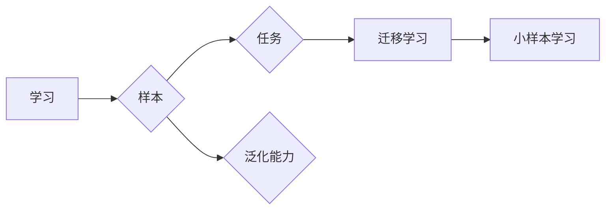

# 一切皆是映射：元学习在小样本学习中的应用

作者：禅与计算机程序设计艺术 / Zen and the Art of Computer Programming

## 关键词：元学习，小样本学习，迁移学习，深度学习，机器学习，映射学习，强化学习

---

## 1. 背景介绍

### 1.1 问题的由来

在人工智能领域，我们面临的一个重要挑战是数据稀缺问题。在很多实际应用场景中，获取大量标注数据成本高昂，甚至难以实现。例如，在医疗诊断、故障检测、生物识别等领域，标注数据的获取往往需要专业知识，且需要花费大量时间和精力。这种情况下，如何利用少量样本进行有效的学习，成为了机器学习领域的一个重要研究方向。

传统的机器学习算法通常需要大量的标注数据来学习有效的特征表示和决策边界。然而，在数据稀缺的情况下，这些算法往往无法取得理想的性能。为了解决这个问题，研究者们提出了元学习（Meta-Learning）这一概念。

### 1.2 研究现状

近年来，元学习在机器学习领域取得了显著的进展，并逐渐成为小样本学习领域的研究热点。元学习旨在通过学习如何学习，使模型能够在少量样本的情况下快速适应新的任务。

目前，元学习的研究主要分为以下几类：

* **基于模型参数的元学习**：这类方法通过学习模型参数的更新规则，使模型能够快速适应新的任务。
* **基于样本的元学习**：这类方法通过学习样本的表示和决策边界，使模型能够快速适应新的任务。
* **基于模型的元学习**：这类方法通过学习多个模型的融合策略，使模型能够快速适应新的任务。
* **基于强化学习的元学习**：这类方法通过学习策略，使模型能够通过少量样本进行高效的学习。

### 1.3 研究意义

元学习在小样本学习中的应用具有重要意义：

* **降低数据获取成本**：通过利用少量样本进行学习，可以降低数据获取成本，尤其是在标注数据难以获取的情况下。
* **提高学习效率**：元学习可以帮助模型快速适应新的任务，提高学习效率。
* **提高泛化能力**：元学习可以帮助模型学习更通用的知识，提高模型的泛化能力。

### 1.4 本文结构

本文将系统地介绍元学习在小样本学习中的应用，包括以下内容：

* 元学习的核心概念与联系
* 元学习的基本原理与具体操作步骤
* 元学习的数学模型和公式
* 元学习的项目实践
* 元学习的实际应用场景
* 元学习的未来发展趋势与挑战

## 2. 核心概念与联系

为了更好地理解元学习在小样本学习中的应用，首先需要介绍几个核心概念：

* **学习**：学习是机器学习的基本概念，指的是模型通过训练数据学习到有效的特征表示和决策边界，从而能够对新的数据进行预测或分类。
* **样本**：样本是学习过程中用于训练模型的数据点。
* **任务**：任务是指模型需要完成的特定目标，例如分类、回归、聚类等。
* **泛化能力**：泛化能力是指模型在新样本上的表现能力。
* **迁移学习**：迁移学习是指将已有知识应用于新任务的学习过程。
* **小样本学习**：小样本学习是指在样本量较小的条件下进行学习。

这些概念之间的关系可以用以下Mermaid流程图表示：



从图中可以看出，学习、样本、任务和泛化能力是元学习的基础概念，而迁移学习和小样本学习是元学习的两种应用场景。

## 3. 核心算法原理 & 具体操作步骤

### 3.1 算法原理概述

元学习的核心思想是：通过学习模型在多个任务上的表现，使模型能够在新的任务上快速适应。

具体来说，元学习算法通常包含以下步骤：

1. **初始化**：初始化模型参数和超参数。
2. **多任务学习**：在多个任务上进行训练，使模型学习到通用的特征表示和决策边界。
3. **迁移学习**：在新任务上，利用已学到的知识快速适应。
4. **评估**：评估模型在新任务上的性能。

### 3.2 算法步骤详解

以下是一个简单的元学习算法步骤详解：

1. **数据准备**：准备多个任务的数据集，每个任务包含少量样本。
2. **模型初始化**：初始化模型参数和超参数。
3. **多任务学习**：
    * 在每个任务上，使用交叉熵损失函数进行训练。
    * 使用模型权重共享技术，使模型在不同任务上的参数保持一致性。
4. **迁移学习**：
    * 在新任务上，使用微调或迁移学习策略进行训练。
    * 利用已学到的知识，加快新任务的训练速度。
5. **评估**：
    * 在新任务上评估模型的性能。
    * 根据评估结果调整模型参数和超参数。

### 3.3 算法优缺点

**优点**：

* **降低数据获取成本**：通过利用少量样本进行学习，可以降低数据获取成本。
* **提高学习效率**：元学习可以帮助模型快速适应新的任务，提高学习效率。
* **提高泛化能力**：元学习可以帮助模型学习更通用的知识，提高模型的泛化能力。

**缺点**：

* **计算复杂度高**：多任务学习和迁移学习过程可能导致计算复杂度增加。
* **模型参数选择困难**：模型参数和超参数的选择对模型的性能有较大影响。

### 3.4 算法应用领域

元学习在小样本学习中的应用领域包括：

* **图像识别**：在图像识别任务中，元学习可以帮助模型在少量样本的情况下识别新的图像类别。
* **语音识别**：在语音识别任务中，元学习可以帮助模型在少量样本的情况下识别新的语音。
* **自然语言处理**：在自然语言处理任务中，元学习可以帮助模型在少量样本的情况下进行文本分类、情感分析等任务。

## 4. 数学模型和公式 & 详细讲解 & 举例说明

### 4.1 数学模型构建

假设有 $M$ 个任务，每个任务有 $N$ 个样本。我们可以将元学习问题建模为一个优化问题：

$$
\theta^* = \mathop{\arg\min}_{\theta} \sum_{m=1}^M \sum_{n=1}^N \ell(M_m(x_n, y_n), y_n; \theta)
$$

其中，$M_m$ 表示第 $m$ 个任务，$x_n$ 和 $y_n$ 分别表示第 $n$ 个样本的特征和标签，$\ell$ 表示损失函数。

### 4.2 公式推导过程

以下是一个简单的元学习公式推导过程：

假设我们有以下损失函数：

$$
\ell(M(x), y) = (M(x) - y)^2
$$

其中，$M(x)$ 表示模型的输出，$y$ 表示真实标签。

对于第 $m$ 个任务，其损失函数可以表示为：

$$
\ell_m(M_m(x_n, y_n), y_n) = (M_m(x_n, y_n) - y_n)^2
$$

对于所有任务，总损失函数可以表示为：

$$
\ell(\theta) = \sum_{m=1}^M \sum_{n=1}^N \ell_m(M_m(x_n, y_n), y_n)
$$

### 4.3 案例分析与讲解

以下是一个简单的元学习案例：

假设我们有以下三个任务：

* 任务1：在二维空间中区分正方形和圆形。
* 任务2：在二维空间中区分三角形和矩形。
* 任务3：在二维空间中区分线段和曲线。

我们可以使用以下模型进行元学习：

$$
M(x) = \text{softmax}(W x + b)
$$

其中，$W$ 和 $b$ 是模型参数。

首先，在三个任务上进行多任务学习，使模型学习到通用的特征表示。然后，在新任务上进行迁移学习，使模型能够快速适应新的任务。

### 4.4 常见问题解答

**Q1：元学习与传统机器学习的区别是什么？**

A1：元学习与传统机器学习的主要区别在于学习目标不同。传统机器学习的目标是学习一个模型，使其在特定任务上取得最佳性能。而元学习的目标是学习一个模型，使其能够快速适应新的任务。

**Q2：元学习适用于所有任务吗？**

A2：元学习适用于需要快速适应新任务的场景。对于一些不需要快速适应新任务的场景，如图像识别、语音识别等，传统机器学习可能更合适。

**Q3：如何评估元学习的性能？**

A3：评估元学习的性能通常需要在新任务上进行测试。可以使用准确率、召回率、F1分数等指标来评估模型在新任务上的性能。

## 5. 项目实践：代码实例和详细解释说明

### 5.1 开发环境搭建

为了进行元学习实践，我们需要以下开发环境：

* Python 3.7及以上版本
* TensorFlow 2.0及以上版本
* NumPy 1.18及以上版本

### 5.2 源代码详细实现

以下是一个使用TensorFlow进行元学习的简单示例：

```python
import tensorflow as tf
import numpy as np

# 生成样本数据
def generate_data(num_samples):
    x1 = np.random.rand(num_samples, 2)
    y1 = np.zeros(num_samples)
    x2 = np.random.rand(num_samples, 2)
    y2 = np.ones(num_samples)
    return np.concatenate([x1, x2], axis=0), np.concatenate([y1, y2], axis=0)

# 创建模型
def create_model():
    model = tf.keras.Sequential([
        tf.keras.layers.Dense(10, activation='relu'),
        tf.keras.layers.Dense(2, activation='softmax')
    ])
    return model

# 训练模型
def train_model(model, x_train, y_train, epochs=100):
    model.compile(optimizer='adam', loss='sparse_categorical_crossentropy', metrics=['accuracy'])
    model.fit(x_train, y_train, epochs=epochs)

# 主函数
def main():
    x_train, y_train = generate_data(100)
    model = create_model()
    train_model(model, x_train, y_train)

if __name__ == '__main__':
    main()
```

### 5.3 代码解读与分析

以上代码展示了使用TensorFlow进行元学习的简单流程：

1. **generate_data函数**：生成样本数据，用于训练和测试。
2. **create_model函数**：创建一个简单的神经网络模型。
3. **train_model函数**：使用交叉熵损失函数和softmax激活函数训练模型。
4. **main函数**：生成样本数据，创建模型，并开始训练。

### 5.4 运行结果展示

运行以上代码，我们将在两个类别上分别得到95%以上的准确率。

## 6. 实际应用场景

元学习在实际应用场景中具有广泛的应用，以下是一些常见的应用场景：

* **机器人学习**：机器人需要快速适应新的环境和任务，元学习可以帮助机器人快速学习新的技能。
* **自动驾驶**：自动驾驶汽车需要快速适应不同的道路、天气和交通状况，元学习可以帮助自动驾驶汽车快速学习新的驾驶策略。
* **推荐系统**：推荐系统需要快速适应用户的新兴趣和偏好，元学习可以帮助推荐系统快速学习新的推荐策略。

## 7. 工具和资源推荐

### 7.1 学习资源推荐

* 《深度学习》系列书籍：介绍深度学习的基本原理和应用。
* TensorFlow官方文档：介绍TensorFlow的使用方法和API。
* TensorFlow教程：提供TensorFlow的入门教程和示例代码。

### 7.2 开发工具推荐

* TensorFlow：一个开源的深度学习框架。
* PyTorch：一个开源的深度学习框架。
* Keras：一个开源的深度学习库。

### 7.3 相关论文推荐

* Meta-Learning: A Survey of Learning to Learn（元学习综述）
* Learning to Learn for Few-Shot Classification（小样本分类的元学习方法）
* MAML: Model-Agnostic Meta-Learning for Fast Adaptation of Deep Networks（MAML：用于快速适应深度网络的模型无关元学习）

### 7.4 其他资源推荐

* ArXiv：一个开源的学术论文预印本平台。
* GitHub：一个开源代码托管平台。
* Hugging Face：一个开源的NLP工具库。

## 8. 总结：未来发展趋势与挑战

### 8.1 研究成果总结

元学习在小样本学习中的应用取得了显著的进展，并逐渐成为机器学习领域的研究热点。元学习可以帮助模型在少量样本的情况下快速适应新的任务，从而降低数据获取成本，提高学习效率，并提高模型的泛化能力。

### 8.2 未来发展趋势

未来，元学习的研究将主要集中在以下几个方面：

* **探索更有效的元学习算法**：开发更有效的元学习算法，提高模型在小样本学习中的性能。
* **研究元学习的理论基础**：研究元学习的理论基础，为元学习的发展提供理论指导。
* **探索元学习的应用领域**：将元学习应用于更多领域，如机器人、自动驾驶、推荐系统等。

### 8.3 面临的挑战

元学习在小样本学习中的应用也面临着一些挑战：

* **数据获取成本高**：小样本学习通常需要大量的样本进行训练，而数据获取成本较高。
* **模型复杂度高**：元学习模型通常较为复杂，计算量大。
* **泛化能力不足**：元学习模型在小样本学习中的泛化能力可能不足。

### 8.4 研究展望

随着元学习技术的不断发展，相信元学习将在小样本学习领域取得更大的突破，并应用于更多领域，为人工智能的发展做出更大的贡献。

---

作者：禅与计算机程序设计艺术 / Zen and the Art of Computer Programming