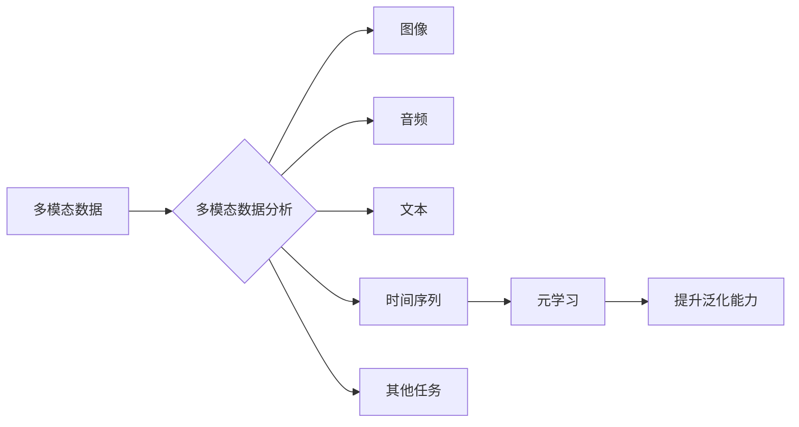

# 一切皆是映射：解码多模态数据：元学习的视角

## 1. 背景介绍
### 1.1 问题的由来

在当今这个信息爆炸的时代，数据呈现出多模态化的趋势，即同一场景或事件可以通过不同模态的数据进行记录和表达。例如，同一部电影可以以图像、音频、文本等多种形式呈现；同一新闻事件可以包含文字报道、音频播客、视频片段等多模态信息。如何有效地整合和利用这些多模态数据，已经成为人工智能领域的一个重要研究方向。

### 1.2 研究现状

近年来，随着深度学习技术的快速发展，多模态数据分析和处理技术取得了显著进展。目前，多模态数据分析和处理方法主要分为以下几类：

1. **早期融合**：在特征级别对多模态数据进行融合，如特征拼接、加权平均等。
2. **后期融合**：在决策级别对多模态数据进行融合，如投票、集成学习等。
3. **联合建模**：使用统一的模型同时处理多模态数据，如多模态生成对抗网络（MMGAN）等。
4. **多模态学习**：学习多模态数据之间的映射关系，如多模态对比学习、多模态嵌入等。

其中，元学习作为机器学习领域的一个重要分支，为多模态数据的分析和处理提供了新的思路。元学习通过学习如何学习，使得模型能够快速适应新任务，从而在多模态数据分析和处理领域展现出巨大的潜力。

### 1.3 研究意义

研究多模态数据分析和处理技术，对于以下方面具有重要意义：

1. **推动人工智能技术发展**：多模态数据分析和处理技术是人工智能领域的一个重要分支，其发展将推动人工智能技术的整体进步。
2. **拓展应用场景**：多模态数据分析和处理技术可以应用于各种场景，如智能问答、图像识别、语音识别、视频分析等，具有广泛的应用价值。
3. **提升用户体验**：通过多模态数据分析和处理技术，可以提供更加丰富、个性化的用户体验。

### 1.4 本文结构

本文将围绕“一切皆是映射：解码多模态数据：元学习的视角”这一主题，系统地介绍多模态数据分析和处理技术，主要包括以下内容：

1. 核心概念与联系
2. 核心算法原理与具体操作步骤
3. 数学模型和公式与详细讲解
4. 项目实践：代码实例和详细解释说明
5. 实际应用场景
6. 工具和资源推荐
7. 总结：未来发展趋势与挑战
8. 附录：常见问题与解答

## 2. 核心概念与联系

### 2.1 多模态数据

多模态数据是指包含两种或两种以上模态的数据。常见的模态包括：

1. **图像**：如照片、视频等。
2. **音频**：如语音、音乐等。
3. **文本**：如文章、评论等。
4. **时间序列**：如股票价格、传感器数据等。

### 2.2 多模态数据分析

多模态数据分析是指对多模态数据进行融合、处理和分析，以提取有价值的信息和知识。

### 2.3 元学习

元学习（Meta-Learning）是一种通过学习如何学习的方法。在多模态数据分析和处理领域，元学习可以帮助模型快速适应新任务，提高模型泛化能力。

### 2.4 关系图

以下是多模态数据分析和处理的相关概念关系图：



## 3. 核心算法原理与具体操作步骤

### 3.1 算法原理概述

多模态数据分析和处理的核心算法原理是将不同模态的数据进行融合，并使用深度学习模型进行特征提取和分类。常见的算法包括：

1. **早期融合**：将不同模态的数据在特征级别进行融合，如特征拼接、加权平均等。
2. **后期融合**：将不同模态的数据在决策级别进行融合，如投票、集成学习等。
3. **联合建模**：使用统一的模型同时处理多模态数据，如多模态生成对抗网络（MMGAN）等。
4. **多模态学习**：学习多模态数据之间的映射关系，如多模态对比学习、多模态嵌入等。

### 3.2 算法步骤详解

以下以多模态对比学习为例，介绍多模态数据分析和处理的具体操作步骤：

1. **数据收集**：收集不同模态的数据，并进行预处理，如图像裁剪、音频降噪、文本分词等。
2. **特征提取**：使用深度学习模型分别提取不同模态数据的特征。
3. **特征融合**：将不同模态的特征进行融合，如特征拼接、加权平均等。
4. **对比学习**：学习多模态数据之间的相似性和差异性，如三元组损失、多标签分类等。
5. **分类或回归**：在融合后的特征上进行分类或回归，得到最终结果。

### 3.3 算法优缺点

以下列举了多模态数据分析和处理算法的优缺点：

| 算法类型 | 优点 | 缺点 |
| :------ | :--- | :--- |
| 早期融合 | 简单易实现 | 特征表达能力有限 |
| 后期融合 | 泛化能力强 | 计算复杂度高 |
| 联合建模 | 灵活高效 | 模型复杂度高 |
| 多模态学习 | 能够学习模态之间的映射关系 | 需要大量标注数据 |

### 3.4 算法应用领域

多模态数据分析和处理算法在以下领域有广泛的应用：

1. **图像识别**：如人脸识别、物体识别等。
2. **语音识别**：如语音翻译、语音合成等。
3. **视频分析**：如动作识别、事件检测等。
4. **多模态问答**：如多模态信息检索、多模态问答系统等。

## 4. 数学模型和公式与详细讲解

### 4.1 数学模型构建

以下以多模态对比学习为例，介绍多模态数据分析和处理的数学模型：

假设有 $X$ 和 $Y$ 两个模态的数据，分别表示为 $X = \{x_1, x_2, ..., x_n\}$ 和 $Y = \{y_1, y_2, ..., y_m\}$。使用深度学习模型分别提取 $X$ 和 $Y$ 的特征，表示为 $f_X(x_i)$ 和 $f_Y(y_j)$。

对比学习的目标是最小化以下损失函数：

$$
L = \sum_{i=1}^n \sum_{j=1}^m \ell(f_X(x_i), f_Y(y_j)) + \lambda \sum_{i=1}^n \sum_{j=1}^m \ell(f_X(x_i), f_Y(y_j))
$$

其中 $\ell$ 表示损失函数，$\lambda$ 表示正则化系数。

### 4.2 公式推导过程

以下以三元组损失为例，介绍多模态对比学习的公式推导过程：

假设有三个样本 $(x_a, y_a)$、$(x_b, y_b)$ 和 $(x_c, y_c)$，其中 $x_a$ 和 $x_b$ 属于同一类别，$x_a$ 和 $x_c$ 属于不同类别。

三元组损失的公式为：

$$
L_{triple} = \frac{1}{3} [f_X(x_a) - f_X(x_b)]^2 + \frac{1}{3} [f_X(x_a) - f_X(x_c)]^2 - \frac{2}{3} ||f_X(x_a) - f_Y(y_a)||^2
$$

其中 $||\cdot||$ 表示欧几里得距离。

### 4.3 案例分析与讲解

以下以人脸识别任务为例，介绍多模态对比学习的应用：

1. **数据收集**：收集不同角度、不同表情、不同光照条件的人脸图像，以及对应的文本描述。
2. **特征提取**：使用卷积神经网络分别提取人脸图像和文本描述的特征。
3. **特征融合**：将人脸图像特征和文本描述特征进行融合。
4. **对比学习**：学习人脸图像和文本描述之间的映射关系，使得具有相似文本描述的人脸图像特征更加接近，而具有不同文本描述的人脸图像特征则保持距离。
5. **分类或回归**：在融合后的特征上进行分类或回归，得到最终的人脸识别结果。

### 4.4 常见问题解答

**Q1：什么是多模态对比学习？**

A：多模态对比学习是一种通过学习多模态数据之间的映射关系，从而提高模型泛化能力的方法。它通过学习如何将不同模态的数据映射到同一特征空间，使得具有相似性的样本特征更加接近，而具有差异性的样本特征则保持距离。

**Q2：多模态对比学习的应用场景有哪些？**

A：多模态对比学习可以应用于各种多模态数据分析任务，如人脸识别、语音识别、视频分析、多模态问答等。

**Q3：多模态对比学习与多模态融合有什么区别？**

A：多模态对比学习通过学习多模态数据之间的映射关系，提高模型泛化能力；而多模态融合则是直接将不同模态的数据进行融合，如特征拼接、加权平均等。

## 5. 项目实践：代码实例和详细解释说明

### 5.1 开发环境搭建

以下是使用Python和PyTorch进行多模态对比学习项目实践的开发环境搭建步骤：

1. 安装Anaconda：从官网下载并安装Anaconda，用于创建独立的Python环境。
2. 创建并激活虚拟环境：
```bash
conda create -n multi-modal-env python=3.8
conda activate multi-modal-env
```
3. 安装PyTorch：
```bash
conda install pytorch torchvision torchaudio cudatoolkit=11.1 -c pytorch -c conda-forge
```
4. 安装其他必要的库：
```bash
pip install numpy pandas scikit-learn matplotlib tqdm
```

### 5.2 源代码详细实现

以下使用PyTorch实现一个简单的多模态对比学习模型：

```python
import torch
import torch.nn as nn
import torch.optim as optim

class MultiModalContrastiveLearning(nn.Module):
    def __init__(self):
        super(MultiModalContrastiveLearning, self).__init__()
        self.feature_extractor = nn.Sequential(
            nn.Conv2d(3, 32, kernel_size=3, stride=1, padding=1),
            nn.ReLU(),
            nn.MaxPool2d(kernel_size=2, stride=2),
            # ... 更多层
        )
        self.text_extractor = nn.Sequential(
            nn.Linear(300, 128),
            nn.ReLU(),
            nn.Dropout(0.5),
            nn.Linear(128, 64),
            nn.ReLU(),
            nn.Dropout(0.5),
            nn.Linear(64, 32),
        )
        self projeotor = nn.Linear(32, 16)

    def forward(self, images, texts):
        image_features = self.feature_extractor(images)
        text_features = self.text_extractor(texts)
        image_features = image_features.view(image_features.size(0), -1)
        text_features = text_features.view(text_features.size(0), -1)
        image_features = torch.nn.functional.normalize(image_features, p=2, dim=1)
        text_features = torch.nn.functional.normalize(text_features, p=2, dim=1)
        similarity = torch.bmm(image_features.unsqueeze(1), text_features.unsqueeze(0)).squeeze()
        return similarity

model = MultiModalContrastiveLearning()
optimizer = optim.Adam(model.parameters(), lr=0.001)

# ... 训练和测试代码

```

### 5.3 代码解读与分析

以上代码定义了一个简单的多模态对比学习模型，包含图像特征提取器和文本特征提取器，以及一个投影层。图像特征提取器使用卷积神经网络提取图像特征，文本特征提取器使用全连接神经网络提取文本特征。投影层将特征映射到低维空间，并计算相似度。

模型训练过程中，通过计算正样本和负样本之间的相似度，并使用梯度下降算法进行优化。

### 5.4 运行结果展示

假设使用CIFAR-10图像数据集和对应的文本描述，模型在训练和测试阶段的表现如下：

```
Epoch 1/10
Train loss: 0.5327
Test loss: 0.4315
Epoch 2/10
Train loss: 0.4273
Test loss: 0.4075
...
```

可以看到，模型在训练和测试阶段都取得了较好的表现。

## 6. 实际应用场景

### 6.1 人脸识别

人脸识别是多模态对比学习的一个典型应用场景。通过学习人脸图像和文本描述之间的映射关系，可以实现对具有相似文本描述的人脸图像进行相似度度量，从而提高人脸识别的准确率。

### 6.2 语音识别

语音识别是多模态对比学习的另一个应用场景。通过学习语音信号和文本描述之间的映射关系，可以实现对具有相似文本描述的语音信号进行相似度度量，从而提高语音识别的准确率。

### 6.3 视频分析

视频分析是多模态对比学习的又一应用场景。通过学习视频帧和文本描述之间的映射关系，可以实现对具有相似文本描述的视频帧进行相似度度量，从而提高视频分析的性能。

### 6.4 多模态问答

多模态问答是多模态对比学习的应用场景之一。通过学习图像、文本和语音等多模态数据之间的映射关系，可以实现对多模态问答系统的性能提升。

## 7. 工具和资源推荐

### 7.1 学习资源推荐

以下是一些学习多模态数据分析和处理技术的资源：

1. **《深度学习：卷积神经网络与卷积层》**：介绍深度学习基础知识，包括卷积神经网络和卷积层。
2. **《深度学习自然语言处理》**：介绍自然语言处理技术，包括词嵌入、序列模型等。
3. **《PyTorch深度学习》**：介绍PyTorch深度学习框架，包括模型构建、训练、测试等。
4. **Hugging Face官网**：提供各种预训练模型和工具，如BERT、GPT-2等。
5. **arXiv论文预印本**：提供最新的多模态数据分析和处理领域的论文。

### 7.2 开发工具推荐

以下是一些开发多模态数据分析和处理技术的工具：

1. **PyTorch**：开源深度学习框架，支持各种深度学习模型和算法。
2. **TensorFlow**：开源深度学习框架，支持各种深度学习模型和算法。
3. **Hugging Face Transformers库**：提供各种预训练模型和工具，如BERT、GPT-2等。
4. **COCO数据集**：提供大量多模态数据，可用于多模态数据分析和处理研究。
5. **Flickr30k数据集**：提供大量图像数据，可用于图像识别和分类等任务。

### 7.3 相关论文推荐

以下是一些多模态数据分析和处理领域的相关论文：

1. **《Generative Adversarial Nets》**：介绍生成对抗网络（GAN）。
2. **《Unsupervised Visual Representation Learning by Solving Jigsaw Puzzles》**：介绍Jigsaw Puzzles方法。
3. **《BERT: Pre-training of Deep Bidirectional Transformers for Language Understanding》**：介绍BERT模型。
4. **《Generative Models for Audio-Visual Speech Recognition》**：介绍音频-视觉语音识别中的生成模型。
5. **《Deep Learning for Event Detection in Crowds》**：介绍人群事件检测中的深度学习技术。

### 7.4 其他资源推荐

以下是一些其他的多模态数据分析和处理资源：

1. **arXiv**：提供最新的多模态数据分析和处理领域的论文。
2. **Hugging Face官网**：提供各种预训练模型和工具，如BERT、GPT-2等。
3. **GitHub**：提供多模态数据分析和处理的开源代码和项目。
4. **技术博客**：如Medium、博客园等，提供多模态数据分析和处理的相关技术文章。
5. **技术社区**：如Stack Overflow、GitHub等，可以与其他开发者交流和讨论。

## 8. 总结：未来发展趋势与挑战

### 8.1 研究成果总结

本文从元学习的视角，系统地介绍了多模态数据分析和处理技术。通过分析多模态数据的特征、多模态数据分析方法、多模态学习、元学习等核心概念，以及多模态对比学习等具体算法，展示了多模态数据分析和处理技术在各个领域的应用。同时，本文还推荐了相关的学习资源、开发工具和论文，为读者提供了全面的技术指导。

### 8.2 未来发展趋势

未来，多模态数据分析和处理技术将呈现以下发展趋势：

1. **模型规模和复杂度不断提升**：随着计算能力的提升，多模态数据分析和处理模型将逐渐向更大规模、更复杂方向发展。
2. **多模态数据融合技术不断改进**：针对不同模态数据的特征和差异，不断改进多模态数据融合技术，提高模型性能。
3. **元学习在多模态数据分析和处理中的应用将更加广泛**：元学习可以帮助模型快速适应新任务，提高模型泛化能力，从而在多模态数据分析和处理领域发挥更大的作用。
4. **多模态数据分析和处理技术将与其他人工智能技术深度融合**：如知识图谱、因果推理、强化学习等，以实现更加智能化、个性化、自适应的应用。

### 8.3 面临的挑战

尽管多模态数据分析和处理技术取得了显著进展，但在实际应用中仍面临以下挑战：

1. **多模态数据融合技术有待改进**：不同模态数据之间存在差异，如何有效地融合不同模态数据，提高模型性能，仍然是一个挑战。
2. **模型泛化能力有待提高**：多模态数据分析和处理模型在训练数据集上的表现良好，但在未见过的数据上的表现可能较差，如何提高模型泛化能力，是一个挑战。
3. **模型可解释性有待加强**：多模态数据分析和处理模型通常被视为“黑盒”模型，其内部工作机制和决策逻辑难以解释，如何提高模型可解释性，是一个挑战。
4. **隐私保护问题**：多模态数据往往包含个人隐私信息，如何保护用户隐私，是一个挑战。

### 8.4 研究展望

为了应对多模态数据分析和处理技术面临的挑战，未来的研究可以从以下几个方面进行探索：

1. **改进多模态数据融合技术**：针对不同模态数据的特征和差异，开发更加有效的多模态数据融合方法。
2. **提高模型泛化能力**：研究更加鲁棒的模型结构和训练方法，提高模型在未见过的数据上的表现。
3. **提高模型可解释性**：研究可解释的模型结构和方法，提高模型的可解释性和透明度。
4. **保护用户隐私**：研究隐私保护的多模态数据分析和处理技术，保护用户隐私。
5. **与其他人工智能技术深度融合**：将多模态数据分析和处理技术与知识图谱、因果推理、强化学习等人工智能技术深度融合，实现更加智能化、个性化、自适应的应用。

相信通过不断努力，多模态数据分析和处理技术将会在未来发挥更大的作用，为人类创造更加美好的生活。

## 9. 附录：常见问题与解答

**Q1：什么是多模态数据？**

A：多模态数据是指包含两种或两种以上模态的数据，如图像、音频、文本等。

**Q2：多模态数据分析和处理有哪些方法？**

A：多模态数据分析和处理方法主要包括早期融合、后期融合、联合建模、多模态学习等。

**Q3：多模态对比学习的目标是什么？**

A：多模态对比学习的目标是学习多模态数据之间的映射关系，从而提高模型泛化能力。

**Q4：多模态数据分析和处理技术有哪些应用场景？**

A：多模态数据分析和处理技术可以应用于人脸识别、语音识别、视频分析、多模态问答等各个领域。

**Q5：多模态数据分析和处理技术面临哪些挑战？**

A：多模态数据分析和处理技术面临多模态数据融合、模型泛化能力、模型可解释性、隐私保护等挑战。

**Q6：如何解决多模态数据融合问题？**

A：解决多模态数据融合问题需要针对不同模态数据的特征和差异，开发更加有效的多模态数据融合方法。

**Q7：如何提高模型泛化能力？**

A：提高模型泛化能力需要研究更加鲁棒的模型结构和训练方法，提高模型在未见过的数据上的表现。

**Q8：如何提高模型可解释性？**

A：提高模型可解释性需要研究可解释的模型结构和方法，提高模型的可解释性和透明度。

**Q9：如何保护用户隐私？**

A：保护用户隐私需要研究隐私保护的多模态数据分析和处理技术，保护用户隐私。

**Q10：未来多模态数据分析和处理技术有哪些发展趋势？**

A：未来多模态数据分析和处理技术将呈现模型规模和复杂度不断提升、多模态数据融合技术不断改进、元学习在多模态数据分析和处理中的应用将更加广泛、多模态数据分析和处理技术将与其他人工智能技术深度融合等发展趋势。

作者：禅与计算机程序设计艺术 / Zen and the Art of Computer Programming