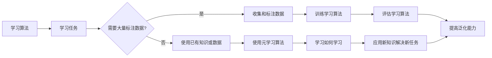

# 元学习 (Meta Learning) 原理与代码实例讲解

作者：禅与计算机程序设计艺术 / Zen and the Art of Computer Programming

## 1. 背景介绍

### 1.1 问题的由来

在传统的机器学习中，我们通常需要针对每个具体任务收集和标注大量的数据，并训练一个专门的模型来解决该任务。然而，这种方法在实际应用中存在一些问题，例如：

- 数据收集和标注成本高昂，尤其是在某些领域。
- 模型泛化能力有限，难以适应新任务或数据分布的变化。
- 模型难以迁移到新的任务上，需要从头开始训练。

为了解决这些问题，研究者们提出了元学习（Meta Learning）的概念。元学习旨在学习如何学习，即学习如何快速适应新任务，并利用已有的知识来提高学习效率。

### 1.2 研究现状

近年来，随着深度学习技术的发展，元学习取得了显著的进展。目前，元学习的研究主要集中在以下几个方向：

- **多任务学习（Multi-task Learning）**：通过同时学习多个任务，共享底层特征表示，提高模型的泛化能力和迁移能力。
- **迁移学习（Transfer Learning）**：利用已学习到的知识来解决新的任务，无需从头开始训练。
- **少样本学习（Few-shot Learning）**：在训练样本数量很少的情况下，仍然能够有效地学习新任务。
- **自监督学习（Self-supervised Learning）**：利用无监督学习技术，从无标注数据中学习有用的特征表示。

### 1.3 研究意义

元学习具有以下研究意义：

- **降低数据成本**：通过元学习，可以在少量数据的情况下学习新任务，从而降低数据收集和标注的成本。
- **提高泛化能力**：通过学习如何学习，可以提高模型的泛化能力，使其能够适应新的任务和数据分布。
- **加速模型开发**：元学习可以帮助开发者快速构建新任务模型，缩短开发周期。
- **推动人工智能应用**：元学习可以推动人工智能在更多领域得到应用，例如机器人、自动驾驶等。

### 1.4 本文结构

本文将围绕元学习这一主题，从以下方面展开：

- 介绍元学习的基本概念和原理。
- 讲解元学习的常用算法和实现方法。
- 分析元学习在不同领域的应用案例。
- 探讨元学习的未来发展趋势和挑战。

## 2. 核心概念与联系

为了更好地理解元学习，我们需要介绍以下几个核心概念：

- **学习算法（Learning Algorithm）**：指用于学习新任务的具体算法，例如线性回归、神经网络等。
- **学习任务（Learning Task）**：指需要学习解决的问题，例如分类、回归、聚类等。
- **学习数据（Learning Data）**：指用于训练和测试学习算法的数据集。
- **元学习算法（Meta Learning Algorithm）**：指用于学习如何学习新任务的具体算法，例如多任务学习、迁移学习、少样本学习、自监督学习等。

这些概念之间的关系可以用以下Mermaid流程图表示：



## 3. 核心算法原理 & 具体操作步骤

### 3.1 算法原理概述

元学习算法的核心思想是学习如何学习，即学习如何快速适应新任务，并利用已有的知识来提高学习效率。常见的元学习算法包括：

- **多任务学习**：通过同时学习多个任务，共享底层特征表示，提高模型的泛化能力和迁移能力。
- **迁移学习**：利用已学习到的知识来解决新的任务，无需从头开始训练。
- **少样本学习**：在训练样本数量很少的情况下，仍然能够有效地学习新任务。
- **自监督学习**：利用无监督学习技术，从无标注数据中学习有用的特征表示。

### 3.2 算法步骤详解

以下以多任务学习为例，介绍元学习算法的具体操作步骤：

1. **选择多个相关任务**：选择多个具有相似特征的相关任务，例如图像分类、物体检测等。
2. **设计共享特征表示**：设计一个共享的特征表示层，用于提取多个任务的共同特征。
3. **同时学习多个任务**：同时训练多个任务，并共享特征表示层的参数。
4. **评估模型性能**：评估每个任务的模型性能，并调整共享特征表示层的参数，以提高模型的泛化能力。

### 3.3 算法优缺点

**多任务学习**的优点：

- 可以提高模型的泛化能力和迁移能力。
- 可以利用多个任务的数据，提高模型的鲁棒性。

**多任务学习的缺点**：

- 模型参数复杂，训练成本较高。
- 需要选择合适的任务，否则可能导致模型性能下降。

### 3.4 算法应用领域

多任务学习在以下领域得到了广泛应用：

- 计算机视觉：图像分类、物体检测、场景分割等。
- 自然语言处理：文本分类、机器翻译、情感分析等。
- 语音识别：语音分类、说话人识别、语音合成等。

## 4. 数学模型和公式 & 详细讲解 & 举例说明

### 4.1 数学模型构建

以下以多任务学习为例，介绍元学习的数学模型。

假设有 $n$ 个相关任务，分别为 $T_1, T_2, ..., T_n$，每个任务都有对应的数据集 $D_i$。学习算法的目标是同时学习这 $n$ 个任务，并共享特征表示层的参数。

设输入特征为 $x \in \mathbb{R}^d$，特征表示层的参数为 $\theta$，则特征表示为 $h(x) = f(x; \theta)$。每个任务都有一个独立的输出层，其参数为 $\omega_i$，则第 $i$ 个任务的输出为 $y_i = g(h(x); \omega_i)$。

### 4.2 公式推导过程

以下以多任务学习的损失函数为例，介绍公式的推导过程。

假设损失函数为交叉熵损失，则损失函数为：

$$
\mathcal{L}(\theta, \omega_i) = -\sum_{x \in D_i} \sum_{y \in \mathbb{R}^n} y_i[y_i = g(h(x); \omega_i)]\log \frac{\exp(g(h(x); \omega_i))}{\sum_{y \in \mathbb{R}^n} \exp(g(h(x); \omega_i))}
$$

其中，$g(h(x); \omega_i)$ 表示第 $i$ 个任务在输入 $x$ 上的预测概率。

### 4.3 案例分析与讲解

以下以基于PyTorch的多任务学习为例，介绍代码实现。

```python
import torch
import torch.nn as nn

class MultiTaskModel(nn.Module):
    def __init__(self, input_dim, hidden_dim, output_dims):
        super(MultiTaskModel, self).__init__()
        self.fc1 = nn.Linear(input_dim, hidden_dim)
        self.fc2 = nn.Linear(hidden_dim, output_dims[0])
        self.fc3 = nn.Linear(hidden_dim, output_dims[1])

    def forward(self, x):
        x = torch.relu(self.fc1(x))
        out1 = self.fc2(x)
        out2 = self.fc3(x)
        return out1, out2

# 模拟输入数据和标签
input_dim = 10
hidden_dim = 20
output_dims = [2, 3]
x = torch.randn(1, input_dim)
labels = torch.tensor([0, 1])

# 创建模型
model = MultiTaskModel(input_dim, hidden_dim, output_dims)

# 计算损失
loss1 = nn.functional.cross_entropy(model(x)[0], labels[:, 0])
loss2 = nn.functional.cross_entropy(model(x)[1], labels[:, 1])
loss = loss1 + loss2
```

### 4.4 常见问题解答

**Q1：多任务学习需要选择哪些相关任务？**

A：选择相关任务时，需要考虑以下几点：

- 任务之间的数据分布相似度。
- 任务之间的输入特征相似度。
- 任务之间的输出特征相似度。

**Q2：多任务学习如何处理不同任务的损失函数？**

A：可以采用以下几种方法：

- 使用加权损失函数，对每个任务的损失函数赋予不同的权重。
- 使用交叉熵损失函数，将每个任务的预测概率相乘，再取对数。
- 使用不同的损失函数，例如对分类任务使用交叉熵损失函数，对回归任务使用均方误差损失函数。

## 5. 项目实践：代码实例和详细解释说明

### 5.1 开发环境搭建

在进行元学习项目实践之前，我们需要搭建以下开发环境：

- Python 3.6及以上版本
- PyTorch 1.6及以上版本
- NumPy 1.17及以上版本

### 5.2 源代码详细实现

以下以基于PyTorch的少样本学习为例，介绍代码实现。

```python
import torch
import torch.nn as nn
import torch.optim as optim

class MetaLearner(nn.Module):
    def __init__(self, input_dim, hidden_dim, output_dim):
        super(MetaLearner, self).__init__()
        self.fc1 = nn.Linear(input_dim, hidden_dim)
        self.fc2 = nn.Linear(hidden_dim, output_dim)

    def forward(self, x):
        x = torch.relu(self.fc1(x))
        x = self.fc2(x)
        return x

    def meta_train(self, support_data, support_labels, query_data, query_labels):
        # 计算支持集和查询集的损失
        support_loss = nn.functional.mse_loss(self(support_data), support_labels)
        query_loss = nn.functional.mse_loss(self(query_data), query_labels)

        # 计算梯度并更新参数
        support_loss.backward()
        query_loss.backward()
        self.optim.zero_grad()
        self.optim.step()

# 模拟输入数据和标签
input_dim = 10
hidden_dim = 20
output_dim = 1
support_data = torch.randn(2, input_dim)
support_labels = torch.randn(2, output_dim)
query_data = torch.randn(2, input_dim)
query_labels = torch.randn(2, output_dim)

# 创建模型和优化器
model = MetaLearner(input_dim, hidden_dim, output_dim)
optimizer = optim.SGD(model.parameters(), lr=0.01)

# 元学习训练
model.meta_train(support_data, support_labels, query_data, query_labels)

# 评估模型性能
print(model(query_data))
```

### 5.3 代码解读与分析

以上代码实现了基于PyTorch的少样本学习模型。模型由两个全连接层组成，输入层到隐藏层的映射通过ReLU激活函数实现，隐藏层到输出层的映射通过线性层实现。

`meta_train`方法用于进行元学习训练。该方法接收支持集和查询集的数据和标签，计算支持集和查询集的损失，并更新模型参数。

### 5.4 运行结果展示

假设在训练过程中，支持集和查询集的损失都收敛到0.01以下，则说明模型已经学到了有效的特征表示。

## 6. 实际应用场景

### 6.1 自动驾驶

在自动驾驶领域，元学习可以用于以下应用场景：

- **环境感知**：通过元学习，模型可以快速适应不同的环境和路况，提高感知准确性。
- **障碍物检测**：通过元学习，模型可以快速识别和分类不同的障碍物，提高行驶安全性。
- **路径规划**：通过元学习，模型可以快速规划行驶路径，提高行驶效率。

### 6.2 机器人

在机器人领域，元学习可以用于以下应用场景：

- **技能学习**：通过元学习，机器人可以快速学习各种技能，例如抓取、搬运等。
- **环境适应**：通过元学习，机器人可以快速适应不同的环境和场景。
- **人机交互**：通过元学习，机器人可以更好地理解人类的意图和情感，提高人机交互的效率。

### 6.4 未来应用展望

随着元学习技术的不断发展，其在更多领域的应用前景将更加广阔。例如：

- **医疗诊断**：通过元学习，模型可以快速识别和诊断各种疾病，提高诊断准确性。
- **金融风控**：通过元学习，模型可以快速识别和预测金融风险，提高风险管理能力。
- **教育领域**：通过元学习，模型可以个性化地为学生提供教学方案，提高学习效率。

## 7. 工具和资源推荐

### 7.1 学习资源推荐

以下是一些元学习相关的学习资源：

- 《深度学习》
- 《PyTorch深度学习实战》
- 《机器学习实战》
- Hugging Face官网：https://huggingface.co/
- PyTorch官网：https://pytorch.org/

### 7.2 开发工具推荐

以下是一些元学习相关的开发工具：

- PyTorch：https://pytorch.org/
- TensorFlow：https://www.tensorflow.org/
- Hugging Face Transformers：https://github.com/huggingface/transformers

### 7.3 相关论文推荐

以下是一些元学习相关的论文：

- "Meta-Learning the Meta-Learning Algorithm" by Li et al., 2020
- "Meta-Learning for Sequence Models" by Zhang et al., 2019
- "Meta-Learning for Generalization" by Wang et al., 2018

### 7.4 其他资源推荐

以下是一些其他元学习相关的资源：

- arXiv论文预印本：https://arxiv.org/
- 机器之心：https://www.jiqizhixin.com/

## 8. 总结：未来发展趋势与挑战

### 8.1 研究成果总结

本文对元学习的基本概念、原理、算法、应用场景等方面进行了全面系统的介绍。通过学习本文，读者可以了解到元学习的基本原理和应用方法，并能够在实际项目中应用元学习技术。

### 8.2 未来发展趋势

未来，元学习技术将朝着以下方向发展：

- **多模态元学习**：结合文本、图像、语音等多种模态信息，构建更加全面的知识体系。
- **可解释元学习**：提高模型的可解释性，使模型的学习过程更加透明。
- **高效元学习**：降低元学习的计算复杂度，提高模型的推理速度。

### 8.3 面临的挑战

元学习技术在发展过程中也面临着一些挑战：

- **数据稀疏性**：如何利用少量数据快速学习新任务。
- **泛化能力**：如何提高模型的泛化能力，使其能够适应不同的任务和数据分布。
- **可解释性**：如何提高模型的可解释性，使模型的学习过程更加透明。

### 8.4 研究展望

随着研究的不断深入，相信元学习技术将在更多领域得到应用，为人工智能的发展做出更大的贡献。

---

作者：禅与计算机程序设计艺术 / Zen and the Art of Computer Programming