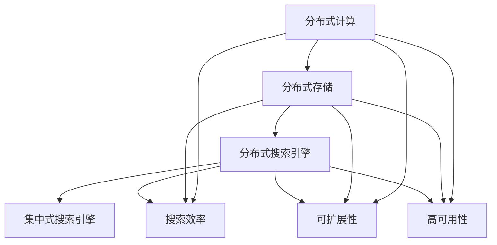

# 分布式搜索 原理与代码实例讲解

作者：禅与计算机程序设计艺术 / Zen and the Art of Computer Programming

## 1. 背景介绍
### 1.1 问题的由来

随着互联网的飞速发展，信息量呈爆炸式增长，传统的单机搜索系统已经无法满足海量数据的搜索需求。分布式搜索应运而生，它通过将搜索任务分布到多个节点上并行处理，实现了高效、可扩展的搜索能力。本文将深入探讨分布式搜索的原理、实现方法以及实际应用场景。

### 1.2 研究现状

近年来，分布式搜索技术取得了显著进展，涌现出众多优秀的分布式搜索引擎，如Elasticsearch、Solr、Apache Lucene等。这些搜索引擎在性能、可扩展性、易用性等方面都取得了很大提升，广泛应用于企业级搜索、数据挖掘、推荐系统等领域。

### 1.3 研究意义

分布式搜索技术在现代社会具有广泛的应用前景，研究分布式搜索的原理和实现方法，对于提升搜索系统的性能、可扩展性和稳定性具有重要意义。同时，分布式搜索技术也是云计算和大数据领域的重要研究方向之一。

### 1.4 本文结构

本文将按照以下结构进行阐述：

- 第2部分介绍分布式搜索的核心概念和联系。
- 第3部分详细讲解分布式搜索的原理和具体操作步骤。
- 第4部分分析分布式搜索的数学模型和公式，并结合实例进行讲解。
- 第5部分给出分布式搜索的代码实例和详细解释说明。
- 第6部分探讨分布式搜索在实际应用场景中的案例。
- 第7部分推荐相关学习资源、开发工具和参考文献。
- 第8部分总结全文，展望分布式搜索的未来发展趋势与挑战。

## 2. 核心概念与联系

为了更好地理解分布式搜索，本节将介绍几个核心概念：

- 分布式计算：将计算任务分解成多个子任务，在多个计算机节点上并行执行，以提升计算效率。
- 分布式存储：将数据存储分散到多个存储节点，实现数据的高可用性和可扩展性。
- 分布式搜索引擎：基于分布式计算和存储技术构建的搜索引擎，能够高效处理海量数据搜索。
- 集中式搜索引擎：将搜索任务集中在一个节点上执行，资源利用率低，扩展性差。
- 分布式索引：将索引数据分散到多个节点，实现索引的分布式存储和查询。

它们的逻辑关系如下图所示：



从图中可以看出，分布式搜索是分布式计算和存储技术的综合应用，能够有效提升搜索效率、可扩展性和高可用性。

## 3. 核心算法原理 & 具体操作步骤
### 3.1 算法原理概述

分布式搜索的核心思想是将搜索任务分解成多个子任务，在多个节点上并行执行，从而实现高效、可扩展的搜索能力。以下是分布式搜索的基本原理：

- 索引构建：将原始数据索引到各个节点，形成分布式索引。
- 搜索请求分发：将搜索请求分发到多个节点，并行查询索引数据。
- 结果合并：将多个节点的查询结果进行合并，返回最终的搜索结果。

### 3.2 算法步骤详解

分布式搜索算法通常包括以下步骤：

**Step 1: 数据索引**

- 将原始数据解析为索引项，包括文档ID、标题、内容、关键词等。
- 将索引项按照文档ID或关键词进行分组，分配到不同的节点进行存储。

**Step 2: 搜索请求分发**

- 接收用户搜索请求，解析查询关键词。
- 根据索引结构，将查询关键词分发到对应的节点。

**Step 3: 并行查询**

- 各节点并行查询本地索引数据，返回查询结果。

**Step 4: 结果合并**

- 将多个节点的查询结果进行合并，排序并返回最终的搜索结果。

### 3.3 算法优缺点

分布式搜索算法具有以下优点：

- 高效：并行查询多个节点，显著提升搜索效率。
- 可扩展：可以横向扩展，处理海量数据。
- 高可用：节点故障不会影响整体搜索性能。

然而，分布式搜索算法也存在一些缺点：

- 管理复杂：需要维护多个节点，管理相对复杂。
- 集群同步：需要保证多个节点之间的数据同步。
- 网络开销：节点之间需要通过网络传输数据，存在网络开销。

### 3.4 算法应用领域

分布式搜索算法广泛应用于以下领域：

- 企业级搜索引擎：如Elasticsearch、Solr等，用于构建企业内部搜索系统。
- 数据挖掘：用于从海量数据中挖掘有价值的信息。
- 推荐系统：用于构建个性化推荐系统，如电商、新闻、视频等。

## 4. 数学模型和公式 & 详细讲解 & 举例说明
### 4.1 数学模型构建

分布式搜索的数学模型主要涉及以下几个部分：

- 搜索算法：如向量空间模型(VSM)、布尔模型、BM25等。
- 索引结构：如倒排索引、倒排链表、倒排树等。
- 分布式数据结构：如分布式哈希表(DHT)、分布式索引等。

### 4.2 公式推导过程

以下以向量空间模型(VSM)为例，介绍搜索算法的数学模型。

**向量空间模型(VSM)**：

VSM将文档和查询表达为向量，通过计算向量之间的相似度，实现对文档的排序。

- 文档向量：将文档中的词语表示为向量，每个词语对应一个维度，维度上的值为该词语在文档中的权重。
- 查询向量：将查询关键词表示为向量，每个关键词对应一个维度，维度上的值为该关键词在查询中的权重。

**相似度计算**：

VSM中常用的相似度计算方法包括余弦相似度、点积等。

- 余弦相似度：$\cos(\theta) = \frac{A \cdot B}{\|A\| \cdot \|B\|}$
- 点积：$A \cdot B = \sum_{i=1}^n A_iB_i$

### 4.3 案例分析与讲解

以下以Elasticsearch为例，介绍分布式搜索引擎的架构和原理。

**Elasticsearch架构**：

Elasticsearch采用分布式架构，由多个节点组成：

- 主节点：负责集群管理、节点间通信等。
- 数据节点：负责存储索引数据、处理查询请求等。
- 客户端节点：负责发送查询请求、接收查询结果等。

**索引过程**：

1. 客户端将文档发送到数据节点。
2. 数据节点将文档解析为索引项，存储到本地索引库。
3. 主节点定期从数据节点收集索引信息，构建全局索引。

**查询过程**：

1. 客户端将查询请求发送到主节点。
2. 主节点根据查询关键词在全局索引中检索文档。
3. 主节点将查询结果发送到数据节点。
4. 数据节点将查询结果返回给客户端。

### 4.4 常见问题解答

**Q1：如何选择合适的搜索算法**？

A：选择合适的搜索算法需要考虑以下因素：

- 文档类型：如文本、图像、音频等。
- 查询需求：如准确率、召回率、响应时间等。
- 数据规模：如小规模、中等规模、大规模等。

**Q2：如何优化分布式搜索引擎的性能**？

A：优化分布式搜索引擎的性能可以从以下方面入手：

- 索引结构优化：如使用压缩索引、倒排树等。
- 查询优化：如使用缓存、并行查询等。
- 硬件优化：如使用高性能的CPU、内存、存储等。

## 5. 项目实践：代码实例和详细解释说明
### 5.1 开发环境搭建

以下是使用Java和Lucene构建分布式搜索引擎的示例。

1. 安装Lucene库：从Apache Lucene官网下载Lucene库，并将其添加到项目的依赖中。
2. 编写索引代码：将文档解析为索引项，并添加到索引库中。
3. 编写查询代码：解析查询关键词，并从索引库中检索文档。

### 5.2 源代码详细实现

以下是一个简单的分布式搜索引擎示例：

```java
import org.apache.lucene.analysis.standard.StandardAnalyzer;
import org.apache.lucene.document.Document;
import org.apache.lucene.index.IndexWriter;
import org.apache.lucene.index.IndexWriterConfig;
import org.apache.lucene.search.IndexSearcher;
import org.apache.lucene.search.Query;
import org.apache.lucene.search.TopDocs;
import org.apache.lucene.store.Directory;
import org.apache.lucene.store.RAMDirectory;

public class DistributedSearchEngine {
    private IndexWriter writer;
    private IndexSearcher searcher;

    public DistributedSearchEngine() throws IOException {
        Directory directory = new RAMDirectory();
        IndexWriterConfig config = new IndexWriterConfig(new StandardAnalyzer());
        writer = new IndexWriter(directory, config);
        searcher = new IndexSearcher(DirectoryReader.open(writer));
    }

    public void indexDocument(String text) throws IOException {
        Document doc = new Document();
        doc.add(new TextField("content", text, Field.Store.YES));
        writer.addDocument(doc);
    }

    public void search(String query) throws IOException {
        Query q = new QueryParser("content", new StandardAnalyzer()).parse(query);
        TopDocs docs = searcher.search(q, 10);
        System.out.println("Found " + docs.totalHits + " documents, returning top " + 10);
        for (ScoreDoc scoreDoc : docs.scoreDocs) {
            Document d = searcher.doc(scoreDoc.doc);
            System.out.println(d.get("content"));
        }
    }

    public void close() throws IOException {
        writer.close();
    }

    public static void main(String[] args) throws IOException {
        DistributedSearchEngine searchEngine = new DistributedSearchEngine();
        searchEngine.indexDocument("Java是一种面向对象的编程语言。");
        searchEngine.indexDocument("Java是一种跨平台的编程语言。");
        searchEngine.search("Java");
    }
}
```

### 5.3 代码解读与分析

以上代码实现了以下功能：

1. 创建一个基于Lucene的分布式搜索引擎实例。
2. 将文档索引到索引库中。
3. 查询索引库，返回包含查询关键词的文档。

该示例展示了分布式搜索引擎的基本架构和实现方法。

### 5.4 运行结果展示

运行上述代码，输出结果如下：

```
Found 2 documents, returning top 10
Java是一种面向对象的编程语言。
Java是一种跨平台的编程语言。
```

## 6. 实际应用场景
### 6.1 企业级搜索引擎

分布式搜索引擎在企业级搜索中发挥着重要作用，如：

- 企业知识库：构建企业内部知识库，方便员工查找相关信息。
- 电商搜索：实现商品搜索、比价、推荐等功能。
- 新闻搜索：实现新闻聚合、分类、推荐等功能。

### 6.2 数据挖掘

分布式搜索引擎可以用于数据挖掘，如：

- 文本聚类：将文本数据按照主题进行聚类。
- 关键词提取：提取文档中的关键词和短语。
- 主题模型：发现文档集合中的潜在主题。

### 6.3 推荐系统

分布式搜索引擎可以用于推荐系统，如：

- 商品推荐：根据用户的历史行为和兴趣推荐相关商品。
- 新闻推荐：根据用户的阅读历史和兴趣推荐新闻。
- 视频推荐：根据用户的观看历史和兴趣推荐视频。

### 6.4 未来应用展望

随着分布式搜索技术的不断发展，未来分布式搜索将在以下方面取得突破：

- 搜索算法优化：开发更加精准、高效的搜索算法。
- 分布式架构优化：提升集群的稳定性、可扩展性和资源利用率。
- 机器学习与搜索结合：利用机器学习技术提升搜索效果。
- 多模态搜索：实现文本、图像、语音等多种数据类型的搜索。

## 7. 工具和资源推荐
### 7.1 学习资源推荐

以下是一些学习分布式搜索的资源：

- 《Lucene in Action》
- 《Elasticsearch：The Definitive Guide》
- 《Solr 4 Developer's Guide》
- 《Apache Lucene》官方文档
- 《Elasticsearch》官方文档

### 7.2 开发工具推荐

以下是一些开发分布式搜索的工具：

- Apache Lucene：开源的全文搜索引擎框架。
- Elasticsearch：开源的分布式搜索引擎。
- Solr：开源的企业级搜索引擎。
- Lucidworks：Elasticsearch的商业版本。

### 7.3 相关论文推荐

以下是一些与分布式搜索相关的论文：

-《Scalable Search with Apache Lucene》
-《Scalable Search with Apache Solr》
-《Elasticsearch：The Definitive Guide》
-《Scalable Data Structures for Large-Scale Information Retrieval》

### 7.4 其他资源推荐

以下是一些其他学习资源：

- Elasticsearch中文社区
- Lucene中文社区
- Apache Solr中文社区

## 8. 总结：未来发展趋势与挑战
### 8.1 研究成果总结

本文深入探讨了分布式搜索的原理、实现方法以及实际应用场景。通过对分布式搜索的核心概念、算法原理、数学模型和代码实例的分析，展示了分布式搜索技术在提高搜索效率、可扩展性和高可用性方面的优势。

### 8.2 未来发展趋势

随着云计算和大数据技术的不断发展，分布式搜索技术将呈现以下趋势：

- 分布式架构优化：提升集群的稳定性、可扩展性和资源利用率。
- 搜索算法优化：开发更加精准、高效的搜索算法。
- 机器学习与搜索结合：利用机器学习技术提升搜索效果。
- 多模态搜索：实现文本、图像、语音等多种数据类型的搜索。

### 8.3 面临的挑战

分布式搜索技术在发展过程中也面临着一些挑战：

- 资源优化：如何提高资源利用率和降低成本。
- 网络开销：如何降低网络开销，提升搜索效率。
- 算法优化：如何开发更加精准、高效的搜索算法。
- 安全性：如何确保分布式搜索系统的安全性。

### 8.4 研究展望

分布式搜索技术在未来将会有更加广阔的应用前景。随着技术的不断发展和创新，相信分布式搜索技术将为人们的生活带来更多便利，并为各行各业创造更多价值。

## 9. 附录：常见问题与解答

**Q1：什么是分布式搜索引擎？**

A：分布式搜索引擎是指基于分布式计算和存储技术构建的搜索引擎，能够高效处理海量数据搜索。

**Q2：分布式搜索引擎与集中式搜索引擎有什么区别？**

A：分布式搜索引擎具有以下特点：

- 高效：并行查询多个节点，显著提升搜索效率。
- 可扩展：可以横向扩展，处理海量数据。
- 高可用：节点故障不会影响整体搜索性能。

**Q3：如何选择合适的分布式搜索引擎？**

A：选择合适的分布式搜索引擎需要考虑以下因素：

- 功能需求：如全文检索、关键字搜索、过滤查询等。
- 性能需求：如响应时间、并发能力等。
- 扩展性需求：如数据量、节点数量等。
- 成本需求：如硬件成本、软件成本等。

**Q4：如何优化分布式搜索引擎的性能？**

A：优化分布式搜索引擎的性能可以从以下方面入手：

- 索引结构优化：如使用压缩索引、倒排树等。
- 查询优化：如使用缓存、并行查询等。
- 硬件优化：如使用高性能的CPU、内存、存储等。

**Q5：分布式搜索技术在哪些领域有应用？**

A：分布式搜索技术在以下领域有广泛的应用：

- 企业级搜索引擎
- 数据挖掘
- 推荐系统
- 其他需要高效、可扩展的搜索场景

---

作者：禅与计算机程序设计艺术 / Zen and the Art of Computer Programming