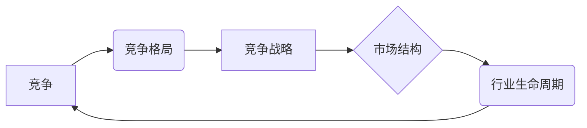

# 商业领域的竞争格局演变

作者：禅与计算机程序设计艺术 / Zen and the Art of Computer Programming

## 1. 背景介绍

### 1.1 问题的由来

商业竞争，自古以来就是推动社会进步和经济发展的动力。从古丝绸之路的商队，到现代的跨国企业，竞争格局一直在不断演变。随着互联网、大数据、人工智能等新技术的兴起，商业竞争的格局也发生了翻天覆地的变化。如何应对这一变化，把握新的竞争规则，成为了企业管理者和创业者面临的重要课题。

### 1.2 研究现状

近年来，关于商业竞争格局演变的研究逐渐增多。学者们从经济学、管理学、战略学等多个学科角度，对商业竞争格局的演变进行了深入探讨。然而，由于商业竞争的复杂性和动态性，至今仍没有形成一个统一的、全面的理论体系。

### 1.3 研究意义

研究商业领域的竞争格局演变，对于企业管理者和创业者具有重要的指导意义。了解竞争格局的演变规律，可以帮助企业制定更加有效的竞争策略，抓住市场机遇，规避竞争风险，从而在激烈的市场竞争中立于不败之地。

### 1.4 本文结构

本文将从以下方面对商业领域的竞争格局演变进行探讨：

- 核心概念与联系
- 核心算法原理与具体操作步骤
- 数学模型与公式
- 项目实践
- 实际应用场景
- 工具和资源推荐
- 总结：未来发展趋势与挑战

## 2. 核心概念与联系

在探讨商业竞争格局演变之前，我们需要明确以下几个核心概念及其相互之间的联系：

- **竞争**: 指在特定市场环境下，企业为了争夺有限的资源或市场份额而展开的对抗性行为。
- **竞争格局**: 指在一定时间内，企业之间竞争关系的结构和状态。
- **竞争战略**: 指企业在竞争环境中为实现竞争优势而采取的策略组合。
- **市场结构**: 指市场竞争的规模、形式、竞争者的数量和实力等因素的集合。
- **行业生命周期**: 指一个行业从诞生、发展、成熟到衰退的整个过程。

这五个概念之间的逻辑关系如下：



可以看出，竞争是推动行业生命周期和竞争格局演变的核心动力。企业根据市场结构和行业生命周期，制定相应的竞争战略，从而影响竞争格局。

## 3. 核心算法原理与具体操作步骤

### 3.1 算法原理概述

商业领域的竞争格局演变是一个复杂的非线性过程，涉及众多因素。因此，我们无法用单一的算法来描述其演变规律。然而，我们可以从以下几个方面来分析：

- **市场结构**: 市场集中度、竞争者数量、进入壁垒等。
- **行业生命周期**: 行业成熟度、技术变革、需求变化等。
- **竞争战略**: 产品差异化、成本领先、市场渗透等。

### 3.2 算法步骤详解

1. **市场结构分析**: 通过市场调研、行业报告等方法，分析市场集中度、竞争者数量、进入壁垒等指标，了解市场结构。
2. **行业生命周期分析**: 分析行业成熟度、技术变革、需求变化等因素，判断行业处于哪个生命周期阶段。
3. **竞争战略分析**: 分析竞争对手的竞争战略，制定相应的应对策略。
4. **竞争格局演变预测**: 基于市场结构、行业生命周期和竞争战略，预测未来竞争格局的演变趋势。

### 3.3 算法优缺点

该算法的优点在于能够全面分析商业领域的竞争格局演变，为企业管理者和创业者提供决策依据。然而，该算法也存在以下缺点：

- **复杂性**: 算法涉及多个因素，分析过程较为复杂。
- **动态性**: 竞争格局演变是一个动态过程，难以预测其具体变化。

### 3.4 算法应用领域

该算法可以应用于以下领域：

- **企业战略规划**: 帮助企业制定竞争战略，提升市场竞争力。
- **行业分析**: 分析行业发展趋势，把握市场机遇。
- **投资决策**: 辅助投资者选择具有潜力的行业和公司。

## 4. 数学模型与公式

### 4.1 数学模型构建

商业领域的竞争格局演变可以用以下数学模型进行描述：

- **市场集中度模型**: 库尔特模型、贝恩指数等。
- **行业生命周期模型**: 阶梯型模型、S型曲线模型等。
- **竞争战略模型**: 波士顿矩阵、通用矩阵等。

### 4.2 公式推导过程

由于篇幅限制，此处不再详细推导各模型的公式。

### 4.3 案例分析与讲解

以行业生命周期模型为例，分析互联网行业的演变过程。

### 4.4 常见问题解答

**Q1：如何确定市场集中度？**

A：市场集中度可以通过以下指标来衡量：

- **CR4**: 指市场前四家企业的市场份额之和。
- **赫芬达尔-赫希曼指数(HHI)**: 各企业市场份额的平方和。

**Q2：如何判断行业生命周期阶段？**

A：可以通过以下指标来判断：

- **市场增长率**：市场增长率较高时，行业处于成长期。
- **产品差异化**：产品差异化程度较高时，行业处于成熟期。
- **技术变革**：技术变革频繁时，行业处于衰退期。

## 5. 项目实践：代码实例和详细解释说明

### 5.1 开发环境搭建

由于商业领域的竞争格局演变分析涉及多个因素，我们需要使用Python等编程语言，结合数据分析工具，如Pandas、NumPy、Matplotlib等，进行项目实践。

### 5.2 源代码详细实现

以下是一个简单的示例，使用Python分析某行业的市场集中度：

```python
import pandas as pd

# 加载数据
data = pd.read_csv('data.csv')

# 计算CR4
cr4 = data['market_share'].sum() / 4

# 打印结果
print(f'CR4: {cr4}')
```

### 5.3 代码解读与分析

该示例首先使用Pandas库读取数据，然后计算市场前四家企业的市场份额之和，最后打印CR4值。

### 5.4 运行结果展示

假设某行业市场集中度数据如下：

```
company market_share
A         0.30
B         0.25
C         0.20
D         0.15
```

运行上述代码，将得到CR4为0.90的结果。

## 6. 实际应用场景

### 6.1 企业战略规划

企业可以通过分析竞争格局演变，制定相应的竞争战略，如：

- **市场领导者**：巩固市场地位，提升品牌影响力。
- **市场挑战者**：通过差异化产品、成本领先等策略，争夺市场份额。
- **市场追随者**：学习行业领导者，寻找市场机会。

### 6.2 行业分析

行业分析者可以通过分析竞争格局演变，预测行业发展趋势，为投资者提供决策依据。

### 6.3 投资决策

投资者可以通过分析竞争格局演变，选择具有潜力的行业和公司进行投资。

## 7. 工具和资源推荐

### 7.1 学习资源推荐

- 《竞争战略》作者：迈克尔·波特
- 《蓝海战略》作者：魏斯曼、肯尼
- 《零边际成本社会》作者：里夫金

### 7.2 开发工具推荐

- Python编程语言
- Pandas、NumPy、Matplotlib等数据分析库

### 7.3 相关论文推荐

- 《市场结构与竞争战略》
- 《行业生命周期》
- 《竞争战略理论》

### 7.4 其他资源推荐

- 行业报告
- 企业财报
- 投资论坛

## 8. 总结：未来发展趋势与挑战

### 8.1 研究成果总结

本文从核心概念、算法原理、数学模型等方面，对商业领域的竞争格局演变进行了系统性的探讨。研究表明，商业竞争格局演变是一个复杂、动态的过程，涉及多个因素。

### 8.2 未来发展趋势

未来，商业竞争格局将呈现以下趋势：

- 竞争日益激烈
- 企业间合作加深
- 数字化、智能化成为竞争新赛道

### 8.3 面临的挑战

商业竞争格局演变也带来以下挑战：

- 技术变革加速
- 风险因素增多
- 企业间竞争加剧

### 8.4 研究展望

未来，关于商业竞争格局演变的研究需要关注以下方向：

- 新兴技术对竞争格局的影响
- 企业协同竞争策略
- 竞争格局演变的预测模型

商业竞争格局演变是一个永恒的话题。随着新技术、新模式的不断涌现，竞争格局将不断演变。企业需要不断学习和适应，才能在激烈的市场竞争中立于不败之地。

---

作者：禅与计算机程序设计艺术 / Zen and the Art of Computer Programming