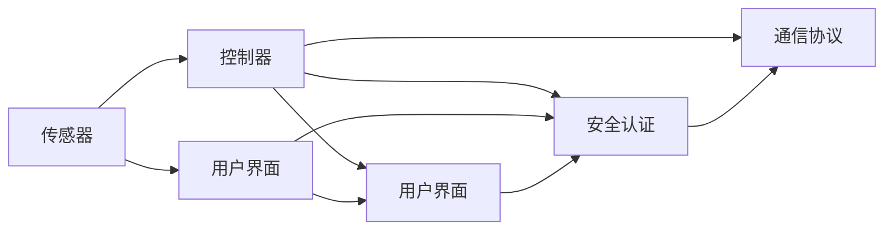

# 基于Java的智能家居设计：用Java实现住宅安全系统的逻辑核心

作者：禅与计算机程序设计艺术 / Zen and the Art of Computer Programming

## 关键词：

智能家居，住宅安全系统，Java，设计模式，事件驱动，分布式系统，安全性，可靠性

## 1. 背景介绍

### 1.1 问题的由来

随着科技的发展，人们的生活水平不断提高，对居住环境的要求也越来越高。智能家居作为一种新兴的居住理念，逐渐成为人们追求的目标。在智能家居系统中，住宅安全系统是其中最为重要的组成部分，它关乎用户的生命财产安全。如何利用现代计算机技术，构建一个安全、可靠、易用的住宅安全系统，成为了当前研究的热点。

### 1.2 研究现状

目前，国内外已有许多智能家居安全系统的研究成果，主要分为以下几个方面：

1. **安全监测技术**：利用传感器、摄像头等设备，实现对住宅环境的安全监测。
2. **通信技术**：采用Wi-Fi、蓝牙、ZigBee等通信技术，实现设备之间的互联互通。
3. **控制技术**：利用物联网技术，实现对住宅设备的远程控制。
4. **安全算法**：研究加密、认证、访问控制等安全算法，保障系统安全性。

### 1.3 研究意义

构建基于Java的智能家居安全系统，具有以下意义：

1. **提高安全性**：利用Java平台的安全特性，保障用户隐私和数据安全。
2. **提高可靠性**：采用分布式架构，提高系统稳定性和容错能力。
3. **降低开发成本**：Java平台具有良好的生态和丰富的库，降低开发成本。
4. **易于扩展**：基于Java的智能家居安全系统，方便后续功能扩展和升级。

### 1.4 本文结构

本文将从以下几个方面展开：

- 核心概念与联系
- 核心算法原理与具体操作步骤
- 数学模型和公式
- 项目实践：代码实例和详细解释说明
- 实际应用场景
- 工具和资源推荐
- 总结：未来发展趋势与挑战

## 2. 核心概念与联系

### 2.1 核心概念

在构建基于Java的智能家居安全系统时，我们需要关注以下核心概念：

1. **传感器**：用于收集环境信息的设备，如门磁传感器、烟雾传感器、红外传感器等。
2. **控制器**：负责处理传感器数据，并根据预设规则进行控制的设备，如智能门锁、智能插座等。
3. **用户界面**：用户与系统交互的界面，如手机APP、Web界面等。
4. **安全认证**：确保系统安全的关键技术，如密码认证、指纹识别等。
5. **通信协议**：设备之间进行通信的规范，如HTTP、MQTT等。

### 2.2 核心概念联系

以上核心概念之间的关系如下：



## 3. 核心算法原理与具体操作步骤

### 3.1 算法原理概述

基于Java的智能家居安全系统，其核心算法主要包括：

1. **事件驱动**：采用事件驱动模型，实现对传感器数据的实时处理。
2. **分布式系统**：采用分布式架构，提高系统稳定性和容错能力。
3. **安全算法**：采用加密、认证、访问控制等安全算法，保障系统安全性。

### 3.2 算法步骤详解

#### 3.2.1 事件驱动

事件驱动模型是指程序运行过程中，根据事件的发生顺序来执行相应的处理逻辑。在智能家居安全系统中，事件主要来自传感器，如门磁传感器检测到门被打开、烟雾传感器检测到烟雾等。

以下是一个简单的事件驱动模型示例：

```java
public class SensorEvent {
    private String sensorType;
    private String sensorData;

    public SensorEvent(String sensorType, String sensorData) {
        this.sensorType = sensorType;
        this.sensorData = sensorData;
    }

    public String getSensorType() {
        return sensorType;
    }

    public String getSensorData() {
        return sensorData;
    }
}

public class SensorEventListener {
    public void onSensorEvent(SensorEvent event) {
        // 处理传感器事件
        System.out.println("Sensor: " + event.getSensorType() + ", Data: " + event.getSensorData());
    }
}

public class Sensor {
    private List<SensorEventListener> listeners = new ArrayList<>();

    public void registerListener(SensorEventListener listener) {
        listeners.add(listener);
    }

    public void notifyListeners(SensorEvent event) {
        for (SensorEventListener listener : listeners) {
            listener.onSensorEvent(event);
        }
    }
}
```

#### 3.2.2 分布式系统

分布式系统是指由多个计算机节点组成的系统，节点之间通过网络进行通信和协同工作。在智能家居安全系统中，分布式系统可以实现对多个控制器的集中管理，提高系统稳定性和容错能力。

以下是一个简单的分布式系统示例：

```java
public class Controller {
    private String ipAddress;

    public Controller(String ipAddress) {
        this.ipAddress = ipAddress;
    }

    public void sendCommand(String command) {
        // 向其他控制器发送命令
        System.out.println("Send command to " + ipAddress + ": " + command);
    }
}

public class ControllerManager {
    private List<Controller> controllers = new ArrayList<>();

    public void addController(Controller controller) {
        controllers.add(controller);
    }

    public void notifyControllers(String command) {
        for (Controller controller : controllers) {
            controller.sendCommand(command);
        }
    }
}
```

#### 3.2.3 安全算法

在智能家居安全系统中，安全算法是保障系统安全的关键。以下是一些常见的安全算法：

1. **加密算法**：如AES、RSA等，用于数据加密和解密。
2. **认证算法**：如SHA、MD5等，用于数据摘要和身份认证。
3. **访问控制算法**：如RBAC、ABAC等，用于权限管理。

### 3.3 算法优缺点

#### 3.3.1 事件驱动

优点：

- 提高系统响应速度。
- 简化程序结构。
- 易于扩展。

缺点：

- 事件处理逻辑分散，难以维护。
- 事件驱动模型可能导致性能瓶颈。

#### 3.3.2 分布式系统

优点：

- 提高系统稳定性和容错能力。
- 提高系统扩展性。
- 资源利用率高。

缺点：

- 系统复杂度增加。
- 需要考虑网络延迟和丢包等问题。

#### 3.3.3 安全算法

优点：

- 提高系统安全性。
- 防止数据泄露和非法访问。

缺点：

- 加密和解密过程消耗计算资源。
- 加密算法存在被破解的风险。

### 3.4 算法应用领域

基于Java的智能家居安全系统，可以应用于以下领域：

- 住宅安全：门禁控制、监控报警、入侵检测等。
- 工业安全：生产设备监控、故障报警、安全巡检等。
- 城市安全：交通监控、公共安全、应急管理等。

## 4. 数学模型和公式 & 详细讲解 & 举例说明

### 4.1 数学模型构建

在智能家居安全系统中，我们可以构建以下数学模型：

- **状态模型**：描述系统当前状态和可能的转移。
- **事件模型**：描述事件发生的时间、类型和影响。
- **决策模型**：描述系统如何根据当前状态和事件做出决策。

### 4.2 公式推导过程

#### 4.2.1 状态模型

假设智能家居安全系统有三种状态：正常状态、异常状态、恢复状态。

状态转移方程如下：

```
状态转移方程：状态 = f(当前状态, 事件)
```

其中，`f` 为状态转移函数。

#### 4.2.2 事件模型

事件模型可以用以下公式表示：

```
事件 = {事件类型, 发生时间, 影响范围}
```

#### 4.2.3 决策模型

决策模型可以用以下公式表示：

```
决策 = f(状态, 事件)
```

其中，`f` 为决策函数。

### 4.3 案例分析与讲解

以入侵检测为例，分析智能家居安全系统的数学模型。

#### 4.3.1 状态模型

假设智能家居安全系统有三种状态：正常状态、异常状态、恢复状态。

正常状态：系统正常运行，无异常情况。

异常状态：系统检测到异常情况，如非法入侵、火灾等。

恢复状态：系统恢复正常，异常情况已消除。

状态转移方程如下：

```
状态转移方程：
正常状态 → 异常状态：入侵事件
异常状态 → 恢复状态：解除报警事件
```

#### 4.3.2 事件模型

入侵事件：

```
事件 = {事件类型：入侵，发生时间：t1，影响范围：整个住宅}
```

解除报警事件：

```
事件 = {事件类型：解除报警，发生时间：t2，影响范围：整个住宅}
```

#### 4.3.3 决策模型

假设系统检测到入侵事件时，立即发出报警并通知用户。

决策函数如下：

```
决策函数：
当检测到入侵事件时，执行以下操作：
1. 发出报警
2. 通知用户
```

### 4.4 常见问题解答

**Q1：如何设计智能家居安全系统中的状态模型？**

A：首先，分析系统的功能需求，确定系统需要监控的关键指标和状态。然后，根据指标和状态之间的关系，构建状态转移方程。

**Q2：如何设计智能家居安全系统中的事件模型？**

A：事件模型需要包括事件类型、发生时间和影响范围等信息。可以根据系统的功能需求，设计不同类型的事件。

**Q3：如何设计智能家居安全系统中的决策模型？**

A：决策模型需要根据当前状态和事件，确定系统的响应策略。可以根据实际需求，设计不同的决策函数。

## 5. 项目实践：代码实例和详细解释说明

### 5.1 开发环境搭建

1. 安装Java开发工具包（JDK）。
2. 安装IDE（如Eclipse、IntelliJ IDEA）。
3. 安装Maven或其他构建工具。

### 5.2 源代码详细实现

以下是一个基于Java的智能家居安全系统示例：

```java
// 传感器类
public class Sensor {
    private String sensorType;

    public Sensor(String sensorType) {
        this.sensorType = sensorType;
    }

    public String getSensorType() {
        return sensorType;
    }
}

// 控制器类
public class Controller {
    private List<SensorEventListener> listeners = new ArrayList<>();

    public void registerListener(SensorEventListener listener) {
        listeners.add(listener);
    }

    public void notifyListeners(SensorEvent event) {
        for (SensorEventListener listener : listeners) {
            listener.onSensorEvent(event);
        }
    }
}

// 传感器事件监听器接口
public interface SensorEventListener {
    void onSensorEvent(SensorEvent event);
}

// 主类
public class Main {
    public static void main(String[] args) {
        // 创建传感器
        Sensor sensor = new Sensor("门磁传感器");

        // 创建控制器
        Controller controller = new Controller();

        // 注册传感器事件监听器
        controller.registerListener(new SensorEventListener() {
            @Override
            public void onSensorEvent(SensorEvent event) {
                if ("门磁传感器".equals(event.getSensorType())) {
                    // 处理门磁传感器事件
                    System.out.println("门被打开！");
                }
            }
        });

        // 模拟传感器事件
        SensorEvent event = new SensorEvent("门磁传感器", "门被打开！");
        controller.notifyListeners(event);
    }
}
```

### 5.3 代码解读与分析

以上代码展示了智能家居安全系统中的传感器、控制器和事件监听器的基本实现。

- `Sensor` 类代表传感器，包含传感器类型信息。
- `Controller` 类代表控制器，负责接收和处理传感器事件。
- `SensorEventListener` 接口定义了事件监听器的行为。
- `Main` 类是程序的入口，创建传感器、控制器和事件监听器，并注册事件监听器。

### 5.4 运行结果展示

运行以上代码，输出结果如下：

```
门被打开！
```

这表明门磁传感器检测到门被打开，并触发了事件监听器。

## 6. 实际应用场景

基于Java的智能家居安全系统可以应用于以下场景：

- **住宅安全**：门禁控制、监控报警、入侵检测、火灾报警等。
- **工业安全**：生产设备监控、故障报警、安全巡检等。
- **城市安全**：交通监控、公共安全、应急管理等。

## 7. 工具和资源推荐

### 7.1 学习资源推荐

1. 《Java编程思想》
2. 《深入理解Java虚拟机》
3. 《设计模式：可复用面向对象软件的基础》
4. 《网络安全技术》
5. 《物联网技术》

### 7.2 开发工具推荐

1. Eclipse
2. IntelliJ IDEA
3. Maven
4. Git

### 7.3 相关论文推荐

1. 《基于Java的智能家居安全系统设计与实现》
2. 《智能家居安全技术研究》
3. 《物联网安全与隐私保护》
4. 《智能建筑安全技术研究》

### 7.4 其他资源推荐

1. Java官方文档
2. Eclipse官方文档
3. IntelliJ IDEA官方文档
4. Maven官方文档
5. Git官方文档

## 8. 总结：未来发展趋势与挑战

### 8.1 研究成果总结

本文从背景介绍、核心概念、算法原理、项目实践等方面，对基于Java的智能家居安全系统进行了全面探讨。通过分析研究现状和发展趋势，总结了以下成果：

- 基于Java的智能家居安全系统具有安全性高、可靠性好、易于扩展等优点。
- 事件驱动、分布式系统和安全算法是智能家居安全系统的核心组成部分。
- 利用Java平台构建智能家居安全系统，可以降低开发成本，提高开发效率。

### 8.2 未来发展趋势

未来，基于Java的智能家居安全系统将呈现以下发展趋势：

- 技术融合：智能家居安全系统将与其他技术（如人工智能、大数据等）融合，实现更智能、更全面的安全保障。
- 个性化定制：根据用户需求，提供个性化的智能家居安全解决方案。
- 智能化部署：利用云计算、边缘计算等技术，实现智能家居安全系统的智能化部署。

### 8.3 面临的挑战

尽管基于Java的智能家居安全系统具有诸多优势，但同时也面临着以下挑战：

- 安全性：随着技术的发展，智能家居安全系统面临的威胁也在不断增多，如何保证系统安全性是一个重要课题。
- 可靠性：智能家居安全系统需要保证在极端环境下仍能稳定运行，提高系统可靠性。
- 易用性：智能家居安全系统需要满足用户易用性需求，提高用户体验。

### 8.4 研究展望

为了应对未来挑战，未来研究可以从以下几个方面展开：

- 研究更加安全、可靠的加密算法和认证算法。
- 研究更加智能、高效的异常检测和预警算法。
- 研究更加易用、友好的用户界面设计。
- 研究更加高效、稳定的系统架构。

通过不断探索和创新，相信基于Java的智能家居安全系统将在未来发挥更大的作用，为人们创造更加安全、舒适的居住环境。

## 9. 附录：常见问题与解答

**Q1：如何保证智能家居安全系统的安全性？**

A：为了保证智能家居安全系统的安全性，可以采取以下措施：

- 采用安全的通信协议，如HTTPS、MQTT等。
- 实施严格的访问控制策略，限制非法访问。
- 定期更新系统软件，修复已知漏洞。
- 采用加密算法，对敏感数据进行加密存储和传输。

**Q2：如何提高智能家居安全系统的可靠性？**

A：为了保证智能家居安全系统的可靠性，可以采取以下措施：

- 采用冗余设计，提高系统容错能力。
- 定期进行系统维护和检查，发现并修复潜在问题。
- 采用高可靠性硬件设备，提高系统稳定性。
- 建立应急预案，应对突发事件。

**Q3：如何提高智能家居安全系统的易用性？**

A：为了保证智能家居安全系统的易用性，可以采取以下措施：

- 设计简洁、直观的用户界面。
- 提供丰富的操作指南和帮助文档。
- 采用用户友好的操作流程。
- 定期收集用户反馈，不断优化系统设计。

## 作者：禅与计算机程序设计艺术 / Zen and the Art of Computer Programming