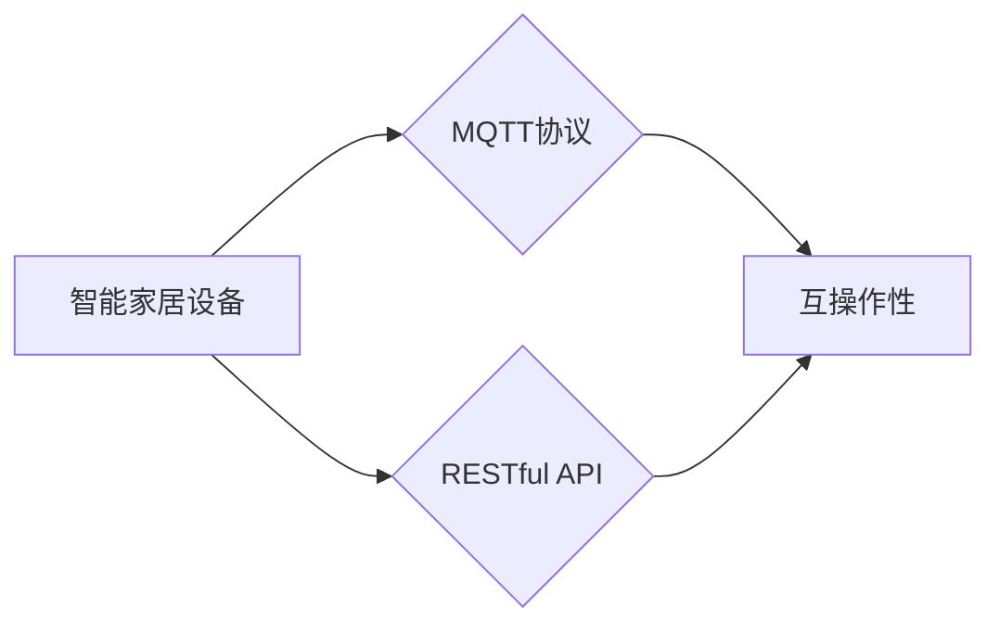
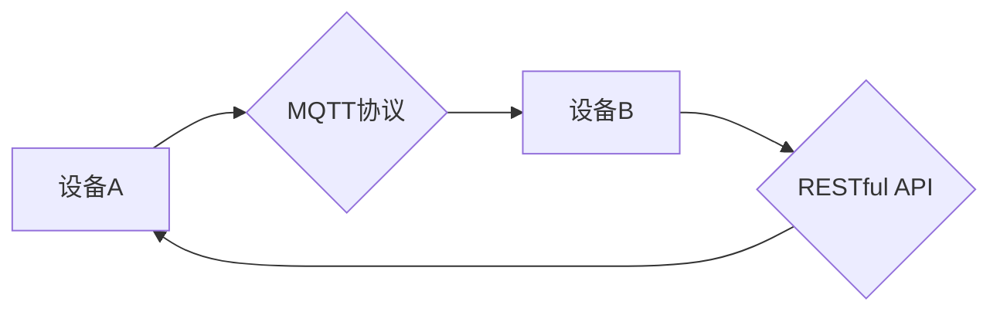

# 基于MQTT协议和RESTful API的智能家居设备互操作性研究

作者：禅与计算机程序设计艺术 / Zen and the Art of Computer Programming

## 1. 背景介绍
### 1.1 问题的由来

随着物联网(IoT)技术的快速发展，智能家居设备逐渐渗透到人们生活的方方面面。然而，不同品牌和厂商的智能家居设备之间互操作性差，导致用户在使用过程中面临诸多不便。如何实现智能家居设备的互操作性，成为当前物联网领域亟待解决的问题。

### 1.2 研究现状

目前，已有多种协议和技术被用于智能家居设备的互操作性研究，主要包括MQTT协议和RESTful API。MQTT协议是一种轻量级的消息队列传输协议，适用于低功耗、低带宽、不可靠的连接环境。RESTful API则是一种基于HTTP协议的应用程序接口设计风格，易于扩展和实现。

### 1.3 研究意义

研究基于MQTT协议和RESTful API的智能家居设备互操作性，对于以下方面具有重要意义：

1. 提高用户使用体验。实现智能家居设备的互操作性，可以方便用户进行设备管理、场景设置和自动化控制，提升用户体验。

2. 促进智能家居生态发展。互操作性可以降低智能家居系统开发门槛，吸引更多厂商和开发者参与，推动智能家居生态的繁荣。

3. 降低智能家居系统成本。通过互操作性，用户可以自由选择不同品牌和厂商的设备，降低系统整体成本。

### 1.4 本文结构

本文将围绕基于MQTT协议和RESTful API的智能家居设备互操作性展开研究。文章结构如下：

- 第2部分：介绍智能家居设备互操作性的核心概念和关键技术。
- 第3部分：分析MQTT协议和RESTful API的原理和优势。
- 第4部分：探讨MQTT协议和RESTful API在智能家居设备互操作性中的应用。
- 第5部分：介绍智能家居设备互操作性项目实践。
- 第6部分：分析智能家居设备互操作性的未来发展趋势与挑战。
- 第7部分：总结全文，展望智能家居设备互操作性的未来。

## 2. 核心概念与联系

### 2.1 智能家居设备互操作性

智能家居设备互操作性是指不同品牌和厂商的智能家居设备之间能够相互识别、通信和协同工作的能力。具体而言，它包括以下几个方面：

1. 设备识别：设备之间能够识别对方的存在，了解对方的能力和状态。
2. 通信协议：设备之间使用相同的通信协议进行数据传输。
3. 控制交互：设备之间能够根据需求进行控制交互，实现协同工作。

### 2.2 MQTT协议

MQTT（Message Queuing Telemetry Transport）是一种轻量级的消息队列传输协议，适用于低功耗、低带宽、不可靠的连接环境。其核心特点如下：

1. 发布/订阅模式：设备发布消息到主题，其他设备订阅相关主题，接收消息。
2. 质量服务等级(QoS)：支持三个质量服务等级，确保消息传输的可靠性。
3. 轻量级协议：协议结构简单，传输开销小，适用于低带宽环境。

### 2.3 RESTful API

RESTful API是一种基于HTTP协议的应用程序接口设计风格，具有以下特点：

1. 无状态：客户端与服务器之间无状态信息交互，便于分布式部署。
2. 资源导向：所有操作针对资源进行，便于扩展和实现。
3. 状态码反馈：服务器通过HTTP状态码返回操作结果，便于客户端处理。

### 2.4 关系图

以下为MQTT协议、RESTful API和智能家居设备互操作性的关系图：



## 3. 核心算法原理 & 具体操作步骤
### 3.1 算法原理概述

基于MQTT协议和RESTful API的智能家居设备互操作性，主要依赖于以下原理：

1. MQTT协议：通过发布/订阅模式实现设备之间的消息传递。
2. RESTful API：通过HTTP请求实现设备之间的控制交互。

### 3.2 算法步骤详解

基于MQTT协议和RESTful API的智能家居设备互操作性实现步骤如下：

1. 设备注册：设备启动后，向服务器注册自身信息，包括设备ID、设备类型、支持的协议和接口等。
2. 设备发现：客户端通过设备发现功能，查询并获取可用的设备信息。
3. 设备通信：客户端与设备之间通过MQTT协议或RESTful API进行通信，实现数据交换和交互。
4. 设备控制：客户端向设备发送控制指令，设备根据指令进行相应操作。

### 3.3 算法优缺点

基于MQTT协议和RESTful API的智能家居设备互操作性具有以下优点：

1. 灵活高效：支持多种通信协议，适用于不同场景。
2. 易于实现：基于HTTP协议，易于开发和使用。
3. 可扩展性强：可支持多种设备类型和接口。

然而，该方案也存在以下缺点：

1. 安全性：HTTP协议本身不安全，容易受到攻击。
2. 性能开销：HTTP请求和响应需要经过网络传输，可能存在延迟。
3. 状态管理：RESTful API需要维护客户端状态，增加系统复杂度。

## 4. 数学模型和公式 & 详细讲解 & 举例说明
### 4.1 数学模型构建

智能家居设备互操作性数学模型可以抽象为以下形式：



### 4.2 公式推导过程

该数学模型主要依赖于MQTT协议和RESTful API的通信机制。具体推导过程如下：

1. 设备A发布消息到主题，设备B订阅该主题。
2. 设备A将消息通过MQTT协议发送给设备B。
3. 设备B通过MQTT协议接收消息，并通过RESTful API与设备A进行交互。
4. 设备A和设备B通过RESTful API进行控制交互。

### 4.3 案例分析与讲解

以下以智能门锁为例，分析MQTT协议和RESTful API在智能家居设备互操作性中的应用：

1. 设备A：智能门锁，支持MQTT协议和RESTful API。
2. 设备B：手机APP，支持RESTful API。
3. 设备C：云服务器，作为消息传输和设备管理的中心。

步骤如下：

1. 用户通过手机APP发送开锁指令，APP将指令封装成JSON格式，通过RESTful API发送到云服务器。
2. 云服务器将开锁指令通过MQTT协议发送给智能门锁。
3. 智能门锁接收到开锁指令后，执行开锁操作，并通过MQTT协议将开锁状态发送回云服务器。
4. 云服务器将开锁状态通过RESTful API发送回手机APP，APP显示开锁成功。

### 4.4 常见问题解答

**Q1：MQTT协议和HTTP协议的区别是什么？**

A：MQTT协议和HTTP协议都是用于数据传输的协议，但它们在应用场景、传输效率、安全性等方面存在差异。MQTT协议适用于低功耗、低带宽、不可靠的连接环境，而HTTP协议适用于高带宽、可靠性要求较高的应用场景。

**Q2：如何保证MQTT协议的安全性？**

A：为了保证MQTT协议的安全性，可以采用以下措施：
1. 使用TLS/SSL加密通信。
2. 对客户端进行身份验证和授权。
3. 限制客户端的访问权限。

**Q3：RESTful API的安全性问题如何解决？**

A：为了保证RESTful API的安全性，可以采用以下措施：
1. 使用HTTPS协议加密通信。
2. 对用户进行身份验证和授权。
3. 限制用户访问资源的权限。

## 5. 项目实践：代码实例和详细解释说明
### 5.1 开发环境搭建

以下是使用Python和Node.js开发智能家居设备互操作性的开发环境搭建步骤：

1. 安装Python：
```bash
sudo apt-get install python3
```

2. 安装Node.js：
```bash
sudo apt-get install nodejs
```

3. 安装Docker：
```bash
sudo apt-get install docker
```

4. 创建Dockerfile：
```Dockerfile
FROM python:3.7
RUN pip install flask mqtt
```

5. 编写Python代码，实现MQTT客户端功能。

6. 编写Node.js代码，实现RESTful API服务。

7. 构建Docker镜像：
```bash
docker build -t myapp .
```

8. 运行Docker容器：
```bash
docker run -d -p 5000:5000 myapp
```

### 5.2 源代码详细实现

以下为Python代码实现MQTT客户端功能的示例：

```python
import paho.mqtt.client as mqtt

# MQTT服务器地址
MQTT_HOST = 'localhost'
# MQTT服务器端口
MQTT_PORT = 1883
# MQTT客户端ID
MQTT_CLIENT_ID = 'client1'

# MQTT主题
MQTT_TOPIC = 'home/lock/open'

# MQTT服务器连接函数
def on_connect(client, userdata, flags, rc):
    if rc == 0:
        print("Connected to MQTT broker!")
    else:
        print("Failed to connect, return code %d\
", rc)

# MQTT发布消息函数
def on_publish(client, userdata, mid):
    print("Message published, mid: %s", mid)

# 初始化MQTT客户端
client = mqtt.Client(MQTT_CLIENT_ID)
client.on_connect = on_connect
client.on_publish = on_publish

# 连接MQTT服务器
client.connect(MQTT_HOST, MQTT_PORT, 60)

# 发布开锁指令
client.publish(MQTT_TOPIC, 'open', qos=1)

# 保持连接
client.loop_forever()
```

以下为Node.js代码实现RESTful API服务的示例：

```javascript
const express = require('express')
const bodyParser = require('body-parser')

const app = express()
app.use(bodyParser.json())

// 开锁接口
app.post('/lock/open', (req, res) => {
  // 发送开锁指令到MQTT服务器
  mqttClient.publish('home/lock/open', 'open', { qos: 1 })
  res.send('Lock is opening...')
})

const mqtt = require('mqtt')
const mqttClient = mqtt.connect('mqtt://localhost')

app.listen(5000, () => {
  console.log('Server is running on http://localhost:5000')
})
```

### 5.3 代码解读与分析

Python代码中，首先引入了paho.mqtt.client模块，用于创建MQTT客户端。然后定义了MQTT服务器地址、端口、客户端ID和主题。在连接函数中，根据连接成功或失败进行相应的处理。发布函数中，当消息发布成功时，输出消息ID。

Node.js代码中，首先引入了express和body-parser模块，用于创建HTTP服务器和解析JSON请求体。然后定义了开锁接口，将开锁指令发送到MQTT服务器。最后，创建MQTT客户端，启动HTTP服务器。

### 5.4 运行结果展示

运行Python代码，启动MQTT客户端。然后运行Node.js代码，启动RESTful API服务器。

当用户通过手机APP发送开锁指令时，APP将指令通过RESTful API发送到服务器，服务器将指令发送到MQTT服务器。MQTT服务器将开锁指令发送给智能门锁，智能门锁执行开锁操作，并通过MQTT服务器将开锁状态发送回服务器。服务器再将开锁状态发送回手机APP。

## 6. 实际应用场景
### 6.1 智能家居场景

基于MQTT协议和RESTful API的智能家居设备互操作性，可以应用于以下场景：

1. 智能照明：通过控制灯光设备的开关、亮度、色温等，实现场景灯光。
2. 智能安防：通过监控设备、门锁等，实现入侵报警、门禁管理等功能。
3. 智能家电：通过控制家电设备，实现远程控制、定时开关等功能。
4. 智能环境：通过传感器设备，实现温湿度控制、空气质量监测等功能。

### 6.2 物联网平台

基于MQTT协议和RESTful API的智能家居设备互操作性，可以构建物联网平台，实现以下功能：

1. 设备管理：对设备进行注册、发现、配置和管理。
2. 数据采集：采集设备运行数据，进行存储、分析和可视化。
3. 事件驱动：根据设备事件，实现自动化控制和智能决策。
4. 服务集成：将第三方服务集成到平台中，提供更多功能。

### 6.3 物联网应用

基于MQTT协议和RESTful API的智能家居设备互操作性，可以应用于以下物联网应用：

1. 智能社区：实现小区安防、门禁、停车等管理。
2. 智能工厂：实现设备监控、生产调度、设备维护等功能。
3. 智能农业：实现农田环境监测、灌溉控制、农作物生长监测等功能。
4. 智能医疗：实现远程医疗、智能诊断、药物管理等功能。

## 7. 工具和资源推荐
### 7.1 学习资源推荐

1. 《MQTT协议详解》：全面介绍MQTT协议的原理、应用场景和编程实践。
2. 《RESTful API设计规范》：介绍RESTful API的设计原则、最佳实践和工具。
3. 《物联网技术与应用》：介绍物联网的基本概念、技术体系、应用场景和发展趋势。
4. 《Python编程：从入门到实践》：Python编程语言入门教程。
5. 《Node.js实战》：Node.js编程实践教程。

### 7.2 开发工具推荐

1. MQTT服务器：EMQX、Mosquitto等。
2. HTTP服务器：Node.js、Flask等。
3. MQTT客户端：Paho MQTT、MQTT.js等。
4. RESTful API开发框架：Express.js、Flask等。
5. 数据可视化工具：D3.js、ECharts等。

### 7.3 相关论文推荐

1. MQTT: A Protocol for_SENSOR NETWORKS，MQTT协议原论文。
2. RESTful API设计指南，RESTful API设计规范。
3. MQTT协议在智能家居系统中的应用，MQTT协议在智能家居中的应用案例。
4. RESTful API在智能家居系统中的应用，RESTful API在智能家居中的应用案例。
5. 智能家居系统互操作性与标准化，智能家居设备互操作性与标准化研究。

### 7.4 其他资源推荐

1. MQTT官网：https://mosquitto.org/
2. MQTT社区：https://mosquitto.org/community/
3. RESTful API设计指南：https://restfulapi.net/
4. Node.js官网：https://nodejs.org/
5. Python官网：https://www.python.org/

## 8. 总结：未来发展趋势与挑战
### 8.1 研究成果总结

本文对基于MQTT协议和RESTful API的智能家居设备互操作性进行了深入研究。通过对核心概念、关键技术、应用场景等方面的分析，本文揭示了该技术在智能家居、物联网等领域的重要价值。同时，本文还针对MQTT协议、RESTful API等关键技术进行了详细讲解，并给出了实际项目实践案例。

### 8.2 未来发展趋势

基于MQTT协议和RESTful API的智能家居设备互操作性在未来将呈现以下发展趋势：

1. 标准化：智能家居设备互操作性标准将进一步统一，推动智能家居生态的健康发展。
2. 个性化：智能家居系统将更加注重用户体验，提供个性化定制服务。
3. 智能化：智能家居设备将具备更强的智能化能力，实现更加便捷的交互方式。
4. 安全化：智能家居系统将更加注重安全性，保障用户隐私和数据安全。

### 8.3 面临的挑战

尽管基于MQTT协议和RESTful API的智能家居设备互操作性具有诸多优势，但在实际应用中仍面临以下挑战：

1. 标准化：智能家居设备互操作性标准尚未统一，导致不同设备之间的兼容性差。
2. 安全性：智能家居系统存在安全隐患，需要加强安全防护措施。
3. 用户体验：智能家居系统用户体验仍有待提升，需要更加人性化的设计。
4. 数据隐私：智能家居系统涉及用户隐私数据，需要加强数据保护措施。

### 8.4 研究展望

为了应对上述挑战，未来研究可以从以下几个方面展开：

1. 完善智能家居设备互操作性标准，推动智能家居生态健康发展。
2. 加强智能家居系统安全防护，保障用户隐私和数据安全。
3. 提升智能家居系统用户体验，实现更加便捷的交互方式。
4. 探索智能家居设备之间的协同工作模式，实现更加智能化的家居生活。

相信随着技术的不断发展和创新，基于MQTT协议和RESTful API的智能家居设备互操作性将在未来发挥更加重要的作用，为人们创造更加便捷、舒适、安全的智能生活。