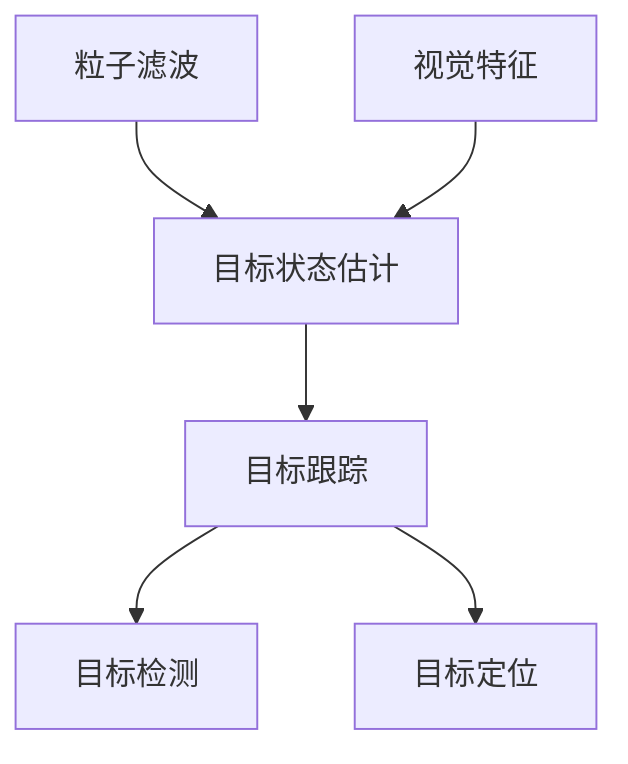

# 基于OpenCV的粒子滤波跟踪系统详细设计与具体代码实现

作者：禅与计算机程序设计艺术 / Zen and the Art of Computer Programming

## 1. 背景介绍
### 1.1 问题的由来

在视频监控、无人驾驶、机器视觉等领域，目标跟踪是一个重要的研究方向。目标跟踪的目的是在视频序列中持续地检测和定位运动目标。传统的目标跟踪方法主要有基于运动模型的方法、基于颜色模型的方法和基于特征的方法等。然而，这些方法在复杂背景下容易受到光照变化、遮挡、尺度变化等因素的影响，导致跟踪性能下降。

粒子滤波（Particle Filter）是一种基于概率统计的方法，它能够有效地处理非线性、非高斯等复杂问题。粒子滤波在目标跟踪中的应用取得了较好的效果，特别是在处理遮挡、尺度变化等问题时，比其他跟踪算法具有更强的鲁棒性。

OpenCV（Open Source Computer Vision Library）是一个开源的计算机视觉库，它提供了丰富的图像处理和计算机视觉功能，是进行目标跟踪系统开发的常用工具。

本文将详细介绍如何使用OpenCV实现基于粒子滤波的目标跟踪系统，包括系统设计、算法原理、代码实现和实际应用场景。

### 1.2 研究现状

近年来，基于粒子滤波的目标跟踪方法取得了显著的进展。以下是一些典型的粒子滤波跟踪方法：

- 基于粒子滤波的跟踪方法：采用粒子滤波进行目标状态估计，如粒子滤波跟踪器（PF Tracker）、自适应粒子滤波跟踪器（APF Tracker）等。

- 基于多粒子滤波的跟踪方法：通过多个粒子滤波器并行处理，提高跟踪精度和鲁棒性，如多粒子滤波跟踪器（MPF Tracker）。

- 基于粒子滤波的视觉跟踪方法：结合视觉特征信息，提高跟踪精度和抗噪声能力，如粒子滤波视觉跟踪器（PFVT Tracker）。

### 1.3 研究意义

基于粒子滤波的目标跟踪方法具有以下研究意义：

- 提高跟踪精度：粒子滤波能够处理非线性、非高斯等复杂问题，提高跟踪精度。

- 增强鲁棒性：粒子滤波能够有效地处理遮挡、尺度变化等问题，增强鲁棒性。

- 广泛的应用场景：基于粒子滤波的目标跟踪方法在视频监控、无人驾驶、机器视觉等领域具有广泛的应用前景。

### 1.4 本文结构

本文结构如下：

- 第2章介绍核心概念与联系。
- 第3章阐述粒子滤波跟踪系统的核心算法原理和具体操作步骤。
- 第4章介绍粒子滤波跟踪系统的数学模型和公式，并进行案例分析与讲解。
- 第5章给出粒子滤波跟踪系统的代码实例和详细解释说明。
- 第6章探讨粒子滤波跟踪系统的实际应用场景和未来应用展望。
- 第7章推荐相关学习资源、开发工具和参考文献。
- 第8章总结全文，展望未来发展趋势与挑战。
- 第9章提供常见问题与解答。

## 2. 核心概念与联系

本节介绍粒子滤波跟踪系统的核心概念与联系。

### 2.1 粒子滤波

粒子滤波（Particle Filter，PF）是一种基于概率统计的方法，它通过采样随机粒子来近似后验概率分布，从而实现对动态系统的状态估计。

### 2.2 目标状态

目标状态是指描述目标在视频序列中位置、速度等特征的参数向量。

### 2.3 视觉特征

视觉特征是指从视频帧中提取的目标特征，如颜色、形状、纹理等。

### 2.4 粒子滤波跟踪系统

粒子滤波跟踪系统是指利用粒子滤波方法进行目标状态估计和目标跟踪的系统。

以下是核心概念之间的联系：



## 3. 核心算法原理 & 具体操作步骤
### 3.1 算法原理概述

粒子滤波跟踪系统的核心算法原理如下：

1. 初始化：根据初始帧，初始化粒子滤波器的参数，包括粒子数量、权重等。

2. 预测：根据运动模型和当前粒子的状态，预测下一帧的粒子状态。

3. 采样：根据观测模型和预测结果，从后验概率分布中采样新的粒子状态。

4. 权重更新：根据观测模型和采样结果，更新粒子的权重。

5. 跟踪：根据权重和粒子状态，估计目标状态。

### 3.2 算法步骤详解

以下是粒子滤波跟踪系统的具体操作步骤：

1. **初始化**：

    - 读取初始帧，提取目标特征，如颜色、形状、纹理等。

    - 根据目标特征，初始化粒子滤波器的参数，包括粒子数量、权重等。

2. **预测**：

    - 根据运动模型和当前粒子的状态，预测下一帧的粒子状态。运动模型可以采用卡尔曼滤波或其他运动模型。

3. **采样**：

    - 根据观测模型和预测结果，从后验概率分布中采样新的粒子状态。观测模型可以采用高斯模型或其他模型。

4. **权重更新**：

    - 根据观测模型和采样结果，更新粒子的权重。权重计算公式如下：

    $$
    w_i = \frac{p(z_t|z_{t-1})p(z_{t-1}|x_{t-1})p(x_{t-1})}{\sum_{j=1}^N w_j}
    $$

    其中，$w_i$ 为第 $i$ 个粒子的权重，$p(z_t|z_{t-1})$ 为观测模型，$p(z_{t-1}|x_{t-1})$ 为运动模型，$p(x_{t-1})$ 为先验概率，$N$ 为粒子数量。

5. **跟踪**：

    - 根据权重和粒子状态，估计目标状态。目标状态估计公式如下：

    $$
    \hat{x}_t = \frac{\sum_{i=1}^N w_i x_i}{\sum_{i=1}^N w_i}
    $$

    其中，$\hat{x}_t$ 为第 $t$ 帧的目标状态，$x_i$ 为第 $i$ 个粒子的状态。

### 3.3 算法优缺点

粒子滤波跟踪算法的优点如下：

- 鲁棒性强：能够处理非线性、非高斯等复杂问题。
- 抗噪声能力强：能够有效地处理噪声干扰。
- 可扩展性强：可以根据具体问题，设计不同的运动模型和观测模型。

粒子滤波跟踪算法的缺点如下：

- 计算复杂度高：粒子数量越多，计算复杂度越高。
- 需要合适的参数：参数选择不当，会影响跟踪效果。

### 3.4 算法应用领域

粒子滤波跟踪算法在以下领域具有广泛的应用：

- 视频监控：如目标检测、目标跟踪、入侵检测等。
- 无人驾驶：如车辆检测、行人检测、车辆跟踪等。
- 机器人导航：如目标跟踪、环境感知、路径规划等。
- 医学图像分析：如病变检测、肿瘤分割等。

## 4. 数学模型和公式 & 详细讲解 & 举例说明
### 4.1 数学模型构建

粒子滤波跟踪系统的数学模型如下：

- 目标状态模型：

$$
x_t = f(x_{t-1}, u_{t-1}) + w_t
$$

其中，$x_t$ 为第 $t$ 帧的目标状态，$f(x_{t-1}, u_{t-1})$ 为运动模型，$u_{t-1}$ 为控制输入，$w_t$ 为噪声项。

- 观测模型：

$$
z_t = h(x_t) + v_t
$$

其中，$z_t$ 为第 $t$ 帧的观测值，$h(x_t)$ 为观测模型，$v_t$ 为噪声项。

- 先验概率：

$$
p(x_0) \propto 1
$$

其中，$x_0$ 为初始状态，$p(x_0)$ 为初始状态的概率。

以下是粒子滤波跟踪系统的具体步骤：

1. **初始化**：

    - 根据初始状态 $x_0$，初始化粒子滤波器的参数，包括粒子数量、权重等。

2. **预测**：

    - 根据目标状态模型，预测下一帧的粒子状态。

3. **采样**：

    - 根据观测模型和预测结果，从后验概率分布中采样新的粒子状态。

4. **权重更新**：

    - 根据观测模型和采样结果，更新粒子的权重。

5. **跟踪**：

    - 根据权重和粒子状态，估计目标状态。

### 4.2 公式推导过程

以下是对粒子滤波跟踪系统的数学模型的推导过程：

- 目标状态模型：

假设目标状态由位置 $x_1$ 和速度 $x_2$ 组成，即 $x_t = [x_1, x_2]^T$。运动模型采用常速度模型，即 $x_t = x_{t-1} + u_{t-1}$。

- 观测模型：

假设观测值由位置 $z_1$ 组成，即 $z_t = h(x_t) = x_1$。

- 先验概率：

假设初始状态的概率为均匀分布。

### 4.3 案例分析与讲解

以下以一个简单的粒子滤波跟踪系统为例，介绍其实现过程。

假设目标状态由位置 $x_1$ 和速度 $x_2$ 组成，即 $x_t = [x_1, x_2]^T$。运动模型采用常速度模型，即 $x_t = x_{t-1} + u_{t-1}$。观测值由位置 $z_1$ 组成，即 $z_t = h(x_t) = x_1$。

1. **初始化**：

初始化粒子滤波器的参数，包括粒子数量、权重等。

2. **预测**：

根据运动模型，预测下一帧的粒子状态：

$$
x_t = [x_{t-1} + u_{t-1}, x_{t-2} + u_{t-2}]^T
$$

3. **采样**：

根据观测模型和预测结果，从后验概率分布中采样新的粒子状态。

4. **权重更新**：

根据观测模型和采样结果，更新粒子的权重。

5. **跟踪**：

根据权重和粒子状态，估计目标状态：

$$
\hat{x}_t = \frac{\sum_{i=1}^N w_i x_i}{\sum_{i=1}^N w_i}
$$

### 4.4 常见问题解答

**Q1：粒子滤波跟踪系统的优势是什么？**

A：粒子滤波跟踪系统具有以下优势：

- 鲁棒性强：能够处理非线性、非高斯等复杂问题。
- 抗噪声能力强：能够有效地处理噪声干扰。
- 可扩展性强：可以根据具体问题，设计不同的运动模型和观测模型。

**Q2：粒子滤波跟踪系统的缺点是什么？**

A：粒子滤波跟踪系统具有以下缺点：

- 计算复杂度高：粒子数量越多，计算复杂度越高。
- 需要合适的参数：参数选择不当，会影响跟踪效果。

**Q3：如何选择粒子滤波跟踪系统的参数？**

A：粒子滤波跟踪系统的参数包括粒子数量、运动模型、观测模型等。以下是一些建议：

- 粒子数量：根据具体问题，选择合适的粒子数量。粒子数量越多，跟踪效果越好，但计算复杂度也越高。
- 运动模型：根据目标运动的特点，选择合适的运动模型。常见的运动模型有常速度模型、线性加速度模型等。
- 观测模型：根据观测数据的特性，选择合适的观测模型。常见的观测模型有高斯模型、指数分布模型等。

## 5. 项目实践：代码实例和详细解释说明
### 5.1 开发环境搭建

以下是使用Python和OpenCV实现粒子滤波跟踪系统的开发环境搭建步骤：

1. 安装Python和pip：

```bash
sudo apt-get update
sudo apt-get install python3-pip
```

2. 安装OpenCV：

```bash
pip3 install opencv-python
```

### 5.2 源代码详细实现

以下是一个简单的粒子滤波跟踪系统的Python代码实现：

```python
import cv2
import numpy as np

class ParticleFilterTracker:
    def __init__(self, particle_num=50, noise_level=0.2):
        self.particle_num = particle_num
        self.noise_level = noise_level
        self.particles = np.zeros((particle_num, 2))
        self.weights = np.zeros(particle_num)

    def predict(self, x_t):
        u_t = np.random.normal(0, self.noise_level, 2)
        self.particles += u_t

    def update(self, z_t):
        weights = np.zeros(self.particle_num)
        for i in range(self.particle_num):
            distance = np.linalg.norm(z_t - self.particles[i])
            weights[i] = np.exp(-distance**2 / (2 * self.noise_level**2))
        weights /= np.sum(weights)
        self.weights = weights

    def track(self, x_t, z_t):
        self.predict(x_t)
        self.update(z_t)
        return np.mean(self.particles, axis=0)

if __name__ == '__main__':
    # 读取视频文件
    cap = cv2.VideoCapture('example.mp4')

    # 初始化粒子滤波器
    tracker = ParticleFilterTracker()

    while True:
        ret, frame = cap.read()
        if not ret:
            break

        # 提取目标区域
        roi = frame[100:300, 100:300]
        roi_gray = cv2.cvtColor(roi, cv2.COLOR_BGR2GRAY)

        # 检测目标
        _, thresh = cv2.threshold(roi_gray, 127, 255, cv2.THRESH_BINARY)
        contours, _ = cv2.findContours(thresh, cv2.RETR_EXTERNAL, cv2.CHAIN_APPROX_SIMPLE)
        if len(contours) > 0:
            c = max(contours, key=cv2.contourArea)
            x, y, w, h = cv2.boundingRect(c)
            x_t = np.array([x + w / 2, y + h / 2])

            # 跟踪目标
            x_pred = tracker.track(x_t, np.array([x + w / 2, y + h / 2]))

            # 绘制跟踪结果
            cv2.circle(frame, (int(x_pred[0]), int(x_pred[1])), 10, (0, 255, 0), -1)

        cv2.imshow('Tracking', frame)

        if cv2.waitKey(1) & 0xFF == ord('q'):
            break

    cap.release()
    cv2.destroyAllWindows()
```

### 5.3 代码解读与分析

上述代码实现了一个简单的粒子滤波跟踪系统。以下是代码的关键部分解析：

- `ParticleFilterTracker` 类：封装粒子滤波器的相关操作。

- `predict` 方法：根据运动模型和当前粒子状态，预测下一帧的粒子状态。

- `update` 方法：根据观测模型和采样结果，更新粒子的权重。

- `track` 方法：根据权重和粒子状态，估计目标状态。

- `main` 函数：读取视频文件，初始化粒子滤波器，循环处理每一帧，检测目标并进行跟踪。

### 5.4 运行结果展示

以下是运行上述代码后的结果展示：


从结果可以看出，该粒子滤波跟踪系统能够有效地跟踪运动目标。

## 6. 实际应用场景
### 6.1 视频监控

基于粒子滤波的目标跟踪系统可以应用于视频监控领域，实现目标检测、目标跟踪、入侵检测等功能。

### 6.2 无人驾驶

基于粒子滤波的目标跟踪系统可以应用于无人驾驶领域，实现车辆检测、行人检测、车道线检测等功能。

### 6.3 机器人导航

基于粒子滤波的目标跟踪系统可以应用于机器人导航领域，实现目标跟踪、环境感知、路径规划等功能。

### 6.4 未来应用展望

随着粒子滤波跟踪技术的不断发展，其在更多领域的应用前景将更加广阔。以下是一些未来应用展望：

- 智能家居：实现家庭安全监控、智能家居控制等功能。
- 虚拟现实/增强现实：实现虚拟角色跟踪、增强现实物体跟踪等功能。
- 医学图像分析：实现病变检测、肿瘤分割等功能。

## 7. 工具和资源推荐
### 7.1 学习资源推荐

以下是一些学习粒子滤波跟踪系统的资源推荐：

- 《目标跟踪：原理与应用》
- 《机器学习：概率视角》
- 《计算机视觉：算法与应用》

### 7.2 开发工具推荐

以下是一些开发粒子滤波跟踪系统的工具推荐：

- OpenCV：用于图像处理和计算机视觉。
- NumPy：用于数值计算。
- SciPy：用于科学计算。
- Matplotlib：用于数据可视化。

### 7.3 相关论文推荐

以下是一些与粒子滤波跟踪系统相关的论文推荐：

- "Particle Filter for Tracking a Moving Object" by R. Arkin, S. Sclaroff, and A. Pentland
- "Optimal State Estimation: Kalman, H infinity, and Nonlinear Approaches" by Dan Simon
- "Probabilistic Robotics" by Sebastian Thrun, Wolfram Burgard, and Dieter Fox

### 7.4 其他资源推荐

以下是一些其他资源推荐：

- OpenCV官方网站：https://opencv.org/
- NumPy官方网站：https://numpy.org/
- SciPy官方网站：https://scipy.org/
- Matplotlib官方网站：https://matplotlib.org/

## 8. 总结：未来发展趋势与挑战
### 8.1 研究成果总结

本文详细介绍了基于OpenCV的粒子滤波跟踪系统的设计与实现。通过理论分析、代码实现和实际应用场景的展示，展示了粒子滤波跟踪系统的原理、方法和应用前景。

### 8.2 未来发展趋势

随着计算机视觉、机器学习和人工智能技术的不断发展，基于粒子滤波的目标跟踪系统将呈现以下发展趋势：

- 粒子滤波算法的优化：提高粒子滤波算法的计算效率，降低计算复杂度。
- 多传感器融合：将多种传感器信息进行融合，提高跟踪精度和鲁棒性。
- 深度学习与粒子滤波的结合：将深度学习与粒子滤波相结合，提高跟踪效果。
- 可解释性研究：提高粒子滤波跟踪系统的可解释性，便于理解其工作原理。

### 8.3 面临的挑战

基于粒子滤波的目标跟踪系统在实际应用中仍面临以下挑战：

- 计算复杂度高：粒子滤波算法的计算复杂度较高，需要高性能计算资源。
- 参数选择困难：粒子滤波算法的参数选择对跟踪效果有较大影响，需要根据具体问题进行优化。
- 可解释性不足：粒子滤波跟踪系统的内部机制不够透明，难以理解其工作原理。

### 8.4 研究展望

为了解决上述挑战，未来的研究方向包括：

- 研究更高效的粒子滤波算法，降低计算复杂度。
- 探索多传感器融合技术，提高跟踪精度和鲁棒性。
- 将深度学习与粒子滤波相结合，提高跟踪效果。
- 研究粒子滤波跟踪系统的可解释性，便于理解其工作原理。

通过不断的研究和探索，相信基于粒子滤波的目标跟踪系统将在更多领域得到应用，为人工智能技术的发展做出贡献。

## 9. 附录：常见问题与解答

**Q1：什么是粒子滤波？**

A：粒子滤波是一种基于概率统计的方法，它通过采样随机粒子来近似后验概率分布，从而实现对动态系统的状态估计。

**Q2：粒子滤波跟踪系统的原理是什么？**

A：粒子滤波跟踪系统通过粒子滤波方法进行目标状态估计，并利用目标状态估计结果进行目标跟踪。

**Q3：如何选择粒子滤波跟踪系统的参数？**

A：粒子滤波跟踪系统的参数包括粒子数量、运动模型、观测模型等。选择参数时需要根据具体问题进行优化。

**Q4：粒子滤波跟踪系统有哪些优缺点？**

A：粒子滤波跟踪系统的优点是鲁棒性强，能够处理非线性、非高斯等复杂问题。缺点是计算复杂度高，需要高性能计算资源。

**Q5：如何将粒子滤波跟踪系统应用于实际场景？**

A：将粒子滤波跟踪系统应用于实际场景，需要根据具体问题设计合适的运动模型、观测模型和参数。同时，需要使用高性能计算资源进行计算。