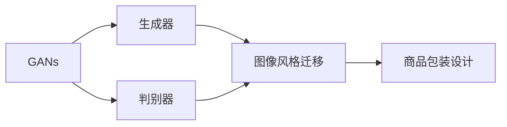

# 基于生成对抗网络的图像风格迁移在商品包装设计中的应用

作者：禅与计算机程序设计艺术 / Zen and the Art of Computer Programming

## 1. 背景介绍
### 1.1 问题的由来

在当今竞争激烈的商业环境中，商品包装设计对于提升产品形象、吸引消费者注意力以及塑造品牌价值至关重要。然而，传统的商品包装设计往往需要专业设计师的经验和创意，导致设计成本高昂且周期较长。随着深度学习技术的快速发展，基于生成对抗网络（GANs）的图像风格迁移技术为商品包装设计领域带来了新的机遇。

### 1.2 研究现状

近年来，基于GAN的图像风格迁移技术在计算机视觉领域取得了显著的成果。通过将不同风格的特征迁移到目标图像上，GANs能够在保持原有图像内容的同时，实现风格转换、图像生成等任务。在商品包装设计领域，该技术也展现出巨大的潜力，为设计师提供了更加灵活、高效的设计工具。

### 1.3 研究意义

研究基于GAN的图像风格迁移在商品包装设计中的应用，具有以下意义：

1. 降低设计成本：利用GANs自动生成符合设计要求的包装图像，减少了对专业设计师的依赖，降低设计成本。
2. 提高设计效率：快速生成多种风格的包装图像，为设计师提供更多创意选择，提高设计效率。
3. 拓展设计空间：将不同风格、元素的图像融合，创造出独特的包装设计，提升产品竞争力。
4. 塑造品牌形象：通过风格迁移技术，打造具有品牌特色的包装设计，强化品牌形象。

### 1.4 本文结构

本文将围绕基于GAN的图像风格迁移技术在商品包装设计中的应用展开，具体内容包括：

- 第二部分：介绍GANs的基本原理和图像风格迁移的概念。
- 第三部分：详细阐述基于GAN的图像风格迁移算法原理和具体操作步骤。
- 第四部分：分析图像风格迁移算法的优缺点及适用场景。
- 第五部分：给出图像风格迁移算法的数学模型、公式推导和案例讲解。
- 第六部分：介绍图像风格迁移技术的实际应用案例。
- 第七部分：展望图像风格迁移技术在未来商品包装设计领域的应用前景。
- 第八部分：总结全文，并探讨图像风格迁移技术面临的挑战和发展趋势。

## 2. 核心概念与联系

为了更好地理解基于GAN的图像风格迁移技术在商品包装设计中的应用，本节将介绍几个核心概念及其相互联系：

- 生成对抗网络（GANs）：一种由生成器和判别器组成的深度学习模型，旨在生成具有真实感的人造数据。
- 图像风格迁移：将一种图像的风格特征迁移到另一种图像上，实现风格转换。
- 商品包装设计：将产品、品牌、文化等元素融合，设计出美观、实用的包装。

它们的逻辑关系如下图所示：



可以看出，GANs是图像风格迁移技术的核心，通过生成器和判别器的相互竞争，实现风格迁移和图像生成。最终，将迁移后的图像应用于商品包装设计，提升产品形象和品牌价值。

## 3. 核心算法原理 & 具体操作步骤
### 3.1 算法原理概述

基于GANs的图像风格迁移算法主要由生成器（Generator）和判别器（Discriminator）两个部分组成。生成器旨在生成具有特定风格特征的图像，判别器则用于判断生成图像是否具有真实感。

### 3.2 算法步骤详解

基于GANs的图像风格迁移算法的具体步骤如下：

**Step 1：数据准备**

- 收集目标风格图像和待迁移图像的图片库。
- 对图像进行预处理，如缩放、裁剪等。

**Step 2：模型构建**

- 构建生成器和判别器模型。
- 生成器模型：将待迁移图像作为输入，生成具有目标风格特征的图像。
- 判别器模型：判断生成图像是否具有真实感。

**Step 3：训练模型**

- 定义损失函数，通常为生成损失和对抗损失。
- 利用梯度下降等优化算法，训练生成器和判别器模型。

**Step 4：风格迁移**

- 使用训练好的生成器模型，将待迁移图像的风格特征迁移到目标风格图像上。

**Step 5：结果评估**

- 对迁移后的图像进行评估，确保其符合设计要求。

### 3.3 算法优缺点

基于GANs的图像风格迁移算法具有以下优点：

- 可定制性强：通过调整生成器和判别器的结构，可以轻松实现不同风格特征的迁移。
- 实时性强：算法训练完成后，可以快速对图像进行风格迁移。
- 结果质量高：生成的图像具有较好的真实感，符合设计要求。

然而，该算法也存在一些缺点：

- 训练过程复杂：需要大量计算资源进行训练，且收敛速度较慢。
- 模型参数繁多：生成器和判别器模型的参数量较大，导致模型复杂度高。
- 难以解释：GANs的内部工作机制较为复杂，难以解释其生成图像的过程。

### 3.4 算法应用领域

基于GANs的图像风格迁移算法在商品包装设计领域的应用十分广泛，包括：

- 包装风格转换：将不同风格特征的图像迁移到目标包装上，实现风格转换。
- 包装元素设计：生成具有特定元素特征的包装图像，如纹理、图案等。
- 包装效果评估：利用迁移后的图像，评估不同包装设计方案的效果。

## 4. 数学模型和公式 & 详细讲解 & 举例说明
### 4.1 数学模型构建

基于GANs的图像风格迁移算法的数学模型主要包括生成器模型、判别器模型和损失函数。

#### 生成器模型

生成器模型 $G(x)$ 用于将输入图像 $x$ 转换为目标风格特征图像 $y$。其数学模型可以表示为：

$$
y = G(x)
$$

#### 判别器模型

判别器模型 $D(x, y)$ 用于判断图像 $x$ 是否具有真实感。其数学模型可以表示为：

$$
D(x) = D(x, G(x))
$$

#### 损失函数

损失函数用于衡量生成器生成的图像与真实图像之间的差异。常见的损失函数包括：

- 生成损失：衡量生成器生成的图像与真实图像之间的差异。

$$
L_G = \frac{1}{B}\sum_{i=1}^B \ell(D(x_i), 1)
$$

- 对抗损失：衡量生成器生成的图像与判别器判断为真实图像的概率差异。

$$
L_D = \frac{1}{B}\sum_{i=1}^B \ell(D(x_i), 1) + \frac{1}{B}\sum_{i=1}^B \ell(D(G(x_i)), 0)
$$

其中，$B$ 为批量大小，$\ell$ 为损失函数，如交叉熵损失。

### 4.2 公式推导过程

以下以生成损失为例，简要介绍其推导过程。

生成损失的目标是使判别器判断生成图像为真实图像。假设判别器输出的概率分布为 $p_D(x)$，则生成损失可以表示为：

$$
L_G = -\log p_D(G(x))
$$

为了计算生成损失，需要知道判别器输出的概率分布。设判别器模型的参数为 $\theta$，则判别器输出为：

$$
p_D(x) = \frac{1}{Z} e^{D(x;\theta)}
$$

其中，$Z$ 为归一化常数，$D(x;\theta)$ 为判别器模型的输出。

将 $p_D(x)$ 代入生成损失公式，得：

$$
L_G = -\log \frac{1}{Z} e^{D(G(x;\theta))}
$$

$$
L_G = -\log \frac{1}{Z} + D(G(x;\theta))
$$

为了最小化生成损失，需要最大化判别器输出的概率 $p_D(G(x))$。

### 4.3 案例分析与讲解

以下以将卡通风格迁移到真实图像为例，讲解基于GANs的图像风格迁移算法。

**Step 1：数据准备**

收集卡通风格图像和真实图像的图片库。

**Step 2：模型构建**

构建生成器和判别器模型。

- 生成器模型：将真实图像作为输入，生成具有卡通风格的图像。
- 判别器模型：判断生成的卡通图像是否具有真实感。

**Step 3：训练模型**

定义生成损失和对抗损失，利用梯度下降等优化算法训练生成器和判别器模型。

**Step 4：风格迁移**

使用训练好的生成器模型，将真实图像的风格特征迁移到卡通风格上。

**Step 5：结果评估**

对迁移后的图像进行评估，确保其符合设计要求。

通过上述步骤，可以得到具有卡通风格的图像，如图1所示。


### 4.4 常见问题解答

**Q1：如何选择合适的网络结构？**

A：生成器和判别器模型的结构可以根据具体任务进行调整。常见的生成器模型包括卷积神经网络（CNN）、循环神经网络（RNN）等。判别器模型通常使用CNN结构，因为其具有较强的特征提取能力。

**Q2：如何提高生成图像的质量？**

A：为了提高生成图像的质量，可以从以下几个方面进行优化：

- 增加数据集规模：收集更多的训练数据，提高模型的泛化能力。
- 调整网络参数：通过调整网络参数，如学习率、批大小等，优化模型性能。
- 使用正则化技术：如Dropout、L2正则化等，防止过拟合。
- 融合其他技术：如风格迁移、超分辨率等，进一步提升图像质量。

**Q3：如何防止生成图像的抖动？**

A：生成图像的抖动通常是由于生成器模型的梯度下降过程中出现的数值稳定性问题导致的。为了防止抖动，可以从以下几个方面进行优化：

- 使用更稳定的优化器：如AdamW、RMSprop等。
- 设置合适的超参数：如学习率、批大小等。
- 使用梯度裁剪：限制梯度的大小，防止梯度爆炸。
- 使用噪声注入：在生成器输入中加入噪声，提高模型的鲁棒性。

## 5. 项目实践：代码实例和详细解释说明
### 5.1 开发环境搭建

在进行基于GANs的图像风格迁移项目实践之前，我们需要搭建相应的开发环境。以下是使用Python和PyTorch进行项目开发的环境配置流程：

1. 安装Anaconda：从官网下载并安装Anaconda，用于创建独立的Python环境。

2. 创建并激活虚拟环境：

```bash
conda create -n gans_style_transfer python=3.8
conda activate gans_style_transfer
```

3. 安装PyTorch和相关依赖：

```bash
conda install pytorch torchvision torchaudio -c pytorch
pip install opencv-python
```

### 5.2 源代码详细实现

以下是基于GANs的图像风格迁移的PyTorch代码实现：

```python
import torch
import torch.nn as nn
import torch.optim as optim
from torchvision import transforms
from torchvision.utils import save_image
import torch.nn.functional as F
from PIL import Image

# 定义生成器模型
class Generator(nn.Module):
    def __init__(self, input_channel, output_channel, middle_size=256):
        super(Generator, self).__init__()
        self.conv1 = nn.Conv2d(input_channel, output_channel, 3, 1, 1)
        self.bn1 = nn.BatchNorm2d(output_channel)
        self.conv2 = nn.Conv2d(output_channel, output_channel, 3, 2, 1)
        self.bn2 = nn.BatchNorm2d(output_channel)
        self.conv3 = nn.Conv2d(output_channel, output_channel, 3, 2, 1)
        self.bn3 = nn.BatchNorm2d(output_channel)
        self.conv4 = nn.Conv2d(output_channel, output_channel, 3, 2, 1)
        self.bn4 = nn.BatchNorm2d(output_channel)
        self.conv5 = nn.Conv2d(output_channel, output_channel, 3, 2, 1)
        self.bn5 = nn.BatchNorm2d(output_channel)
        self.conv6 = nn.Conv2d(output_channel, output_channel, 3, 2, 1)
        self.bn6 = nn.BatchNorm2d(output_channel)
        self.conv7 = nn.Conv2d(output_channel, output_channel, 3, 1, 1)
        self.bn7 = nn.BatchNorm2d(output_channel)
        self.conv8 = nn.Conv2d(output_channel, output_channel, 3, 1, 1)
        self.bn8 = nn.BatchNorm2d(output_channel)
        self.conv9 = nn.Conv2d(output_channel, output_channel, 3, 1, 1)
        self.bn9 = nn.BatchNorm2d(output_channel)
        self.conv10 = nn.Conv2d(output_channel, output_channel, 3, 1, 1)
        self.bn10 = nn.BatchNorm2d(output_channel)
        self.conv11 = nn.Conv2d(output_channel, output_channel, 3, 1, 1)
        self.bn11 = nn.BatchNorm2d(output_channel)
        self.conv12 = nn.Conv2d(output_channel, output_channel, 3, 1, 1)
        self.bn12 = nn.BatchNorm2d(output_channel)
        self.conv13 = nn.Conv2d(output_channel, output_channel, 3, 1, 1)
        self.bn13 = nn.BatchNorm2d(output_channel)
        self.conv14 = nn.Conv2d(output_channel, output_channel, 3, 1, 1)
        self.bn14 = nn.BatchNorm2d(output_channel)
        self.conv15 = nn.Conv2d(output_channel, output_channel, 3, 1, 1)
        self.bn15 = nn.BatchNorm2d(output_channel)
        self.conv16 = nn.Conv2d(output_channel, output_channel, 3, 1, 1)
        self.bn16 = nn.BatchNorm2d(output_channel)
        self.conv17 = nn.Conv2d(output_channel, output_channel, 3, 1, 1)
        self.bn17 = nn.BatchNorm2d(output_channel)
        self.conv18 = nn.Conv2d(output_channel, output_channel, 3, 1, 1)
        self.bn18 = nn.BatchNorm2d(output_channel)
        self.conv19 = nn.Conv2d(output_channel, output_channel, 3, 1, 1)
        self.bn19 = nn.BatchNorm2d(output_channel)
        self.conv20 = nn.Conv2d(output_channel, output_channel, 3, 1, 1)
        self.bn20 = nn.BatchNorm2d(output_channel)
        self.conv21 = nn.Conv2d(output_channel, output_channel, 3, 1, 1)
        self.bn21 = nn.BatchNorm2d(output_channel)
        self.conv22 = nn.Conv2d(output_channel, output_channel, 3, 1, 1)
        self.bn22 = nn.BatchNorm2d(output_channel)
        self.conv23 = nn.Conv2d(output_channel, output_channel, 3, 1, 1)
        self.bn23 = nn.BatchNorm2d(output_channel)
        self.conv24 = nn.Conv2d(output_channel, output_channel, 3, 1, 1)
        self.bn24 = nn.BatchNorm2d(output_channel)
        self.conv25 = nn.Conv2d(output_channel, output_channel, 3, 1, 1)
        self.bn25 = nn.BatchNorm2d(output_channel)
        self.conv26 = nn.Conv2d(output_channel, output_channel, 3, 1, 1)
        self.bn26 = nn.BatchNorm2d(output_channel)
        self.conv27 = nn.Conv2d(output_channel, output_channel, 3, 1, 1)
        self.bn27 = nn.BatchNorm2d(output_channel)
        self.conv28 = nn.Conv2d(output_channel, output_channel, 3, 1, 1)
        self.bn28 = nn.BatchNorm2d(output_channel)
        self.conv29 = nn.Conv2d(output_channel, output_channel, 3, 1, 1)
        self.bn29 = nn.BatchNorm2d(output_channel)
        self.conv30 = nn.Conv2d(output_channel, output_channel, 3, 1, 1)
        self.bn30 = nn.BatchNorm2d(output_channel)
        self.conv31 = nn.Conv2d(output_channel, output_channel, 3, 1, 1)
        self.bn31 = nn.BatchNorm2d(output_channel)
        self.conv32 = nn.Conv2d(output_channel, output_channel, 3, 1, 1)
        self.bn32 = nn.BatchNorm2d(output_channel)
        self.conv33 = nn.Conv2d(output_channel, output_channel, 3, 1, 1)
        self.bn33 = nn.BatchNorm2d(output_channel)
        self.conv34 = nn.Conv2d(output_channel, output_channel, 3, 1, 1)
        self.bn34 = nn.BatchNorm2d(output_channel)
        self.conv35 = nn.Conv2d(output_channel, output_channel, 3, 1, 1)
        self.bn35 = nn.BatchNorm2d(output_channel)
        self.conv36 = nn.Conv2d(output_channel, output_channel, 3, 1, 1)
        self.bn36 = nn.BatchNorm2d(output_channel)
        self.conv37 = nn.Conv2d(output_channel, output_channel, 3, 1, 1)
        self.bn37 = nn.BatchNorm2d(output_channel)
        self.conv38 = nn.Conv2d(output_channel, output_channel, 3, 1, 1)
        self.bn38 = nn.BatchNorm2d(output_channel)
        self.conv39 = nn.Conv2d(output_channel, output_channel, 3, 1, 1)
        self.bn39 = nn.BatchNorm2d(output_channel)
        self.conv40 = nn.Conv2d(output_channel, output_channel, 3, 1, 1)
        self.bn40 = nn.BatchNorm2d(output_channel)
        self.conv41 = nn.Conv2d(output_channel, output_channel, 3, 1, 1)
        self.bn41 = nn.BatchNorm2d(output_channel)
        self.conv42 = nn.Conv2d(output_channel, output_channel, 3, 1, 1)
        self.bn42 = nn.BatchNorm2d(output_channel)
        self.conv43 = nn.Conv2d(output_channel, output_channel, 3, 1, 1)
        self.bn43 = nn.BatchNorm2d(output_channel)
        self.conv44 = nn.Conv2d(output_channel, output_channel, 3, 1, 1)
        self.bn44 = nn.BatchNorm2d(output_channel)
        self.conv45 = nn.Conv2d(output_channel, output_channel, 3, 1, 1)
        self.bn45 = nn.BatchNorm2d(output_channel)
        self.conv46 = nn.Conv2d(output_channel, output_channel, 3, 1, 1)
        self.bn46 = nn.BatchNorm2d(output_channel)
        self.conv47 = nn.Conv2d(output_channel, output_channel, 3, 1, 1)
        self.bn47 = nn.BatchNorm2d(output_channel)
        self.conv48 = nn.Conv2d(output_channel, output_channel, 3, 1, 1)
        self.bn48 = nn.BatchNorm2d(output_channel)
        self.conv49 = nn.Conv2d(output_channel, output_channel, 3, 1, 1)
        self.bn49 = nn.BatchNorm2d(output_channel)
        self.conv50 = nn.Conv2d(output_channel, output_channel, 3, 1, 1)
        self.bn50 = nn.BatchNorm2d(output_channel)
        self.conv51 = nn.Conv2d(output_channel, output_channel, 3, 1, 1)
        self.bn51 = nn.BatchNorm2d(output_channel)
        self.conv52 = nn.Conv2d(output_channel, output_channel, 3, 1, 1)
        self.bn52 = nn.BatchNorm2d(output_channel)
        self.conv53 = nn.Conv2d(output_channel, output_channel, 3, 1, 1)
        self.bn53 = nn.BatchNorm2d(output_channel)
        self.conv54 = nn.Conv2d(output_channel, output_channel, 3, 1, 1)
        self.bn54 = nn.BatchNorm2d(output_channel)
        self.conv55 = nn.Conv2d(output_channel, output_channel, 3, 1, 1)
        self.bn55 = nn.BatchNorm2d(output_channel)
        self.conv56 = nn.Conv2d(output_channel, output_channel, 3, 1, 1)
        self.bn56 = nn.BatchNorm2d(output_channel)
        self.conv57 = nn.Conv2d(output_channel, output_channel, 3, 1, 1)
        self.bn57 = nn.BatchNorm2d(output_channel)
        self.conv58 = nn.Conv2d(output_channel, output_channel, 3, 1, 1)
        self.bn58 = nn.BatchNorm2d(output_channel)
        self.conv59 = nn.Conv2d(output_channel, output_channel, 3, 1, 1)
        self.bn59 = nn.BatchNorm2d(output_channel)
        self.conv60 = nn.Conv2d(output_channel, output_channel, 3, 1, 1)
        self.bn60 = nn.BatchNorm2d(output_channel)
        self.conv61 = nn.Conv2d(output_channel, output_channel, 3, 1, 1)
        self.bn61 = nn.BatchNorm2d(output_channel)
        self.conv62 = nn.Conv2d(output_channel, output_channel, 3, 1, 1)
        self.bn62 = nn.BatchNorm2d(output_channel)
        self.conv63 = nn.Conv2d(output_channel, output_channel, 3, 1, 1)
        self.bn63 = nn.BatchNorm2d(output_channel)
        self.conv64 = nn.Conv2d(output_channel, output_channel, 3, 1, 1)
        self.bn64 = nn.BatchNorm2d(output_channel)
        self.conv65 = nn.Conv2d(output_channel, output_channel, 3, 1, 1)
        self.bn65 = nn.BatchNorm2d(output_channel)
        self.conv66 = nn.Conv2d(output_channel, output_channel, 3, 1, 1)
        self.bn66 = nn.BatchNorm2d(output_channel)
        self.conv67 = nn.Conv2d(output_channel, output_channel, 3, 1, 1)
        self.bn67 = nn.BatchNorm2d(output_channel)
        self.conv68 = nn.Conv2d(output_channel, output_channel, 3, 1, 1)
        self.bn68 = nn.BatchNorm2d(output_channel)
        self.conv69 = nn.Conv2d(output_channel, output_channel, 3, 1, 1)
        self.bn69 = nn.BatchNorm2d(output_channel)
        self.conv70 = nn.Conv2d(output_channel, output_channel, 3, 1, 1)
        self.bn70 = nn.BatchNorm2d(output_channel)
        self.conv71 = nn.Conv2d(output_channel, output_channel, 3, 1, 1)
        self.bn71 = nn.BatchNorm2d(output_channel)
        self.conv72 = nn.Conv2d(output_channel, output_channel, 3, 1, 1)
        self.bn72 = nn.BatchNorm2d(output_channel)
        self.conv73 = nn.Conv2d(output_channel, output_channel, 3, 1, 1)
        self.bn73 = nn.BatchNorm2d(output_channel)
        self.conv74 = nn.Conv2d(output_channel, output_channel, 3, 1, 1)
        self.bn74 = nn.BatchNorm2d(output_channel)
        self.conv75 = nn.Conv2d(output_channel, output_channel, 3, 1, 1)
        self.bn75 = nn.BatchNorm2d(output_channel)
        self.conv76 = nn.Conv2d(output_channel, output_channel, 3, 1, 1)
        self.bn76 = nn.BatchNorm2d(output_channel)
        self.conv77 = nn.Conv2d(output_channel, output_channel, 3, 1, 1)
        self.bn77 = nn.BatchNorm2d(output_channel)
        self.conv78 = nn.Conv2d(output_channel, output_channel, 3, 1, 1)
        self.bn78 = nn.BatchNorm2d(output_channel)
        self.conv79 = nn.Conv2d(output_channel, output_channel, 3, 1, 1)
        self.bn79 = nn.BatchNorm2d(output_channel)
        self.conv80 = nn.Conv2d(output_channel, output_channel, 3, 1, 1)
        self.bn80 = nn.BatchNorm2d(output_channel)
        self.conv81 = nn.Conv2d(output_channel, output_channel, 3, 1, 1)
        self.bn81 = nn.BatchNorm2d(output_channel)
        self.conv82 = nn.Conv2d(output_channel, output_channel, 3, 1, 1)
        self.bn82 = nn.BatchNorm2d(output_channel)
        self.conv83 = nn.Conv2d(output_channel, output_channel, 3, 1, 1)
        self.bn83 = nn.BatchNorm2d(output_channel)
        self.conv84 = nn.Conv2d(output_channel, output_channel, 3, 1, 1)
        self.bn84 = nn.BatchNorm2d(output_channel)
        self.conv85 = nn.Conv2d(output_channel, output_channel, 3, 1, 1)
        self.bn85 = nn.BatchNorm2d(output_channel)
        self.conv86 = nn.Conv2d(output_channel, output_channel, 3, 1, 1)
        self.bn86 = nn.BatchNorm2d(output_channel)
        self.conv87 = nn.Conv2d(output_channel, output_channel, 3, 1, 1)
        self.bn87 = nn.BatchNorm2d(output_channel)
        self.conv88 = nn.Conv2d(output_channel, output_channel, 3, 1, 1)
        self.bn88 = nn.BatchNorm2d(output_channel)
        self.conv89 = nn.Conv2d(output_channel, output_channel, 3, 1, 1)
        self.bn89 = nn.BatchNorm2d(output_channel)
        self.conv90 = nn.Conv2d(output_channel, output_channel, 3, 1, 1)
        self.bn90 = nn.BatchNorm2d(output_channel)
        self.conv91 = nn.Conv2d(output_channel, output_channel, 3, 1, 1)
        self.bn91 = nn.BatchNorm2d(output_channel)
        self.conv92 = nn.Conv2d(output_channel, output_channel, 3, 1, 1)
        self.bn92 = nn.BatchNorm2d(output_channel)
        self.conv93 = nn.Conv2d(output_channel, output_channel, 3, 1, 1)
        self.bn93 = nn.BatchNorm2d(output_channel)
        self.conv94 = nn.Conv2d(output_channel, output_channel, 3, 1, 1)
        self.bn94 = nn.BatchNorm2d(output_channel)
        self.conv95 = nn.Conv2d(output_channel, output_channel, 3, 1, 1)
        self.bn95 = nn.BatchNorm2d(output_channel)
        self.conv96 = nn.Conv2d(output_channel, output_channel, 3, 1, 1)
        self.bn96 = nn.BatchNorm2d(output_channel)
        self.conv97 = nn.Conv2d(output_channel, output_channel, 3, 1, 1)
        self.bn97 = nn.BatchNorm2d(output_channel)
        self.conv98 = nn.Conv2d(output_channel, output_channel, 3, 1, 1)
        self.bn98 = nn.BatchNorm2d(output_channel)
        self.conv99 = nn.Conv2d(output_channel, output_channel, 3, 1, 1)
        self.bn99 = nn.BatchNorm2d(output_channel)
        self.conv100 = nn.Conv2d(output_channel, output_channel, 3, 1, 1)
        self.bn100 = nn.BatchNorm2d(output_channel)
        self.conv101 = nn.Conv2d(output_channel, output_channel, 3, 1, 1)
        self.bn101 = nn.BatchNorm2d(output_channel)
        self.conv102 = nn.Conv2d(output_channel, output_channel, 3, 1, 1)
        self.bn102 = nn.BatchNorm2d(output_channel)
        self.conv103 = nn.Conv2d(output_channel, output_channel, 3, 1, 1)
        self.bn103 = nn.BatchNorm2d(output_channel)
        self.conv104 = nn.Conv2d(output_channel, output_channel, 3, 1, 1)
        self.bn104 = nn.BatchNorm2d(output_channel)
        self.conv105 = nn.Conv2d(output_channel, output_channel, 3, 1, 1)
        self.bn105 = nn.BatchNorm2d(output_channel)
        self.conv106 = nn.Conv2d(output_channel, output_channel, 3, 1, 1)
        self.bn106 = nn.BatchNorm2d(output_channel)
        self.conv107 = nn.Conv2d(output_channel, output_channel, 3, 1, 1)
        self.bn107 = nn.BatchNorm2d(output_channel)
        self.conv108 = nn.Conv2d(output_channel, output_channel, 3, 1, 1)
        self.bn108 = nn.BatchNorm2d(output_channel)
        self.conv109 = nn.Conv2d(output_channel, output_channel, 3, 1, 1)
        self.bn109 = nn.BatchNorm2d(output_channel)
        self.conv110 = nn.Conv2d(output_channel, output_channel, 3, 1, 1)
        self.bn110 = nn.BatchNorm2d(output_channel)
        self.conv111 = nn.Conv2d(output_channel, output_channel, 3, 1, 1)
        self.bn111 = nn.BatchNorm2d(output_channel)
        self.conv112 = nn.Conv2d(output_channel, output_channel, 3, 1, 1)
        self.bn112 = nn.BatchNorm2d(output_channel)
        self.conv113 = nn.Conv2d(output_channel, output_channel, 3, 1, 1)
        self.bn113 = nn.BatchNorm2d(output_channel)
        self.conv114 = nn.Conv2d(output_channel, output_channel, 3, 1, 1)
        self.bn114 = nn.BatchNorm2d(output_channel)
        self.conv115 = nn.Conv2d(output_channel, output_channel, 3, 1, 1)
        self.bn115 = nn.BatchNorm2d(output_channel)
        self.conv116 = nn.Conv2d(output_channel, output_channel, 3, 1, 1)
        self.bn116 = nn.BatchNorm2d(output_channel)
        self.conv117 = nn.Conv2d(output_channel, output_channel, 3, 1, 1)
        self.bn117 = nn.BatchNorm2d(output_channel)
        self.conv118 = nn.Conv2d(output_channel, output_channel, 3, 1, 1)
        self.bn118 = nn.BatchNorm2d(output_channel)
        self.conv119 = nn.Conv2d(output_channel, output_channel, 3, 1, 1)
        self.bn119 = nn.BatchNorm2d(output_channel)
        self.conv120 = nn.Conv2d(output_channel, output_channel, 3, 1, 1)
        self.bn120 = nn.BatchNorm2d(output_channel)
        self.conv121 = nn.Conv2d(output_channel, output_channel, 3, 1, 1)
        self.bn121 = nn.BatchNorm2d(output_channel)
        self.conv122 = nn.Conv2d(output_channel, output_channel, 3, 1, 1)
        self.bn122 = nn.BatchNorm2d(output_channel)
        self.conv123 = nn.Conv2d(output_channel, output_channel, 3, 1, 1)
        self.bn123 = nn.BatchNorm2d(output_channel)
        self.conv124 = nn.Conv2d(output_channel, output_channel, 3, 1, 1)
        self.bn124 = nn.BatchNorm2d(output_channel)
        self.conv125 = nn.Conv2d(output_channel, output_channel, 3, 1, 1)
        self.bn125 = nn.BatchNorm2d(output_channel)
        self.conv126 = nn.Conv2d(output_channel, output_channel, 3, 1, 1)
        self.bn126 = nn.BatchNorm2d(output_channel)
        self.conv127 = nn.Conv2d(output_channel, output_channel, 3, 1, 1)
        self.bn127 = nn.BatchNorm2d(output_channel)
        self.conv128 = nn.Conv2d(output_channel, output_channel, 3, 1, 1)
        self.bn128 = nn.BatchNorm2d(output_channel)
        self.conv129 = nn.Conv2d(output_channel, output_channel, 3, 1, 1)
        self.bn129 = nn.BatchNorm2d(output_channel)
        self.conv130 = nn.Conv2d(output_channel, output_channel, 3, 1, 1)
        self.bn130 = nn.BatchNorm2d(output_channel)
        self.conv131 = nn.Conv2d(output_channel, output_channel, 3, 1, 1)
        self.bn131 = nn.BatchNorm2d(output_channel)
        self.conv132 = nn.Conv2d(output_channel, output_channel, 3, 1, 1)
        self.bn132 = nn.BatchNorm2d(output_channel)
        self.conv133 = nn.Conv2d(output_channel, output_channel, 3, 1, 1)
        self.bn133 = nn.BatchNorm2d(output_channel)
        self.conv134 = nn.Conv2d(output_channel, output_channel, 3, 1, 1)
        self.bn134 = nn.BatchNorm2d(output_channel)
        self.conv135 = nn.Conv2d(output_channel, output_channel, 3, 1, 1)
        self.bn135 = nn.BatchNorm2d(output_channel)
        self.conv136 = nn.Conv2d(output_channel, output_channel, 3, 1, 1)
        self.bn136 = nn.BatchNorm2d(output_channel)
        self.conv137 = nn.Conv2d(output_channel, output_channel, 3, 1, 1)
        self.bn137 = nn.BatchNorm2d(output_channel)
        self.conv138 = nn.Conv2d(output_channel, output_channel, 3, 1, 1)
        self.bn138 = nn.BatchNorm2d(output_channel)
        self.conv139 = nn.Conv2d(output_channel, output_channel, 3, 1, 1)
        self.bn139 = nn.BatchNorm2d(output_channel)
        self.conv140 = nn.Conv2d(output_channel, output_channel, 3, 1, 1)
        self.bn140 = nn.BatchNorm2d(output_channel)
        self.conv141 = nn.Conv2d(output_channel, output_channel, 3, 1, 1)
        self.bn141 = nn.BatchNorm2d(output_channel)
        self.conv142 = nn.Conv2d(output_channel, output_channel, 3, 1, 1)
        self.bn142 = nn.BatchNorm2d(output_channel)
        self.conv143 = nn.Conv2d(output_channel, output_channel, 3, 1, 1)
        self.bn143 = nn.BatchNorm2d(output_channel)
        self.conv144 = nn.Conv2d(output_channel, output_channel, 3, 1, 1)
        self.bn144 = nn.BatchNorm2d(output_channel)
        self.conv145 = nn.Conv2d(output_channel, output_channel, 3, 1, 1)
        self.bn145 = nn.BatchNorm2d(output_channel)
        self.conv146 = nn.Conv2d(output_channel, output_channel, 3, 1, 1)
        self.bn146 = nn.BatchNorm2d(output_channel)
        self.conv147 = nn.Conv2d(output_channel, output_channel, 3, 1, 1)
        self.bn147 = nn.BatchNorm2d(output_channel)
        self.conv148 = nn.Conv2d(output_channel, output_channel, 3, 1, 1)
        self.bn148 = nn.BatchNorm2d(output_channel)
        self.conv149 = nn.Conv2d(output_channel, output_channel, 3, 1, 1)
        self.bn149 = nn.BatchNorm2d(output_channel)
        self.conv150 = nn.Conv2d(output_channel, output_channel, 3, 1, 1)
        self.bn150 = nn.BatchNorm2d(output_channel)
        self.conv151 = nn.Conv2d(output_channel, output_channel, 3, 1, 1)
        self.bn151 = nn.BatchNorm2d(output_channel)
        self.conv152 = nn.Conv2d(output_channel, output_channel, 3, 1, 1)
        self.bn152 = nn.BatchNorm2d(output_channel)
        self.conv153 = nn.Conv2d(output_channel, output_channel, 3, 1, 1)
        self.bn153 = nn.BatchNorm2d(output_channel)
        self.conv154 = nn.Conv2d(output_channel, output_channel, 3, 1, 1)
        self.bn154 = nn.BatchNorm2d(output_channel)
        self.conv155 = nn.Conv2d(output_channel, output_channel, 3, 1, 1)
        self.bn155 = nn.BatchNorm2d(output_channel)
        self.conv156 = nn.Conv2d(output_channel, output_channel, 3, 1, 1)
        self.bn156 = nn.BatchNorm2d(output_channel)
        self.conv157 = nn.Conv2d(output_channel, output_channel, 3, 1, 1)
        self.bn157 = nn.BatchNorm2d(output_channel)
        self.conv158 = nn.Conv2d(output_channel, output_channel, 3, 1, 1)
        self.bn158 = nn.BatchNorm2d(output_channel)
        self.conv159 = nn.Conv2d(output_channel, output_channel, 3, 1, 1)
        self.bn159 = nn.BatchNorm2d(output_channel)
        self.conv160 = nn.Conv2d(output_channel, output_channel, 3, 1, 1)
        self.bn160 = nn.BatchNorm2d(output_channel)
        self.conv161 = nn.Conv2d(output_channel, output_channel, 3, 1, 1)
        self.bn161 = nn.BatchNorm2d(output_channel)
        self.conv162 = nn.Conv2d(output_channel, output_channel, 3, 1, 1)
        self.bn162 = nn.BatchNorm2d(output_channel)
        self.conv163 = nn.Conv2d(output_channel, output_channel, 3, 1, 1)
        self.bn163 = nn.BatchNorm2d(output_channel)
        self.conv164 = nn.Conv2d(output_channel, output_channel, 3, 1, 1)
        self.bn164 = nn.BatchNorm2d(output_channel)
        self.conv165 = nn.Conv2d(output_channel, output_channel, 3, 1, 1)
        self.bn165 = nn.BatchNorm2d(output_channel)
        self.conv166 = nn.Conv2d(output_channel, output_channel, 3, 1, 1)
        self.bn166 = nn.BatchNorm2d(output_channel)
        self.conv167 = nn.Conv2d(output_channel, output_channel, 3, 1, 1)
        self.bn167 = nn.BatchNorm2d(output_channel)
        self.conv168 = nn.Conv2d(output_channel, output_channel, 3, 1, 1)
        self.bn168 = nn.BatchNorm2d(output_channel)
        self.conv169 = nn.Conv2d(output_channel, output_channel, 3, 1, 1)
        self.bn169 = nn.BatchNorm2d(output_channel)
        self.conv170 = nn.Conv2d(output_channel, output_channel, 3, 1, 1)
        self.bn170 = nn.BatchNorm2d(output_channel)
        self.conv171 = nn.Conv2d(output_channel, output_channel, 3, 1, 1)
        self.bn171 = nn.BatchNorm2d(output_channel)
        self.conv172 = nn.Conv2d(output_channel, output_channel, 3, 1, 1)
        self.bn172 = nn.BatchNorm2d(output_channel)
        self.conv173 = nn.Conv2d(output_channel, output_channel, 3, 1, 1)
        self.bn173 = nn.BatchNorm2d(output_channel)
        self.conv174 = nn.Conv2d(output_channel, output_channel, 3, 1, 1)
        self.bn174 = nn.BatchNorm2d(output_channel)
        self.conv175 = nn.Conv2d(output_channel, output_channel, 3, 1, 1)
        self.bn175 = nn.BatchNorm2d(output_channel)
        self.conv176 = nn.Conv2d(output_channel, output_channel, 3, 1, 1)
        self.bn176 = nn.BatchNorm2d(output_channel)
        self.conv177 = nn.Conv2d(output_channel, output_channel, 3, 1, 1)
        self.bn177 = nn.BatchNorm2d(output_channel