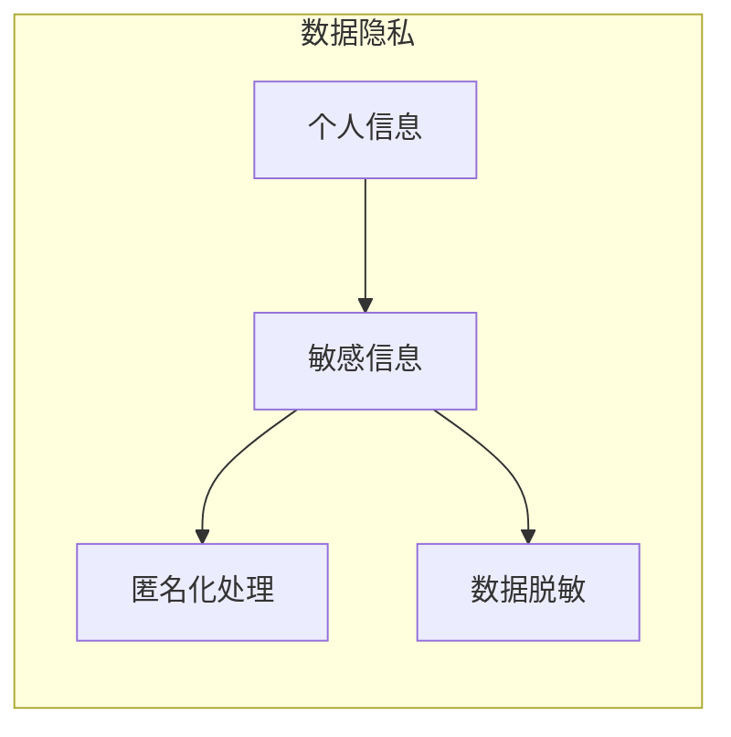
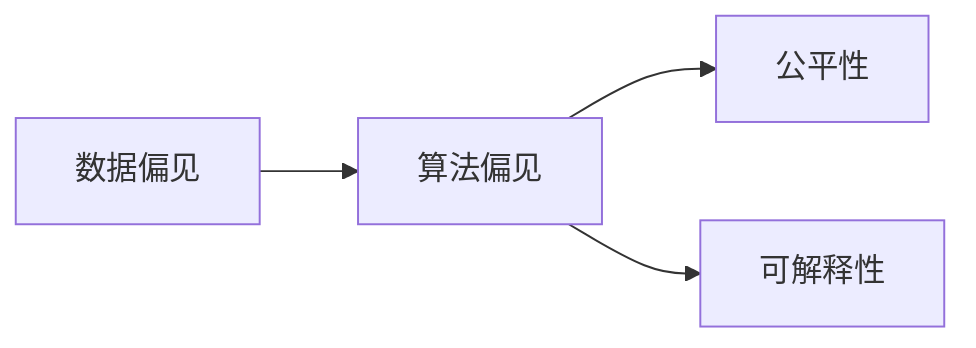
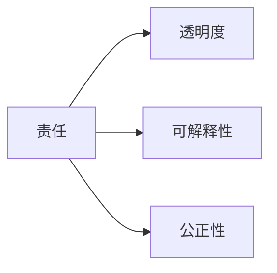

# 基础模型的社会外部条件

## 关键词：基础模型，社会影响，外部条件，伦理，法律，技术标准，可持续发展

## 1. 背景介绍

近年来，随着人工智能技术的快速发展，基础模型（如大型语言模型、计算机视觉模型等）在各个领域取得了显著的应用成果。这些基础模型通过在庞大的数据集上进行训练，能够实现复杂的信息处理任务，为人类社会带来了巨大的便利。然而，基础模型的应用也引发了一系列社会问题，如数据隐私、算法偏见、技术伦理等。因此，探讨基础模型的社会外部条件，对于推动人工智能技术的健康发展具有重要意义。

### 1.1 问题的由来

基础模型的社会外部条件主要源于以下几个方面：

1. **数据隐私**：基础模型训练需要海量数据，这些数据可能包含个人隐私信息，如何保护用户隐私成为一大挑战。
2. **算法偏见**：基础模型在训练过程中可能存在偏见，导致其在某些群体上的表现不佳，甚至加剧社会不平等。
3. **技术伦理**：基础模型的应用涉及伦理问题，如算法透明度、可解释性、责任归属等。
4. **法律与法规**：基础模型的应用需要遵循相关法律法规，如数据保护法、反歧视法等。
5. **技术标准**：基础模型的应用需要制定统一的技术标准，以保证其安全性和互操作性。

### 1.2 研究现状

目前，国内外学者对基础模型的社会外部条件进行了广泛的研究，主要集中在以下几个方面：

1. **数据隐私保护**：研究如何在不泄露用户隐私的前提下，利用数据训练基础模型。
2. **算法偏见识别与缓解**：研究如何识别和缓解基础模型中的算法偏见。
3. **技术伦理规范**：研究基础模型的技术伦理规范，以确保其应用符合伦理标准。
4. **法律法规制定**：研究如何制定相关法律法规，以规范基础模型的应用。
5. **技术标准制定**：研究基础模型的技术标准，以保证其安全性和互操作性。

### 1.3 研究意义

探讨基础模型的社会外部条件具有重要的研究意义：

1. **促进人工智能技术的健康发展**：通过研究基础模型的社会外部条件，有助于推动人工智能技术的健康发展，避免其对社会造成负面影响。
2. **保障用户权益**：研究如何保护用户隐私和防止算法偏见，有助于保障用户权益。
3. **提高技术伦理意识**：研究基础模型的技术伦理规范，有助于提高公众和开发者对技术伦理的认识。
4. **推动法律与法规的完善**：研究基础模型的法律与法规问题，有助于推动相关法律法规的完善。
5. **促进技术标准制定**：研究基础模型的技术标准，有助于促进相关技术标准的制定和实施。

### 1.4 本文结构

本文将从以下几个方面对基础模型的社会外部条件进行探讨：

- **第2部分**：介绍基础模型的社会外部条件相关核心概念与联系。
- **第3部分**：分析基础模型的社会外部条件中的关键问题，如数据隐私、算法偏见、技术伦理等。
- **第4部分**：探讨基础模型的社会外部条件的解决方案，包括法律、法规、技术标准、伦理规范等。
- **第5部分**：分析基础模型的社会外部条件在实际应用中的挑战与机遇。
- **第6部分**：展望基础模型的社会外部条件的未来发展趋势与挑战。

## 2. 核心概念与联系

### 2.1 数据隐私

数据隐私是基础模型社会外部条件中的核心问题之一。数据隐私涉及以下核心概念：

1. **个人信息**：指能够识别或推断出特定个人身份的信息，如姓名、身份证号、生物特征等。
2. **敏感信息**：指可能对个人造成伤害或损害的信息，如医疗记录、财务信息、宗教信仰等。
3. **匿名化处理**：指通过技术手段删除或修改个人信息，使其无法识别或推断出特定个人身份的过程。
4. **数据脱敏**：指对敏感信息进行加密、脱敏、替换等处理，以降低其敏感程度的过程。

这些概念之间的关系如下所示：

### 2.2 算法偏见

算法偏见是指算法在处理数据时，由于数据集的偏差或算法设计上的缺陷，导致算法对某些群体或个体产生歧视性结果的现象。算法偏见涉及以下核心概念：

1. **数据偏见**：指数据集在统计上存在的不平衡现象，导致算法在处理不同群体或个体时产生偏见。
2. **算法偏差**：指算法在处理数据时，由于算法设计上的缺陷，导致算法对某些群体或个体产生歧视性结果。
3. **公平性**：指算法在处理不同群体或个体时，能够保持一致性的性能。
4. **可解释性**：指算法的决策过程能够被人类理解和解释。

这些概念之间的关系如下所示：

### 2.3 技术伦理

技术伦理是指技术在社会应用中应遵循的道德规范和价值观。技术伦理涉及以下核心概念：

1. **责任**：技术开发者、使用者、监管者等各方在技术应用中应承担的责任。
2. **透明度**：技术决策过程应具有透明度，以便公众和监管者进行监督。
3. **可解释性**：技术的决策过程应具有可解释性，以便公众和监管者对其进行评估。
4. **公正性**：技术应用应遵循公平原则，避免对特定群体或个体造成歧视性结果。

这些概念之间的关系如下所示：

## 3. 核心问题分析

### 3.1 数据隐私

数据隐私是基础模型社会外部条件中的核心问题之一。以下将从以下几个方面分析数据隐私问题：

1. **数据收集与使用**：基础模型训练需要收集大量数据，如何在不泄露用户隐私的前提下收集和使用数据成为一大挑战。
2. **数据共享与开放**：数据共享与开放是推动基础模型技术发展的重要手段，但如何平衡数据共享与数据隐私保护成为一大难题。
3. **数据跨境流动**：随着全球化的发展，数据跨境流动日益频繁，如何确保数据跨境流动符合数据保护法规成为一大挑战。

### 3.2 算法偏见

算法偏见是基础模型社会外部条件中的另一个核心问题。以下将从以下几个方面分析算法偏见问题：

1. **数据偏见来源**：分析数据偏见可能来自哪些方面，如数据收集、数据标注、数据存储等环节。
2. **算法偏见检测**：研究如何检测和识别算法偏见，以及如何对存在偏见的模型进行改进。
3. **算法偏见缓解**：研究如何缓解算法偏见，如数据增强、算法改进、伦理规范等。

### 3.3 技术伦理

技术伦理是基础模型社会外部条件中的另一个核心问题。以下将从以下几个方面分析技术伦理问题：

1. **算法透明度**：研究如何提高算法的透明度，以便公众和监管者对其进行评估。
2. **可解释性**：研究如何提高算法的可解释性，以便公众和监管者理解算法的决策过程。
3. **责任归属**：研究在算法出错或造成损害时，如何确定责任归属。

## 4. 解决方案探讨

### 4.1 法律与法规

为了解决基础模型的社会外部条件问题，需要制定相应的法律法规，以确保基础模型的应用符合伦理和法律标准。以下是一些可能的解决方案：

1. **数据保护法**：制定数据保护法，明确数据收集、使用、存储、共享等方面的规范，以保护用户隐私。
2. **反歧视法**：制定反歧视法，禁止算法对特定群体或个体产生歧视性结果。
3. **算法可解释性法案**：制定算法可解释性法案，要求算法开发者提供算法的决策过程和依据。

### 4.2 技术标准

为了确保基础模型的应用安全性和互操作性，需要制定统一的技术标准。以下是一些可能的解决方案：

1. **数据标准**：制定数据标准，规范数据格式、数据质量等方面的要求，以确保数据的可用性和互操作性。
2. **算法标准**：制定算法标准，规范算法设计、评估等方面的要求，以确保算法的公平性、可解释性和可追溯性。
3. **模型评估标准**：制定模型评估标准，规范模型性能评估、风险控制等方面的要求，以确保模型的应用效果和安全性。

### 4.3 伦理规范

为了确保基础模型的应用符合伦理标准，需要制定相应的伦理规范。以下是一些可能的解决方案：

1. **算法伦理指南**：制定算法伦理指南，明确算法开发者、使用者、监管者等各方的伦理责任和行为规范。
2. **技术伦理委员会**：成立技术伦理委员会，负责监督基础模型的应用，确保其符合伦理标准。
3. **伦理审查机制**：建立伦理审查机制，对基础模型的应用进行审查，防止其造成负面影响。

## 5. 实际应用中的挑战与机遇

基础模型的社会外部条件在实际应用中面临着诸多挑战，同时也蕴藏着巨大的机遇。

### 5.1 挑战

1. **数据隐私保护**：如何在保护用户隐私的前提下，利用数据训练基础模型，成为一大挑战。
2. **算法偏见识别与缓解**：如何识别和缓解算法偏见，成为一大挑战。
3. **技术伦理**：如何确保基础模型的应用符合伦理标准，成为一大挑战。
4. **法律与法规**：如何制定相关法律法规，以规范基础模型的应用，成为一大挑战。
5. **技术标准**：如何制定统一的技术标准，以保证其安全性和互操作性，成为一大挑战。

### 5.2 机遇

1. **推动技术进步**：基础模型的社会外部条件研究将推动人工智能技术的进步，促进其健康发展。
2. **提高社会效益**：基础模型的应用将提高社会效益，改善人们的生活质量。
3. **创造就业机会**：基础模型的应用将创造新的就业机会，推动经济增长。
4. **促进国际合作**：基础模型的社会外部条件研究将促进国际合作，推动全球人工智能技术发展。

## 6. 未来发展趋势与挑战

### 6.1 未来发展趋势

1. **数据隐私保护**：随着技术的发展，将涌现更多数据隐私保护技术，如联邦学习、差分隐私等，以保护用户隐私。
2. **算法偏见识别与缓解**：将开发更多算法偏见识别与缓解技术，如对抗样本生成、公平性度量等，以提高算法的公平性。
3. **技术伦理**：将制定更完善的技术伦理规范，以指导基础模型的应用。
4. **法律与法规**：将制定更完善的法律法规，以规范基础模型的应用。
5. **技术标准**：将制定更统一的技术标准，以保证基础模型的安全性和互操作性。

### 6.2 面临的挑战

1. **技术挑战**：如何解决数据隐私保护、算法偏见识别与缓解等技术难题。
2. **伦理挑战**：如何确保基础模型的应用符合伦理标准。
3. **法律挑战**：如何制定和完善相关法律法规。
4. **标准挑战**：如何制定统一的技术标准。

### 6.3 研究展望

未来，基础模型的社会外部条件研究需要在以下几个方面进行深入探索：

1. **数据隐私保护**：研究更高效、更安全的隐私保护技术，以保护用户隐私。
2. **算法偏见识别与缓解**：研究更有效的算法偏见识别与缓解技术，以提高算法的公平性。
3. **技术伦理**：研究更完善的技术伦理规范，以指导基础模型的应用。
4. **法律与法规**：研究更完善的法律法规，以规范基础模型的应用。
5. **技术标准**：研究更统一的技术标准，以保证基础模型的安全性和互操作性。

## 7. 工具和资源推荐

### 7.1 学习资源推荐

1. 《人工智能：一种现代的方法》
2. 《深度学习》
3. 《人工智能：一种常识视角》
4. 《算法伦理》
5. 《数据科学中的伦理问题》

### 7.2 开发工具推荐

1. TensorFlow
2. PyTorch
3. Keras
4. Hugging Face Transformers
5. Google Colab

### 7.3 相关论文推荐

1. "Understanding Black-Box Models via Influence Functions"
2. "Explaining and Interpreting Deep Learning Models"
3. "The Ethics of Artificial Intelligence"
4. "Ethical Considerations in Data Science"
5. "The Privacy-Preserving Power of Federated Learning"

### 7.4 其他资源推荐

1. Hugging Face
2. TensorFlow
3. PyTorch
4. arXiv
5. Google Scholar

## 8. 总结：未来发展趋势与挑战

基础模型的社会外部条件研究对于推动人工智能技术的健康发展具有重要意义。本文从数据隐私、算法偏见、技术伦理、法律与法规、技术标准等方面，对基础模型的社会外部条件进行了探讨，并提出了相应的解决方案。未来，基础模型的社会外部条件研究需要在数据隐私保护、算法偏见识别与缓解、技术伦理、法律与法规、技术标准等方面进行深入探索。

## 9. 附录：常见问题与解答

**Q1：如何平衡数据隐私保护与数据利用？**

A：在保护用户隐私的前提下，可以采用数据脱敏、差分隐私、联邦学习等技术，在不泄露用户隐私的前提下，利用数据训练基础模型。

**Q2：如何识别和缓解算法偏见？**

A：可以采用对抗样本生成、公平性度量、数据增强等技术，识别和缓解算法偏见。

**Q3：如何确保基础模型的应用符合伦理标准？**

A：可以制定技术伦理规范，建立伦理审查机制，对基础模型的应用进行审查。

**Q4：如何制定相关法律法规，以规范基础模型的应用？**

A：可以借鉴现有法律法规，结合基础模型的特点，制定相关法律法规，以规范基础模型的应用。

**Q5：如何制定统一的技术标准，以保证基础模型的安全性和互操作性？**

A：可以借鉴国际标准，结合我国实际情况，制定统一的技术标准，以保证基础模型的安全性和互操作性。

作者：禅与计算机程序设计艺术 / Zen and the Art of Computer Programming