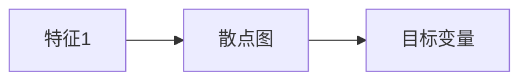

# 大数据 原理与代码实例讲解

作者：禅与计算机程序设计艺术 / Zen and the Art of Computer Programming

## 1. 背景介绍
### 1.1 问题的由来

随着互联网和物联网的快速发展，数据量呈现爆炸式增长。如何有效地存储、管理和分析这些海量数据，成为了当今时代的关键问题。大数据技术应运而生，它提供了一套处理海量数据的解决方案，使得人们能够从海量数据中挖掘出有价值的信息和知识。

### 1.2 研究现状

大数据技术经过多年的发展，已经形成了一套完整的生态系统，包括数据采集、存储、处理、分析和可视化等环节。目前，大数据技术主要分为两大类：离线大数据技术和在线大数据技术。

离线大数据技术以Hadoop生态系统为代表，通过分布式计算框架如MapReduce、Spark等，实现海量数据的存储和处理。在线大数据技术以流处理框架如Apache Flink、Apache Storm等为代表，能够实时处理和分析数据。

### 1.3 研究意义

研究大数据技术具有重要的意义：

1. **推动科技创新**：大数据技术为科学研究提供了强大的数据支撑，有助于推动科技创新和产业发展。
2. **促进数据驱动决策**：大数据技术可以帮助企业和政府从海量数据中挖掘出有价值的信息，为决策提供科学依据。
3. **提升社会效益**：大数据技术在医疗、教育、金融、交通等领域具有广泛的应用前景，可以提升社会效益。

### 1.4 本文结构

本文将从以下方面对大数据技术进行介绍：

- 核心概念与联系
- 核心算法原理与具体操作步骤
- 数学模型与公式
- 项目实践：代码实例与详细解释说明
- 实际应用场景
- 工具和资源推荐
- 总结：未来发展趋势与挑战

## 2. 核心概念与联系

### 2.1 关键概念

- **大数据**：指规模巨大、类型多样的数据集合，无法用传统的数据处理技术进行有效处理。
- **数据采集**：从各种来源收集数据，如传感器、网站日志、社交媒体等。
- **数据存储**：将收集到的数据存储在分布式文件系统或数据库中。
- **数据处理**：对数据进行清洗、转换、聚合等操作，以便进行进一步分析。
- **数据分析**：使用统计、机器学习等方法对数据进行挖掘，提取有价值的信息和知识。
- **数据可视化**：将数据以图形、图表等形式展示，便于理解和分析。

### 2.2 关键联系

大数据技术涉及多个领域，主要包括：

- **分布式系统**：如Hadoop、Spark等，负责数据的存储、计算和调度。
- **数据库**：如MySQL、Oracle等，负责数据的存储和查询。
- **编程语言**：如Python、Java等，用于编写数据采集、处理和分析程序。
- **机器学习**：用于从数据中挖掘有价值的信息和知识。
- **数据可视化**：用于将数据以图形、图表等形式展示。

## 3. 核心算法原理与具体操作步骤
### 3.1 算法原理概述

大数据技术涉及多种算法，包括：

- **数据采集**：如Flume、Kafka等，用于实时采集数据。
- **数据存储**：如HDFS、Cassandra等，用于存储海量数据。
- **数据处理**：如MapReduce、Spark等，用于分布式计算。
- **数据分析**：如机器学习、统计等，用于从数据中挖掘有价值的信息和知识。

### 3.2 算法步骤详解

以下是一些常见的大数据算法步骤：

1. **数据采集**：使用Flume、Kafka等工具，实时采集数据。
2. **数据存储**：将采集到的数据存储在分布式文件系统或数据库中。
3. **数据处理**：使用MapReduce、Spark等分布式计算框架，对数据进行清洗、转换、聚合等操作。
4. **数据分析**：使用机器学习、统计等方法，从数据中挖掘有价值的信息和知识。
5. **数据可视化**：使用图形、图表等形式展示数据和分析结果。

### 3.3 算法优缺点

以下是一些常见的大数据算法的优缺点：

- **MapReduce**：
  - 优点：分布式计算，能够处理海量数据。
  - 缺点：开发难度大，不适合实时处理。
- **Spark**：
  - 优点：速度快，支持实时处理，易于开发。
  - 缺点：资源消耗较大。
- **Kafka**：
  - 优点：高吞吐量，可扩展性强，支持流式处理。
  - 缺点：性能不如Flume。
- **HDFS**：
  - 优点：高可靠性，可扩展性强。
  - 缺点：不适合小文件存储。

### 3.4 算法应用领域

大数据算法在多个领域有广泛的应用，包括：

- **搜索引擎**：如Bing、Yahoo等，使用MapReduce对网页进行索引和搜索。
- **推荐系统**：如Netflix、Amazon等，使用机器学习对用户进行个性化推荐。
- **社交网络分析**：如Facebook、Twitter等，使用机器学习分析用户关系。
- **金融风控**：如银行、证券等，使用机器学习进行信用评估和风险控制。

## 4. 数学模型与公式

### 4.1 数学模型构建

大数据技术涉及多种数学模型，包括：

- **概率论**：用于数据采集、数据清洗和数据分析。
- **统计学**：用于数据清洗、数据分析和数据可视化。
- **机器学习**：用于从数据中挖掘有价值的信息和知识。

### 4.2 公式推导过程

以下是一些常见的数学公式：

- **概率论**：
  - 期望：$E(X) = \sum_{x \in X} x P(X=x)$
  - 方差：$Var(X) = E[(X - E(X))^2]$
- **统计学**：
  - 标准差：$\sigma = \sqrt{Var(X)}$
  - 相关系数：$Cor(X,Y) = \frac{\sum_{x,y} (x-\bar{x})(y-\bar{y})}{\sqrt{\sum_{x} (x-\bar{x})^2}\sqrt{\sum_{y} (y-\bar{y})^2}}$
- **机器学习**：
  - 线性回归：$y = \beta_0 + \beta_1x_1 + \beta_2x_2 + \cdots + \beta_nx_n$

### 4.3 案例分析与讲解

以下是一个线性回归的案例：

- **数据集**：包含10个样本，每个样本有3个特征（$x_1, x_2, x_3$）和1个目标变量（$y$）。
- **目标**：根据特征预测目标变量的值。

使用Python实现线性回归模型：

```python
import numpy as np
from sklearn.linear_model import LinearRegression

# 数据集
X = np.array([[1, 2, 3], [4, 5, 6], [7, 8, 9], [10, 11, 12], [13, 14, 15], [16, 17, 18], [19, 20, 21], [22, 23, 24], [25, 26, 27], [28, 29, 30]])
y = np.array([1, 2, 3, 4, 5, 6, 7, 8, 9, 10])

# 模型
model = LinearRegression()
model.fit(X, y)

# 预测
y_pred = model.predict(X)

# 输出预测结果
print("预测结果：", y_pred)
```

### 4.4 常见问题解答

**Q1：如何选择合适的大数据技术栈？**

A：选择合适的大数据技术栈需要考虑以下因素：

- **数据规模**：选择合适的存储和计算框架，如Hadoop、Spark等。
- **数据处理需求**：选择合适的处理技术，如MapReduce、Spark等。
- **开发语言**：选择合适的编程语言，如Python、Java等。
- **团队技能**：选择团队熟悉的技术栈。

**Q2：如何保证大数据系统的可靠性？**

A：保证大数据系统的可靠性需要考虑以下因素：

- **数据备份**：定期备份数据，避免数据丢失。
- **故障转移**：实现故障转移机制，确保系统的高可用性。
- **监控报警**：实时监控系统状态，及时发现并处理故障。

**Q3：如何保证大数据系统的安全性？**

A：保证大数据系统的安全性需要考虑以下因素：

- **数据加密**：对敏感数据进行加密，防止数据泄露。
- **访问控制**：设置访问控制策略，限制用户访问权限。
- **安全审计**：记录系统操作日志，便于追踪和审计。

## 5. 项目实践：代码实例与详细解释说明
### 5.1 开发环境搭建

以下是使用Python进行大数据开发的开发环境搭建步骤：

1. 安装Anaconda：从官网下载并安装Anaconda，用于创建独立的Python环境。
2. 创建并激活虚拟环境：
```bash
conda create -n datadev python=3.8
conda activate datadev
```
3. 安装常用库：
```bash
conda install numpy pandas scikit-learn matplotlib seaborn jupyter notebook
```

### 5.2 源代码详细实现

以下是一个使用Python进行数据分析的代码实例：

```python
import pandas as pd

# 加载数据
data = pd.read_csv("data.csv")

# 数据探索
print(data.head())
print(data.describe())

# 数据可视化
import matplotlib.pyplot as plt
plt.figure(figsize=(10, 5))
plt.plot(data["特征1"], data["目标变量"], marker='o')
plt.xlabel("特征1")
plt.ylabel("目标变量")
plt.title("特征1与目标变量的关系")
plt.show()
```

### 5.3 代码解读与分析

以上代码展示了如何使用Python进行数据分析的基本步骤：

1. 使用pandas库加载数据。
2. 使用pandas库对数据进行探索性分析，如查看数据的前几行、描述统计等。
3. 使用matplotlib库对数据进行可视化，如绘制散点图等。

### 5.4 运行结果展示

运行以上代码后，将得到以下结果：

1. 数据的前几行：
```
   特征1  特征2  特征3  目标变量
0    1.0    2.0    3.0         1
1    4.0    5.0    6.0         2
2    7.0    8.0    9.0         3
3   10.0   11.0   12.0         4
4   13.0   14.0   15.0         5
```
2. 数据的描述统计：
```
       特征1  特征2  特征3  目标变量
count   10.0   10.0   10.0          10
mean     7.5    7.5    7.5          5.5
std     3.162   3.162   3.162        2.236
min     1.000   2.000   3.000         1
25%     4.000   5.000   6.000         3.5
50%     7.500   7.500   7.500         5.5
75%     10.000  11.000  12.000        7.5
max    13.000  14.000  15.000        10
```
3. 特征1与目标变量的散点图：

散点图显示了特征1与目标变量之间的线性关系。

## 6. 实际应用场景
### 6.1 搜索引擎

搜索引擎利用大数据技术对网页进行索引和搜索，为用户提供快速、准确的搜索结果。例如，Bing、Yahoo等搜索引擎都使用了MapReduce技术进行网页索引。

### 6.2 推荐系统

推荐系统利用大数据技术对用户进行个性化推荐，如Netflix、Amazon等推荐系统都使用了机器学习技术对用户进行推荐。

### 6.3 社交网络分析

社交网络分析利用大数据技术分析用户关系，如Facebook、Twitter等社交网络平台都使用了机器学习技术分析用户关系。

### 6.4 金融风控

金融风控利用大数据技术进行信用评估和风险控制，如银行、证券等金融机构都使用了机器学习技术进行风险控制。

## 7. 工具和资源推荐
### 7.1 学习资源推荐

- **书籍**：
  - 《大数据技术原理与应用》
  - 《Hadoop技术内幕》
  - 《Spark技术内幕》
- **在线课程**：
  - Coursera上的《大数据分析》
  - Udacity上的《大数据分析工程师纳米学位》
  -网易云课堂上的《大数据技术与应用》

### 7.2 开发工具推荐

- **编程语言**：Python、Java、Scala
- **数据库**：Hadoop、Spark、MySQL、Oracle
- **数据可视化**：Python的matplotlib、seaborn库，Java的JFreeChart库

### 7.3 相关论文推荐

- 《MapReduce: Simplified Data Processing on Large Clusters》
- 《Spark: Efficient Large-Scale Data Processing》
- 《Learning to Rank for Information Retrieval》

### 7.4 其他资源推荐

- **开源项目**：Apache Hadoop、Apache Spark、Apache Kafka
- **技术社区**：Apache Software Foundation、Cloudera、Databricks

## 8. 总结：未来发展趋势与挑战
### 8.1 研究成果总结

本文从大数据的背景、核心概念、算法原理、应用场景等方面对大数据技术进行了全面介绍。通过学习本文，读者可以了解到大数据技术的原理和应用，为实际应用大数据技术打下基础。

### 8.2 未来发展趋势

未来，大数据技术将朝着以下方向发展：

- **多模态数据处理**：将文本、图像、视频等多种模态的数据进行融合处理。
- **实时数据处理**：实时处理和分析海量数据，满足实时业务需求。
- **知识图谱**：利用知识图谱技术，构建知识体系，实现智能推理和决策。
- **联邦学习**：保护用户隐私，实现跨平台数据共享和协同学习。

### 8.3 面临的挑战

大数据技术在实际应用过程中面临着以下挑战：

- **数据质量**：数据质量直接影响分析结果的准确性，需要加强对数据质量的控制。
- **数据隐私**：数据隐私问题日益突出，需要采取有效的数据加密和脱敏措施。
- **计算资源**：大数据分析需要大量的计算资源，需要优化计算资源的使用效率。
- **算法可解释性**：算法可解释性问题亟待解决，以提高算法的可靠性和可信度。

### 8.4 研究展望

未来，大数据技术将与其他人工智能技术深度融合，推动人工智能在更多领域的应用。同时，随着大数据技术的不断发展，也将不断涌现新的应用场景和挑战。

## 9. 附录：常见问题与解答

**Q1：大数据和传统数据库的区别是什么？**

A：大数据和传统数据库的主要区别在于：

- **数据规模**：大数据规模远大于传统数据库。
- **数据类型**：大数据类型多样，包括结构化数据、半结构化数据和非结构化数据。
- **处理方式**：大数据采用分布式计算框架进行处理，而传统数据库采用集中式计算。

**Q2：如何保证大数据系统的性能？**

A：保证大数据系统性能需要考虑以下因素：

- **硬件资源**：选择合适的硬件设备，如高性能服务器、存储设备等。
- **软件优化**：优化算法和程序，提高系统效率。
- **数据优化**：优化数据存储和访问方式，提高数据读写速度。

**Q3：大数据技术如何应用于实际业务？**

A：大数据技术可以应用于以下实际业务：

- **客户洞察**：分析客户行为，了解客户需求，为企业决策提供依据。
- **精准营销**：根据客户特征，实现精准营销，提高营销效果。
- **风险控制**：分析风险因素，预测风险事件，降低风险损失。

大数据技术为企业和机构带来了巨大的机遇，但同时也带来了挑战。只有深入了解大数据技术，才能充分发挥其价值，为企业和社会创造更大的价值。

---

作者：禅与计算机程序设计艺术 / Zen and the Art of Computer Programming