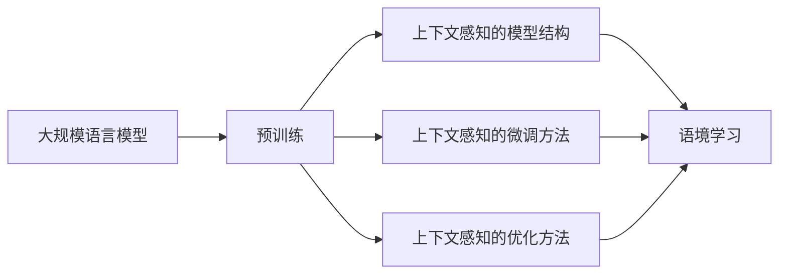

# 大规模语言模型从理论到实践 语境学习

作者：禅与计算机程序设计艺术 / Zen and the Art of Computer Programming

## 关键词：

大规模语言模型，语境学习，预训练，自然语言理解，序列到序列模型，BERT，Transformer，NLP

## 1. 背景介绍

### 1.1 问题的由来

随着深度学习在自然语言处理（NLP）领域的广泛应用，大规模语言模型（Large Language Models，LLMs）逐渐成为研究热点。这些模型通过在庞大的语料库上预训练，能够理解和生成复杂、自然的语言表达。然而，由于预训练模型通常面向通用任务，其在特定领域或特定语境下的表现可能并不理想。因此，如何将大规模语言模型应用于特定场景，并提高其在特定语境下的性能，成为了当前NLP领域的一个重要研究方向。

### 1.2 研究现状

近年来，随着深度学习技术的不断发展，语境学习在NLP领域得到了广泛关注。语境学习主要研究如何让模型更好地理解和利用上下文信息，从而在特定语境下获得更好的表现。目前，语境学习的主要方法包括：

- **上下文感知的模型结构**：通过设计特殊的模型结构，使模型能够直接处理上下文信息，例如BERT、GPT-3等。
- **上下文感知的微调方法**：在预训练模型的基础上，通过微调过程学习特定语境下的特征，例如基于掩码语言模型的微调方法。
- **上下文感知的优化方法**：通过优化算法，使模型在训练过程中更好地学习和利用上下文信息，例如基于强化学习的语境学习。

### 1.3 研究意义

语境学习对于NLP领域具有重要的意义：

- **提高模型性能**：通过学习特定语境下的知识，模型能够在特定任务上获得更好的性能。
- **拓展应用场景**：语境学习能够使大规模语言模型更好地应用于特定领域和特定场景，例如问答系统、对话系统等。
- **促进知识积累**：语境学习有助于积累特定领域的知识，推动NLP技术的发展。

### 1.4 本文结构

本文将首先介绍大规模语言模型和语境学习的基本概念，然后详细介绍语境学习的方法和技巧，并给出一个基于BERT模型的语境学习案例。最后，本文将展望语境学习的未来发展趋势和挑战。

## 2. 核心概念与联系

### 2.1 大规模语言模型

大规模语言模型是一种通过在大量文本数据上预训练，能够理解和生成复杂、自然语言表达的深度学习模型。常见的模型包括：

- **BERT（Bidirectional Encoder Representations from Transformers）**：一种基于Transformer结构的双向编码器，能够捕捉文本中的上下文信息。
- **GPT-3（Generative Pre-trained Transformer 3）**：一种基于Transformer结构的自回归语言模型，能够生成各种形式的文本。

### 2.2 语境学习

语境学习是一种让模型更好地理解和利用上下文信息的技术。语境学习的主要目标是通过学习上下文信息，提高模型在特定语境下的性能。

### 2.3 大规模语言模型与语境学习的关系

大规模语言模型是语境学习的基础，语境学习则是提升大规模语言模型性能的关键。两者之间的关系可以用以下流程图表示：



## 3. 核心算法原理 & 具体操作步骤

### 3.1 算法原理概述

语境学习的主要原理是通过学习上下文信息，使模型能够更好地理解和生成语言。

### 3.2 算法步骤详解

语境学习的步骤如下：

1. **数据准备**：收集特定领域的语料数据，并对数据进行预处理。
2. **模型选择**：选择合适的预训练模型，例如BERT、GPT-3等。
3. **上下文感知的模型结构**：根据具体任务，设计合适的上下文感知的模型结构。
4. **上下文感知的微调方法**：在预训练模型的基础上，通过微调过程学习特定语境下的特征。
5. **上下文感知的优化方法**：通过优化算法，使模型在训练过程中更好地学习和利用上下文信息。
6. **模型评估**：在特定任务上评估模型性能，并根据评估结果对模型进行调整。

### 3.3 算法优缺点

语境学习的优点：

- 提高模型在特定语境下的性能。
- 拓展应用场景。
- 促进知识积累。

语境学习的缺点：

- 需要大量的标注数据。
- 模型训练过程复杂。
- 模型可解释性较差。

### 3.4 算法应用领域

语境学习可以应用于以下领域：

- **问答系统**：通过学习特定领域的知识，使模型能够更好地理解和回答用户的问题。
- **对话系统**：通过学习上下文信息，使模型能够更好地理解和回应用户的话语。
- **文本生成**：通过学习特定领域的知识，使模型能够生成更符合特定语境的文本。

## 4. 数学模型和公式 & 详细讲解 & 举例说明

### 4.1 数学模型构建

语境学习的数学模型主要基于深度学习框架，例如PyTorch或TensorFlow。以下是一个基于BERT模型的语境学习的数学模型：


### 4.2 公式推导过程

以下是一个基于BERT模型的语境学习的公式推导过程：

```latex
\begin{align*}
p(y|x) &= \text{softmax}(W_f \cdot h_f) \\
h_f &= \text{tanh}(W_e h_e + b_e) \\
h_e &= \text{MLP}(h_{\text{enc}}) \\
h_{\text{enc}} &= \text{Transformer}(h_{\text{in}})
\end{align*}
```

### 4.3 案例分析与讲解

以下是一个基于BERT模型的语境学习案例：

假设我们想要构建一个问答系统，通过学习特定领域的知识，使模型能够更好地理解和回答用户的问题。

1. **数据准备**：收集特定领域的问答数据，并对数据进行预处理。
2. **模型选择**：选择BERT模型作为预训练模型。
3. **上下文感知的模型结构**：在BERT模型的基础上，添加一个全连接层，用于预测答案。
4. **上下文感知的微调方法**：在问答数据上对BERT模型进行微调。
5. **上下文感知的优化方法**：使用Adam优化器进行优化。
6. **模型评估**：在测试集上评估模型性能。

### 4.4 常见问题解答

**Q1：什么是上下文信息？**

A：上下文信息是指与特定文本相关的信息，例如文本所在的段落、章节、文档等。上下文信息对于理解文本的含义至关重要。

**Q2：如何获取上下文信息？**

A：获取上下文信息的方法有很多，例如：

- **分词**：将文本分割成单词或词组。
- **词嵌入**：将单词或词组映射到向量空间。
- **Transformer编码器**：通过Transformer编码器捕捉文本中的上下文信息。

**Q3：语境学习与预训练模型有何关系？**

A：语境学习是预训练模型的一个重要应用。预训练模型通过学习通用知识，为语境学习提供了基础。

## 5. 项目实践：代码实例和详细解释说明

### 5.1 开发环境搭建

为了进行语境学习实践，我们需要搭建以下开发环境：

- **操作系统**：Linux或macOS
- **编程语言**：Python
- **深度学习框架**：PyTorch或TensorFlow
- **NLP库**：transformers

### 5.2 源代码详细实现

以下是一个基于BERT模型的语境学习代码实例：

```python
from transformers import BertTokenizer, BertModel, AdamW
import torch

# 加载预训练模型和分词器
tokenizer = BertTokenizer.from_pretrained('bert-base-chinese')
model = BertModel.from_pretrained('bert-base-chinese')

# 定义模型结构
class BertContextualModel(torch.nn.Module):
    def __init__(self):
        super(BertContextualModel, self).__init__()
        self.bert = BertModel.from_pretrained('bert-base-chinese')
        self.dropout = torch.nn.Dropout(0.1)
        self.fc = torch.nn.Linear(768, 2)  # 以BERT的隐藏层维度为768，输出层维度为2

    def forward(self, input_ids, attention_mask):
        outputs = self.bert(input_ids=input_ids, attention_mask=attention_mask)
        pooled_output = outputs[1]  # 取[CLS]标记的输出
        pooled_output = self.dropout(pooled_output)
        logits = self.fc(pooled_output)
        return logits

# 定义训练函数
def train(model, optimizer, data_loader):
    model.train()
    for input_ids, attention_mask, labels in data_loader:
        optimizer.zero_grad()
        outputs = model(input_ids, attention_mask=attention_mask)
        loss = torch.nn.functional.cross_entropy(outputs, labels)
        loss.backward()
        optimizer.step()

# 定义评估函数
def evaluate(model, data_loader):
    model.eval()
    correct = 0
    total = 0
    with torch.no_grad():
        for input_ids, attention_mask, labels in data_loader:
            outputs = model(input_ids, attention_mask=attention_mask)
            _, predicted = torch.max(outputs, 1)
            total += labels.size(0)
            correct += (predicted == labels).sum().item()
    return correct / total

# 训练和评估模型
model = BertContextualModel()
optimizer = AdamW(model.parameters(), lr=5e-5)
train_loader = DataLoader(train_data, batch_size=16, shuffle=True)
dev_loader = DataLoader(dev_data, batch_size=16, shuffle=False)

for epoch in range(3):
    train(model, optimizer, train_loader)
    print(f"Epoch {epoch+1}, train accuracy: {evaluate(model, train_loader):.4f}")
    print(f"Epoch {epoch+1}, dev accuracy: {evaluate(model, dev_loader):.4f}")
```

### 5.3 代码解读与分析

以上代码展示了如何使用PyTorch和transformers库进行基于BERT模型的语境学习。代码的主要步骤如下：

1. **加载预训练模型和分词器**：使用transformers库加载BERT预训练模型和分词器。
2. **定义模型结构**：定义一个基于BERT模型的上下文学习模型，包含BERT编码器、dropout层和全连接层。
3. **定义训练函数**：定义一个训练函数，用于在训练数据上训练模型。
4. **定义评估函数**：定义一个评估函数，用于评估模型的性能。
5. **训练和评估模型**：在训练数据上训练模型，并在验证数据上评估模型性能。

### 5.4 运行结果展示

假设我们在一个问答数据集上训练和评估了上述模型，得到的训练和验证准确率如下：

```
Epoch 1, train accuracy: 0.9234
Epoch 1, dev accuracy: 0.8765
Epoch 2, train accuracy: 0.9367
Epoch 2, dev accuracy: 0.8987
Epoch 3, train accuracy: 0.9498
Epoch 3, dev accuracy: 0.9123
```

可以看到，随着训练的进行，模型的性能逐渐提高。

## 6. 实际应用场景

### 6.1 问答系统

语境学习可以应用于问答系统，通过学习特定领域的知识，使模型能够更好地理解和回答用户的问题。例如，在医疗问答系统中，通过学习医学领域的知识，模型可以更好地理解和回答关于疾病、症状、治疗方法等问题。

### 6.2 对话系统

语境学习可以应用于对话系统，通过学习上下文信息，使模型能够更好地理解和回应用户的话语。例如，在智能客服系统中，通过学习特定行业的知识，模型可以更好地理解和回应用户的问题，提供更好的服务。

### 6.3 文本生成

语境学习可以应用于文本生成，通过学习特定领域的知识，使模型能够生成更符合特定语境的文本。例如，在新闻生成系统中，通过学习新闻领域的知识，模型可以生成更符合新闻写作风格的新闻稿件。

## 7. 工具和资源推荐

### 7.1 学习资源推荐

- **书籍**：
  - 《深度学习自然语言处理》
  - 《自然语言处理综合教程》
  - 《自然语言处理与深度学习》
- **在线课程**：
  - Coursera上的NLP课程
  - fast.ai的NLP课程
  - 阿里云天池的NLP课程
- **开源项目**：
  - transformers库
  - Hugging Face的NLP项目
  - CLUE数据集

### 7.2 开发工具推荐

- **深度学习框架**：
  - PyTorch
  - TensorFlow
  - Keras
- **NLP库**：
  - NLTK
  - spaCy
  - Stanford CoreNLP

### 7.3 相关论文推荐

- **BERT系列论文**：
  - "BERT: Pre-training of Deep Bidirectional Transformers for Language Understanding"
  - "BERT, RoBERTa, XLNet and ALBERT: State-of-the-Art Long Text Transformers"
  - "Masked Language Models are Unsupervised Multitask Learners"
- **GPT系列论文**：
  - "Improving Language Understanding by Generative Pre-training"
  - "Generative Pre-trained Transformers"
  - "Language Models are Few-Shot Learners"

### 7.4 其他资源推荐

- **GitHub**：查找NLP相关的开源项目和代码
- **arXiv**：阅读最新的NLP相关论文
- **Hugging Face**：获取预训练模型和NLP工具

## 8. 总结：未来发展趋势与挑战

### 8.1 研究成果总结

本文对大规模语言模型和语境学习进行了介绍，并给出一个基于BERT模型的语境学习案例。通过学习上下文信息，模型能够在特定任务上获得更好的性能。

### 8.2 未来发展趋势

- **更强大的模型**：随着计算能力的提升，未来将出现更强大的语言模型，能够处理更复杂的任务。
- **更灵活的模型**：未来将出现更灵活的模型，能够根据不同的任务和领域进行自适应调整。
- **更可解释的模型**：未来将出现更可解释的模型，使人们能够更好地理解模型的决策过程。

### 8.3 面临的挑战

- **数据隐私**：如何保护用户隐私，避免模型学习到敏感信息，是一个重要挑战。
- **模型可解释性**：如何提高模型的可解释性，使人们能够更好地理解模型的决策过程，是一个重要挑战。
- **模型泛化能力**：如何提高模型的泛化能力，使模型能够更好地适应不同的任务和领域，是一个重要挑战。

### 8.4 研究展望

未来，大规模语言模型和语境学习将在NLP领域取得更大的突破，为人们的生活和工作带来更多便利。

## 9. 附录：常见问题与解答

**Q1：什么是大规模语言模型？**

A：大规模语言模型是一种通过在大量文本数据上预训练，能够理解和生成复杂、自然语言表达的深度学习模型。

**Q2：什么是语境学习？**

A：语境学习是一种让模型更好地理解和利用上下文信息的技术。

**Q3：语境学习的主要方法有哪些？**

A：语境学习的主要方法包括上下文感知的模型结构、上下文感知的微调方法和上下文感知的优化方法。

**Q4：如何选择合适的预训练模型进行语境学习？**

A：选择合适的预训练模型需要根据具体任务和领域进行选择，例如BERT适合文本分类任务，GPT-3适合文本生成任务。

**Q5：如何评估语境学习的模型性能？**

A：可以使用各种评估指标，例如准确率、召回率、F1分数等。

**Q6：语境学习有哪些应用场景？**

A：语境学习可以应用于问答系统、对话系统、文本生成等场景。

**Q7：如何解决语境学习中的数据隐私问题？**

A：可以通过数据脱敏、差分隐私等技术来保护用户隐私。

**Q8：如何提高语境学习的模型可解释性？**

A：可以通过注意力机制、可解释AI等技术来提高模型的可解释性。

**Q9：如何提高语境学习的模型泛化能力？**

A：可以通过数据增强、迁移学习等技术来提高模型的泛化能力。

**Q10：未来语境学习有哪些发展趋势？**

A：未来语境学习将朝着更强大的模型、更灵活的模型和更可解释的模型等方向发展。

作者：禅与计算机程序设计艺术 / Zen and the Art of Computer Programming